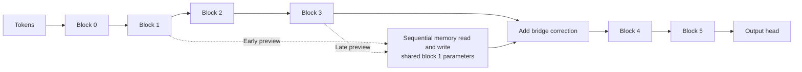

# CDRM architecture and six-block state mapping

The active six-block profile uses early site **1**, late source/bridge site **3**,
and ordinary suffix blocks **4–5**. All six ordinary blocks execute once. A side
scan shares the canonical parameters of ordinary block 1; it does not replace
that block or replay the preview.

Let `p_early` and `p_late` denote those ordinary post-block previews. The candidate
is `p_early + epsilon * A_deep(RMS(p_late - p_early))`. Queries and temporary K/V
come from the early preview, with the owning block's learned preprocessing. Each
position reads earlier permanent records plus its own temporary pair. It then
applies the owning block's residual/MLP processing to the candidate and projected
read, producing `hat_m`. The permanent write is projected only after that read:
`m = (1-rho)*p_early + rho*hat_m`. No history is detached.

The bridge adds `lambda * A_bridge(RMS(hat_m - p_early))` to the ordinary late
preview. It uses the proposed state `hat_m`, not interpolated memory `m` or a raw
K/V tensor. The current permanent record is first visible to the following token;
the terminal record may correctly have no loss consumer. Every independent
forward rebuilds memory.

The two bias-free D-to-D adapters are the only separately owned side parameters.
Both are initialized nonzero. Stateless adapter RMS normalization uses epsilon
`1e-6`; it does not replace the backbone's learned normalization. The selected
profile keeps fixed gates `epsilon=0.1`, `rho=1`, `lambda=0.01`. At lambda zero,
controlled FP32 execution matches the ordinary model. Rho zero leaves an active
reader/writer/bridge and is not a SEQ switch.

The native diagnostic field names preserve the original twelve-block interface:

| Native field | Six-block meaning | Original twelve-block meaning |
|---|---|---|
| `p3` | Ordinary output after block 1 | Ordinary output after block 3 |
| `p8` | Ordinary output after block 3 | Ordinary output after block 8 |
| `v8` | Bridged input to block 4 | Bridged input to block 9 |
| `hat_m`, `m` | Proposed state and interpolated residual-space memory | Same roles |

Interpret these names using `cdrm_early_layer` and `cdrm_late_layer`. Ordinary
hidden-state indexing stays block based: the bridged state is at
`hidden_states[cdrm_late_layer + 1]`; diagnostic previews do not add extra entries.
Per-token `records`, `permanent_k`, `permanent_v` and `read_outputs` expose the
actual graph nodes for temporal-gradient checks. Detached summaries are suitable
for logging; keeping those graph tensors between updates is not.

The active same-depth control changes only the adapter source to normalized
`p_early`, preserving a nonzero source, the same adapters and the ordinary late
bridge destination. Its different input statistics remain a control limitation.
Gains over SEQ alone would not isolate a deep-source effect; the prepared
same-depth comparison is a subsequent attribution experiment.

See [usage](cdrm-naive-usage.md), [resolved profiles](../configs/cdrm/README.md),
[core reference](../recurrent-transformer/olmo/cdrm.py), and
[the independent tests](../recurrent-transformer/tests/test_cdrm_reference.py).
