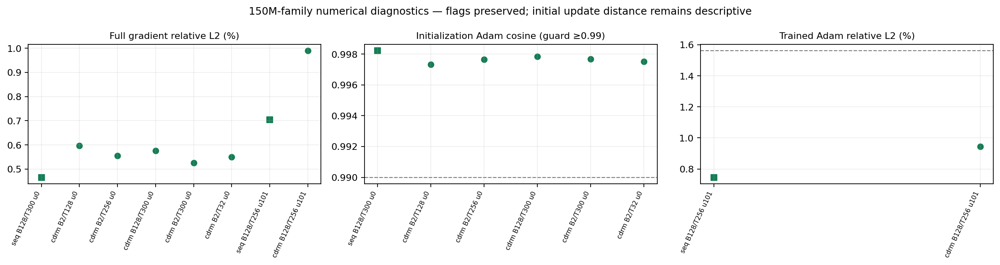
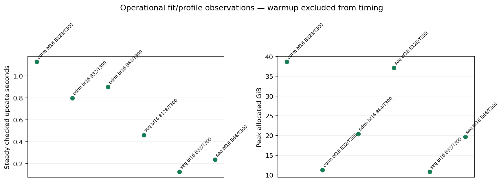
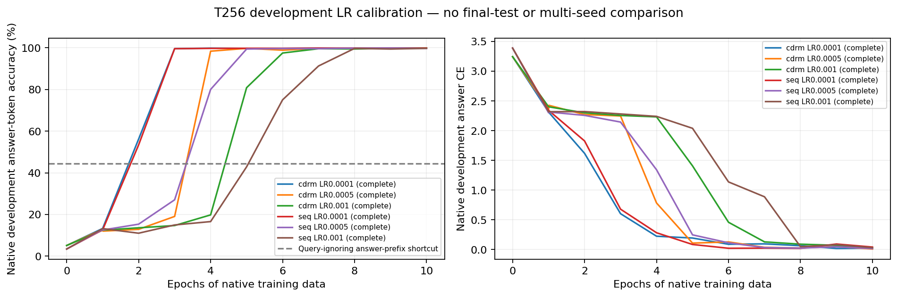

# Fuzzy-recall phase-one generated evidence

Phase one: numerical/operational evidence and development-only T256 LR calibration.

Execution completion is separate from numerical pass. Raw flags remain visible; initialized Adam relative L2 is descriptive and its original guard is cosine>=.99. Runtime projections are unmeasured multi-length estimates. Calibration accuracy is not a final held-out comparison.

Integrity/consistency errors: **0**. All six frozen calibration endpoints complete: **True**.

Native training uses dense shifted targets including padding. Held-out development scores native masked value tokens; answers are teacher forced. Final data and the four-length main sweep are not included.

Calibration dev retains **13 / 16143** scored tokens without an earlier matching key. Their native labels remain in every primary denominator. The query-ignoring answer-prefix shortcut reaches **44.35%**; independent uniform eight-value guesses give12.5%. Retrieval coverage is not a hard task ceiling.

| Arm | Unique parameters | Adapter parameters |
| --- | ---: | ---: |
| cdrm | 153,175,040 | 2,097,152 |
| seq | 153,437,184 | 0 |

| Numerical case | Status | Full gradient L2 | Adam criterion | Adam L2 (descriptive at init) | Pass |
| --- | --- | ---: | --- | ---: | --- |
| seq B128/T300 u0 | diagnostics_complete | 0.4661% | initial delta cosine >=.99 | 5.9582% | True |
| cdrm B2/T128 u0 | diagnostics_complete | 0.5974% | initial delta cosine >=.99 | 7.3126% | True |
| cdrm B2/T256 u0 | diagnostics_complete | 0.5558% | initial delta cosine >=.99 | 6.8408% | True |
| cdrm B128/T300 u0 | diagnostics_complete | 0.5764% | initial delta cosine >=.99 | 6.5954% | True |
| cdrm B2/T300 u0 | diagnostics_complete | 0.5259% | initial delta cosine >=.99 | 6.8226% | True |
| cdrm B2/T32 u0 | diagnostics_complete | 0.5506% | initial delta cosine >=.99 | 7.0461% | True |
| seq B128/T256 u101 | diagnostics_complete | 0.7047% | trained delta relative L2 <=.015625 | 0.7466% | True |
| cdrm B128/T256 u101 | diagnostics_complete | 0.9903% | trained delta relative L2 <=.015625 | 0.9456% | True |

All attempts and full flag lists are retained in report.json and CSVs, including failed/incomplete attempts and strict FP32 coordinate failures.

| Arm | LR | Status | Completed epochs | Frozen-endpoint dev accuracy |
| --- | ---: | --- | ---: | ---: |
| cdrm | 0.0001 | complete | 10 | 99.864% |
| cdrm | 0.0005 | complete | 10 | 99.901% |
| cdrm | 0.001 | complete | 10 | 99.802% |
| seq | 0.0001 | complete | 10 | 99.876% |
| seq | 0.0005 | complete | 10 | 99.740% |
| seq | 0.001 | complete | 10 | 99.771% |

| Projected main sweep | Epochs | Total updates | Training hours |
| --- | ---: | ---: | ---: |
| T300 timing proxy for all four lengths; upper proxy, not a proven bound | 25 | 60,000 | 13.24 |
| Measured T256 calibration mean after first update; other three lengths use T300 proxy | 25 | 60,000 | 12.65 |
| T300 timing proxy for all four lengths; upper proxy, not a proven bound | 50 | 120,000 | 26.47 |
| Measured T256 calibration mean after first update; other three lengths use T300 proxy | 50 | 120,000 | 25.30 |

Projections cover24 runs and exclude compilation, evaluation, logging, checkpointing and calibration cost. T300 extrapolation is an upper proxy, not a measured or proven bound for the complete sweep.

