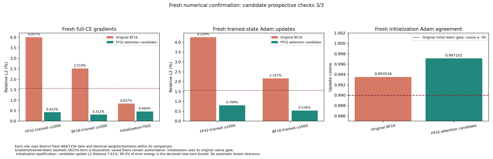
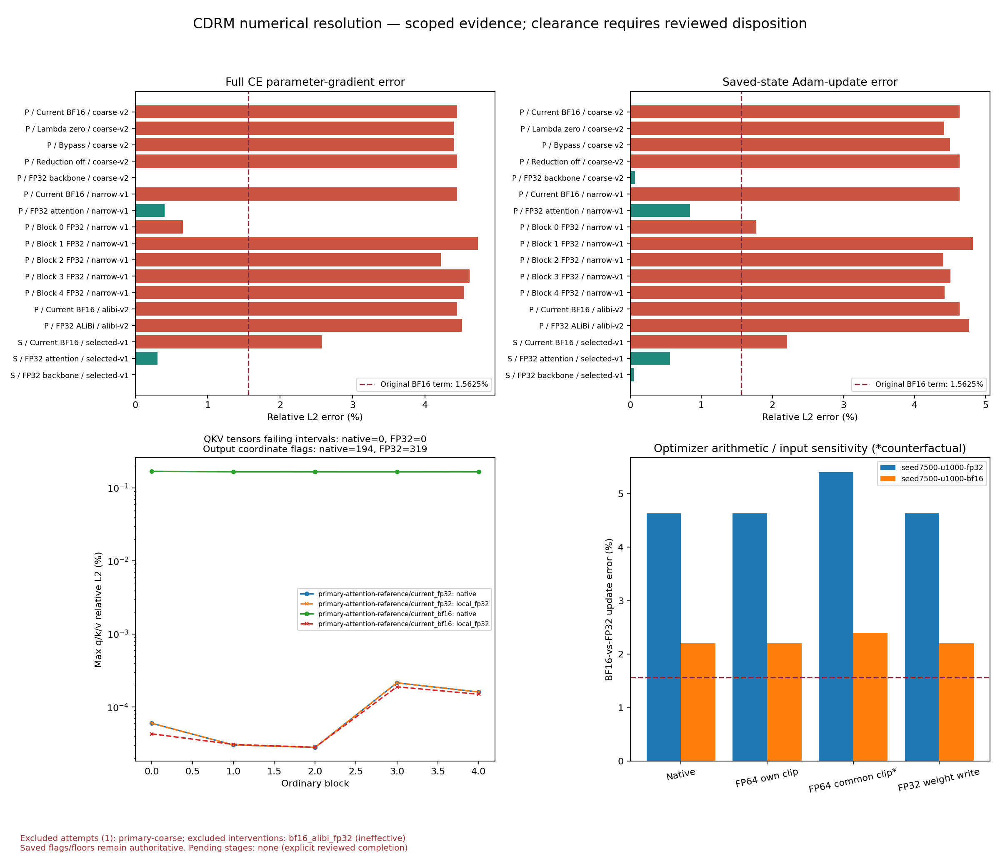

# CDRM numerical resolution

Keeping ordinary attention in FP32 resolves the trained-checkpoint gradient
and Adam-update alarms in the bounded cases tested, while retaining BF16 MLPs,
the BF16 output head and the tiled BF16 fabric. The selected candidate passes
its predeclared numerical checks on both retained diagnostics and all three
fresh confirmation roles. Initialization retains a first-Adam-update
qualification described below.

This investigation keeps the five-block architecture and runs fixed-state
forward, derivative and optimizer comparisons. It does not train models or
assess task performance. The [storage receipt](storage.json) records archive
verification.

The [W&B summary](https://wandb.ai/taylorbollman/cdrm-numerical-resolution/runs/22hhyqg5)
contains the plots and numerical records.

## Findings established on the retained primary case

The original mixed policy differs from tiled FP32 by 4.4423% in the full
parameter gradient and 4.6329% in the Adam update. Those failures are retained.
The same differences persist with the fabric bypassed or its bridge multiplier
set to zero. Lambda is a fixed 0.01 configuration scalar; the two adapter
matrices are learned. Removing a learned gate is therefore not the relevant
remedy for this implementation.

The ordinary backbone is the main source of this discrepancy. Keeping that
backbone in FP32 while leaving the tiled fabric in BF16 reduces gradient and
Adam differences to 0.00488% and 0.06792%. A narrower candidate, retaining FP32
from ordinary QKV projection through attention output projection, reduces them
to 0.40558% and 0.84045%. Its MLPs, final output head and tiled fabric retain
BF16 computation; residuals, recurrent state and optimizer retain their existing
FP32 policy. Both controls pass the measured primary gradient tensor/maximum
and trained-Adam screens. Complete side checks and fresh confirmation follow
below.

| Primary fixed-state control | Gradient relative L2 | Adam-update relative L2 |
| --- | ---: | ---: |
| Original BF16 mixed policy | 4.44233% | 4.63293% |
| Fixed lambda set to zero | 4.39841% | 4.41752% |
| BF16 reduced-precision GEMM reductions disabled | 4.44233% | 4.63293% |
| FP32 ALiBi only, with its effective dtype verified | 4.51335% | 4.77187% |
| Ordinary block 0 in FP32 | 0.66080% | 1.77073% |
| Ordinary attention in FP32, MLP/head/fabric in BF16 | 0.40558% | 0.84045% |
| Entire ordinary backbone/head in FP32, fabric in BF16 | 0.00488% | 0.06792% |

In this plot, P and S denote the retained primary and secondary cases. Gradient
bar colors reflect the complete gradient tensor/maximum screens, so block 0
can remain red despite its global L2 error lying below the dashed screen term.

Block 0 alone still fails six tensor L2 checks, one maximum check and the
trained-Adam screen. Promoting any one of blocks 1–4 leaves roughly the
original discrepancy. These are interventions at unchanged weights and inputs;
they are not a training comparison or independent additive error contributions.

The second retained checkpoint also supports the attention candidate: gradient
relative L2 is 0.30851% and Adam-update relative L2 is 0.55847%, with no tensor
L2 or maximum flags. Its original mixed policy remains at 2.57370% and 2.20583%.
Unobserved and observed candidate executions agree bit for bit on this case.

## Independent arithmetic references

Independent FP64 clipping and Adam calculations reproduce the two original
update discrepancies: native 4.6329309% versus ideal FP64 4.6329290% on the
primary case, and 2.2058268% versus 2.2058057% on the secondary case. All local
optimizer arithmetic checks pass. A common clipping coefficient increases the
differences; native clipping slightly mitigates them. The evidence points to
the gradients entering Adam, rather than an optimizer implementation error.

Embedding accumulation is accurate; the discrepancy is already present in its
incoming adjoints. Independent CPU FP64 sums of those adjoints reproduce its observed
BF16-versus-FP32 discrepancy, while native accumulation differs from the
same-operand FP64 sum by only 3.38e-7–4.31e-7 relative L2.

For attention, an independent analytic FP64 forward and VJP use the actual
captured Q/K/V, additive mask and incoming cotangent. The BF16 local gradient
differences are approximately 0.165% relative L2. A separate attribution shows
that every captured native attention output and Q/K/V gradient equals the local
math-SDPA FP32 calculation followed by the intended storage cast, bit for bit:
40 tensor comparisons and 83,886,080 coordinates across FP32 and BF16 arms,
including 41,943,040 BF16 coordinates. There is no additional native mismatch
in this decomposition. The FP64-to-FP32 arithmetic residual, explicit storage
cast and their vector interaction remain separately recorded.

The strict local output-coordinate interval is not universally satisfied:
79 and 112 FP32 output coordinates fail in blocks 3 and 4, and three BF16
output coordinates fail in block 4. Local FP32 evaluations on the captured
BF16 operands have 50 and 78 output flags in blocks 3 and 4. All local Q/K/V
gradient intervals pass. The output flags remain visible; their arithmetic is
explained by the independently measured FP32 residual and subsequent storage
rounding. This does not retroactively change the prospective interval or turn
the original whole-model BF16 failures into passes.

An isolated block-0 replay further separates local precision effects from the
incoming gradient. All FP32, original BF16 and candidate block replays reproduce
their full-model outputs, parameter gradients and input gradients bit for bit.
With its incoming FP32 cotangent held fixed, original BF16 changes the block's
parameter gradients by 0.94894%. Changing the incoming cotangent adds a vector
whose norm is 5.50266% of the FP32 gradient norm; their negative interaction
leaves a total 4.91676% discrepancy. These percentages must not be added.
The attention candidate reduces the corresponding local and incoming terms
to 0.12424% and 0.39948%, with total 0.42182%. Thus a large early-block gradient
error need not be a local backward defect: substantial error arrives through
the surrounding composition. This diagnostic does not assign all incoming
error to one forward operation or fully separate every forward/backward cast.

## Execution qualifications

The first coarse attempt exceeded a Dynamo specialization limit across its
multiple controls. It is retained as a failed attempt and excluded from
accepted numerical evidence. The clean replay separates the in-memory frame
cache between arms, preserves the same isolated Inductor disk cache and audits
each arm before resetting counters. All original and instrumented baselines
reproduce the archived packets and optimizer steps bit for bit.

The first ALiBi-only control was ineffective because CUDA autocast recast its
mask inside SDPA. That observation is retained and labeled ineffective. The
corrected control disables autocast around the primitive while preserving
BF16 Q/K/V/output, and a direct CUDA test verifies the intended mask behavior.
The full-attention candidate had its complete attention region explicitly
outside autocast throughout and was unaffected by this diagnostic issue.

No original model source, architecture, optimizer setting or acceptance budget
has been changed. The candidate currently exists as an explicit diagnostic
precision wrapper; default training behavior is unchanged.

## Confirmation and disposition

The candidate, 51 source files, criteria and role allocation were frozen before
generating 192 native numerical examples with seed 925903 and a distinct
initialization with seed 7502. Each role has one physical B64/T256 batch, with
no overlaps with prior training, development or numerical data and no
resampling. The original and local reference contracts remain unchanged.

| Fresh role | Original BF16 gradient L2 | Candidate gradient L2 | Candidate independent-side gradient L2 | Candidate Adam result |
| --- | ---: | ---: | ---: | --- |
| FP32-trained u1000 | 4.00745% | 0.42234% | 0.45243% | L2 0.79944%; passes trained ≤1.5625% gate |
| BF16-trained u1000 | 2.51855% | 0.31213% | 0.45654% | L2 0.53392%; passes trained ≤1.5625% gate |
| Distinct initialization 7502 | 0.83723% | 0.46000% | 0.44462% | Cosine 0.99710085; passes initial ≥0.99 gate |

All candidate full-gradient tensor/max, logit/loss, full and independent
unscaled-state, side-gradient and applicable Adam screens pass. Every direct
side and full-output cotangent scaling check at 1/32 and 32 agrees bit for bit
after normalization. All 12 confirmation-arm compiler audits pass. Confirmation
omits the diagnostic capture observers, preserves all 45 canonical parameter
owners and checks that derivative probes do not mutate actual-CE gradients.
Each optimizer step starts from the assigned saved state and is discarded.

**The initialization Adam qualification is material.** Its candidate update
relative L2 distance is 7.61465%, compared with 11.37168% for the original
BF16 policy. The original initialization contract uses cosine ≥0.99, rather
than the trained update-distance gate, so both pass that applicable criterion.
For the candidate, 99.23493% of update-error energy lies in the original
near-zero-gradient bucket, with 1803 gradient sign flips there and 12 outside
it. Maximum individual update differences can approach twice the learning
rate. This is a bounded pass under an initialization criterion based on direction, not a claim
that every first update closely matches FP32. The trained-case conclusion
remains separately supported by its stricter update-distance checks.

An additional independent FP64 optimizer calculation on this already-observed
initialization reproduces the candidate update distance at 7.6146499%, versus
native 7.6146496%; it also reproduces the original BF16 distance. All local
optimizer arithmetic checks pass with exact zero prior moments. Thus the
remaining first-step sensitivity comes from the small gradient differences
entering Adam, rather than its numerical implementation. No new case was drawn
and no criterion or candidate was adjusted after confirmation.

The naive-versus-tiled FP32 full actual-CE gradients pass all coordinate checks,
as do the compared FP32 states and logits. The raw independent side retains
9, 8 and 9 tensor elementwise flags in the three roles, at global relative L2
4.81e-7–4.99e-7. All existing scale-aware diagnostics pass. These are retained
strict coordinate failures, consistent with the earlier cancellation and
reduction-order qualification; this investigation does not independently
prove the entire CDRM side VJP against FP64. The aggregate original machine
flag remains false because it includes these flags and the failed original
BF16 policy on trained states. `candidate_prospective_checks_pass` is true
for all three roles; it is a separate, explicitly scoped result.

An independent CPU audit also verifies complete standalone fabric packets
are byte-identical between the original BF16 and candidate policies in all
three roles: the attention intervention does not silently change the shared
fabric computation. All 82 current source files inherited from the parent
milestone remain unchanged.

The evidence supports keeping the architecture and using the selected
attention precision placement for the next bounded CDRM work. It does not
support declaring the original all-dense-BF16 policy equivalent to FP32.
No new tiled backward defect was identified in the checked paths. This is a
sensible PR pause before integrating the candidate as an explicit model
option and measuring its operational cost. Long sequences, other widths,
other attention backends and learning behavior remain outside this numerical
confirmation. The candidate currently remains an explicit diagnostic wrapper;
training defaults have not been promoted.

## Reproduction and retained records

The [usage guide](../../cdrm-numerical-resolution-usage.md) identifies each
diagnostic and gives a replay command with the exact candidate and fixture
hashes. The scientific lineage is
`.runtime/cdrm-numerical-resolution/20260907T232931Z/`, retained under
`gs://fast-chunks/cdrm-w-latent/cdrm-numerical-resolution/20260907T232931Z/`.
It includes the original failed attempt, ineffective-control audit, frozen
candidate and roles, generated arrays, initialization, source snapshots,
compiler caches, raw gradients/states/optimizer packets, independent references,
CPU/CUDA test logs and review reports. The storage receipt records manifest
and remote-checksum verification separately from the scientific results.

The three fresh runs are
[FP32-trained](https://wandb.ai/taylorbollman/cdrm-numerical-resolution/runs/3ojton62),
[BF16-trained](https://wandb.ai/taylorbollman/cdrm-numerical-resolution/runs/nk5acx3d)
and [initialization](https://wandb.ai/taylorbollman/cdrm-numerical-resolution/runs/4e5wgaip).
The [initial Adam reference](https://wandb.ai/taylorbollman/cdrm-numerical-resolution/runs/eamkg4bg)
records the remaining first-step qualification.
