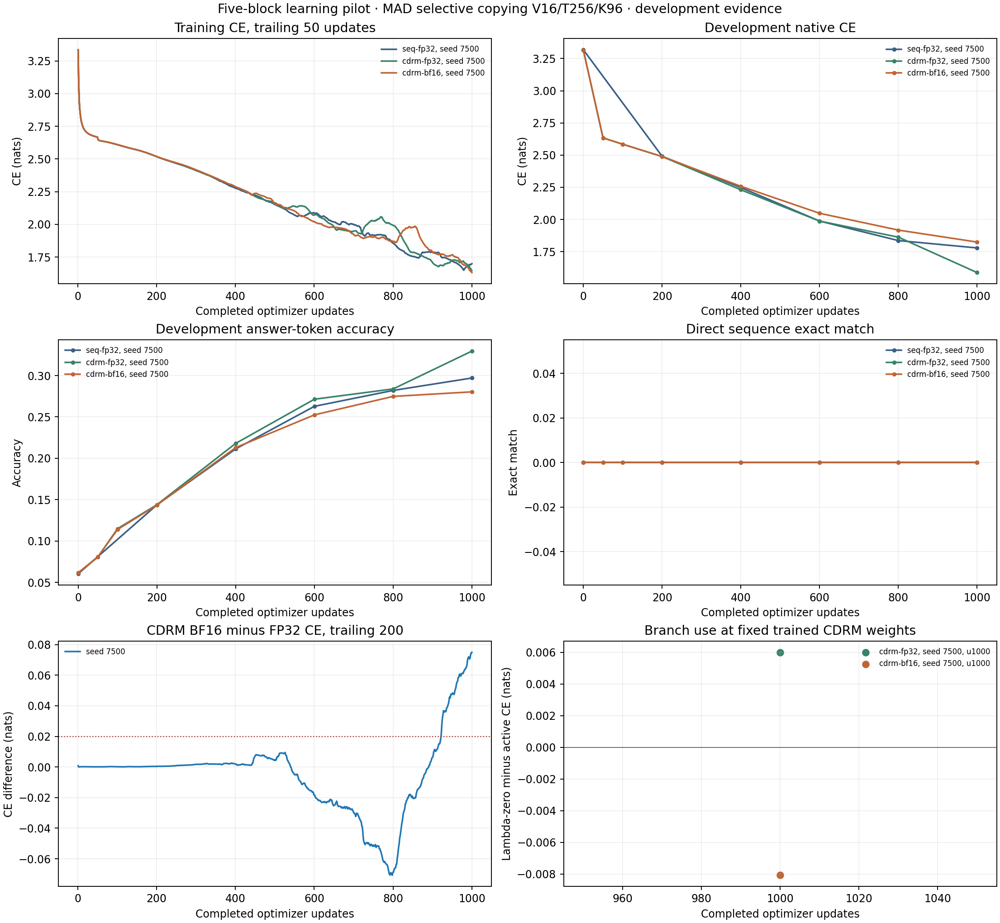

# Bounded five-block CDRM learning pilot

The first matched FP32 comparison shows a development improvement from training
with CDRM: at 1000 updates it reaches 32.96% answer-token accuracy versus SEQ’s
29.70%, with lower cross entropy. CDRM BF16 reaches 28.03%, below both FP32
arms. No arm produces an entirely correct
96-answer sequence in the 256-example development set. This is one
initialization on one development task, and the current CDRM implementation
uses much more update time. It establishes an informative pilot setting,
without establishing a general architecture or efficiency advantage.

BF16 has both numerical and learning concerns. At the FP32-trained update-1000 weights,
whole-model BF16 gradients and Adam deltas fail the frozen numerical budgets
materially, although direct memory checks remain good. Controls show that the
failure persists with the fabric’s contribution zeroed and with the final head
computed in FP32. Its training trajectory also develops persistent higher
development loss and finishes with a 0.236928-nat gap against CDRM FP32. The
pilot stops at the first 1000-update cohort review: there is no 2500-update
extension, second-seed training or BF16 clearance. The observed FP32 architecture
improvement merits a separate discussion of the next experiment; it does not
resolve the precision concerns.

The [prospective protocol](protocol.md) fixes five ordinary blocks, one fabric
between zero-based sites 1 and 3, D128/H16, full MHA, MLP512/GELU, learned
normalization/QK normalization, ALiBi and zero dropout. Gates remain epsilon
0.1, rho 1 and lambda 0.01. The production BF16 policy, including BF16 output
logits and FP32 CE, is unchanged. The fabric shares the early block’s existing
weights; its two adapters add 32,768 parameters, giving 1,022,592 versus SEQ’s
989,824.

The task is native MAD selective copying, **sequence length 256**, vocabulary
16, 96 copied symbols and physical batch 64. We reuse the retained 12,800
training and 256 development examples, aligned native labels, shuffle seed
925704, AdamW and the original 200-epoch cosine schedule. There are 200 updates
per epoch; the LR changes after each complete epoch, rather than being
compressed into this short pilot. There is no final research test set.

Seed 7500 is the only trained initialization. Both CDRM arms resume
their exact original update-100 weights, Adam moments, scheduler, RNG and data
position. SEQ starts from the corresponding original ordinary backbone, with
the fabric and its adapter owners removed. All arms see the same ordered
examples and learning rates. The prospective second initialization and fresh
numerical slots are prepared, but preparation does not count as a trained
replication.

At the completed matched 1000-update endpoint:

| Arm | Development CE | Answer-token accuracy | Direct sequence exact match | Recorded cumulative update time |
| --- | ---: | ---: | ---: | ---: |
| SEQ-5 FP32 | 1.779062 | 29.7038% | 0/256 | 23.15 s |
| Tiled CDRM-5 FP32 | 1.587551 | 32.9590% | 0/256 | 546.93 s |
| Tiled CDRM-5 BF16 | 1.824479 | 28.0314% | 0/256 | 618.65 s |

CDRM FP32’s observed advantage over SEQ is 0.191511 nats and 3.2552 percentage
points at equal updates. CDRM BF16 is 4.9276 points below CDRM FP32. Recorded
model-update time includes compilation when it occurs
and excludes some evaluation/logging/retention work; these are measured pilot
costs, not a warmed throughput benchmark. Each 1000-update trajectory consumes
16,384,000 input tokens and 6,144,000 scored answers. The much larger current
CDRM cost matters when interpreting the equal-update accuracy comparison.

The setting passed the protocol’s allocation screen. The fixed order-ignoring
modal baseline is 12.2030% token accuracy, and the fixed CE learning threshold
is `0.8 * log(14) = 2.11125` nats. SEQ learns substantially and does not meet the
three-consecutive-evaluation early-ace rule. No result was classified as solved
from token accuracy alone.

At the FP32-trained CDRM checkpoint, removing the branch only during evaluation
changes development CE from 1.587551 to 1.593550 and token accuracy from 32.9590%
to 32.8003%; exact match stays zero. Weights, optimizer, gradients, model modes
and RNG are preserved by this control. It measures dependence on the learned
branch at those fixed weights. The separately trained SEQ model answers the
different question of training with versus without the fabric; lambda-zero
CDRM is not substituted for that baseline. In the BF16-trained checkpoint,
lambda-zero slightly improves CE from 1.824479 to 1.816400 and token accuracy
from 28.0314% to 28.1250%, with training state preserved. Neither endpoint shows
a large immediate dependence on the branch at the fixed lambda of 0.01.

The paired BF16 trajectory first crosses the prospectively fixed
two-consecutive-development-point 0.02-nat investigation trigger at update 600.
Training and development gaps evolve differently; a favorable training window
does not erase the development trigger:

| Update | Development CE, BF16 minus FP32 | Mean training CE gap over preceding 200 updates |
| --- | ---: | ---: |
| 400 | +0.027129 | +0.001874 |
| 600 | +0.060673 | -0.018486 |
| 800 | +0.054837 | -0.068693 |
| 1000 | +0.236928 | +0.074874 |

Across all 1000 matched training updates, BF16's mean CE is actually 0.002011
nats lower than FP32's. The loss curves oscillate, and BF16's increase around
update 850 has receded by the endpoint. Both arms continue learning; the final
gaps warrant this review pause but do not demonstrate monotonic collapse or
establish that BF16 is generally unusable.

At update 600, evaluating the same BF16-trained weights in strict FP32 changes CE
from 2.048053 to 2.043864. Only 0.004189 of the 0.060673-nat gap comes from the
immediate evaluation arithmetic: a 0.056485-nat gap remains against the
FP32-trained checkpoint under common FP32 evaluation. The original BF16
evaluation reproduces bitwise. The discrepancy therefore largely reflects the
learned trajectory, and the favorable training window does not erase it.

The retained investigations find finite parameters and optimizer state, active
fabric signals, matching example order/LRs and exact recovery. These justified
finishing the originally bounded diagnostic with reviews at 600 and 800. At
1000, the last-200-training-loss guard also triggers. This is evidence of a
meaningful precision-dependent outcome in this paired initialization, not an
estimate of its frequency across seeds or proof of the exact causal operation.

Fresh numerical monitoring uses a separate 768-example draw frozen before this
pilot. Eight disjoint B64 slots are assigned by initialization, endpoint and
training precision; the final 256 examples are reserved. We use the two
assigned update-1000 slots, at offsets 0 and 64. Each compares naive FP32, tiled
FP32 and tiled BF16 at **one checkpoint's identical weights and Adam state**.
This is distinct from comparing two training trajectories after they have
diverged. The slots use different examples, so their error magnitudes do not
isolate the effect of checkpoint trajectory alone.

| Same-state numerical check | FP32-trained u1000 | BF16-trained u1000 |
| --- | ---: | ---: |
| Tiled versus naive FP32, actual CE gradient relative L2 | 1.66e-7; coordinates pass | 1.48e-7; coordinates pass |
| BF16 versus FP32, whole-model gradient relative L2 | **4.4423%; fails** | **2.5737%; fails** |
| BF16 per-tensor L2 / maximum failures, including inputs | **40 / 6** | **12 / 3** |
| Independent unnormalized memory-gradient relative L2 | 0.4402%; guards pass | 0.4523%; guards pass |
| Unscaled side-state BF16 guards | Pass | Pass |
| Trained Adam delta relative L2 | **4.6329%; fails** | **2.2058%; fails** |
| Same-state absolute CE difference | 0.008398 nats; passes | 0.005770 nats; passes |

The frozen whole-gradient allowance is 1.5625% plus its specified absolute
floor; the Adam-delta allowance is 1.5625%. The FP32-trained slot has 39
parameter plus one input L2 failures, and four parameter plus two input maximum
failures. The BF16-trained slot has 11 plus one L2 failures and one plus two
maximum failures. Both are broader than the parent milestone's marginal
aggregate-only BF16 flag. More than 95% of Adam error energy lies outside the
frozen near-zero-gradient mask in both slots, so this is not confined to the
previous initialization sign corner. Strict FP32 coordinate flags on the
independent raw side probe also remain visible: nine parameter flags per slot,
with global relative errors 4.77e-7 and 4.78e-7. All original failed machine
flags remain false; reviewed operational completion is not numerical clearance.

The six-arm localization reproduces original loss, logits, parameter/input
gradients and Adam-step packets bitwise. Lambda-zero still gives 4.3984%
gradient error and 4.4175% Adam error. An FP32 head gives 4.4387% and 4.6151%;
explicit FP32 final normalization adds no change. The native head gradient
matches its same-operand FP64 contraction rounded once to BF16, while its input
already differs by about 1.51% from FP32. These observations support sensitivity
of the learned ordinary backbone under mixed precision, without identifying a
memory-specific derivative defect. They do not establish that longer BF16
training is equivalent or safe to promote by default.

The new runner preserves full trajectory ancestry and allows stopping-target
extensions without resetting training state or changing the schedule. Its
checkpoint format remains compatible with the existing numerical validator.
The numerical wrapper enforces each prospective same-state checkpoint/fixture
role and preserves the validator’s false flags. The CPU aggregate independently
reconstructs batch hashes and LRs, verifies continuation prefixes and source
snapshots, checks direct metric counts, and keeps reviewed qualification apart
from numerical and operational results.

Validation includes three preparation tests, eight runner tests, four numerical
wrapper tests, and 27 aggregate checks including actual retained trajectories,
adversarial identity/order/metric cases and final-tracking-failure retention.
Real retained initialization and update-100 state checks also pass. On the H100,
BF16 recovery from update 190 to 210 matches uninterrupted model, optimizer,
scheduler, RNG, data position and non-timing metrics bitwise across an epoch
boundary. This uses the recorded shared compiler cache and does not claim
portable bitwise recovery across compiler/runtime changes. A test-only regex
failure was retained before its corrected passing test run.

Runs and controls are visible in the
[pilot W&B project](https://wandb.ai/taylorbollman/cdrm-tiled-learning-pilot),
including [SEQ](https://wandb.ai/taylorbollman/cdrm-tiled-learning-pilot/runs/ox01et51),
[CDRM FP32](https://wandb.ai/taylorbollman/cdrm-tiled-learning-pilot/runs/66tf3uox),
[CDRM BF16](https://wandb.ai/taylorbollman/cdrm-tiled-learning-pilot/runs/bymgcm2t),
[u1000 numerical localization](https://wandb.ai/taylorbollman/cdrm-tiled-learning-pilot/runs/lhzk7y2y),
[BF16-trained numerical observation](https://wandb.ai/taylorbollman/cdrm-tiled-learning-pilot/runs/vw5n6ikv),
[u600 evaluation control](https://wandb.ai/taylorbollman/cdrm-tiled-learning-pilot/runs/mdmqhev5)
and [epoch recovery](https://wandb.ai/taylorbollman/cdrm-tiled-learning-pilot/runs/yvd4n3ji).
Local evidence is under `.runtime/cdrm-tiled-pilot/20260907T212606Z/`.
The [combined W&B run](https://wandb.ai/taylorbollman/cdrm-tiled-learning-pilot/runs/1hbe7p8s)
contains all three curves. The [audited summary](summary.json) has no provenance,
pairing or completeness errors and retains the false numerical predicates.
The [reviewed disposition](reviewed-disposition.json) records the pause at1000.
Standalone [PNG](summary.png) and [SVG](summary.svg), [training CSV](training.csv),
[development CSV](development.csv), [paired precision CSV](paired-precision.csv)
and [branch-ablation CSV](branch-ablation.csv) support inspection and reuse.

The archive destination is
`gs://fast-chunks/cdrm-w-latent/cdrm-tiled-pilot/20260907T212606Z/`.
The [retention receipt](storage.json) records its manifest, source/cache archive
hashes and complete object-checksum verification. Checkpoints, data, raw numerical
tensors, controls, failed attempts, unused prospective examples and the untrained
second initialization are retained. The immutable parent lineage is rehashed
separately; its scientific artifacts remain unchanged.

