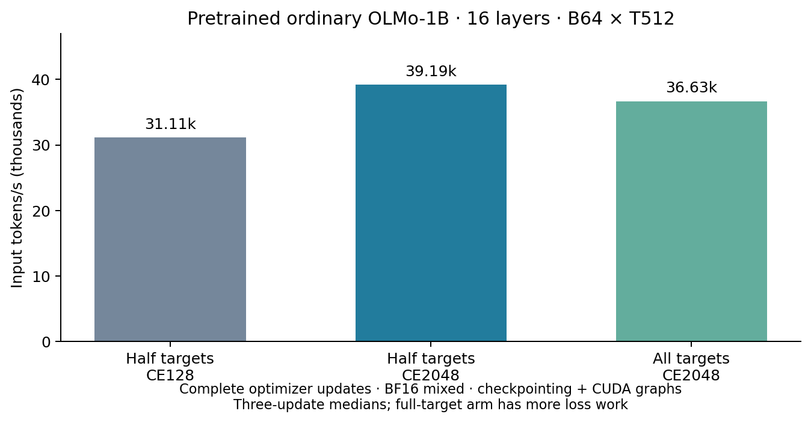

# CE integration and original 16-layer OLMo throughput

2026-09-23. Completed: six GPU reports, 18/18 gates, 36 physical optimizer updates, and 152 scoped CPU tests. Frozen runtime/protocol `0d39a22` on base PR21 merge `4528b37`. No failed GPU attempt or runtime edit during this queue.

**The original pretrained model improves from 31.11k to 39.19k input tokens/s (26.0%) by increasing CE position chunks 128→2048.** This validates the bottleneck found in the prior six-layer test. The full-next-token-supervision measurement is 36.63k/s.

## What changed

Shared dynamic/static training CE now accepts `NextLatConfig.ce_chunk_size=2048` independently from `vocab_chunk_size=128`, which still controls KL. Each CE chunk projects selected positions over all 50,304 vocabulary rows; masks, loss weights, tying and valid-position denominators stay the same. `None` preserves old behavior and exact historical config dictionaries. No global default, model/kernel math, optimizer policy or checkpoint is changed. See [usage](usage.md) and [prospective protocol](protocol.md).

For new bounded native training/profiling, use the explicit CE2048/KL128 configuration and record it. Rebuild static layouts/graphs after configuration changes. Historical exact resumes should keep their saved settings. Existing evaluation chunking is separate. Dense-matrix FLOP estimates stay valid, since they already exclude conversion/add/fill/launch costs.

## Throughput and memory

Native step 60,000 (~252B tokens), 16 layers, D2048/H16, SwiGLU 8192 per branch, tied vocabulary 50,304, native RoPE/nonaffine LayerNorm, no Q/K normalization. Ordinary active parameters 1,176,764,416; resident 1,185,153,024 including frozen unused fusion. H100 80GB HBM3 (79.647 GiB physical), BF16 mixed with FP32 weights/gradients/Adam, ordinary checkpointing, deterministic PyTorch Flash SDPA, CUDA graphs, TF32/autocast cache off. Physical B64/T512, one batch/update, no accumulation.

| CE targets per row / chunk | Complete-update input tokens/s | Forward/loss/backward only | Setup peak allocated GiB | Setup peak reserved GiB | W&B |
| --- | ---: | ---: | ---: | ---: | --- |
| 256 / 128 | 31,114 | 32,478 | 26.74 | 37.17 | [run](https://wandb.ai/taylorbollman/pretrained-fbt-rt-nextlat/runs/josij5s0) |
| 256 / 2048 | 39,191 | 41,208 | 26.74 | 37.17 | [run](https://wandb.ai/taylorbollman/pretrained-fbt-rt-nextlat/runs/jbioj0tf) |
| 511 / 2048 | 36,633 | 38,337 | 26.74 | 37.17 | [run](https://wandb.ai/taylorbollman/pretrained-fbt-rt-nextlat/runs/jxvijbeb) |

The half-supervision pair differs only in CE chunking. The control matches F4's 31,113/s within timing noise. Full supervision does approximately twice the CE work and is a separate workload. All are medians of three synchronized complete updates after three real preparation updates and ten backward warmups plus capture. Full-step scope includes validated input copies, graph forward/loss/backward, clipping, AdamW and scheduler; no profiler or logging in timed closures. All participating gradients, parameters and Adam states were finite, and trainable weights changed. Setup reservations and current/steady memory are separately retained in raw reports.

These are directional short-run throughput measurements, not sustained training or a reproduction of the RT paper's six-layer 153k/s result. Its model/loss/compiler/checkpoint recipe differs; see [prior paper audit](../olmo-ordinary-throughput/paper-comparison.md). Do not compare the new ordinary timing to historical RT/FBT/NextLat timings as a matched architecture overhead ratio: those still used CE128. Remeasure matched configurations when revisiting that matrix.

## Numerical and graph checks

B8/T512 half CE selects 2,048 targets: sixteen 128-position projections versus one 2048-position projection at identical weights. Ordinary, NextLat and all-three RT+FBT+NextLat cover representative native paths; the all-three case uses RT layers 0/15, K2 feedback and optimized Triton/recompute RT in both arms. All eight feature switches are covered by tiny CPU comparisons.

| Native case | Global gradient L2 difference | Worst tensor L2 | Worst tensor normalized max | Graph/Adam exact | W&B |
| --- | ---: | ---: | ---: | --- | --- |
| ordinary | 0.4079% | 0.6134% | 1.0363% | yes | [run](https://wandb.ai/taylorbollman/pretrained-fbt-rt-nextlat/runs/ffarowa7) |
| nextlat | 0.1828% | 0.3245% | 0.6250% | yes | [run](https://wandb.ai/taylorbollman/pretrained-fbt-rt-nextlat/runs/cezvyrjl) |
| combined | 0.6552% | 1.1543% | 2.5641% | yes | [run](https://wandb.ai/taylorbollman/pretrained-fbt-rt-nextlat/runs/qf5e6gnf) |

Maximum relative CE loss difference: 9.65e-08; every auxiliary loss stays bitwise equal. All gates meet the prospective global L2 ≤1/64, tensor L2 ≤1/32, normalized tensor maximum ≤1/16 and CE relative-loss ≤1e-5 screens. Same-candidate eager/graph losses and every participating gradient are exact at initial state, changed tokens/repeated replay and changed weights. Each case also matches three eager against three graph updates in weights, Adam moments, schedule, counters and metrics. This is exact execution parity for the candidate, not bitwise equality across chunk sizes or a long-learning claim.

The 152 CPU tests include 30 new checks for dense full-vocabulary CE/hidden/readout gradients, partial and empty masks, untouched auxiliary values/gradients/readout detach, legacy config identity, stale-layout rejection and all eight feature combinations. See [test log](test-results.txt).

**Earlier numerical qualifications remain open.** F4's RT+FBT coordinate-budget miss and approximately 18% BF16-versus-full-FP32 initialization gradient difference concern a different comparison. These CE checks do not clear them. The existing AccumulateGrad stream warning remains visible; actual single-GPU capture/replay and full updates passed. No multi-GPU claim.

## Dao loss and next steps

Dao's optimized CE imports successfully without dependency changes. It fuses the loss calculation after logits are materialized, not the vocabulary projection. In the prior six-layer CE2048 trace, named CE kernels accounted for 4.09% of device-event time. That makes it a plausible small optimization, but not the dominant bottleneck solved here. We have not run Dao on GPU or adopted it; see [source/API/compatibility audit](dao-ce-audit.md). A later opt-in probe should preserve FP32 logits/non-inplace backward and validate loss/readout gradients, checkpointing and capture before timing. RoPE/SwiGLU remain separate opportunities.

The broader next milestone remains graph recovery/save-resume and accumulation, padded graph/online readiness, with matched CE settings in future throughput cards. Keep the bounded RT precision qualification visible and require a second GPU for genuine distributed tests. No long quality run or automatic Q/K normalization change is queued.

## Retained evidence

All 246 run/source pairs and protocol hashes match their snapshots and frozen runtime. [summary.json](summary.json) selects the six exact raw reports and W&B links; local sources/logs live under `.runtime/olmo-ce-integration/`. The starting native checkpoint is retained by reference; disposable few-update weights are omitted. The verified [storage receipt](storage-receipt.json) records the small GCS evidence archive, manifest and checkpoint identity. Full environment/repository restoration still uses Git and the project container.
