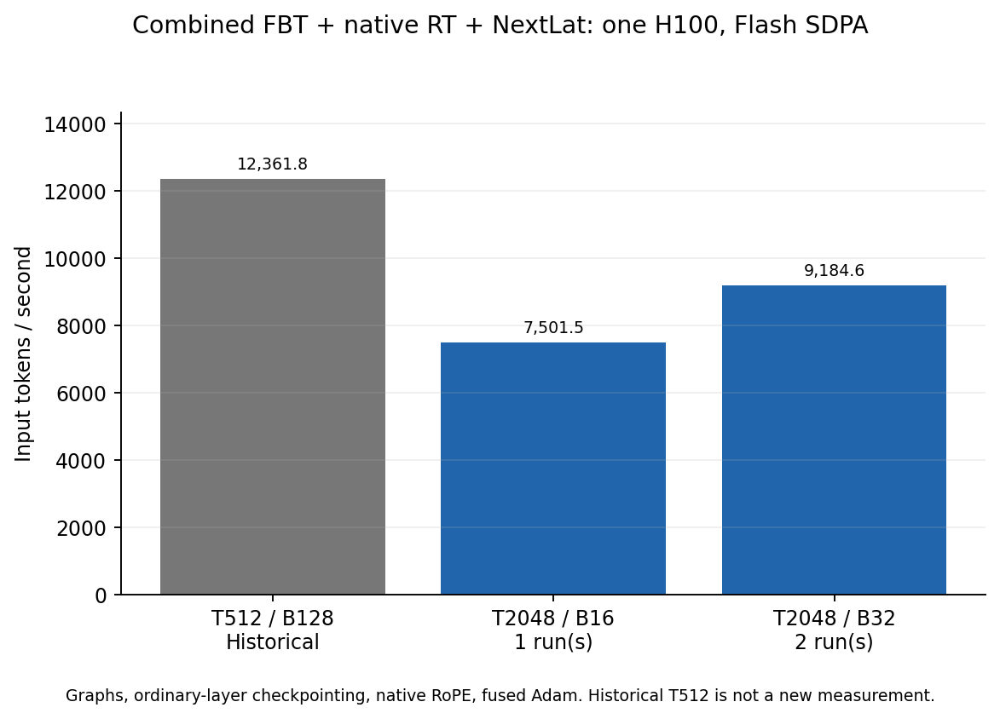
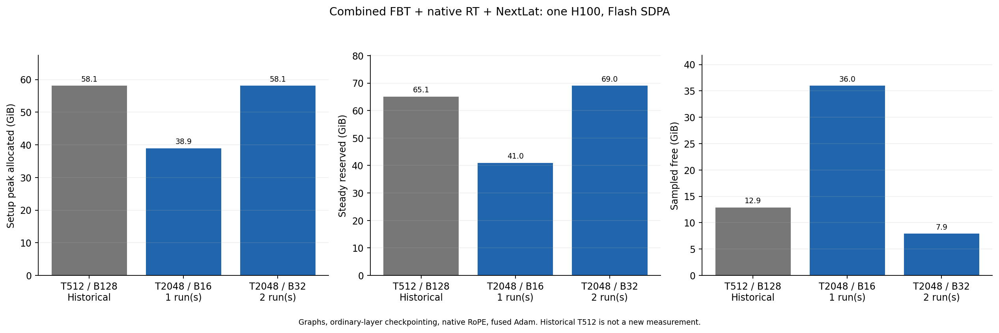

# Combined OLMo at length 2048, Flash SDPA only

**Complete, 2026-09-28.** The combined model works at length 2048, but does
**not maintain length-512 throughput**. Repeated B32/T2048 reaches **9,184.55
input tokens/s**, versus the saved B128/T512 **12,361.82/s**. That is **25.70%
less throughput**, or **34.59% more time** for the same 65,536 input tokens.
Both B32 runs pass all checks and differ by only 0.0134% in throughput.

No FA4 run, new T512 run, production arithmetic change or quality training was
performed. The GPU is idle. Pause for user review before further experiments.

## Results and operating choices

| Length | Physical batch | Input tokens/update | Input tokens/s | Seconds/update | Steady reserved GiB | Sampled free GiB |
| ---: | ---: | ---: | ---: | ---: | ---: | ---: |
| 512, historical | 128 | 65,536 | 12,361.82 | 5.3015 | 65.11 | 12.89 |
| 2048 | 16 | 32,768 | 7,501.52 | 4.3682 | 40.99 | 35.98 |
| 2048, two runs pooled | 32 | 65,536 | 9,184.55 | 7.1355 | 69.01 | 7.91 |

B32 is the fastest tested setting for this fixed configuration. It is 22.44%
faster than B16, but has only about 7.9 GiB sampled free. B16 is the conservative
choice when changing the model or workload: about 36 GiB free, with an 18.32%
throughput penalty versus B32. Larger batches were not pursued given graph
memory and the request for a bounded test followed by review.

B16 setup peak allocated/reserved is 38.918/41.227 GiB. B32 setup is
58.087/69.014 GiB versus historical 58.095/65.113 GiB. Thus, equal-token setup
allocated peaks are similar, but T2048 reserves about 3.90 GiB more and leaves
about 4.98 GiB less device-free memory. Reservation includes graph pools and
allocator cache; it is not live activation size. Free memory is sampled at
phase boundaries, not continuously. The approximately 19 GiB steady allocated
figure alone substantially understates the memory needed to execute the graph.

## Model, supervision and timing

The model is the 16-layer OLMo-1B step60000 checkpoint, after approximately
252B pretraining tokens. **K2 FBT** means an ordinary bootstrap pass, followed
by an attached-feedback pass with **native RT at indices 0 and 15**. It is not
recurrent at every layer. Both passes use CE + NextLat SmoothL1 + KL, each with
coefficient 1; pass losses are summed. Alpha, beta and gamma are 1.

Execution keeps native ordinary RoPE, compiled ordinary SwiGLU, fused AdamW,
all ordinary-layer activation checkpointing, and BF16 mixed precision with
FP32 parameters, gradients, residuals, normalization and Adam state. CUDA graphs
capture forward/loss/backward. Complete-update timing includes clipping, Adam,
scheduler, finite checks and input validation/copy. There is one physical batch
per update and no gradient accumulation.

Each fresh process has three preparation updates, eleven requested capture
warmups plus one gradient-preparation backward, and five timed complete updates.
B32 repeats individually measure 9,183.94 and 9,185.17 tokens/s. Pooling divides
total timed tokens by total time, rather than averaging rates.

The saved T512 reference is explicitly historical, not rerun or same-day
interleaved. All 37 pretrained runtime source hashes, recorded package versions,
and GPU/PyTorch/CUDA identities match it. The current harness only extends
selection and evidence reporting; model math is unchanged.

The fixture has independent, full-valid repeated-text rows, full CE/latent
masks and response-half KL. B32/T2048 per-pass CE/latent/KL counts are
65,504/65,504/32,768; B128/T512 counts are 65,408/65,408/32,768. K2 executes twice
the reported input-token work. Real data loading, packing, padding and quality
are outside this benchmark.

Training parameters total **1,267,879,936**: backbone 1,176,764,416; fusion
8,388,608; training-only NextLat predictor 82,726,912. Deployable with fusion:
1,185,153,024. RT adds no parameters. Native Q/K math remains unchanged.

The existing analytic matrix-arithmetic estimate is 1.419–1.568 PFLOPs/update
at B32/T2048, versus 1.363–1.449 at B128/T512. These are accounting estimates,
not hardware counters or rigorous bounds. They exclude norms, RoPE, activations,
softmax/loss elementwise work, casts, optimizer/clipping, launches and hardware
padding; checkpoint and attention arithmetic have the documented ranges.

## Functionality and likely performance contributors

All four new stages pass all five gates: actual selected dispatch; exact initial
eager/graph loss and raw-gradient agreement; exact changed-weight terminal
parity; dependency integrity; source integrity. **20/20 checks and all 32 short
optimizer updates pass.** B2 is a diagnostic and is excluded from performance
pooling. The scoped CPU suites pass 137 tests.

These checks do not clear older independent BF16/native-author qualifications
or constitute a new independent full-Adam trajectory comparison. They establish
functionality of this execution path, not long-run optimization equivalence.

Actual dispatch confirms Flash SDPA for ordinary attention, zero FA4/Dao loader
calls, compiled ordinary SwiGLU, and native RT historical attention. Across
RT0/15, each forward has 4,094 historical tiles: 4,088 Triton tiles plus four
eager 512×512 and two eager 1024×1024 tiles. All 4,094 historical backward tiles
use recomputed Triton. The six larger forward rectangles cover 75.04% of
historical pair area, **not 75.04% of model time**.

Plausible contributors to the slowdown are the smaller physical RT batch
(128→32), a fourfold longer sequential path, additional attention arithmetic,
and unfused larger forward tiles. This sweep does not separate their costs.
A targeted profile of the T2048 RT path would be the useful next investigation
if improving its speed is the priority, before deciding which optimization to
attempt. Nothing further is queued pending review. The slowdown is not evidence
that RT/NextLat is malfunctioning or that T2048 has worse language quality.

## Earlier loss-difference question

The earlier **7.23e-5 nats/target** difference compared ordinary **FA4 and Flash
SDPA at the same length 2048**. It was not 512-versus-2048 loss. It failed the
unchanged relative-loss tolerance of 1e-5 while that ordinary comparison passed
its output/gradient budgets. OLMo's original 2048 training context does not
alter the equivalence tolerance or imply quality harm. The same absolute
difference can pass or fail depending on the reference loss. No new cross-backend
comparison was made in this SDPA-only milestone.

## Evidence

[Protocol](protocol.md), [reproduction](usage.md), [CPU verification](cpu-tests.md),
[interruption handoff](progress.md), [storage receipt](storage-receipt.md),
[CSV measurements](performance.csv), [audit summary](summary.md).
Runtime commit `79e850a`; evidence helper `5f6c6ac`. All 652 new report-pinned
source snapshots verify, with all four stages retained in GCS. Starting O1
weights remain retained by reference; disposable benchmark updates need no new
full checkpoint.

| Stage | Role | W&B |
| --- | --- | --- |
| `sdpa-b2-check-01` | Operational diagnostic | [x8hkueyb](https://wandb.ai/taylorbollman/pretrained-fbt-rt-nextlat/runs/x8hkueyb) |
| `sdpa-b16-01` | Capacity/timing | [0gunb0o4](https://wandb.ai/taylorbollman/pretrained-fbt-rt-nextlat/runs/0gunb0o4) |
| `sdpa-b32-01` | Equal-token comparison | [udqdeq7x](https://wandb.ai/taylorbollman/pretrained-fbt-rt-nextlat/runs/udqdeq7x) |
| `sdpa-b32-02` | Fresh-process repeat | [1jd873ve](https://wandb.ai/taylorbollman/pretrained-fbt-rt-nextlat/runs/1jd873ve) |
| Saved `single-combined-b128-01` | Historical T512 reference | [watsz35j](https://wandb.ai/taylorbollman/pretrained-fbt-rt-nextlat/runs/watsz35j) |
