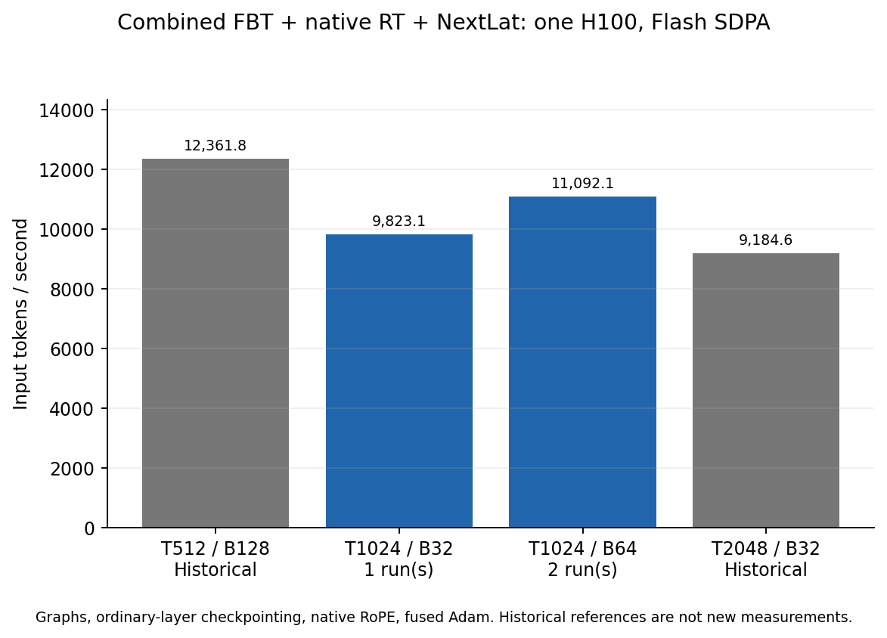
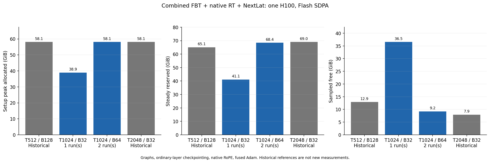

# Combined OLMo at length 1024: context-length compromise

**Complete, 2026-09-28.** Length 1024 is a substantially better throughput
compromise than 2048 for this combined model. Repeated B64/T1024 reaches
**11,092.06 input tokens/s**, retaining **89.73%** of the saved T512 throughput.
The deficit is **10.27%**, versus **25.70% at T2048**. Time per token rises
**11.45%** versus T512, and T1024 is **20.77% faster** than T2048.

I recommend T1024 as the starting context for the proposed directional RT
screen, subject to the intended tasks fitting that context. B64 is the fastest
setting tested here for the unchanged model. B32 provides substantial headroom
when modifying the model or data path. This benchmark does not establish
learning quality or launch the proposed continuation/SFT experiment.

## Measurements

All rows use one H10080GB, K2 FBT + native RT at indices 0/15 + NextLat, native
ordinary RoPE and Flash SDPA. No FA4 or new T512/T2048 run was performed.

| Length | Physical batch | Input tokens/update | Input tokens/s | Seconds/update | Steady reserved GiB | Sampled free GiB |
| ---: | ---: | ---: | ---: | ---: | ---: | ---: |
| 512, saved | 128 | 65,536 | 12,361.82 | 5.3015 | 65.11 | 12.89 |
| 1024 | 32 | 32,768 | 9,823.08 | 3.3358 | 41.12 | 36.55 |
| **1024, two runs pooled** | **64** | **65,536** | **11,092.06** | **5.9084** | **68.45** | **9.20** |
| 2048, saved pooled pair | 32 | 65,536 | 9,184.55 | 7.1355 | 69.01 | 7.91 |

The new B64 runs measure 11,089.20 and 11,094.92 tokens/s, a 0.052% spread.
Pooling uses total tokens divided by total elapsed time. B64 is 12.92% faster
than B32; B32 trades about 11.44% throughput for an additional 27.35 GiB sampled
free. No larger physical batch was pursued: the fixed B64 configuration fits,
but its roughly 9.2 GiB sampled headroom does not guarantee capacity for additions.

B32 setup peak allocated/reserved is 38.921/41.123 GiB; B64 is
58.091/68.445 GiB. Equal-token setup allocated peaks are nearly identical
across contexts, while graph/allocator reservation is higher than the saved
T512 value. Reservation is not live activation size, and sampled free memory
is not a continuously measured minimum. The approximately 19 GiB allocated
between replays does not represent the memory required to execute the graph.

The references are historical, not same-day interleaved measurements. All 37
pretrained runtime source hashes and recorded packages/GPU/PyTorch/CUDA identities
match all three retained reference stages. Model math and precision are unchanged.
These are short steady complete-update measurements with synthetic repeated-text
rows, not real data-loader or end-to-end long-run throughput measurements.

## What this suggests for a 500M-token screen

| Context / batch | Compute-only hours for 500M input tokens |
| --- | ---: |
| T512 / B128 | 11.24 |
| T1024 / B64 | **12.52** |
| T2048 / B32 | 15.12 |
| T1024 / B32, more headroom | 14.14 |

At B64/T1024, 7,630 optimizer updates process 500,039,680 input tokens. The
12.52-hour estimate assumes the benchmark's exact objective and supervision:
full CE/latent coverage, **KL on response-half positions**, and one physical
batch per update. It excludes data loading, evaluation, checkpoint/restart I/O,
startup and all SFT. Full-sequence KL or a different data layout adds work;
measure the final real-data configuration briefly before committing to a budget.
Each comparison arm requires its own training time; this is not the total time
for a paired screen.

For the RT question, the primary comparison should be matched **FBT + NextLat
with and without RT**, using the same starting checkpoint, data/order, context,
loss masks and token budget. Track quality versus both tokens seen and wall
cost. Ordinary OLMo can anchor the overall recipe separately. An early negative
result can justify deprioritizing this RT configuration under the tested recipe;
it would not show that RT has no value in every configuration or at longer
contexts. See [screening notes](screening-notes.md). No quality run is queued.

## Configuration and checks

The starting checkpoint is original 16-layer OLMo-1B step60000 (~252B tokens):
width 2048, 16 heads/head128, SwiGLU8192 per branch, tied 50304 vocabulary,
native nonaffine normalization and no added Q/K normalization.

K2 means an ordinary bootstrap pass followed by attached feedback with native
RT at indices 0 and 15, not recurrence in every layer. Alpha, beta and gamma
are 1. Each pass contributes CE + NextLat SmoothL1 + KL with coefficients 1;
pass losses are summed. Input throughput counts B×T once, while K2 executes
2×B×T pass-token work.

Native ordinary RoPE, rounded compiled ordinary SwiGLU, fused AdamW, all
ordinary-layer activation checkpointing, native RT weight-cast/RoPE reuse,
K/V-only writes, historical Triton tiles and recompute backward remain enabled.
BF16 mixed uses FP32 parameters, gradients, residuals, norms and Adam state;
TF32 and autocast weight cache are off. CUDA graphs capture forward/loss/backward;
complete-update timing includes validation/copy, finite checks, clipping, Adam
and scheduler. CE position chunks are 2048, KL chunks 128.

Every fresh process has three actual preparation updates, eleven requested
capture warmups plus one gradient-preparation backward, and five timed updates.
At B64/T1024, per-pass CE/latent/KL counts are 65,472/65,472/32,768. Independent
rows are fully valid; no packing, padding, cached prefixes or accumulation.

All **three stages pass 15/15 operational checks and 24 short optimizer updates**.
Initial and changed-weight terminal own eager/graph loss/raw-gradient checks
are exact. Dispatch, final source/dependency integrity and active objective/
parameter contracts pass. **160 scoped CPU tests pass.** These are not new
independent FP32 or full-Adam trajectory comparisons; older BF16 qualifications
remain recorded.

Actual T1024 dispatch has 2,046 historical forward tiles across RT0/15:
2,044 Triton plus two eager 512×512 tiles. All 2,046 historical backward tiles
use recomputed Triton. The larger forward tiles cover about 50.05% of historical
pair area, not that fraction of runtime. Shorter recurrence, larger physical
RT batch and less attention arithmetic plausibly explain the improvement over
2048; this sweep does not measure their separate contributions.

Training parameters remain 1,267,879,936: backbone 1,176,764,416; fusion
8,388,608; training-only predictor 82,726,912. Deployable with fusion is
1,185,153,024. RT adds no parameters. The existing analytic matrix-arithmetic
estimate for B64/T1024 is 1.382–1.489 PFLOPs/update. This is not a hardware-counter
measurement or rigorous bound; it excludes norms, RoPE, activations, loss
pointwise arithmetic, casts, optimizer/clipping, launches and hardware padding.

## Evidence and closeout

Runtime `dcbde27`; evidence helper `46c03f0`. All 489 new report-pinned source
snapshots verify. Three stages and the separate closeout evidence are retained
in GCS; starting O1 weights remain retained by reference. No new full checkpoint
is needed for disposable timing updates. The GPU is idle; pause for review.

[Protocol](protocol.md), [usage](usage.md), [CPU verification](cpu-tests.md),
[progress](progress.md), [storage receipt](storage-receipt.md),
[CSV measurements](performance.csv), [audit summary](summary.md).

| New stage | W&B |
| --- | --- |
| `sdpa-b32-01` | [o8ui9kw7](https://wandb.ai/taylorbollman/pretrained-fbt-rt-nextlat/runs/o8ui9kw7) |
| `sdpa-b64-01` | [6bjcm0g7](https://wandb.ai/taylorbollman/pretrained-fbt-rt-nextlat/runs/6bjcm0g7) |
| `sdpa-b64-02` | [zub9i4jo](https://wandb.ai/taylorbollman/pretrained-fbt-rt-nextlat/runs/zub9i4jo) |
