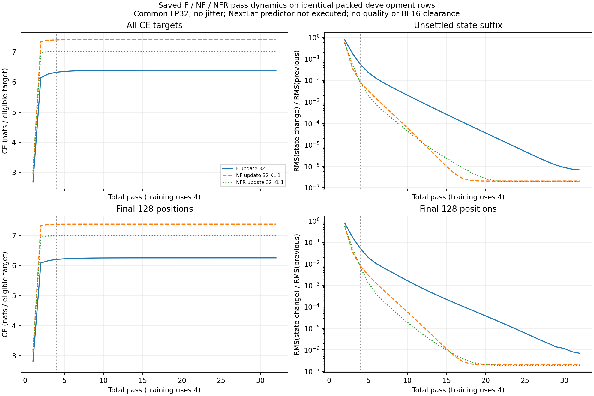
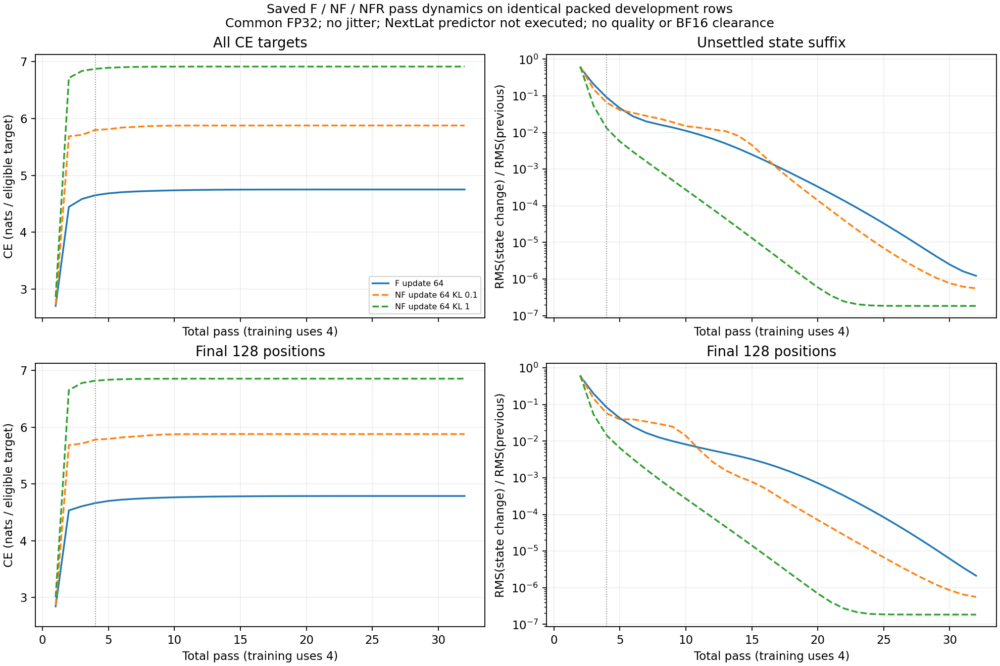
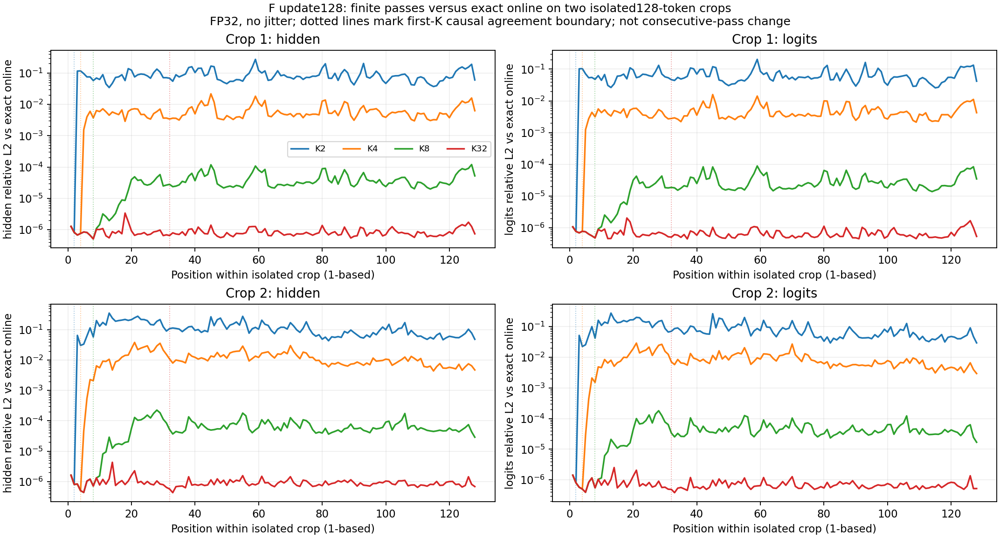

# Saved-checkpoint pass dynamics and exact-online comparison

2026-09-30. These are read-only, common-FP32, noiseless observations. They
change neither trained weights nor optimizer state. The component overlays
use the same eight packed T1024 development rows as the F-only pass probes;
the exact-online check uses two separately identified isolated 128-token crops.
Losses across those two contexts must not be compared as matched evaluations.

**Every measured component configuration settles tightly by pass32.** The
central difference is what predictions it settles to. Lowering NF's KL weight
improves prediction while retaining eventual settling, despite slowing the
early settling curve. These results support the declared matched NFR KL
continuation; they do not support optimizing for the smallest state changes.

## Matched component curves

All rows below use exactly 8,192 inputs and 8,184 CE targets, common FP32,
beta1 and zero jitter. NextLat's predictor is not called; its saved tensors
remain unchanged. NFR retains native RT at layers0/15 in every pass. CE is
in nats per target. Tail change is
`RMS(h[K]−h[K−1])/RMS(h[K−1])` on the final128 positions.

| Saved condition | Pass1 CE | Pass4 CE | Pass32 CE | Tail change at pass32 |
| --- | ---: | ---: | ---: | ---: |
| F32 | 2.678320 | 6.322649 | 6.389008 | 6.91e-7 |
| NF32, KL1 | 2.947346 | 7.400772 | 7.408798 | 2.04e-7 |
| NFR32, KL1 | 3.032401 | 7.016813 | 7.019030 | 1.90e-7 |
| F64 | 2.700558 | 4.650921 | 4.751938 | 2.12e-6 |
| NF64, KL1 control | 2.860311 | 6.876092 | 6.916349 | 1.83e-7 |
| NF64, KL0.1 | 2.725060 | 5.801002 | 5.878880 | 5.59e-7 |

At update32, NF and NFR settle faster than F while predicting substantially
worse. NFR improves later-pass CE relative to NF but has worse first-pass CE;
neither approaches F's combination of first-pass retention and feedback
recovery. This does not isolate why either auxiliary-trained model settles
to those predictions, or establish RT's eventual value.

[Update32 PDF](figures/post-components-update32.pdf) ·
[NF32 W&B](https://wandb.ai/taylorbollman/pretrained-fbt-rt-nextlat/runs/xougoazw) ·
[NFR32 W&B](https://wandb.ai/taylorbollman/pretrained-fbt-rt-nextlat/runs/0j2ui233).

The two NF64 branches restore the same complete NF32 training state and
change only KL weight for updates33–64. Reducing it to0.1 improves settled CE
by **1.037469 nats**, while improving first-pass CE by0.135251. The lower-KL
branch's tail change at pass8 is0.02950 versus0.000895 for control, but both
reach small changes at pass32. Hence slower early settling need not mean
worse adaptation. At pass32, predictive entropy is5.981 versus6.666 and
pre-final-normalization RMS is4.975 versus10.224. Those scale/entropy changes
are observations, not proof of a representation-collapse mechanism.

[Update64 PDF](figures/post-components-update64.pdf) ·
[NF64 KL1 W&B](https://wandb.ai/taylorbollman/pretrained-fbt-rt-nextlat/runs/fax05atg) ·
[NF64 KL0.1 W&B](https://wandb.ai/taylorbollman/pretrained-fbt-rt-nextlat/runs/yzb6m3ay).

F64 is a contextual reference; it trained without NextLat throughout, whereas
both NF branches share32 earlier KL1 updates. No row shows useful later-pass
refinement relative to its own first pass. The later F128 outcome belongs to
the separate [training report](results.md), not an update-matched comparison
with these saved32/64 states. A common small development panel and one seed
cannot establish a general quality ranking.

## F128 finite passes versus exact online

The exact sequential implementation and finite-pass implementation agree
closely after enough passes on both crops. This directly checks their
relationship, rather than inferring online correctness from small changes
between consecutive finite passes.

| Total passes K | Hidden relative L2 versus online | Logit relative L2 versus online | Finite minus online CE, nats/target |
| ---: | ---: | ---: | ---: |
| 2 | 0.114735 | 0.082545 | −0.0358461 |
| 4 | 0.010807 | 0.007741 | +0.0002009 |
| 8 | 0.00006172 | 0.00004361 | +0.00000756 |
| 32 | 0.000000967 | 0.000000718 | −0.000000143 |

Errors pool squared differences and reference norms over both crops; CE pools
254 targets. The reference online CE is 3.558040. At K4, nearly identical mean
CE coexists with **1.08% hidden-state error and 0.77% logit error**. Close mean
loss alone therefore does not establish state equivalence. At K32 the final 32
positions also agree: hidden/logit relative L2 are 9.04e-7/6.86e-7. Agreement is
not confined to the start of the crop.

For this causal recurrence, finite K matches the first K online positions in
exact arithmetic. Those prefixes agree here to approximately 1e-6 in pooled
relative L2; the largest individual-position hidden relative error across
these prefixes is 4.30e-6. Small differences are consistent with cached versus
batched FP32 arithmetic. This is distinct from the **first K−1 positions**
guaranteed settled when comparing pass K against pass K−1. Beyond the first K
positions, differences can reflect finite iteration depth. K32 reaches nearly
the same numerical scale throughout both 128-token crops, providing bounded
empirical agreement beyond that guaranteed prefix.

[Position-error PDF](figures/post-online-f128-position-errors.pdf) ·
[Online diagnostic on W&B](https://wandb.ai/taylorbollman/pretrained-fbt-rt-nextlat/runs/iq36d523).

Both crops come from the first packed development row, at row offsets 43 and 191,
each starting at its document's offset 0. Selection used metadata before token
materialization. Each contains 128 tokens from one document, with fresh cache
and positions reset to 0. The observation concerns teacher-forced execution at
the saved F128 weights, not free generation, BF16 equivalence, or full packed
T1024 online behavior. A lower finite-pass CE than online at K2 is not an
implementation failure or evidence that the online process should be the
quality optimum.

## Execution and evidence

All five diagnostics completed and synced. Full model/buffer hashes, RNG and
gradient-buffer checks remained unchanged, and preserved-runtime checks
passed. No training update or new BF16 validation was performed.

The host launcher's closeout check
mistook the online helper schema's status `complete` for the component helper's
status `completed`, producing a wrapper traceback after successful inference.
The helper was not rerun and the pinned launcher was not edited. The separate
[terminal adoption receipt](../../../.runtime/olmo-fbt-stability/post-diagnostic-online-f128-launch-01/terminal-adoption.json)
records this presentation-only discrepancy; the original launch record and
stdout/traceback remain beside it.

Online checkpoint manifest SHA256:
`b0c8cd0a94db8d33efba77e8533846e782ccf8833db891f8f124457ffd6350b7`.
The [raw report](../../../.runtime/olmo-fbt-stability/post-diagnostics-bound-01/result-online-f128/report.json)
has SHA256 `04b7133b93341f354903524b00dd6ff0ddaa3ef8590c12648983af0fff007616`.
Its [CPU position summary](../../../.runtime/olmo-fbt-stability/post-online-summary-01/report.json)
has SHA256 `36d80a65774a1b13aaa760b052807f0dfb45122d21daa9450e09379850e27322`,
and pins the input copy, presentation source and figure hashes.

Common F declaration SHA256:
`592e86d32f297005f1c6f7a5f9a07df8b1204d14b622018cee521356ba47d461`;
resolution SHA256:
`50d147f5f4f36aebefbc594018e31ff0575ddaef756f195bdd3427419f3df2b2`.

The component overlay summaries pin exact input snapshots, the unchanged
summary producer and all CSV/PDF/PNG artifacts:

| Overlay authority | Report SHA256 |
| --- | --- |
| [Update32 summary](../../../.runtime/olmo-fbt-stability/post-components-update32-summary-01/report.json) | `ca87a2d5aef479db20aa7bc5c4f6e53de22113e1b72cb0fe1c576a68deaa0d75` |
| [Update64 summary](../../../.runtime/olmo-fbt-stability/post-components-update64-summary-01/report.json) | `6185060eb86a4a4316e894192fe996f47d2dc033f67d77f3eb542dabc9444695` |

| Source observation | Report SHA256 |
| --- | --- |
| [F32](../../../.runtime/olmo-fbt-stability/native-f12-to128-01/stability-update-000032.json) | `e5814c282ed9359b689b3cf043b64ef6a64fd3757db0d83fadbeed6e934b242f` |
| [F64](../../../.runtime/olmo-fbt-stability/native-f12-to128-01/stability-update-000064.json) | `e34ef9da1e1190aed5acae477a295a46df673a65a42dc49b1fdce10e12a5bb48` |
| [NF32](../../../.runtime/olmo-fbt-stability/post-diagnostics-prepared-01/result-nf32/report.json) | `b0d4630d31b325d4b833b7324eaaadd9fe7c7fcfd546c8d65632c47fe0ed37a8` |
| [NFR32](../../../.runtime/olmo-fbt-stability/post-diagnostics-prepared-01/result-nfr32/report.json) | `b6083334682ae09f81969d77af28e3f2720bedf09c242c448eed6979c1e6c3ee` |
| [NF64 KL1](../../../.runtime/olmo-fbt-stability/post-diagnostics-prepared-01/result-nf64-control/report.json) | `cbaee8ddbe833616f7c47ab189d90196358235e571e9974a24cc5f9f97b98392` |
| [NF64 KL0.1](../../../.runtime/olmo-fbt-stability/post-diagnostics-prepared-01/result-nf64-reduced/report.json) | `922d4c9dfdad3305a75e91d69a68e1f16da3abcd079a980913d8565b68986dec` |

Imported checkpoint manifest SHAs are NF32
`3dec8c32d183b8f371a533d0b5176e50cd02867daa67157eeecdf10c174ceb2a`,
NFR32 `1c83b37812005b9d87a3ce06a1156b18789498e0d4a1ce7964cb16c5338bc82c`,
NF64 KL1 `0340858a2495e084186779662c6d7f0552a63d39818fa41fc90b4440192c431a`,
and NF64 KL0.1 `8b56a520321a2da7b9afcd7d217aea5eeee0382c3d2076a42350536d2254c88d`.
Every packed overlay shares membership SHA
`407798544e9372034f76d12e60cfe601ab667b0306309ea4623f0de47c1914df`.
