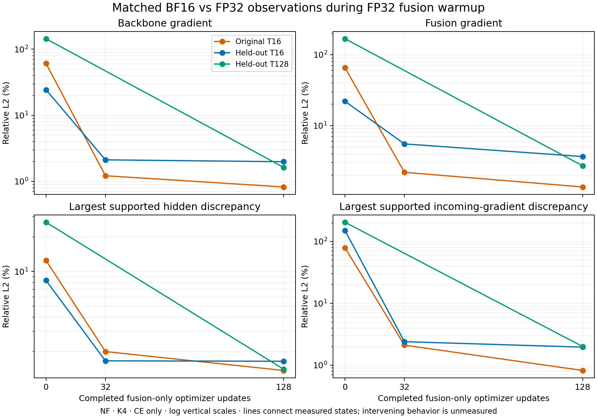

# FP32 fusion startup substantially reduces observed BF16 sensitivity

The fixed 128-update warmup completed successfully. Training only the two fusion
matrices, with the original OLMo backbone frozen, sharply reduced BF16-versus-FP32
gradient differences on the original fixture and both independently selected
held-out fixtures. The improvement extends to the four T128 development
prefixes: backbone/fusion gradient relative L2 falls from **144.02%/167.45% to
1.63%/2.71%**. Absolute gradient differences also fall substantially.

This supports a practical fusion-startup approach and further bounded checks.
It is not BF16 production clearance: these are NF/CE observations with zero
auxiliary cotangents, no temporal RT, isolated documents and very little
held-out data. Optimizer behavior, actual auxiliary losses and packed longer
contexts require their separate checks.

[PDF figure](warmup-numerics.pdf). Vertical axes are logarithmic. Lines connect
measured saved states; they do not establish the intervening trajectory. T128
was measured only at initialization and update 128.

## What trained and what remained fixed

Original OLMo-1B step60000 backbone, fresh fusion, NF K4, beta1, jitter0.02,
campaign CE pass weights `(1/2,1/6,1/6,1/6)`, full FP32/math attention. Only
`state_proj.weight` and `token_gate.weight` trained: **8,388,608 parameters**.
Native weights, tied embedding/readout, predictor and fusion output scale stayed
fixed. AdamW used LR1e-4, 16-update linear LR warmup, betas(.9,.95), epsilon1e-8,
weight decay0.1 and gradient clipping at1. There were no graphs or DDP.

The run consumed exactly **128 optimizer updates ×8,192 CE targets =1,048,576
targets**. The recorded data exposure is 1,073,565 valid input presentations,
1,219 physical microbatches and 9,235 document-window presentations; the last
number is not distinct documents. No latent/KL targets were optimized. The
seven-source readiness slice remains a coverage fixture, not a production
mixture. See [data controls](data.md).

All updates had finite losses/gradients and positive changes in both fusion
matrices. Raw gradient norm ranged from0.4010 to48.4858; **92/128 updates were
clipped**. Frequent clipping is part of this observed trajectory, not a claim
that this optimizer schedule is optimal. Summed update execution was667.3s;
the two training segments totaled922.8s including their setup and retention.
These are diagnostic execution times, not a throughput benchmark.

The first segment stopped at32 and the second restored its checkpoint before
continuing33–128. The independent audit confirms exact saved/restored fusion,
Adam, scheduler, RNG, counters and cursor digests at the32 boundary, identical
configuration/source fingerprint, correct optimizer ownership and frozen-state
integrity. This verifies restoration at that boundary; it is not a comparison
against an independently run uninterrupted128-step trajectory. The separate
preflight established exact next-update continuation across a fresh process.

## Matched gradient comparisons

Each row compares BF16 against FP32 **at the same saved weights**, using the same
tokens, masks, jitter and full diagnostic trainability. Relative L2 is
`||g_BF16 − g_FP32|| / ||g_FP32||`; absolute difference is its numerator. The
predictor has exactly zero gradient because auxiliary cotangents are zero.

| Fixture / update | Backbone relative L2 | Fusion relative L2 | Absolute difference: backbone / fusion | Cosine: backbone / fusion |
| --- | ---: | ---: | ---: | ---: |
| Original T16 / 0 | 60.870% | 65.212% | 332.723 / 56.6953 | 0.79730 / 0.75813 |
| Original T16 / 32 | 1.216% | 2.194% | 0.93397 / 0.14038 | 0.99993 / 0.99977 |
| Original T16 / 128 | 0.823% | 1.365% | 0.58197 / 0.04363 | 0.99997 / 0.99991 |
| Held-out T16 / 0 | 24.334% | 21.968% | 84.3302 / 14.4539 | 0.97101 / 0.97862 |
| Held-out T16 / 32 | 2.117% | 5.521% | 1.44067 / 0.20198 | 0.99978 / 0.99855 |
| Held-out T16 / 128 | 1.983% | 3.663% | 1.28366 / 0.13375 | 0.99980 / 0.99933 |
| Held-out T128 / 0 | 144.017% | 167.448% | 685.071 / 126.112 | 0.32351 / 0.24971 |
| Held-out T128 / 128 | 1.627% | 2.711% | 0.27521 / 0.03448 | 0.99987 / 0.99963 |

This is not improvement produced by a larger denominator. FP32 backbone
gradient norms actually shrink:546.6→70.75 on the original fixture,
346.6→64.74 on held-out T16 and475.7→16.92 on held-out T128. Both the relative
and absolute discrepancies decrease. Final BF16/FP32 backbone norm ratios are
0.99917,0.99846 and0.99887 respectively. Fusion also improves, though its
remaining3.66% discrepancy on the fresh short fixture is higher than the
original fixture's1.37%.

## Supported activations and held-out CE

The maxima below are taken across eight physical-record/pass aggregates. Each
aggregate includes positions with any nonzero incoming cotangent in either
precision; these are not maximum individual-token errors. Full incoming
cotangents include later feedback paths. The mask describes the executed
backward and does not remove positions from the objective.

| Fixture / update | Largest supported hidden relative L2 | Largest supported cotangent relative L2 | Weighted CE mean, FP32 / BF16 (nats/target) |
| --- | ---: | ---: | ---: |
| Original T16 / 0 | 12.472% | 78.908% | 7.74390 / 7.73931 |
| Original T16 / 32 | 2.010% | 2.113% | 6.73953 / 6.73493 |
| Original T16 / 128 | 1.377% | 0.823% | 6.42081 / 6.41994 |
| Held-out T16 / 0 | 8.354% | 150.094% | 6.98818 / 6.96964 |
| Held-out T16 / 32 | 1.669% | 2.401% | 6.45540 / 6.44510 |
| Held-out T16 / 128 | 1.655% | 1.960% | 5.95461 / 5.94808 |
| Held-out T128 / 0 | 26.833% | 204.557% | 7.11410 / 7.08930 |
| Held-out T128 / 128 | 1.411% | 2.005% | 5.25300 / 5.25353 |

The held-out fixtures contain four real development documents each, with no
overlap between the two or with training documents. They were selected by
frozen content-independent rules. Neither fixture was optimized. The CE changes
are matched observations on these fixed tiny fixtures, not evidence of a
language-model quality win. Training CE also changes across updates, but those
updates use different batches and must not be read as a held-out learning curve.

First-pass hidden/embedding fingerprints match exactly across saved states at
each precision on all three fixtures. Frozen backbone/predictor/output-scale
pins and common fixture/noise pins also match. This helps isolate the observed
changes to the learned fusion, without claiming that relative error identifies
a unique numerical mechanism.

## Failures preserved, evidence and recovery

Two harness failures remain recorded. `preflight-01` failed before any optimizer
update because its forced attention-backend context ended before checkpointed
backward recomputation; the corrected training path and regression preceded
both main segments. `long-128-01` failed before importing the endpoint or running
a backward because a Python tuple was compared directly with a JSON list in
its contract guard. The old helper stayed frozen. The new context driver
canonicalizes that metadata and `long-128-02` passes the same state, fixture,
source, runtime and first-pass checks. Neither failure was a numerical result
silently omitted from the tables.

The independent stdlib audit passed20 training/accounting checks, verified
every source snapshot in seven completed reports, matched all three fixtures'
first-pass/state controls, and rehashed the three compact checkpoints at0/32/128.
Recorded GCS receipts verify whole-byte downloads, server size/MD5 and SHA
metadata. The audit did not repeat those cloud downloads or reread the large
native model weights.

The final compact checkpoint is103,240,258 bytes, SHA256
`892ff2fdcdeec89e3008a16a12e91158250ebe05adfe0e9efce8f153409b8cfc`,
GCS generation`1790671431225622`, at
`gs://fast-chunks/cdrm-w-latent/fbt-rt-nextlat/olmo-fusion-startup/20260929T075900Z/train-02/update-000128.pt`.
It contains complete fusion plus Adam/scheduler/RNG/cursor and immutable
authority for frozen model state; it is not a standalone native-weight copy.

Reusable audit, pinned report inputs and CPU plot sources are in
`.runtime/olmo-fusion-startup/warmup-audit-01/`. Audit report SHA256:
`9ed603c130637546632c41e1a548a73cf92cdd10acdcc854e8f96a6a3777764e`.
The successful short128 report SHA is
`c4900c4e4ef32037eff5ee8d4e973721611db8f94eead17f4634e6c2cba681c2`;
long128 replacement SHA is
`1f387076f276a604e08530f72e0850980db4c72275f9a94afac98a3d8787f7b9`.
Other exact input/checkpoint hashes and generations are preserved in the audit.

No architecture, Q/K normalization or numerical acceptance budget changed.
The next bounded checks concern matched optimizer updates, actual auxiliary
gradients and the separately frozen packed-context bridge; these results alone
do not clear those scopes or native RT combinations.
