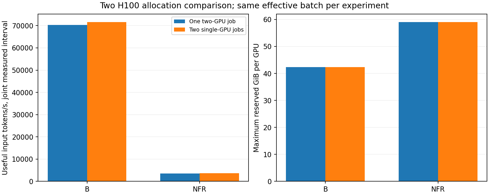

# One pair versus two independent single-GPU jobs

2026-09-30. **All four primary allocation cells completed cleanly.** Ordinary
OLMo and the combined FBT + RT + NextLat model both run on a single H100 at the
same physical batch used by each rank of the two-GPU job. The pair delivers
about **1.96× ordinary and 1.95× combined per-experiment throughput**. Two
independent single-GPU jobs deliver similar aggregate throughput, measuring
1.81% and 2.51% higher respectively in this short comparison. Those small
differences are descriptive, not a robust ranking of allocations.

[Online W&B comparison and table](https://wandb.ai/taylorbollman/pretrained-fbt-rt-nextlat/runs/utjz62x0),
[PDF](figures/allocation.pdf), [PNG](figures/allocation.png).

## Fixed experiment and allocation contract

Each independent experiment uses **512 real packed rows per optimizer update,
length 1024**, hence **524,288 real input tokens/update**. The model and
populated Adam state are authenticated performance clones: B starts from its
saved ordinary update 32, holding LR at 7.76e-5; NFR starts from reduced-KL
update 128, holding LR at 2e-4. The comparisons within each arm use the same
checkpoint, objective, deterministic ordered-data prefix and source hashes.
The two arms do not start from identical trained weights, and this is not a
quality comparison between them.

These are disposable benchmarks with fresh benchmark counters, **two actual
warmup optimizer updates followed by four measured updates per job**. The
inherited finite scheduler, production data cursor and rank RNG are not resumed
or migrated; no production training continuation is performed. Model and Adam
updates occur in the clones. Source checkpoints remain unchanged and disposable
updated weights are not retained as quality checkpoints.

Both arms use the OLMo-1B backbone, BF16 mixed execution with FP32 masters,
gradients and Adam state, fused AdamW, activation checkpointing, forced Flash
SDPA for ordinary attention, and the existing local/synchronized CUDA graphs.
NFR executes K4 FBT, native Triton RT at layers 0/15 on every pass, latent loss
weight 1 and KL weight 0.1. Native RoPE, the existing eager pointwise path and
Q/K semantics are unchanged; FA4 is not enabled. The optimizer/model/gradients
remain replicated rather than sharded, including in the single-rank runner.

| Arm / layout | Physical rows/GPU | Accumulation slots/GPU/update | Physical rows per experiment/update | Real / dummy rows per experiment/update |
| --- | ---: | ---: | ---: | ---: |
| B, one two-GPU job | 32 | 8 | 512 | 512 / 0 |
| B, each single-GPU job | 32 | 16 | 512 | 512 / 0 |
| NFR, one two-GPU job | 12 | 22 | 528 | 512 / 16 |
| NFR, each single-GPU job | 12 | 43 | 516 | 512 / 4 |

The NFR pair therefore processes 2.33% more physical row slots per real update
than a single job, at the same B12 kernel batch. That is real allocation and
padding overhead, not a change in real examples or effective batch. It is of
similar size to the 2.51% aggregate difference; this experiment does not isolate
padding from communication or other effects. Accumulation does not enlarge the
physical matrices used by RT.

B owns 1,176,764,416 trainable parameters and 1,185,153,024 resident parameters
(including dormant fusion). NFR has 1,267,879,936 resident/trainable parameters,
including its training-only NextLat predictor. Changing rank count changes
neither parameter count nor the per-GPU full model/optimizer state.

## Measured throughput and latency

The primary rate counts original real input tokens once, including for K4.
For the singles cell, its numerator is the sum of both independent experiments'
tokens and its denominator is their **joint measured makespan**: earliest
measured start through latest measured finish. It includes any start skew,
inter-update reporting gaps and idle tail. It is not the sum of two rates over
potentially different windows. Per-experiment latency below is that job's
measured window divided by its four updates.

| Arm / layout | Per-experiment seconds/update | Per-experiment input tokens/s | Aggregate input tokens/s across both GPUs | Input tokens per allocated GPU-second |
| --- | ---: | ---: | ---: | ---: |
| B, one pair | 7.456 | 70,318 | **70,318** | 35,159 |
| B, two singles | 14.641 / 14.584 | 35,810 / 35,950 | **71,590** | 35,795 |
| NFR, one pair | 147.571 | 3,552.8 | **3,552.8** | 1,776.4 |
| NFR, two singles | 287.541 / 287.872 | 1,823.3 / 1,821.3 | **3,642.0** | 1,821.0 |

Each pair cell measures 2,097,152 real input tokens; each singles cell measures
4,194,304 total tokens across two experiments. Their joint windows are
29.824/58.588 seconds for B pair/singles and 590.285/1,151.635 seconds for NFR.
The single jobs' start skews are only 0.0249 seconds for B and 0.1461 seconds
for NFR. Their common overlap covers 99.957%/99.987% of the shorter job's
window, respectively, satisfying the declared concurrency screen.

The pair's rate divided by the mean individual single-job rate is 1.9598 for B
and 1.9496 for NFR. Thus, selecting a pair buys substantially quicker feedback
on one experiment at a small observed aggregate throughput cost. With several
independent experiments ready, singles are also practical. One cell per layout
with four measured updates does not establish confidence intervals or an
optimal assignment for heterogeneous experiments.

For comparison, narrower timing scopes within each job are:

| Job | Forward/loss/backward + optimizer/cursor input tokens/s | Adding materialization input tokens/s | Whole measured-window input tokens/s |
| --- | ---: | ---: | ---: |
| B pair | 73,377 | 70,474 | 70,318 |
| B single 0 | 37,002 | 35,847 | 35,810 |
| B single 1 | 37,165 | 35,988 | 35,950 |
| NFR pair | 3,735.7 | 3,558.5 | 3,552.8 |
| NFR single 0 | 1,916.4 | 1,825.5 | 1,823.3 |
| NFR single 1 | 1,915.9 | 1,823.4 | 1,821.3 |

Distributed selected-region timings use the slower rank's summed component
times per update. They are useful component accounting, not a substitute for
the aggregate measured-window rate.

## Memory and startup

Memory is per GPU, not pooled across ranks. Allocated/reserved peaks are maxima
across capture and recorded updates; free memory is the minimum sampled value,
not a continuously measured minimum. Allocator reservation includes cached and
graph-pool storage, and is not identical to live tensor memory or device use.

| Arm / layout | Peak allocated GiB/GPU | Peak reserved GiB/GPU | Minimum sampled free GiB/GPU |
| --- | ---: | ---: | ---: |
| B, pair | 35.10 | 42.39 | 35.23 |
| B, singles | 35.10 | 42.39 | 35.54 |
| NFR, pair | 42.80 | 59.03 | 12.82 |
| NFR, singles | 42.80 | 59.03 | 13.13 |

Single-rank execution does not solve a memory-capacity constraint here; it
retains essentially the same model/Adam and graph footprint. Conversely, these
measurements show that the current physical batches fit comfortably on one
H100. No maximum-batch search was part of this allocation comparison.

| Cell | Host launch to measured start, seconds/job | Graph preparation/capture, seconds/job (max rank) | Whole cell wall seconds |
| --- | ---: | ---: | ---: |
| B pair | 57.57 | 18.42 | 90.10 |
| B singles | 72.14 / 72.12 | 18.21 / 18.20 | 134.15 |
| NFR pair | 755.25 | 425.84 | 1,351.42 |
| NFR singles | 1,057.17 / 1,057.32 | 427.92 / 437.50 | 2,216.38 |

Host launch-to-measured time includes container/Python imports, checkpoint and
data construction, graph preparation, the two actual optimizer warmups and any
shared-gate wait. **Import/loading is not timed separately**, so these figures
must not be described as import-only cost. The graph-preparation timer covers
the inherited prepare/capture helper work, including its backward warmups, but
excludes the two subsequent optimizer warmups. Those optimizer warmups take
about 14.94 seconds total for B pair, 29.26–29.33 seconds/job for B singles,
294.47 seconds for NFR pair, and 572.13–576.47 seconds/job for NFR singles.

Whole-cell time includes launch, preparation, warmup, measurement, W&B closeout
and clean process teardown; singles' jobs overlap. The NFR singles cell took
36.94 minutes, much of which is intentional preparation/warmup for this short
probe. Startup is a real cost for brief jobs and becomes less important for a
long continuation. No checkpoint-write/upload workload was inserted, so these
rates do not measure concurrent checkpoint or cloud-storage contention.

## H200 and the next milestone

The H200 memory option remains relevant, especially for RT-containing arms.
The earlier [T1024/K4 calibration](../olmo-campaign-two-gpu/results.md#resource-calibration-and-next-scope)
found NFR B16 about 15.3% faster than B12, but with only 3.30 GiB sampled free
on H100; B12 was selected for headroom. This suggests additional capacity could
enable a faster physical batch. It does not predict a particular H200 speedup
or establish that all available H200 memory should be filled.

Ordinary OLMo retains substantial headroom here, and historical larger-batch
sweeps found a throughput plateau. There is no demonstrated urgent ordinary
capacity need. That is distinct from memory-bandwidth sensitivity: these tests
do not classify any arm as conclusively compute-bound or bandwidth-bound.
See the [memory assessment](memory-assessment.md) for the other six arms and
the limitations of older T512/K2 evidence. F/NF/N and the other RT combinations
do not inherit a proven optimal B12 solely because NFR used it.

The next useful two-GPU milestone is **bounded checkpoint migration across
one and two ranks**, with the saved update-127 checkpoint available to validate
the existing 128-update horizon. Preserve model, Adam, learning-rate/step/token
clocks and ordered data position; explicitly define rank RNG handling and
rebuild graphs. Today's authenticated performance clones deliberately do not
validate production-resume migration. Across rank counts, preserve the logical
experiment without promising bitwise-identical BF16 reduction/accumulation.

On an actual eight-GPU node, qualify its runtime and restart path, then measure
eight singles, four pairs and one eight-rank job where useful. Two-job results
cannot establish eight-job CPU/SSD/network contention or eight-rank scaling.
For H200, first measure the same physical batch, then try larger physical
batches at the same effective 512-row update. This separates allocation,
hardware and physical-batch changes. Eight-rank production acceptance, H200
capacity, all-eight-arm performance, sharding and long-run learning efficiency
remain outside this milestone.

## Evidence and retained failure

The initial `b-pair-01` completed six finite optimizer updates but hung during
NCCL teardown and required an owned-container stop. Its supervisor failure is
retained and excluded from the primary comparison. The runner now releases
captured graphs/reducer ownership before process-group teardown; replacement
`b-pair-02` and the other three primary cells all exited normally. All primary
job reports and W&B runs are complete/synced.

The CPU summary checks completed supervisors, report SHA256 receipts,
per-update finite objectives/gradient norms and accounting, rank/device
isolation, checkpoint/model/objective configuration, runtime/source matching,
and the common ordered index/start cursor/update prefix. Single-job row-key
streams match exactly. Cross-layout data equivalence relies on that shared
authenticated deterministic prefix and counts; rank-local hashes are not
mathematically joined into a new global key digest. This is not an assertion
of identical BF16 gradients or final clone weights. Nineteen focused summary
tests pass, including non-overlap, source/data mismatch, nonfinite/report
guards, device isolation and PDF/PNG export.

Primary local authorities are under `.runtime/olmo-gpu-allocation/`:

- `b-pair-02/pair/report.json`: [W&B](https://wandb.ai/taylorbollman/pretrained-fbt-rt-nextlat/runs/tjc7lynv).
- `b-singles-01/{single0,single1}/report.json`: [single 0](https://wandb.ai/taylorbollman/pretrained-fbt-rt-nextlat/runs/ibke7d5p), [single 1](https://wandb.ai/taylorbollman/pretrained-fbt-rt-nextlat/runs/prohm0a7).
- `nfr-pair-01/pair/report.json`: [W&B](https://wandb.ai/taylorbollman/pretrained-fbt-rt-nextlat/runs/zbbf26i3).
- `nfr-singles-01/{single0,single1}/report.json`: [single 0](https://wandb.ai/taylorbollman/pretrained-fbt-rt-nextlat/runs/ydqeqv2y), [single 1](https://wandb.ai/taylorbollman/pretrained-fbt-rt-nextlat/runs/ube3ynpa).
- Each cell's `supervisor.json`, plus the completed `suite.json`, preserves process completion and ownership.
- `summary-01/report.json` contains exact rates, timings, memory, matching-contract hashes, report receipts and figure hashes. Its [online summary](https://wandb.ai/taylorbollman/pretrained-fbt-rt-nextlat/runs/utjz62x0) is synced.

The final `closeout-audit.json` passes 931 checks covering original authority,
source and state-file preservation. Its scope is manifest/report/source hashes
and state inode/size/mtime preservation after full checkpoint authentication
at import; it is not an additional full-state readback or BF16-equivalence
claim. Retention receipts remain owned by milestone closeout. No production
continuation past update 128 was launched here.
