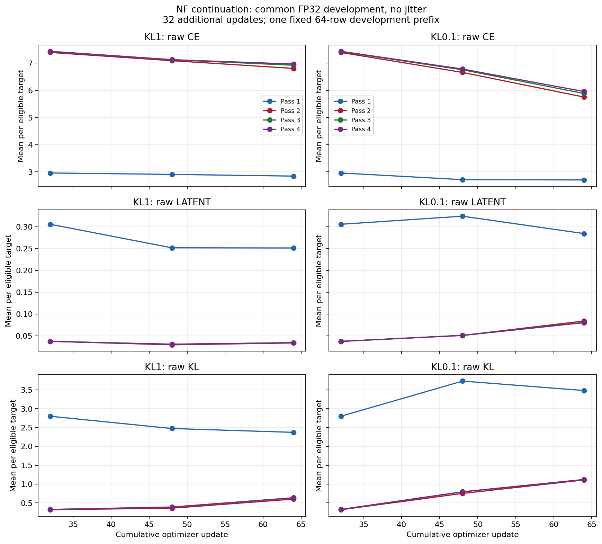
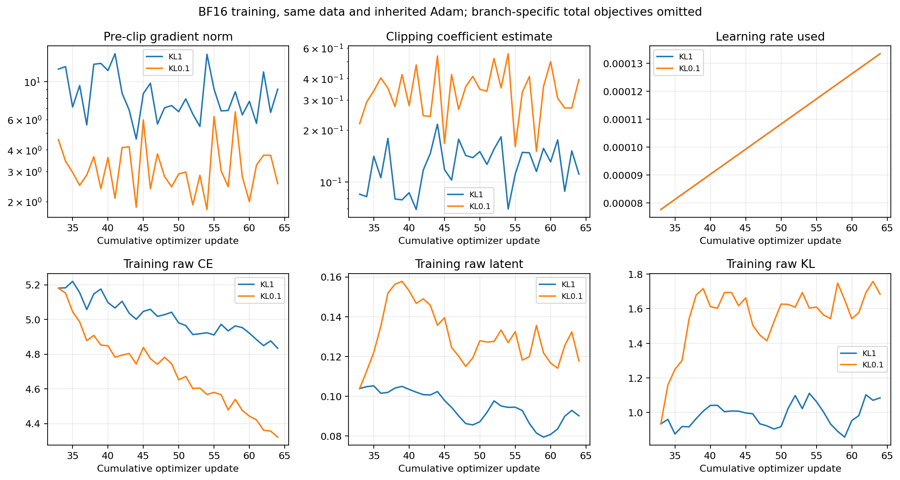
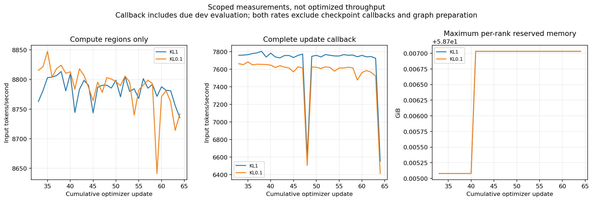

# Paired NF continuation: lower KL improves CE, with an auxiliary-loss tradeoff

Both branches completed update 64 and retained verified cloud checkpoints.
Reducing the NextLat KL coefficient from 1 to 0.1 improved development CE in
every pass and substantially reduced pre-clipping gradient norms. However,
raw latent and KL losses were higher than control in every pass at the
endpoint, and later passes still had much worse CE than pass 1. This supports
the objective-balance hypothesis as a useful direction; it does not establish
that feedback refinement is working well or that the model is ready for a
long quality comparison.

The comparison is **NF: K4 FBT plus NextLat, without active RT**. Both branches
started from exactly the same complete update-32 checkpoint, including model,
Adam moments, scheduler, counters, cursor and per-rank RNG. Only the KL
coefficient changed. Each received 32 additional matched updates, or
16,777,216 new input tokens. Training remained BF16 mixed with FP32 masters,
CUDA graphs, beta 1, latent weight 1 and jitter 0.02, using T1024 and physical
batch 12 per rank on two H100s. The effective update contained 524,288 input
tokens. The original 128-update schedule continued without resetting Adam or
warmup; update 64 remained inside the 100-update warmup.

See the [protocol](protocol.md), [validation record](validation.md), and
[proposed next milestone](next-steps.md). No follow-up training was launched.

## Development CE

All evaluations use the same fixed 64-row `dev-main` prefix: 65,536 inputs,
65,472 CE targets, 65,338 latent pairs and 65,140 KL triples. Evaluation uses
common FP32 math without feedback jitter. The repeated update-32 raw losses
matched the parent exactly in both branches. This is one small development
prefix, not an independent final test set.

CE is in nats per eligible target; lower is better.

| Update / branch | Pass 1 | Pass 2 | Pass 3 | Pass 4 |
| --- | ---: | ---: | ---: | ---: |
| 32, shared origin | 2.960392 | 7.393494 | 7.425865 | 7.435141 |
| 48, KL 1 | 2.908634 | 7.090835 | 7.124708 | 7.127553 |
| 48, KL 0.1 | 2.714837 | 6.659169 | 6.755933 | 6.782391 |
| 64, KL 1 | 2.845510 | 6.805770 | 6.923254 | 6.967279 |
| 64, KL 0.1 | **2.704137** | **5.752041** | **5.883908** | **5.956001** |
| 64, KL 0.1 minus KL 1 | −0.141373 | −1.053730 | −1.039346 | −1.011278 |

Both branches improved relative to the shared origin, so ordinary continued
adaptation matters too. Lower KL produced substantially more later-pass CE
improvement over this interval while also improving pass 1. Its pass-4 minus
pass-1 gap fell to 3.251863 nats, versus 4.121769 for control. The gap improved
without sacrificing pass 1, but is still large: passing through the feedback
route remains much worse than the first pass on this prefix.

[Development PDF](development-raw-losses.pdf) · [Per-pass CSV](development.csv).
The two branch columns share the same vertical scale within each metric row.

## Raw auxiliary losses: the improvement has a tradeoff

These are **unweighted** mean losses at update 64. The aggregate row uses the
unchanged four-pass averaging for each auxiliary term; it excludes the external
KL coefficient. Each term retains its own eligible-target denominator.

| Pass | Latent, KL 1 | Latent, KL 0.1 | KL, KL 1 | KL, KL 0.1 |
| --- | ---: | ---: | ---: | ---: |
| 1 | 0.251570 | 0.284565 | 2.373899 | 3.484266 |
| 2 | 0.033794 | 0.084187 | 0.602146 | 1.110109 |
| 3 | 0.034455 | 0.080884 | 0.636836 | 1.121923 |
| 4 | 0.034343 | 0.080385 | 0.635732 | 1.121298 |
| Aggregate | **0.088541** | **0.132505** | **1.062153** | **1.709399** |

Lower KL has worse raw auxiliary losses than control in **all four passes**,
not only in the aggregate. Relative to the common update-32 origin, its
first-pass latent loss still improves (0.305955 to 0.284565), but later-pass
latent losses and all four raw KL losses increase. Aggregate latent rises
from 0.104575 to 0.132505, and aggregate KL from 0.943608 to 1.709399. Control's
aggregate latent decreases, while its aggregate KL also increases.

Meanwhile, raw aggregate CE improves to 4.284060 for KL 0.1 versus 4.872139 for
control; the CE aggregate uses the fixed pass coefficients 1/2, 1/6, 1/6, 1/6.
This is evidence of a CE/auxiliary tradeoff under the changed loss balance.
It does not demonstrate better latent predictions, representation collapse,
or a BF16 fix. The branches' weighted total objectives are deliberately not
used as comparative quality scores: reducing a coefficient changes that score
mechanically.

## Functionality and clipping

Both branches completed 32 finite updates. Exact saved-parent transition and
graph-preparation checks passed; scheduled evaluation preserved the recorded
training boundary and runtime/RNG conditions. Each endpoint reached verified
cloud update 64 with no pending checkpoint worker. The separate acceptance
record covers tiny restart checks; this native comparison does not add a
native exact-restart or broader precision-equivalence claim.

| Updates 33–64 | KL 1 | KL 0.1 |
| --- | ---: | ---: |
| Updates exceeding clip norm 1 | 32 / 32 | 32 / 32 |
| Median pre-clip gradient norm | 7.791012 | 2.927730 |
| Minimum / maximum norm | 4.622797 / 14.493408 | 1.798710 / 6.655710 |
| Final pre-clip norm | 9.017178 | 2.542595 |
| Median estimated clipping coefficient | 0.128390 | 0.341601 |

The lower norms and less severe clipping are encouraging, but clipping still
applies on every update. Coefficients are host estimates from the returned
pre-clip norms, not separately instrumented optimizer mutations. Inherited
Adam moments and clipping prevent interpreting the tenfold KL-weight reduction
as a tenfold change in parameter updates.

[Training PDF](training-dynamics.pdf) · [Training CSV](training.csv).
Training's raw loss means already contain their canonical pass aggregation;
they exclude the external auxiliary weights. These BF16/jitter measurements
should not be equated with the FP32/no-jitter development losses.

## Resource measurements

These are observed two-GPU segment measurements, not an optimized throughput
benchmark. Rates count each new input token once, not once per FBT pass.
All four forward passes and their backward computation remain in the work.

| Scope across updates 33–64 | KL 1 | KL 0.1 |
| --- | ---: | ---: |
| Compute regions: input tokens/s | 8,783 | 8,787 |
| Compute plus data materialization: input tokens/s | 7,780 | 7,636 |
| Complete update callbacks: input tokens/s | 7,671 | 7,531 |
| Full segment wall: input tokens/s | 5,291 | 5,231 |
| Full segment wall time | 52.85 min | 53.45 min |
| Graph preparation, maximum rank | 99.69 s | 100.98 s |
| Foreground wait for checkpoint worker | 398.07 s | 390.23 s |

Compute rates divide tokens by the sum of each update's maximum-rank
backward-plus-optimizer/cursor time. The second scope adds materialization.
Complete callbacks also include report/scalar work and scheduled development
evaluation; these three rates exclude checkpoint callbacks and graph
preparation. Full segment wall time includes setup, restore, preparation,
evaluations, checkpoint work and terminal retention drain; the timer precedes
final W&B teardown. Background transfer
overlaps training; its elapsed duration must not be added to wall time.
The nearly identical compute rates provide no evidence for a meaningful
compute-speed effect from this KL change.

Both branches recorded the same memory maxima across ranks/samples: **42.833
GiB peak allocated** and **58.707 GiB peak reserved** per GPU. Maximum sampled
post-capture/update allocation was 24.011 GiB, with minimum sampled free memory
18.752 GiB. Peak allocator counters can include preparation/evaluation; these
are per-GPU extrema, not sums across two GPUs or isolated backward-only peaks.

Both models have 1,267,879,936 registered, trainable and optimizer-owned
parameters: backbone 1,176,764,416; fusion 8,388,608; NextLat predictor
82,726,912. Excluding the training-only predictor leaves 1,185,153,024 active
deployment parameters. Changing the KL coefficient adds no parameters.

[Timing/memory PDF](timing-memory.pdf) · [Throughput CSV](throughput.csv).

## Evidence and retained outputs

Runs: [KL 1 control](https://wandb.ai/taylorbollman/pretrained-fbt-rt-nextlat/runs/w5eekmse)
and [KL 0.1](https://wandb.ai/taylorbollman/pretrained-fbt-rt-nextlat/runs/x8f16eqv).
The [paired summary charts](https://wandb.ai/taylorbollman/pretrained-fbt-rt-nextlat/runs/72jc2qi3)
are also synced.
Both reports are finalized and W&B-synced. See the
[storage record](storage-receipt.md) for cloud authorities and recovery scope.

The CPU-only summary is
`.runtime/olmo-kl-continuation/summary-01/report.json`, SHA256
`ff84e19a6f056463b7a43a8a4797b82e85a0e0788a2438f8e0e8b18eb1fb2d72`.
It snapshots the three exact input reports and its producer separately from
the frozen 210-file training inventory, and records SHA256s for all CSV/PDF/PNG
artifacts. The copies beside this document match those artifact hashes.

| Input report | SHA256 |
| --- | --- |
| Parent NF update 32 | `8e6fe4d8aa933650943320c4f277fd92f4d59e530e08ef456d23634e79cbd5a0` |
| KL 1 update 64 | `d0b9c32c0f3465d8a9950915cf8a5582c47ee16c6df16347e8c2ed50879708b2` |
| KL 0.1 update 64 | `bd7fbc420ad5472d3f032b006a4df3bb0c87a4bdbceab14c61bed3761bc67e72` |

Endpoint checkpoint manifest SHAs are
`0340858a2495e084186779662c6d7f0552a63d39818fa41fc90b4440192c431a`
(KL 1) and
`8b56a520321a2da7b9afcd7d217aea5eeee0382c3d2076a42350536d2254c88d`
(KL 0.1). The summary producer SHA is
`f37c0afde087c87352a454c2983fc98867ceb8db7b09ef529c24d68b981fa102`;
its 16 CPU tests cover report mutations, denominator/policy guards, source/input
pinning and static artifact generation. No frozen runtime file changed.

This remains a short, single-seed continuation within warmup on one development
prefix. It supports the bounded [matched NFR proposal](next-steps.md), while
leaving long-run quality, RT's contribution and precision questions open.
