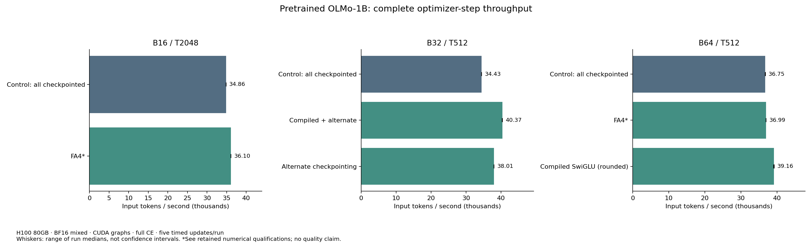

# Ordinary OLMo execution efficiency

2026-09-24. The implementation and measurements use the actual pretrained
16-layer OLMo-1B checkpoint. This is an execution comparison, not a learning
experiment or a reproduction of the RT paper's smaller ordinary model.

## Recommendation

Use the explicit rounded compiled SwiGLU option with ordinary SDPA and all-layer
checkpointing for the conservative B64/T512 configuration. It improves complete
optimizer-step throughput by about 6.5%, passes the unchanged numerical screen,
and preserves substantial memory headroom. B32 with compiled SwiGLU and
alternating checkpointing is a somewhat faster alternative at higher memory
cost. Changing physical batch is not an equivalent learning comparison; maintain
the intended effective batch when choosing a later training setup. Gradient
accumulation still needs its planned validation.

FA4 is compatible with native OLMo RoPE and passes its own graph/optimizer checks,
but has only a small full-step benefit here. Its strict cross-backend loss screen
remains failed, with very small absolute per-token differences. Keep it opt-in;
do not present timing success as numerical clearance. All new production
defaults remain off. RT, FBT, NextLat objectives and Q/K normalization were not
changed or cleared by this ordinary-only work.

## Fixed conditions

- Original OLMo-1B step60000, approximately252B pretraining tokens:16 layers,
  width2048,16 heads/head128, SwiGLU8192 per branch, native nonaffine LayerNorm,
  native FP32 RoPE/residuals, tied50304-token embedding/readout, no Q/K norm.
- Trainable/executed/deployable parameters: **1,176,764,416**. The common wrapper
  also retains **8,388,608 frozen unused fusion parameters**; registered total
  **1,185,153,024**. No candidate adds or converts parameters.
- One H10080GB in the required project container. BF16 mixed precision,
  FP32 master weights/gradients/Adam, TF32 off, deterministic kernels,
  autocast weight caching disabled, native RoPE-table reuse in every arm.
- Full CE on fixed real-text fixture rows/token rotations; CE chunk2048,
  KL128 inactive. No padding, packed document boundaries or accumulation.
  Fixture hashes, checkpoint provenance and supervision counts are recorded.
  Rows repeat prompt text to fill context: these are operational fixtures,
  not representative held-out language-model losses.
- CUDA graphs capture forward/loss/backward. Full timings include input copy,
  clipping, AdamW and scheduler, excluding compilation, loading, logging and
  profiling. Three preparation updates, ten warmup backwards, five timed full
  updates per capacity run. Profiles are separate untimed traces.

## Throughput and memory

The final table and plot are generated from the verified explicit report
selection in [summary.json](summary.json). Reverse-order control/candidate
repeats cover the recommended T512 options; T2048 FA4 remains one directional
pair. Run ranges are not confidence intervals. Setup allocated/reserved peaks
include graph preparation and validation; steady timing peaks are separately
recorded in the raw reports.

| T | Physical batch | Ordinary configuration | Runs | Input tokens/s | Gain vs matched control | Setup peak allocated / reserved GiB |
| ---: | ---: | --- | ---: | ---: | ---: | ---: |
| 512 | 64 | SDPA, eager, all checkpointed | 2 | 36,754 | — | 26.71 / 46.25 |
| 512 | 64 | SDPA, rounded compiled, all checkpointed | 2 | 39,161 | +6.55% | 26.21 / 46.17 |
| 512 | 64 | FA4, eager, all checkpointed† | 1 | 36,995 | +0.65% | 26.71 / 46.25 |
| 512 | 32 | SDPA, eager, all checkpointed | 2 | 34,432 | — | 22.86 / 32.70 |
| 512 | 32 | SDPA, eager, alternating checkpoints | 1 | 38,013 | +10.40% | 35.84 / 57.75 |
| 512 | 32 | SDPA, rounded compiled, alternating checkpoints | 2 | 40,372 | +17.25% | 33.84 / 54.75 |
| 2048 | 16 | SDPA, eager, all checkpointed | 1 | 34,863 | — | 26.71 / 46.25 |
| 2048 | 16 | FA4, eager, all checkpointed† | 1 | 36,102 | +3.55% | 26.71 / 46.25 |

†Exploratory timing: the cross-backend loss screen remains failed. FA4 and
alternating-only rows have one run; sub-percent FA4/T512 differences could
include ordinary measurement variation. Repeated rows use the median of two
run medians, with individual values preserved in the summary. The earlier
control profile at`ed26653` is retained as a separate source cohort, not pooled
into these final-runtime comparisons.

[Download the standalone PDF](throughput.pdf).

Two retained capacity failures matter: alternating checkpointing B64/T512 and
no checkpointing B32/T512 each completed three eager preparation updates but
ran out of memory during graph capture. Each attempted allocation at about79GiB
process memory. No timed-update result exists for either. These failures concern
this graph-preparation path, not a proof that eager execution or a redesigned
capture allocator cannot fit. B32 alternating checkpointing was the bounded
fallback; we did not optimize allocation or chase maximum capacity.

## Numerical and operational evidence

The prospective budgets remain unchanged: global raw-gradient L2<=1/64;
per-tensor L2<=1/32 and maximum-error/reference-peak<=1/16; output L2<=1/64 and
maximum ratio<=1/16; relative loss error<=1e-5. Comparisons use unclipped gradients
from the same pretrained state and full CE. Checkpoint-only changes require
bitwise equality.

| Actual-checkpoint comparison | Global gradient relative L2 | Forward/loss result | Screen |
| --- | ---: | --- | --- |
| Alternating or no checkpointing, B8/T512 | 0 | Bitwise | Pass |
| Rounded compiled SwiGLU, B8/T512 | 0.003133 | Bitwise outputs and loss | Pass |
| Rounded compiled + alternating, B8/T512 | 0.003133 | Bitwise outputs and loss | Pass |
| FA4, B8/T512 | 0.007039 | CE relative difference2.7126e-5 | **Fail: loss only** |
| FA4, B2/T2048 | 0.011567 | CE relative difference1.5226e-4 | **Fail: loss only** |

All FA4 output and gradient budgets pass. Its absolute mean CE differences are
about **1.018e-5 nats/token at T512** and **1.317e-5 at T2048**. These tiny values
do not establish a practically harmful discrepancy, but the predeclared loss
screen is still failed. A future tolerance policy should be chosen prospectively,
not adjusted to relabel this result.
Reference mean CE is only about0.37538 atT512 and0.08651 atT2048 on these repeated
fixtures; that low denominator makes the relative-loss screen demanding even
when the absolute discrepancy is tiny.

Each completed candidate diagnostic passes exact own eager/graph losses and
gradients, changed-input/repeated-overwrite checks, and three eager versus three
graph AdamW updates including weights, moments, scheduler/counters and metrics.
Changed-weight graph checks also pass. Capacity successes have finite complete
updates and real weight changes. FA4 dispatch is explicitly observed without
SDPA fallback; compiled dispatch records actual compiler graphs without graph
breaks or unsupported-path fallback.

The initial compiled implementation omitted Inductor's precision emulation.
It failed output maximum ratio0.07330 and loss relative difference0.00015066,
although gradient budgets passed (global0.009570). The local
`options={"emulate_precision_casts": True}` restores BF16 intermediate rounding
while retaining pointwise fusion. The final version passes as above; its
gradients need not be bitwise because fused backward details still differ.
The earlier failed report remains retained. The first FA4 attempt also stopped
at its loss screen; an explicit failure-preserving diagnostic option then
completed its operational checks. Neither failed report is overwritten.

## Profile and arithmetic interpretation

At B64/T512, control attention accounts for only **3.75%** of summed device-event
time, versus43.57% named matrix multiplication and10.47% copy/cast kernels.
At T2048 attention rises to **9.01%**. This explains why isolated FA4 speedups
translate to modest whole-step gains. These percentages are kernel-name
groupings, not exact model-phase attribution or optimizer wall-time shares.

Rounded SwiGLU replaces standalone activation/multiply work with fused kernels;
its profile reduces summed device time from848.31ms to791.56ms, while absolute
matrix and copy/cast times remain similar. See the detailed
[profile audit and next opportunities](next-opportunities.md).

Resource cards preserve parameter counts and scale checkpoint recomputation
only by the selected ordinary-layer count. B64/T512 all-checkpoint logical
matrix work is approximately295.24–318.32TFLOPs/update. Fusion does not reduce
this matrix estimate: it reduces excluded pointwise work and memory traffic.
These are analytic useful-work estimates, not measured hardware FLOPs/MFU;
they exclude norms, RoPE, activations, loss elementwise work, optimizer, kernel
padding and communication. Every run has its own resource card in the summary.

## Reproduction, retention and next work

[Protocol](protocol.md), [usage](usage.md), [summary](summary.json),
[runtime CPU checks](runtime-test-results.txt),
[harness/precision CPU checks](harness-test-results.txt), and
[evidence-helper checks](retention-test-results.txt) record the exact scope.
W&B uses project`pretrained-fbt-rt-nextlat`, group`olmo-ordinary-efficiency`;
every run URL is in the summary. Reports and snapshots live under
`.runtime/olmo-ordinary-efficiency/` and are retained with the original checkpoint
reference. Disposable profiling-update weights are not new training checkpoints.

Final selection: **23 GPU reports:17 passed,4 numerical failures,2 capture OOMs**;
**152 physical optimizer updates** and **1,242 frozen source/report pairs**
verified. There are106 passing recorded gates out of110; the four failed gates
are the retained compatibility screens, and OOMs stop before remaining checks.
Initial runtime coverage comprises274 distinct CPU tests; the final focused
runtime/harness revision passed100 tests (overlapping that initial suite).
Final report/retention helpers passed56 tests. Do not add overlapping suite
counts as distinct coverage.

Runtime lineage:`ed26653` initial implementation/control/FA4 attempt;
`5445f25` failure-preserving operational diagnostics;
`9fc20cf` rounded compilation;
`18351ef` compiled-only checkpoint arms and all final capacity comparisons.
Each run pins its own revision, source/protocol bytes and relevant FA4 dependency
snapshot. Different core-source cohorts are not pooled. Reports, plots, traces,
queue descriptors/logs and the existing pretrained checkpoint reference are
covered by the verified [storage receipt](storage-receipt.json). GPU ended idle;
no quality run or additional GPU work is queued.

The next promising ordinary optimization is a bounded fusion of the existing
FP32 RoPE application, followed by residual/normalization/cast traffic and a
measured fused-CE comparison. None is automatically queued. Preserve the current
RT numerical qualifications and revisit the native-versus-author backend
decision separately. Graph recovery/accumulation, padding/online integration and
genuine multi-GPU checks remain in the broader functionality plan. New ordinary
options need combination-specific checks before being adopted in RT/FBT runs.
