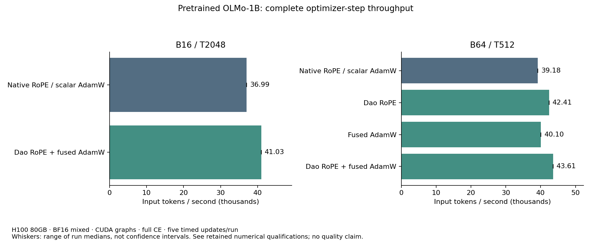

# Ordinary OLMo: fused RoPE and AdamW results

2026-09-24. Runtime `b70b3ec54cd808534f25e863c61c5cb987c19708`.

**Dao RoPE plus fused AdamW improves the already optimized ordinary reference
from 39.18k to 43.61k input tokens/s at B64/T512 (+11.30%).** Reverse-order
repeats agree closely. At B16/T2048, one matched pair improves 36.99k to 41.03k
(+10.92%), with the retained long-context loss qualification below.

I recommend these explicit options for the next ordinary T512 development
configuration. Fused AdamW has the cleaner numerical result; Dao RoPE passes
the unchanged T512 screen and all own operational checks at both lengths.
The T2048 strict relative-loss failure stays visible. Its tiny absolute size
does not motivate a larger precision study now, but it is not an all-context
numerical clearance. Check the options in representative RT/FBT/NextLat
combinations before treating those configurations as validated.

No production defaults, pretrained weights, Q/K normalization, RT backend,
objective or learned parameters changed. These disposable measurements are
not quality training. The GPU queue has finished and the H100 is idle.

## Matched full-step measurements

| Shape | Execution | Input tokens/s | Gain vs matched reference | Runs | Peak setup reserved GiB |
| --- | --- | ---: | ---: | ---: | ---: |
| B64/T512 | Native RoPE / scalar AdamW | 39,180.8 | — | 2 | 46.172 |
| B64/T512 | Dao RoPE / scalar AdamW | 42,408.9 | +8.24% | 1 | 45.682 |
| B64/T512 | Native RoPE / fused AdamW | 40,099.9 | +2.35% | 1 | 46.172 |
| B64/T512 | Dao RoPE / fused AdamW | 43,606.4 | **+11.30%** | 2 | 45.682 |
| B16/T2048 | Native RoPE / scalar AdamW | 36,992.7 | — | 1 | 45.914 |
| B16/T2048 | Dao RoPE / fused AdamW | 41,033.4 | **+10.92%** | 1 | 46.041 |

Each run has five synchronized complete-update samples after three actual
preparation updates and ten backward warmups. Reported repeated values are
medians of run medians. The two B64 reference medians are 39,197.8/39,163.9;
the two combined medians are 43,595.6/43,617.2. The primary four-arm order is
reference, RoPE, Adam, both; the reverse pair is both, reference. These short
measurements are directional, not confidence intervals or a batch-size search.

The reference already includes PR26's rounded compiled ordinary SwiGLU,
all-layer activation checkpointing and reused native RoPE tables. Both sides
use all 16 layers of actual pretrained OLMo-1B step60000, PyTorch Flash SDPA,
BF16 autocast with FP32 parameters/residuals/norm/Adam, full CE position
chunks2048, TF32 off and autocast weight cache off. The graph captures
forward/loss/backward; the timings also include input copy/validation,
clipping, Adam and scheduler. This table is not comparable to old half-CE
rates without accounting for the changed target work.

At B64, peak setup allocated memory is 26.207 GiB for native and 26.221 GiB
for the combined candidate; steady timed allocated peaks are 18.496/17.741
GiB. The small reserved-memory reduction is not a large intrinsic capacity
gain. At T2048, setup allocated is 26.207/26.223 GiB and reservation is
slightly higher for the candidate. Peak setup and postcapture memory are
separate quantities.

[PDF plot](throughput.pdf), [machine-readable summary](summary.json),
[configuration and reproduction](usage.md).

## Numerical and operational assessment

All output and raw-gradient budgets pass for the RoPE checks. Global gradient
relative L2 is 0.006959 at B8/T512 and 0.011324 at B2/T2048, below 0.015625.
Every participating tensor also passes its L2 and maximum-error screen.
The T512 CE comparison passes. At T2048, CE relative difference is
8.539e-5 versus the unchanged 1e-5 limit: **a retained loss-only failure**.
That is an absolute 7.387e-6 nats per predicted token on a repeated-text
fixture whose reference mean CE is only 0.08651. The installed fused kernel
can contract FP32 multiply/add operations; this is not a claim that every
downstream discrepancy has been independently localized to FMA.

Every candidate's own changed-token, repeated-overwrite and changed-weight
eager/graph losses and raw gradients match bitwise. Three eager versus three
graph Adam updates also match exactly, including optimizer/scheduler/counters.
All eight capacity runs have finite complete updates and actual weight changes.

Fused AdamW previously was **not enabled**: historical dispatch is
`foreach=False, fused=None`. The new opt-in `fused=True` keeps FP32 moments
and runs outside the graph. With identical fixed raw gradients, three scalar
versus three fused steps have cumulative-update relative L2 **4.569e-5
(0.00457%)**, below the prospective 0.1% budget. Moment/global weight L2
differences are 2.088e-7/7.274e-8. All hyperparameters except the fused
selector, ownership, clipping and step/LR values match; initial weights and
raw-gradient storage are restored. This is bounded optimizer compatibility,
not identical long-run trajectories.

See [numerical assessment](numerical-assessment.md) for full tensor maxima,
unchanged budgets, exact-check scope and direct W&B links. Twelve reports
contain **11 passes and one retained numerical failure; 64/65 gates pass,
including all 61 operational gates**. There are **96 physical optimizer
updates**: 30 in correctness checks and 66 in capacity/profiling. Each full-step
profile adds a ninth update; that input and its counters are separately recorded.

## What the profiles support

Trace-linked optimizer CUDA work drops from **31.20 ms in 520 events to
11.25 ms in 10 events**; CPU optimizer scope drops from 5.68 to 0.55 ms.
The full-step nonannotation CUDA sums are 829.60/738.38 ms. These are separate
untimed profiles, not substitutes for synchronized step timing.

Kineto includes overlapping GPU user-annotation intervals among CUDA events.
The derived analysis removes them from kernel totals and reconstructs CPU
scopes from the verified traces; raw reports/traces remain untouched. No
native RoPE cost is inferred merely from kernel names. See
[profile audit](profile-audit.md) for the correction and reproducible optimizer
attribution.

TE `LayerNormLinear`/`LayerNormMLP` were deferred: installed modules downcast
the residual before normalization, own additional affine state, and use a
different packed SwiGLU half order. The current small functional adapters
preserve native ownership and precision more directly. Dao/TE standalone CE
remains a possible later small optimization, with no new CE GPU claim here.
See [library audit](library-audit.md) and [installed Dao source audit](dao-rope-audit.md).

## Parameters, arithmetic and evidence

All arms train and execute **1,176,764,416 unique parameters**. The wrapper
registers 1,185,153,024 including unused frozen fusion; deployable ordinary
parameters are 1,176,764,416. Tied embeddings/readout remain one parameter.
The logical matrix-work ranges are unchanged: **295.24–318.32 TFLOPs/update**
at B64/T512 and **308.48–348.05** at B16/T2048. These analytic ranges exclude
pointwise/optimizer work, fusion traffic savings and hardware kernel padding;
they are not measured hardware FLOPs.

The validated evidence covers 672 frozen runtime source/report pairs and the
exact installed Dao snapshots where used. **410 distinct scoped runtime,
optimizer and harness CPU tests pass**, deduplicated across component runs;
the final reporting/retention suite has **75 passing tests**. Test commands
and initial fixture/collection corrections are retained in the test-result
files in this directory. The earlier overlapping RoPE suites are additional
recorded history, not added again to that 410 count.

All twelve runs are online in the
[W&B project](https://wandb.ai/taylorbollman/pretrained-fbt-rt-nextlat),
group `olmo-ordinary-fusions`; every raw report/summary contains its run URL.
Raw local evidence is `.runtime/olmo-ordinary-fusions/`. The GCS evidence
bundle contains selected successes/failure, frozen sources/protocols/dependency
bytes, logs, traces, reports and plots, and references the already retained
original checkpoint. See [storage receipt](storage-receipt.json) for verified
object generations and hashes. Profiling-update weights are not retained.

## Next work

This completes the bounded ordinary optimization pass. The updated V4 plan
also records the user's two suggestions:

- Start genuine two-GPU correctness with replicated execution/DDP, then assess
  ZeRO1 and ZeRO2 for memory and useful physical-batch throughput. Their gradient
  hooks/storage must be integrated with the captured buffers; neither is assumed
  to work merely because single-GPU graphs pass. A second GPU is still needed.
- Profile/compile the contiguous RT per-position finish path, then possibly its
  memory writer/RoPE. Preserve the batched parameter VJP, historical attention
  tiling, BF16 rounding boundaries and FP32 norm/residuals. CUDA graphs already
  reduce host launch work; measure additional device-kernel/traffic savings.

These future checks do not erase the earlier native/author RT numerical
qualifications. Graph recovery/accumulation, padding/online readiness and
distributed save/resume remain on the functionality-first plan. No learning
or additional GPU queue starts automatically from this report.
