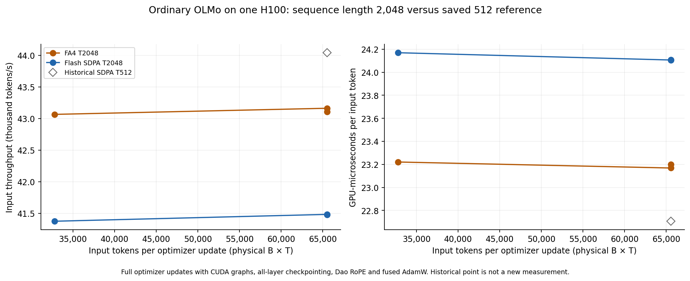

# Ordinary OLMo at length 2048: throughput and memory

2026-09-28. **Length 2048 is practical on one H10080GB for ordinary OLMo.**
At batch32 it reaches **41,480 input tokens/s with Flash SDPA** or
**43,135 with FA4**, leaving **40.9 GiB free**. The saved length512/batch128
reference is **44,041 tokens/s** at essentially the same memory footprint.
Both shapes process65,536inputtokens/update. Length2048 costs approximately
**5.8% throughput with SDPA**, or **2.1% with FA4**, relative to that historical reference.

FA4 improves the repeated matched T2048/B32 rate by **3.99%**,
with **no meaningful memory saving** at the measured shapes. B16 and B32 are
already at nearly the same token throughput, so B48/B64 were not needed.
**B32 is a comfortable ordinary-model operating point**; B16 is a useful
memory-saving choice if an added feature needs headroom. Neither is a maximum
capacity result or an optimal learning-batch claim. No attention default changes.

[Throughput PDF](throughput.pdf), [memory PDF](memory.pdf),
[measurement CSV](performance.csv), [reproduction](usage.md),
[storage receipt](storage-receipt.md).

## Measurements

New rows use one H10080GB HBM3, PyTorch2.13.0a0+8145d630e8.nv26.06,
CUDA13.3, installed FA4 4.0.0b20 and CuTE DSL4.6.0.dev0. The saved T512 run
has matching GPU model, driver, package versions and native runtime sources.
It was measured on2026-09-25 using one GPU of the then two-GPU host. **It is
historical, not an interleaved same-day control.** Per the user's clarification,
no new T512 or FA4/T512 run was performed.

| Length | Physical batch | Attention | Input tokens/update | Tokens/s | Seconds/update | Peak setup allocated GiB | Peak setup reserved GiB | Steady reserved GiB | Sampled free GiB |
| ---: | ---: | --- | ---: | ---: | ---: | ---: | ---: | ---: | ---: |
| 512 | 128 | Flash SDPA (historical) | 65,536 | 44,041.29 | 1.48806 | 34.271 | 37.518 | 37.518 | 40.912 |
| 2048 | 16 | Flash SDPA | 32,768 | 41,373.70 | 0.79200 | 26.222 | 28.406 | 28.156 | 50.260 |
| 2048 | 16 | FA4 | 32,768 | 43,065.26 | 0.76089 | 26.222 | 28.406 | 28.156 | 50.260 |
| 2048 | 32 | Flash SDPA | 65,536 | 41,482.33 | 1.57985 | 34.271 | 37.518 | 37.518 | 40.899 |
| 2048 | 32 | FA4 | 65,536 | 43,162.22 | 1.51837 | 34.271 | 37.518 | 37.518 | 40.899 |
| 2048 | 32 | FA4 (repeat) | 65,536 | 43,107.19 | 1.52030 | 34.271 | 37.518 | 37.518 | 40.899 |
| 2048 | 32 | Flash SDPA (repeat) | 65,536 | 41,477.09 | 1.58005 | 34.271 | 37.518 | 37.518 | 40.899 |

B32 headline rates pool the two runs' total input tokens divided by total timed
seconds. Primary order was SDPA then FA4; repeat order was FA4 then SDPA.
FA4's repeats differ0.13%; SDPA's differ0.013%. These short runs establish a
repeatable directional difference, not confidence intervals or long-training
performance guarantees. B16→B32 increases rates only about0.2–0.3% while using
another9.36GiB of reservation. No OOM or larger-batch capacity search was needed.

At B32, actual device-used memory is about38.28GiB and reservation37.52GiB.
Setup peak allocated is34.27GiB, while postcapture allocated is17.79GiB. That
lower allocated figure omits the reserved graph pool; it is not the full memory
footprint. Free memory is sampled at phase boundaries rather than continuously.
These setups happen to have similar peak and steady reservation; that should
not be assumed for other models/shapes.

## Model, objective and timing contract

All rows use original OLMo-1B step60000 (~252B pretraining tokens),16layers,
width2048,16heads/head128, SwiGLU8192 per branch, tied50304vocabulary, native
normalization and no added Q/K normalization. There are **1,176,764,416 active
parameters**. The wrapper also retains a frozen unused32MiB fusion module;
registered resident parameters total1,185,153,024. It is not executed, trained
or given Adam state. **No RT, FBT or NextLat executes**, and no auxiliary loss
or predictor participates. Model and objective are otherwise unchanged.

Matched arms use Dao native-FP32 RoPE, rounded compiled ordinary SwiGLU,
all-layer activation checkpointing, fused AdamW, BF16 mixed compute with FP32
parameters/gradients/residuals/norms/Adam, TF32off, and autocast weight cacheoff.
The backend comparison changes only ordinary attention. Flash SDPA is forced;
FA4's actual installed CuTE dispatch is checked with no SDPA fallback. No
package upgrade, custom kernel optimization or production model change occurred.

The fixture is full-valid repeated text with separate row documents and changed
token values across updates. Full next-token CE uses position chunks2048 and
all50304 output rows. T2048/B32 has65,504 CE targets versus65,408 at T512/B128;
input-token counts match, but the number of sequence boundaries differs.
One physical microbatch/update, no gradient accumulation. Each fresh process
performs three actual preparation updates, eleven backward warmups, and five
timed complete updates. CUDA graphs capture forward/loss/backward; clipping,
Adam, scheduler and health checks remain outside. Timing includes input
validation/copy and excludes compilation, reference snapshots, fixture creation,
logging, data-loader and checkpoint I/O. These are **compute-path benchmarks**,
not learning-efficiency measurements or an end-to-end data pipeline benchmark.

Analytic matrix work at B32/T2048 is616.95–696.10TFLOPs/update versus
590.49–636.65 at the matched-token historical T512 shape. This includes estimated
checkpoint recomputation but excludes norms, RoPE, activation/softmax/loss
pointwise operations, optimizer work and kernel overhead. It is not measured
hardware FLOPs or MFU. Longer attention increases work despite equal token
counts; the unchanged dense projections/readout help explain the modest total
throughput difference. FA4 changes execution efficiency, not this arithmetic ledger.

## Numerical qualification and operational checks

A bounded B2/T2048 comparison changes only Flash SDPA→FA4 on the current
Dao/compiled/fused configuration. **Output and all raw-gradient budgets pass**:
global gradient relativeL2=0.0108331 (limit0.015625), worst tensorL2=0.0127904
(limit0.03125), worst tensor max/referencepeak=0.0293427 (limit0.0625),
outputL2=0.0064774 and outputmax/referencepeak=0.0102713.

The strict relative CE check **fails**:0.000775228 versus1e-5, corresponding to
**0.000072306 nats per target** on a low-loss repeated-text fixture. The threshold
was not changed. This is a retained loss-only compatibility failure, not a
claim of harmful training behavior or full numerical equivalence. Older
T2048 Dao/FA4 qualifications also remain. No broad numerical campaign followed.

All five operational checks in that diagnostic pass, including exact own
initial/repeated eager/graph gradients and loss, exact changed-weight terminal
parity, actual backend dispatch, and source/dependency integrity. It completed
eight finite optimizer updates but remains failed and is excluded from the
throughput plots. The six capacity processes pass their own five checks each;
no structural/nonfinite/own-graph failure or OOM occurred. The eager reference
is stored on CPU before capture, and the graph is released before terminal
eager validation to avoid artificial memory overlap.

The diagnostic is not a new independent eager-versus-graphed Adam-trajectory
comparison; prior own complete-update checks remain the basis for that scope.
This milestone checks initial/changed-weight raw parity and actual updates.
The functionality evidence supports this qualified performance comparison.
It does not establish long-run training equivalence, packed/padded-document
support, or RT/FBT/NextLat behavior at T2048.

## Implementation and retained evidence

Runtime extension `edf3d0b` adds ordinary T2048/FA4 benchmark selectors,
small-screen handling, dispatch/dependency checks and the required new protocol.
Existing RT/DDP and T512 defaults are preserved. **111 focused CPU tests pass**
(67 installed JIT-deprecation warnings,3.23s); independent read-only review found
no material issue. All37 frozen pretrained runtime files match the historical
T512 reference byte-for-byte; only benchmark selection/reporting was extended.

Final scope: **7new reports,6passed capacity runs and1retained loss-only failure,
56physical optimizer updates, no OOM/unfinished run**. The audit verifies
**1,148source snapshot pairs and214dependency snapshot pairs**. All7stage
receipts verify in GCS, with a separate closeout bundle. The historical T512
report is separately retained and excluded from new-run/update totals.

W&B runs:

- [fa4-check-b2-01](https://wandb.ai/taylorbollman/pretrained-fbt-rt-nextlat/runs/eqoy6u9l)
- [sdpa-b16-01](https://wandb.ai/taylorbollman/pretrained-fbt-rt-nextlat/runs/7a9kppet)
- [fa4-b16-01](https://wandb.ai/taylorbollman/pretrained-fbt-rt-nextlat/runs/ccfmxpid)
- [sdpa-b32-01](https://wandb.ai/taylorbollman/pretrained-fbt-rt-nextlat/runs/c533vnqc)
- [fa4-b32-01](https://wandb.ai/taylorbollman/pretrained-fbt-rt-nextlat/runs/048i3z9m)
- [fa4-b32-02](https://wandb.ai/taylorbollman/pretrained-fbt-rt-nextlat/runs/suooim6i)
- [sdpa-b32-02](https://wandb.ai/taylorbollman/pretrained-fbt-rt-nextlat/runs/rzre1e3z)
- [ordinary-dao-single-b128-01](https://wandb.ai/taylorbollman/pretrained-fbt-rt-nextlat/runs/yqfpvlue)

Local evidence: `.runtime/olmo-ordinary-long-context/`. Per-stage sources,
dependencies, protocol, configuration, checkpoint hash, memory phases, metrics
and logs are retained with receipts in `gs://fast-chunks`; see the storage
receipt for exact prefix/object hashes. No new full checkpoint was created for
these disposable updates; the original pretrained O1 checkpoint remains retained.
The GPU queue is complete. Review the intended data/training configuration next;
no further GPU or quality-training job is queued.
