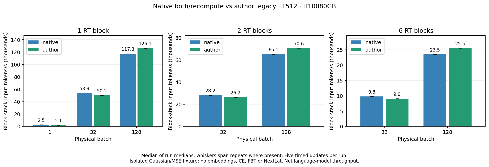

# Author-derived RoPE RT versus optimized native RT

Status: isolated comparison complete. Twenty-five GPU reports pass; the initial
zero-update loader failure remains recorded. No default backend replacement is selected.
Runtime `6eea309`; initial failed loader attempt `f483646` is preserved. See
`protocol.md`, `author-port-audit.md`, `execution-notes.md` and `usage.md`.

## What is being compared

Both paths execute the first native OLMo-1B step60000 checkpoint blocks with
D2048,16heads,128dimensions/head,SwiGLU8192 per branch, nonaffine LayerNorm,
native split-half RoPE, no Q/K normalization and unchanged packed weights.
Each block has67,108,864 parameters; two/six blocks have134,217,728/402,653,184.
Embeddings, vocabulary projection, FBT and NextLat are absent from these isolated
fixtures. A six-block fixture is not a pretrained six-layer language model.

The author-derived path preserves the author's separate temporary Q/KV GEMMs,
compiled helper boundaries, dyadic scheduling, per-token permanent-writer weight
gradients and full materialized backward attention. Four MLP chunks bound local
activation retention. Private invocation-local leaves return packed gradients
to outer autograd. This adapts ownership without changing actual checkpoint
parameters or writing their `.grad` fields from nested backward.

The primary native arm is Stage A RoPE reuse plus K/V-only permanent writes,
with Triton historical kernels, explicit cast reuse and probability recomputation.
Neither recurrent historical path is Flash Attention. Author BF16 arithmetic
prescales Q and retains its probability/adjoint rounding; native uses post-dot
scaling and FP32 probability/error policy. This difference remains explicit.

## Numerical and operational results

All122 scoped CPU tests pass, including independently counted matrix work;
27 harness tests pass after correcting the native checkpoint-key mapping.
The first load attempt executed zero updates and produced no numerical result.

| Native-width fixture | Aggregate parameter-gradient relative L2 | Result |
| --- | ---: | --- |
| Author FP32 scan vs unchanged native scan, B1/T32 | 2.6494e-7 | Pass |
| Author compiled FP32 tiled vs unchanged native scan, B1/T32 | 5.7039e-7 | Pass |
| Native FP32 tiled vs unchanged native scan, B1/T32 | 5.7914e-7 | Pass |
| Author BF16 vs native BF16, B1/T32 | 0.00451671 | Pass |
| Author BF16 vs native BF16, B8/T512 | 0.00413293 | Pass |

AtB8/T512 the worst parameter-tensor L2 is0.00453776 and worst maximum error
normalized by the reference tensor peak is0.00534759. Output L2 is0.000251626;
the scalar MSE is bitwise identical. No acceptance budget was relaxed.

AtB1/T32, the BF16-to-FP32 diagnostic gradient L2 is0.00497301 for author and
0.00505335 for native. These diagnostic rows are not a general mixed-precision
qualification. All four successful verification reports have exact own-backend
eager/graph outputs, loss and raw gradients, changed-input overwrite, three
eager versus three graph Adam updates with exact parameters/moments/counters,
and changed-weight replay. They execute24 actual optimizer updates in total.
The external CUDA-event preflight also passes. Compilation has no recorded
graph breaks/fallback; runtime settings and specialization counts are retained.

## Performance scope

The completed measurement uses one H10080GB, physical batches, BF16 mixed with FP32
parameters/gradients/Adam, and CUDA graphs. Ten backward warmups and three
preparation updates precede five timed complete updates. Each timed shape gets
its own exact changed-input and changed-weight graph checks. Setup/capture and
validation memory are distinct from steady timing. Validation can require more
memory than graph replay alone.

Complete-update timing includes copies of two FP32 Gaussian tensors, graph
forward/MSE/backward, clipping, Adam and scheduling. These copies are larger than
language-model token-ID copies; graph-only and forward/backward event timings
help separate that fixture overhead. Rates must be labeled **block-stack input
tokens/s**, not language-model training throughput or a reproduction of the
paper's published rates. Matrix FLOPs exclude objectives, optimizer, all
pointwise work, communication and hardware padding; they are accounting values.

## Matched throughput and memory

Complete-update block-stack input tokens/s, T512. One-block B32/B128 entries
are medians of two run medians, including reverse order; other entries are one
bounded run each (five timed updates).

| RT blocks | Physical batch | Native optimized | Author-derived | Author change |
| --- | ---: | ---: | ---: | ---: |
| 1 | 1 | 2,526 | 2,064 | -18.3% |
| 1 | 32 | 53,876 | 50,191 | -6.8% |
| 2 | 32 | 28,223 | 26,244 | -7.0% |
| 6 | 32 | 9,759 | 9,044 | -7.3% |
| 1 | 128 | 117,316 | 126,144 | +7.5% |
| 2 | 128 | 65,131 | 70,646 | +8.5% |
| 6 | 128 | 23,506 | 25,524 | +8.6% |

One-block B128 author/native setup peak allocated memory is **12.24/22.79 GiB**;
peak reserved is **28.67/44.75 GiB**. Six-block B128 author setup allocated and
reserved peaks are 19.74/38.42 GiB. These include validation with a live graph
pool and do not establish maximum steady-training batch size. We kept B128 as a
comfortable shared point; B256/B512 were not attempted, given native observed
setup memory and the bounded scope.

The B32 native bridge is control49.01k, RoPE-only52.99k, both53.88k, and
both/materialized55.18k. Thus native improvements matter to the comparison;
materialized native backward is slightly faster here, with its separate memory
tradeoff. Author remains slower at this batch. See [bridge plot](native-bridge.pdf).
The separate [operator audit](profile-audit.md) suggests copy/add/weight-gradient
scheduling overhead contributes at B32. It does not prove the B128 bottleneck.

All21 capacity reports pass finite complete updates and exact own-backend
initial/changed-input/changed-weight graph checks. Together with verification,
there are **192 actual optimizer updates** and1196 frozen source/report pairs.
The failed initial load is retained separately from successful numerical work.
The20 evidence-helper tests also pass. See [summary](summary.json) for exact
shape-specific timings, event partitions, memory, logical matrix FLOPs, compiler
counters and W&B URLs.

## Decision and limits

The author-derived path is useful enough at B128, with a substantial observed
memory reduction, to justify the plan's conditional full-model integration
check. That check will use the unchanged16-layer model with RT at0/15, ordinary
Flash layers, and K2+NextLat. The isolated outcome does not establish an
end-to-end language-model speedup, general mixed-precision equivalence or a
production replacement. Native remains the default.

Existing F4 RT+FBT and broader BF16/FP32 qualifications remain open. This
milestone does not test quality, padded/prefix-cache execution, distributed
training or long-run numerical drift. No acceptance threshold was relaxed.
