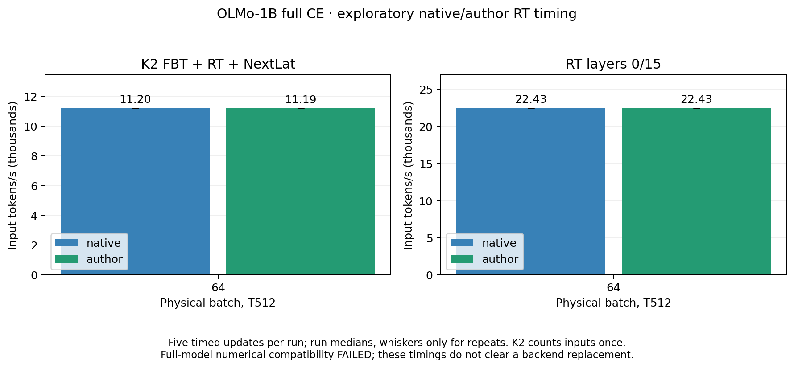

# Author-derived RT integration: numerical compatibility remains unresolved

The opt-in author-derived backend executes correctly with ordinary Flash
attention, CUDA graphs, AdamW, FBT and NextLat in the bounded integration
fixtures. **It does not pass the native-versus-author BF16 numerical screen.**
Both completed GPU reports retain `status: failed` for that compatibility
failure; each separately passes all five operational checks. Keep the native
backend as the default. Bounded full-model throughput comparisons are now
planned as exploratory measurements, following the local checks below; they
cannot clear the unresolved end-to-end discrepancy. Exact agreement between a
candidate's own eager and graph executions does not establish that its gradients match the intended
reference calculation.

## Scope and evidence

Runtime/protocol freeze: `2c38d649022a398f809670eec762910d99e0f2d7`.
The [prospective protocol](protocol.md) and [machine-readable summary](summary.json)
cover two completed B8/T512 verification runs and four B64/T512 timing runs
on one H10080GB. Verification performs three eager and three graph AdamW
updates per case from identical starting state; each capacity run performs
three preparation and five timed updates. There are **44 physical optimizer
updates total** and **282 source/report pairs** checked against each run’s
frozen revision. Capacity runtime524fa89 has the same integration sources as
2c38d649. These are bounded execution checks,
not language-model training or quality results.

The checkpoint is OLMo-1B step60000: 16 layers, width 2048, 16 attention heads
of width 128, SwiGLU width 8192 per branch, native nonaffine LayerNorm and RoPE,
no Q/K normalization, and tied 50,304-token embeddings/readout. RT selects
layers 0 and 15 at full strength. RT-only has one pass; the combined case has
an ordinary bootstrap pass followed by one FBT+RT pass, with NextLat losses on
both passes. Parameters are shared across passes.

Both arms use the same checkpoint, auxiliary initial weights, examples and
full-CE masks. Ordinary layers use deterministic PyTorch Flash SDPA and
activation checkpointing. The native RT control uses RoPE-table reuse,
K/V-only writes, cast reuse, Triton historical attention and probability
recomputation. The author candidate uses the preserved `author_legacy`
arithmetic, compiled helpers, four MLP chunks, invocation-local cast reuse and
materialized backward attention. Author RT itself does not use Flash. FP32
master parameters/residuals and BF16 mixed execution are retained, with TF32
disabled; the arithmetic boundaries differ between the RT implementations.

CPU evidence includes236 integration/harness/regression checks,47 evidence-helper
checks and25 localization checks. Additional58-test and seven-test targeted
reruns are recorded after harness/retention changes. These
overlap and should not be added into a count of distinct tests. Tiny FP32
coverage includes ordinary bypass, RT, K2/K3 shared calls, complete NextLat
losses/raw gradients, tied ownership, unchanged checkpoint keys, static
metadata and unsupported-scope guards. Commands and results are in
[test-results.txt](test-results.txt),
[combined-test-results.txt](combined-test-results.txt),
[final-harness-test-results.txt](final-harness-test-results.txt) and
[retention-test-results.txt](retention-test-results.txt).

## GPU numerical comparison

All listed differences compare author BF16 against native BF16 before gradient
clipping. Relative L2 is `norm(candidate-reference)/norm(reference)`;
maximum error is normalized by the reference tensor's maximum absolute value.

| Metric | Frozen screen | RT-only | K2 FBT+RT+NextLat |
| --- | ---: | ---: | ---: |
| Aggregate raw-gradient relative L2 | <= 0.015625 | **0.312458** | **0.162606** |
| Worst parameter-gradient relative L2 | <= 0.03125 | **0.767565** | **0.232507** |
| Worst parameter-gradient maximum error ratio | <= 0.0625 | **0.931450** | **0.452188** |
| Parameter tensors over L2 screen | 0 | 28 / 65 | 67 / 71 |
| Parameter tensors over maximum-error screen | 0 | 25 / 65 | 63 / 71 |
| Final-pass output relative L2 | <= 0.015625 | 0.008860 | **0.031661** |
| Final-pass output maximum error ratio | <= 0.0625 | **0.062551** | **0.066709** |
| Final-pass CE relative difference | <= 0.00001 | **0.00149439** | **0.00166927** |

Combined final-pass latent-loss and KL-loss relative differences are
0.00056627 and 0.00309550 respectively, also over the frozen loss screen.
Its ordinary bootstrap output and all three bootstrap losses are bitwise
identical across backends. Every compared value is finite, supervision counts
match, and parameter/gradient ownership is preserved.

The RT-only output maximum-error miss is marginal, and the loss screen is
strict. Neither explains away the much larger raw-gradient discrepancies.
No tolerance was widened after seeing the results. These are compatibility
failures against native BF16, not yet a determination of which implementation
is closer to full FP32 on these real model inputs.

In RT-only, block 0 accounts for 92.69% of squared gradient-difference energy;
the tied embedding/readout accounts for 4.28% and block 1 for 2.57%. The largest
per-tensor relative L2 is the tied embedding/readout; within block 0, the
packed attention projection reaches 0.577990. This concentration motivates
localizing block 0. It does not by itself distinguish forward sensitivity,
nonlinear reconstruction, or a backward arithmetic error. Combined error
energy is less concentrated: block 0 contributes 60.02% and block 1 9.31%.

Raw reports and online runs:

- RT-only: [.runtime report](../../../.runtime/olmo-rt-author-integration/verify-rt-author-b8/report.json), [W&B](https://wandb.ai/taylorbollman/pretrained-fbt-rt-nextlat/runs/qnkc3ove).
- Combined: [.runtime report](../../../.runtime/olmo-rt-author-integration/verify-combined-author-b8/report.json), [W&B](https://wandb.ai/taylorbollman/pretrained-fbt-rt-nextlat/runs/ylqrdez0).

## What passed operationally

Both candidates pass **5/5 operational checks**: observed ordinary Flash forward
and backward dispatch; initial eager/graph equivalence; changed-token overwrite;
three eager versus three graph AdamW updates; and replay after weights change.
Losses and raw gradients are bitwise identical for each own-backend eager/graph
comparison. AdamW comparisons also match model values, optimizer moments,
scheduler state, counters and step metrics exactly, and confirm weights change.
The ordinary Flash observer is a separate B1/T8 fixture around the actual
integrated model, outside any timing measurement.

Author helper compilation records 23 unique graphs in each run, no reported
graph breaks or unsupported-operation fallback, and an enabled fail-on-recompile
limit guard. Static preparation avoids host reads of device tensors inside
capture. These results support execution and ownership correctness, while the
independent numerical compatibility failure remains open.

## Parameter and matrix-work accounting

| Quantity | RT-only | K2 FBT+RT+NextLat |
| --- | ---: | ---: |
| Resident unique parameters | 1,185,153,024 | 1,267,879,936 |
| Active/trainable/gradient-participating parameters | 1,176,764,416 | 1,267,879,936 |
| Deployable inference parameters | 1,176,764,416 | 1,185,153,024 |
| Input tokens per update | 4,096 | 4,096 |
| Backbone pass-token work per update | 4,096 | 8,192 |
| Ordinary / RT block calls per microbatch | 14 / 2 | 30 / 2 |
| Analytic matrix FLOPs per update | 39.47–42.00 trillion | 84.86–90.27 trillion |

RT-only retains the wrapper's inactive 8,388,608 fusion parameters in memory;
they are excluded from active/deployable counts. Combined uses those fusion
parameters and adds 82,726,912 training-only NextLat parameters. The repeated
backbone pass increases work, not unique parameter count. These verification
resource cards leave `optimizer_owned` unset; the separate completed AdamW
parity checks provide optimizer-state evidence.

Full CE has 4,088 targets per update. Combined additionally has 4,088 latent
pairs and 2,048 KL triples per pass, with CE/latent/KL counts across its two
passes of 8,176 / 8,176 / 4,096. The KL mask remains the existing response mask;
full-CE supervision does not silently expand it.

FLOP ranges count audited matrix arithmetic, including ordinary checkpoint
recomputation and the author RT backward schedule. They exclude elementwise
work, casts, optimizer/clipping, launch overhead, communication and hardware
padding; they are not measured device FLOPs.

## Exploratory full-model timing

Physical B64/T512, full CE2048/KL128, three preparation updates, ten backward
warmups, CUDA-graph capture and five timed complete updates per arm. Timings
include copies, graph forward/loss/backward, clipping, AdamW and scheduling;
compilation/setup and validation are outside the timer. All four runs pass
finite complete updates and exact initial/changed-input/changed-weight graph
checks. K2 counts each input token once, not twice for its two passes.

| Case | Native input tokens/s | Author input tokens/s | Native setup peak allocated / reserved GiB | Author setup peak allocated / reserved GiB |
| --- | ---: | ---: | ---: | ---: |
| RT layers0/15 | 22,430.8 | 22,425.7 | 32.08 / 50.31 | 26.78 / 45.38 |
| K2 FBT+RT+NextLat | 11,195.8 | 11,186.5 | 38.92 / 65.64 | 36.53 / 66.39 |

Both pairs are effectively tied in this short measurement. The differences
are below0.1%; no small speed advantage is claimed and reverse repeats were
not added. Native rates also reproduce the earlier Stage A measurements.
Author saves allocated setup memory, especially RT-only, but combined peak
reservation is slightly higher. Thus a larger usable combined batch is not
established. Steady graph replay has a different active-allocation footprint;
reserved graph pools remain relevant to physical capacity.

These timings are explicitly exploratory because the independent full-model
numerical screen failed. They do not show model-quality equivalence or clear
an author replacement. The isolated B128 throughput/memory advantage remains
valid within its different workload; it does not imply a B64 full-model gain.

## Fixed-input, fixed-cotangent localization

Completed diagnostic `localize-block0-r2`, frozen at
`524fa89fe431053b34a17326ee8c7fa76368ff1c`, captures the actual block-0 input
and incoming mean-CE cotangent from the same native B8/T512 RT-only fixture.
It holds those tensors, weights and RoPE positions fixed for eight local VJPs:
six arithmetic variants with the actual cotangent, plus native/author mixed
with a same-norm Gaussian cotangent. There are no optimizer updates. All 48
source snapshots were independently matched to the frozen Git revision.
The [prospective protocol](localization-protocol.md),
[raw report](../../../.runtime/olmo-rt-author-integration/localize-block0-r2/report.json)
and [W&B run](https://wandb.ai/taylorbollman/pretrained-fbt-rt-nextlat/runs/p9hbeqgj)
preserve the scope and measurements.

| Fixed-cotangent comparison | Aggregate parameter-gradient relative L2 | Input-gradient relative L2 | Interpretation |
| --- | ---: | ---: | --- |
| Author full FP32 vs native full FP32 | 0.000000465 | 0.000001320 | FP32 screen passes |
| Author legacy mixed vs native mixed | 0.003327 | 0.006552 | BF16 screen passes |
| Native mixed vs native full FP32 | 0.004743 | 0.005465 | Descriptive precision comparison |
| Author legacy mixed vs native full FP32 | 0.004964 | 0.007650 | Descriptive precision comparison |
| Author FP32-state mixed vs native mixed | 0.002566 | 0.004162 | BF16 screen passes |
| Author separate-self diagnostic vs native mixed | 0.003520 | 0.006649 | BF16 screen passes; no improvement over legacy in aggregate parameter error |
| Same-norm Gaussian: author legacy mixed vs native mixed | 0.006412 | 0.008131 | BF16 screen passes |

All ten recorded comparisons are finite and preserve gradient ownership. Five
apply numerical screens (one FP32, four BF16), and all five pass. The other
five are descriptive comparisons whose `passed` field checks finite values
and ownership, not numerical equivalence. All rows remain diagnostic
`gate: false`; none replaces or relabels the failed end-to-end gate.

The local native forward exactly reproduces the captured block-0 forward.
Its four parameter-gradient squared norms match the earlier full-model native
values to floating-point reduction precision (relative differences at most
1.9e-16); this is a fixture consistency check, not a bitwise comparison of the
full gradient tensors. Fixed inputs/cotangents and block parameters are
unchanged. The actual incoming cotangent has L2 norm 0.506921685; the Gaussian
has norm 0.506921703, changing direction without materially changing magnitude.

The backward-only separate-self diagnostic leaves the author forward bitwise
unchanged. Its aggregate discrepancy against native mixed is slightly larger
than the unmodified author's (0.003520 vs 0.003327). Compiled legacy mixed
reconstruction at token 0 already equals the temporary value bitwise. Thus
these observations do not support a token-0 self-cancellation problem as an
explanation of the large integrated discrepancy; they do not rule out every
reconstruction sensitivity elsewhere. No production arithmetic was changed.

These results support agreement of the two block implementations on the tested
real input and shared derivative direction, including close full-FP32
agreement. The much larger integrated block-0 gradient discrepancy (0.437355
relative L2 across its four parameters) is not reproduced when the incoming
cotangent is held fixed. This motivated the incoming-cotangent check below.
Each local arm still follows its own recurrent forward trajectory.

### Completed incoming-cotangent extension

`localize-block0-r3`, frozen at
`987bc460593b5d0e24d412f3054ff1f876407b9f`, completed two full-model backward
captures and nine local VJPs with **zero optimizer updates**. Its 48 source
snapshots and protocol were independently verified against that Git revision.
The [raw report](../../../.runtime/olmo-rt-author-integration/localize-block0-r3/report.json)
and [W&B run](https://wandb.ai/taylorbollman/pretrained-fbt-rt-nextlat/runs/lbotdy8y)
retain all measurements. This repeats the fixed-cotangent measurements and
adds one author local VJP using the author's own incoming cotangent.

| Measurement in this fresh capture | Result |
| --- | ---: |
| Author/native block-0 input and RoPE positions | Bitwise identical |
| Model parameters through both captures | Unchanged |
| Native local vs own full-model block-0 gradients | All four tensors bitwise identical |
| Author local vs own full-model block-0 gradients | All four tensors bitwise identical |
| Author/native incoming cotangent relative L2 | 0.786611 |
| Author/native block-0 output relative L2 | 0.003639 |
| Author/native full-model block-0 parameter-gradient relative L2 | 0.443495 |
| Author/native local gradients with shared native cotangent | 0.003327 |
| Author local gradients: own vs native cotangent | 0.443501 |

Both local forwards also reproduce their own captured full-model block output
bitwise. The repeated five explicit numerical screens still pass; all eleven
recorded comparisons are finite/owned, including six descriptive comparisons
that do not assert numerical equivalence. No failed integrated gate was changed.
The fresh block-0 aggregate discrepancy is **0.443495**, compared with
**0.437355** in the original integrated verification; these are separate
captures and are not claimed to be bitwise reproductions of one another.

The exact own-cotangent replays establish that each local block calculation
reproduces the parameter gradients generated inside its respective full model.
With weights/input fixed, changing only the incoming cotangent produces the
large gradient difference, while changing the local implementation with one
shared cotangent produces a much smaller difference. For this fixture, the
dominant block-0 discrepancy is therefore carried by the gradient arriving
from the surrounding model, rather than a large disagreement between the two
local VJPs at the same incoming direction.

This localizes where the discrepancy enters block 0; it does **not** identify
why the surrounding model produces such different cotangents. The downstream
trajectory includes perturbed activations, ordinary layers, the other RT layer
and the loss. The result neither isolates a specific downstream operation nor
establishes which complete mixed-precision model is closer to a full-FP32
model. It also does not establish harmlessness during longer training or clear
the separate combined FBT+NextLat discrepancy. No production arithmetic was
changed, and no additional numerical diagnostic is scheduled in this bounded
milestone. Exploratory timing does not remove these qualifications or authorize
a default backend replacement.

Native remains the default. Existing F4 RT+FBT and BF16/FP32 qualifications,
padding/cache support, save/resume, multi-GPU and long-run stability remain
outside this bounded result. The storage receipt records verified GCS retention
of selected reports, failures, source snapshots and plots. GPU work is complete;
no learning run or further diagnostic is queued.
