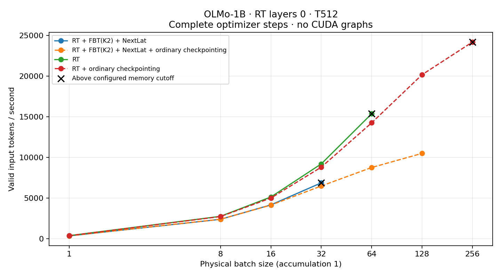

# F2 bounded numerical health and execution

Status: **core_passed_with_graph_qualifications**.

These measurements test operation and resource use on one GPU. They do not measure language-model quality. Native Q/K normalization remains off; only the explicitly recorded RT layers and shapes are covered.

## Objective and gradient scale

FP32 parameters, gradients and Adam moments with BF16 autocast. FBT uses pass 0 plus the mean of extra-pass losses; each CE/latent/KL term keeps its own denominator. Component norms below include their objective weights. Repeated-VJP closure in BF16 is descriptive; no tolerance was widened for this report.

| Case | B / T | Total objective | Native / fusion / predictor gradient norm | Component-sum relative L2 |
|---|---:|---:|---|---:|
| ordinary | 2 / 32 | 1.978 | 31.6 / 0 / 0 | 0 |
| rt | 2 / 32 | 2.441 | 45.11 / 0 / 0 | 0 |
| fbt | 2 / 32 | 12.42 | 664.8 / 104.1 / 0 | 0.003001 |
| nextlat | 2 / 32 | 13.04 | 128.8 / 0 / 48.36 | 0.007402 |
| combined | 2 / 32 | 27.18 | 873.1 / 119.9 / 106.9 | 0.0145 |
| combined-k3 | 2 / 32 | 28.37 | 2763 / 479 / 95.96 | 0.01382 |
| ordinary | 2 / 128 | 0.5205 | 9.696 / 0 / 0 | 0 |
| combined | 2 / 128 | 27.99 | 1194 / 144.4 / 73.68 | 0.00674 |
| combined-k3 | 2 / 128 | 28.83 | 1155 / 180.5 / 71.24 | 0.009053 |

| Case / pass | CE / latent / KL means | Weighted CE / latent / KL gradient norms |
|---|---|---|
| ordinary B2/T32 / 0 | 1.978 / -0 / -0 | 31.6 / — / — |
| rt B2/T32 / 0 | 2.441 / -0 / -0 | 45.11 / — / — |
| fbt B2/T32 / 0 | 1.978 / -0 / -0 | 31.6 / — / — |
| fbt B2/T32 / 1 | 10.44 / -0 / -0 | 671.8 / — / — |
| nextlat B2/T32 / 0 | 1.978 / 0.9416 / 10.12 | 31.6 / 2.464 / 131.7 |
| combined B2/T32 / 0 | 1.978 / 0.9416 / 10.12 | 31.6 / 2.464 / 131.7 |
| combined B2/T32 / 1 | 8.546 / 0.8793 / 4.716 | 656.7 / 16.88 / 909.4 |
| combined-k3 B2/T32 / 0 | 1.978 / 0.9416 / 10.12 | 31.6 / 2.464 / 131.7 |
| combined-k3 B2/T32 / 1 | 8.546 / 0.8793 / 4.716 | 328.3 / 8.44 / 454.7 |
| combined-k3 B2/T32 / 2 | 10.84 / 0.8844 / 4.801 | 1803 / 22.83 / 1216 |
| ordinary B2/T128 / 0 | 0.5205 / 0 / 0 | 9.696 / — / — |
| combined B2/T128 / 0 | 0.5205 / 0.9397 / 11.87 | 9.696 / 2.267 / 108.6 |
| combined B2/T128 / 1 | 9.509 / 0.8472 / 4.309 | 1185 / 18.76 / 615.8 |
| combined-k3 B2/T128 / 0 | 0.5205 / 0.9397 / 11.87 | 9.696 / 2.267 / 108.6 |
| combined-k3 B2/T128 / 1 | 9.509 / 0.8472 / 4.309 | 592.6 / 9.38 / 307.9 |
| combined-k3 B2/T128 / 2 | 10.46 / 0.8438 / 5.039 | 804.3 / 24.86 / 670.1 |

## Observed attention scale

Q/K RMS uses actual post-RoPE operands. Logits and concentrations are detached FP32 reconstructions, not the fused backend's private probabilities or exact mixed dyadic scores. Padding/future entries are excluded; concentration excludes queries with only one allowed key. Permanent K is used below; temporary-K RMS is also retained in summary.json.

| Case / pass / layer (kind) | Q / permanent K RMS | Absolute logit p99 / max | Max probability p95 | Entropy / uniform mean |
|---|---:|---:|---:|---:|
| ordinary B2/T32 / 0 / 0 (ordinary) | 0.9712 / 1.282 | 6.823 / 22.37 | 0.897 | 0.7142 |
| ordinary B2/T32 / 0 / 1 (ordinary) | 0.966 / 1.594 | 8.43 / 14.18 | 0.8471 | 0.6692 |
| ordinary B2/T32 / 0 / 7 (ordinary) | 0.9609 / 1.146 | 7.286 / 14.49 | 0.9697 | 0.4825 |
| ordinary B2/T32 / 0 / 15 (ordinary) | 1.095 / 1.248 | 5.174 / 8.038 | 0.8428 | 0.672 |
| rt B2/T32 / 0 / 0 (rt) | 0.9712 / 0.4725 | 5.585 / 22.37 | 0.9922 | 0.4912 |
| rt B2/T32 / 0 / 1 (ordinary) | 1.045 / 1.464 | 9.189 / 15.94 | 0.9168 | 0.6351 |
| rt B2/T32 / 0 / 7 (ordinary) | 0.9017 / 1.067 | 6.697 / 12 | 0.931 | 0.5775 |
| rt B2/T32 / 0 / 15 (ordinary) | 1.107 / 1.16 | 5.286 / 10.36 | 0.8744 | 0.7053 |
| fbt B2/T32 / 0 / 0 (ordinary) | 0.9712 / 1.282 | 6.823 / 22.37 | 0.897 | 0.7142 |
| fbt B2/T32 / 0 / 1 (ordinary) | 0.966 / 1.594 | 8.43 / 14.18 | 0.8471 | 0.6692 |
| fbt B2/T32 / 0 / 7 (ordinary) | 0.9609 / 1.146 | 7.286 / 14.49 | 0.9697 | 0.4825 |
| fbt B2/T32 / 0 / 15 (ordinary) | 1.095 / 1.248 | 5.174 / 8.038 | 0.8428 | 0.672 |
| fbt B2/T32 / 1 / 0 (ordinary) | 0.4947 / 0.5376 | 1.677 / 14.33 | 0.5354 | 0.9596 |
| fbt B2/T32 / 1 / 1 (ordinary) | 0.894 / 1.096 | 8.494 / 10.98 | 0.7149 | 0.8436 |
| fbt B2/T32 / 1 / 7 (ordinary) | 0.6588 / 0.8259 | 4.893 / 7.055 | 0.9498 | 0.6439 |
| fbt B2/T32 / 1 / 15 (ordinary) | 1.091 / 1.206 | 5.585 / 9.449 | 0.9377 | 0.6405 |
| nextlat B2/T32 / 0 / 0 (ordinary) | 0.9712 / 1.282 | 6.823 / 22.37 | 0.897 | 0.7142 |
| nextlat B2/T32 / 0 / 1 (ordinary) | 0.966 / 1.594 | 8.43 / 14.18 | 0.8471 | 0.6692 |
| nextlat B2/T32 / 0 / 7 (ordinary) | 0.9609 / 1.146 | 7.286 / 14.49 | 0.9697 | 0.4825 |
| nextlat B2/T32 / 0 / 15 (ordinary) | 1.095 / 1.248 | 5.174 / 8.038 | 0.8428 | 0.672 |
| combined B2/T32 / 0 / 0 (ordinary) | 0.9712 / 1.282 | 6.823 / 22.37 | 0.897 | 0.7142 |
| combined B2/T32 / 0 / 1 (ordinary) | 0.966 / 1.594 | 8.43 / 14.18 | 0.8471 | 0.6692 |
| combined B2/T32 / 0 / 7 (ordinary) | 0.9609 / 1.146 | 7.286 / 14.49 | 0.9697 | 0.4825 |
| combined B2/T32 / 0 / 15 (ordinary) | 1.095 / 1.248 | 5.174 / 8.038 | 0.8428 | 0.672 |
| combined B2/T32 / 1 / 0 (rt) | 0.4947 / 0.4827 | 1.479 / 14.33 | 0.585 | 0.9604 |
| combined B2/T32 / 1 / 1 (ordinary) | 0.815 / 0.922 | 7.516 / 9.489 | 0.8118 | 0.8486 |
| combined B2/T32 / 1 / 7 (ordinary) | 0.6539 / 0.7598 | 5.247 / 7.628 | 0.9612 | 0.6411 |
| combined B2/T32 / 1 / 15 (ordinary) | 1.017 / 1.201 | 4.679 / 6.217 | 0.9313 | 0.6891 |
| combined-k3 B2/T32 / 0 / 0 (ordinary) | 0.9712 / 1.282 | 6.823 / 22.37 | 0.897 | 0.7142 |
| combined-k3 B2/T32 / 0 / 1 (ordinary) | 0.966 / 1.594 | 8.43 / 14.18 | 0.8471 | 0.6692 |
| combined-k3 B2/T32 / 0 / 7 (ordinary) | 0.9609 / 1.146 | 7.286 / 14.49 | 0.9697 | 0.4825 |
| combined-k3 B2/T32 / 0 / 15 (ordinary) | 1.095 / 1.248 | 5.174 / 8.038 | 0.8428 | 0.672 |
| combined-k3 B2/T32 / 1 / 0 (rt) | 0.4947 / 0.4827 | 1.479 / 14.33 | 0.585 | 0.9604 |
| combined-k3 B2/T32 / 1 / 1 (ordinary) | 0.815 / 0.922 | 7.516 / 9.489 | 0.8118 | 0.8486 |
| combined-k3 B2/T32 / 1 / 7 (ordinary) | 0.6539 / 0.7598 | 5.247 / 7.628 | 0.9612 | 0.6411 |
| combined-k3 B2/T32 / 1 / 15 (ordinary) | 1.017 / 1.201 | 4.679 / 6.217 | 0.9313 | 0.6891 |
| combined-k3 B2/T32 / 2 / 0 (rt) | 0.4856 / 0.4674 | 1.5 / 14.33 | 0.5405 | 0.9658 |
| combined-k3 B2/T32 / 2 / 1 (ordinary) | 0.8541 / 0.9154 | 7.461 / 8.627 | 0.8395 | 0.8266 |
| combined-k3 B2/T32 / 2 / 7 (ordinary) | 0.6547 / 0.7957 | 4.893 / 8.15 | 0.9452 | 0.6954 |
| combined-k3 B2/T32 / 2 / 15 (ordinary) | 1.054 / 1.163 | 4.741 / 7.567 | 0.9209 | 0.6748 |
| ordinary B2/T128 / 0 / 0 (ordinary) | 0.9573 / 1.291 | 5.715 / 22.39 | 0.7611 | 0.7334 |
| ordinary B2/T128 / 0 / 1 (ordinary) | 0.9673 / 1.65 | 9.3 / 15.98 | 0.77 | 0.6474 |
| ordinary B2/T128 / 0 / 7 (ordinary) | 1.01 / 1.258 | 6.009 / 14.51 | 0.8604 | 0.5649 |
| ordinary B2/T128 / 0 / 15 (ordinary) | 1.119 / 1.386 | 6.655 / 11.02 | 0.6567 | 0.6518 |
| combined B2/T128 / 0 / 0 (ordinary) | 0.9573 / 1.291 | 5.715 / 22.39 | 0.7611 | 0.7334 |
| combined B2/T128 / 0 / 1 (ordinary) | 0.9673 / 1.65 | 9.3 / 15.98 | 0.77 | 0.6474 |
| combined B2/T128 / 0 / 7 (ordinary) | 1.01 / 1.258 | 6.009 / 14.51 | 0.8604 | 0.5649 |
| combined B2/T128 / 0 / 15 (ordinary) | 1.119 / 1.386 | 6.655 / 11.02 | 0.6567 | 0.6518 |
| combined B2/T128 / 1 / 0 (rt) | 0.4627 / 0.4596 | 0.9515 / 6.909 | 0.2784 | 0.985 |
| combined B2/T128 / 1 / 1 (ordinary) | 0.7965 / 0.8329 | 6.314 / 8.545 | 0.624 | 0.9203 |
| combined B2/T128 / 1 / 7 (ordinary) | 0.6839 / 0.7794 | 3.687 / 6.164 | 0.5104 | 0.8182 |
| combined B2/T128 / 1 / 15 (ordinary) | 1.051 / 1.282 | 6.818 / 10.48 | 0.8961 | 0.6609 |
| combined-k3 B2/T128 / 0 / 0 (ordinary) | 0.9573 / 1.291 | 5.715 / 22.39 | 0.7611 | 0.7334 |
| combined-k3 B2/T128 / 0 / 1 (ordinary) | 0.9673 / 1.65 | 9.3 / 15.98 | 0.77 | 0.6474 |
| combined-k3 B2/T128 / 0 / 7 (ordinary) | 1.01 / 1.258 | 6.009 / 14.51 | 0.8604 | 0.5649 |
| combined-k3 B2/T128 / 0 / 15 (ordinary) | 1.119 / 1.386 | 6.655 / 11.02 | 0.6567 | 0.6518 |
| combined-k3 B2/T128 / 1 / 0 (rt) | 0.4627 / 0.4596 | 0.9515 / 6.909 | 0.2784 | 0.985 |
| combined-k3 B2/T128 / 1 / 1 (ordinary) | 0.7965 / 0.8329 | 6.314 / 8.545 | 0.624 | 0.9203 |
| combined-k3 B2/T128 / 1 / 7 (ordinary) | 0.6839 / 0.7794 | 3.687 / 6.164 | 0.5104 | 0.8182 |
| combined-k3 B2/T128 / 1 / 15 (ordinary) | 1.051 / 1.282 | 6.818 / 10.48 | 0.8961 | 0.6609 |
| combined-k3 B2/T128 / 2 / 0 (rt) | 0.4422 / 0.4448 | 0.981 / 6.909 | 0.2461 | 0.9887 |
| combined-k3 B2/T128 / 2 / 1 (ordinary) | 0.8418 / 0.8101 | 7.238 / 8.766 | 0.6727 | 0.8989 |
| combined-k3 B2/T128 / 2 / 7 (ordinary) | 0.6362 / 0.7445 | 3.691 / 6.7 | 0.5341 | 0.8456 |
| combined-k3 B2/T128 / 2 / 15 (ordinary) | 1.054 / 1.224 | 6.54 / 8.743 | 0.882 | 0.6787 |

## Complete-step physical-batch measurements

Includes forward, losses, backward, gradient clipping, AdamW and scheduler. Excludes fixture preparation, W&B and reporting. These short measurements use changing tokens and weights; physical batch and gradient accumulation must not be conflated. All measured cells here use accumulation 1. 'Comfortable' means only the declared allocated-memory bound, not a universal maximum batch or stability clearance.

| Case / T | Physical B | Ordinary checkpointing | Median step s | Valid input tok/s | CE targets/s | Peak allocated / reserved GiB | Comfortable |
|---|---:|---|---:|---:|---:|---:|---|
| rt / 512 | 1 | False | 1.393 | 367.443 | 183.721 | 18.4 / 20.23 | Yes (≤65 GiB) |
| rt / 512 | 8 | False | 1.487 | 2741.32 | 1372.01 | 22.55 / 23.55 | Yes (≤65 GiB) |
| rt / 512 | 16 | False | 1.591 | 5122.27 | 2563.65 | 29.4 / 30.08 | Yes (≤65 GiB) |
| rt / 512 | 32 | False | 1.773 | 9194.15 | 4601.59 | 43.26 / 44.37 | Yes (≤65 GiB) |
| rt / 512 | 64 | False | 2.122 | 15368.2 | 7691.63 | 70.98 / 72.71 | No (≤65 GiB) |
| rt / 512 | 1 | True | 1.43 | 358.065 | 179.033 | 18.4 / 19.52 | Yes (≤65 GiB) |
| rt / 512 | 8 | True | 1.503 | 2712.65 | 1357.66 | 19.18 / 20.07 | Yes (≤65 GiB) |
| rt / 512 | 16 | True | 1.634 | 4990.5 | 2497.7 | 20.66 / 21.74 | Yes (≤65 GiB) |
| rt / 512 | 32 | True | 1.854 | 8792.66 | 4400.65 | 23.62 / 23.88 | Yes (≤65 GiB) |
| rt / 512 | 64 | True | 2.288 | 14252.4 | 7133.21 | 29.55 / 29.95 | Yes (≤65 GiB) |
| rt / 512 | 128 | True | 3.232 | 20175.9 | 10097.8 | 41.4 / 42.29 | Yes (≤65 GiB) |
| rt / 512 | 256 | True | 5.391 | 24195.8 | 12109.8 | 65.12 / 65.85 | No (≤65 GiB) |
| combined / 512 | 1 | False | 1.539 | 332.689 | 166.344 | 20.4 / 23.55 | Yes (≤65 GiB) |
| combined / 512 | 8 | False | 1.716 | 2375.94 | 1189.14 | 31.85 / 32.93 | Yes (≤65 GiB) |
| combined / 512 | 16 | False | 1.964 | 4150.07 | 2077.07 | 46.87 / 47.6 | Yes (≤65 GiB) |
| combined / 512 | 32 | False | 2.377 | 6860.21 | 3433.47 | 76.89 / 78.32 | No (≤65 GiB) |
| combined / 512 | 1 | True | 1.508 | 339.601 | 169.801 | 19.73 / 20.94 | Yes (≤65 GiB) |
| combined / 512 | 8 | True | 1.71 | 2384.1 | 1193.22 | 19.73 / 21.23 | Yes (≤65 GiB) |
| combined / 512 | 16 | True | 1.978 | 4121.67 | 2062.86 | 21.48 / 21.94 | Yes (≤65 GiB) |
| combined / 512 | 32 | True | 2.517 | 6476.77 | 3241.56 | 25.82 / 27.16 | Yes (≤65 GiB) |
| combined / 512 | 64 | True | 3.726 | 8752.39 | 4380.49 | 34.5 / 36.4 | Yes (≤65 GiB) |
| combined / 512 | 128 | True | 6.217 | 10489.6 | 5249.97 | 51.87 / 58.16 | Yes (≤65 GiB) |
| combined / 512 | 256 | True | OOM | — | — | — | No |

Activation checkpointing: **combined B1/T32** matched the complete update exactly, including model/optimizer/scheduler/counter boundary digests.

## CUDA graph microbenchmark

This captures only the unpadded native stack and a fixed hidden-state cotangent backward, with gradient buffers zeroed inside the graph. It excludes CE, readout projection, FBT, NextLat, input copies and optimizer work. A separate SGD update checks changed-weight replay. It is not end-to-end training throughput.

- B1/T32, RT layers [0], ordinary backend auto, deterministic not explicitly set: 0.1071 → 0.03678 s, **2.91×**. Changed-input/weight and repeated-replay checks passed; all compared tensors bitwise equal: True.
- B8/T512, RT layers [0], ordinary backend flash, deterministic True: 1.583 → 0.4808 s, **3.29×**. Changed-input/weight and repeated-replay checks passed; all compared tensors bitwise equal: True.
- B1/T32, RT layers [0], ordinary backend auto, deterministic not explicitly set: **historical capture blocker** at capture. Cannot copy between CPU and CUDA tensors during CUDA graph capture unless the CPU tensor is pinned. Please use tensor.pin_memory() or allocate the tensor with pin_memory=True. No efficiency claim from this attempt.
- B8/T512, RT layers [0], ordinary backend auto, deterministic not explicitly set: **failed original graph check** at equivalence. Graph replay differs from eager: original_tokens_weights No efficiency claim from this attempt.
- B8/T512, RT layers [0], ordinary backend flash, deterministic False: **failed original graph check** at equivalence. Graph replay differs from eager: original_tokens_weights No efficiency claim from this attempt.
- B8/T512, RT layers [0], ordinary backend cudnn, deterministic True: **failed original graph check** at warmup. No available kernel. Aborting execution. No efficiency claim from this attempt.

### Fixed-input localization controls

Completed localization means the controls ran, not that they agreed. These controls retain the original budgets and hold tokens/weights fixed; they cannot substitute for changed-token/weight replay or erase the failed T512 attempt. They make no throughput claim.

| B / T / RT layers / backend | Comparison | Within original budget | Bitwise equal | Max gradient relative L2 | Highest layer outside budget |
|---|---|---|---|---:|---:|
| 8 / 512 / [0] / auto | eager_default_repeat_1 | False | False | 0.004818 | 12 |
| 8 / 512 / [0] / auto | eager_default_repeat_2 | False | False | 0.0048 | 8 |
| 8 / 512 / [0] / auto | eager_capture_stream_vs_default_stream | False | False | 0.004769 | 8 |
| 8 / 512 / [0] / auto | graph_vs_eager_default | False | False | 0.004497 | 7 |
| 8 / 512 / [0] / auto | graph_repeat_1 | False | False | 0.004687 | 13 |
| 8 / 512 / [0] / auto | graph_repeat_2 | False | False | 0.003852 | 13 |
| 8 / 512 / [0] / auto | graph_vs_eager_capture_stream | False | False | 0.003258 | 10 |
| 8 / 512 / [0] / auto | eager_default_after_capture_vs_before | False | False | 0.004586 | 15 |
| 8 / 512 / [0] / auto | graph_vs_eager_default_after_capture | False | False | 0.005227 | 15 |

8 / 512 / [0] / auto: observed dispatch categories `cudnn_sdpa, flash_named_kernel_or_operator, sdpa_dispatch`; structural invariants passed: True.

| 8 / 512 / [] / auto | eager_default_repeat_1 | False | False | 0.005093 | 14 |
| 8 / 512 / [] / auto | eager_default_repeat_2 | False | False | 0.004087 | 10 |
| 8 / 512 / [] / auto | eager_capture_stream_vs_default_stream | False | False | 0.004528 | 12 |
| 8 / 512 / [] / auto | graph_vs_eager_default | False | False | 0.00411 | 10 |
| 8 / 512 / [] / auto | graph_repeat_1 | False | False | 0.003056 | 10 |
| 8 / 512 / [] / auto | graph_repeat_2 | False | False | 0.003803 | 11 |
| 8 / 512 / [] / auto | graph_vs_eager_capture_stream | False | False | 0.004448 | 10 |
| 8 / 512 / [] / auto | eager_default_after_capture_vs_before | False | False | 0.003519 | 10 |
| 8 / 512 / [] / auto | graph_vs_eager_default_after_capture | False | False | 0.003613 | 10 |

8 / 512 / [] / auto: observed dispatch categories `cudnn_sdpa, flash_named_kernel_or_operator, sdpa_dispatch`; structural invariants passed: True.

## Evidence and scope

- `.runtime/olmo1b-step60000/f2-health-01/report.json` — passed; [W&B](https://wandb.ai/taylorbollman/pretrained-fbt-rt-nextlat/runs/5avrpu16); runtime sources match
- `.runtime/olmo1b-step60000/f2-health-t128-01/report.json` — passed; [W&B](https://wandb.ai/taylorbollman/pretrained-fbt-rt-nextlat/runs/in3j9e99); runtime sources match
- `.runtime/olmo1b-step60000/f2-checkpoint-01/report.json` — passed; [W&B](https://wandb.ai/taylorbollman/pretrained-fbt-rt-nextlat/runs/8o8hza2t); runtime sources match
- `.runtime/olmo1b-step60000/f2-capacity-01/report.json` — passed; [W&B](https://wandb.ai/taylorbollman/pretrained-fbt-rt-nextlat/runs/vzn186td); runtime sources match
- `.runtime/olmo1b-step60000/f2-graph-t32-02/report.json` — passed; [W&B](https://wandb.ai/taylorbollman/pretrained-fbt-rt-nextlat/runs/o4ewecv6); runtime sources match
- `.runtime/olmo1b-step60000/f2-graph-flash-det-t512-b8-01/report.json` — passed; [W&B](https://wandb.ai/taylorbollman/pretrained-fbt-rt-nextlat/runs/38m1ghdp); runtime sources match
- `.runtime/olmo1b-step60000/f2-localize-auto-rt-01/report.json` — completed; [W&B](https://wandb.ai/taylorbollman/pretrained-fbt-rt-nextlat/runs/lb7gavkp); runtime sources match
- `.runtime/olmo1b-step60000/f2-localize-auto-ordinary-01/report.json` — completed; [W&B](https://wandb.ai/taylorbollman/pretrained-fbt-rt-nextlat/runs/m7cksofc); runtime sources match
- `.runtime/olmo1b-step60000/f2-graph-t32-01/report.json` — capture_blocked; [W&B](https://wandb.ai/taylorbollman/pretrained-fbt-rt-nextlat/runs/m0ii74wh); 1 recorded historical source differences
- `.runtime/olmo1b-step60000/f2-graph-t512-b8-01/report.json` — failed; [W&B](https://wandb.ai/taylorbollman/pretrained-fbt-rt-nextlat/runs/r1l192od); runtime sources match
- `.runtime/olmo1b-step60000/f2-graph-flash-t512-b8-01/report.json` — failed; [W&B](https://wandb.ai/taylorbollman/pretrained-fbt-rt-nextlat/runs/bvzxzvad); runtime sources match
- `.runtime/olmo1b-step60000/f2-graph-cudnn-det-t512-b8-01/report.json` — failed; [W&B](https://wandb.ai/taylorbollman/pretrained-fbt-rt-nextlat/runs/y41l30h8); runtime sources match

The JSON summary retains input hashes, configurations, gradient groups, selected-layer statistics and the full stated limitations. Raw reports remain authoritative. More layers, larger/different masks, combined CUDA graphs, and multi-GPU execution require their own checks.
