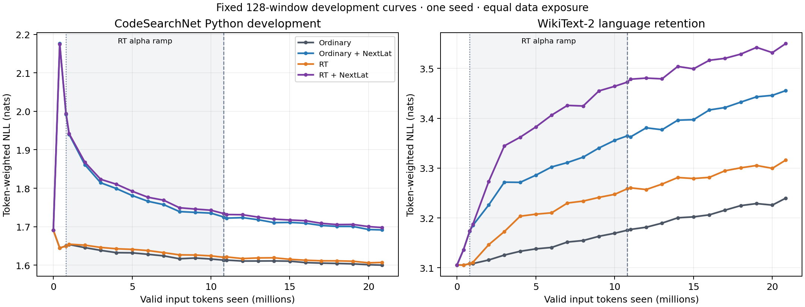

# OLMo O4: matched Python continuation pilot

All four arms completed **2,634 updates** and **20,855,799 valid input tokens** (20,771,511 CE targets) from the same original checkpoint and prepared stream.

Final results use the fixed 512-window prefixes (capped by available data). Curves use the separate 128-window prefixes; the larger final evaluation is never inserted into those curves.

| Model | Code NLL | Code perplexity | Code token accuracy | Retention NLL | Retention perplexity | Retention token accuracy |
| --- | ---: | ---: | ---: | ---: | ---: | ---: |
| Original ordinary checkpoint | 1.787902 | 5.9769 | 62.579% | 3.040993 | 20.9260 | 42.141% |
| Ordinary | 1.699360 | 5.4704 | 64.134% | 3.173815 | 23.8985 | 40.892% |
| Ordinary + NextLat | 1.792776 | 6.0061 | 63.208% | 3.390668 | 29.6858 | 38.579% |
| RT | 1.706351 | 5.5088 | 64.056% | 3.248923 | 25.7626 | 39.818% |
| RT + NextLat | 1.799070 | 6.0440 | 63.081% | 3.485577 | 32.6413 | 37.500% |

Differences below are **left minus right** token NLL: negative favors the left model. Intervals resample original documents, combining their windows first, with 1,000 paired resamples (seed20260922).

| Comparison | Code NLL difference [95% interval] | Retention NLL difference [95% interval] |
| --- | ---: | ---: |
| Ordinary + NextLat − Ordinary | +0.093416 [+0.087822, +0.098928] | +0.216853 [+0.209638, +0.225694] |
| RT − Ordinary | +0.006992 [+0.005692, +0.008378] | +0.075108 [+0.070511, +0.079646] |
| RT + NextLat − Ordinary | +0.099710 [+0.093886, +0.105441] | +0.311762 [+0.302998, +0.322201] |
| RT − Ordinary + NextLat | -0.086424 [-0.091733, -0.081035] | -0.141745 [-0.150490, -0.135155] |
| RT + NextLat − Ordinary + NextLat | +0.006294 [+0.005316, +0.007350] | +0.094909 [+0.089872, +0.099489] |
| RT + NextLat − RT | +0.092718 [+0.086934, +0.098307] | +0.236654 [+0.229254, +0.244500] |

Code interaction `(RT+NextLat − RT) − (NextLat − ordinary)`: -0.000697 nats [-0.002137, +0.000574], from 422 original-document clusters. Negative means a more favorable NextLat effect with RT in this pilot; it is not a replicated interaction finding.

Retention interaction `(RT+NextLat − RT) − (NextLat − ordinary)`: +0.019801 nats [+0.016410, +0.022694], from 59 original-document clusters. Negative means a more favorable NextLat effect with RT in this pilot; it is not a replicated interaction finding.

[Standalone PDF](learning-curves.pdf) · [Full comparisons and paired intervals](final-comparison.json)

One seed, approximately 20–22M valid-input-token recovery pilot; equal data exposure, not equal compute. Development subsets only; tests untouched. All valid same-document targets, reset context per window, unknown OLMo pretraining overlap. Cluster intervals describe sampled evaluation documents, not seed variability or research efficacy.

The general-language set is a retention check, not a published WikiText perplexity comparison. Code is continued as text rather than executed; token NLL does not establish programming-task success. NextLat adds training-only parameters and compute; its predictor is absent from evaluation. No FBT or autonomous latent rollout is tested.

Preflight provenance amendment: Before any learning arm, add an explicit cloud-retention retry when resuming a nonfinal checkpoint whose upload failed. No numerical, data, optimizer, scheduling, evaluation or profiling computation changed. The authentic preflight hashes and explicit old/new training-source hashes remain recorded; all four learning arms use the same amended frozen configuration.

Run and checkpoint records:

- [Ordinary on W&B](https://wandb.ai/taylorbollman/pretrained-fbt-rt-nextlat/runs/4rhi7s7i); [endpoint checkpoint](gs://fast-chunks/cdrm-w-latent/fbt-rt-nextlat/olmo1b-o4-code-pilot/20260921T220500Z/ordinary/update-002634.pt), GCS generation `1790030289931727`, SHA256 `1ff841d7e5ead37fc50d1e5c81ec04304a9507c19c2fce978c6de2d445eef30e`.
- [Ordinary + NextLat on W&B](https://wandb.ai/taylorbollman/pretrained-fbt-rt-nextlat/runs/tsgun4ax); [endpoint checkpoint](gs://fast-chunks/cdrm-w-latent/fbt-rt-nextlat/olmo1b-o4-code-pilot/20260921T220500Z/ordinary-nextlat/update-002634.pt), GCS generation `1790032585405349`, SHA256 `8933c5dea8c20f2e80be15185295cb6e5fb5a6f588a96ba625afd76cbad46e2b`.
- [RT on W&B](https://wandb.ai/taylorbollman/pretrained-fbt-rt-nextlat/runs/uvfoj6id); [endpoint checkpoint](gs://fast-chunks/cdrm-w-latent/fbt-rt-nextlat/olmo1b-o4-code-pilot/20260921T220500Z/rt/update-002634.pt), GCS generation `1790039343598726`, SHA256 `0304cb5f67915ea137e27880cd47ab30b1a581f8c7c528953b3d6eb07d0728b9`.
- [RT + NextLat on W&B](https://wandb.ai/taylorbollman/pretrained-fbt-rt-nextlat/runs/4cpi8hz0); [endpoint checkpoint](gs://fast-chunks/cdrm-w-latent/fbt-rt-nextlat/olmo1b-o4-code-pilot/20260921T220500Z/rt-nextlat/update-002634.pt), GCS generation `1790046674327457`, SHA256 `2c0a2b44d8f4a2d41927cd4b0715128a6b3f4c1b20ed5064f7992c3e00a8688a`.
