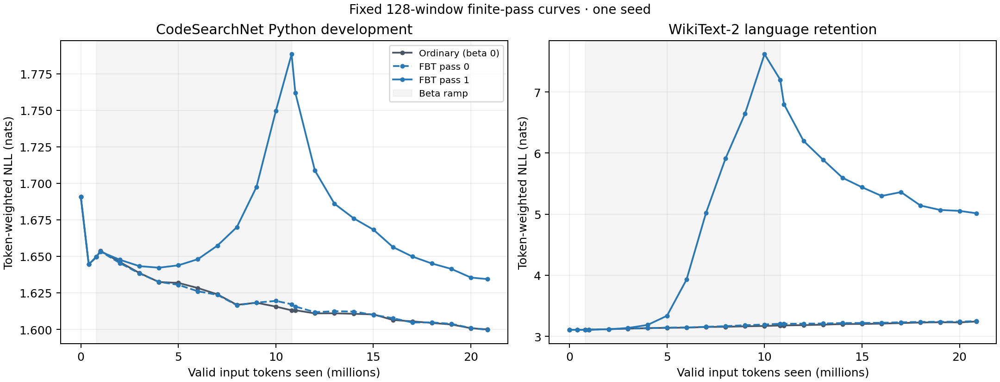
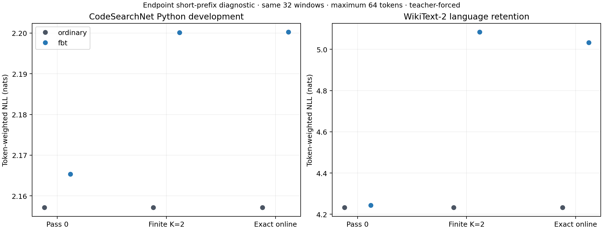

# OLMo O5b: ordinary versus FBT continuation

Both arms completed **2,634 updates** and **20,855,799 valid input tokens** (20,771,511 CE targets per pass) from the same original checkpoint and document stream.

Both optimize pass0 CE + pass1 CE (K=2, gamma=1). Ordinary keeps beta zero; FBT ramps feedback. Final results use fixed 512-window development selections. Separate 128-window curves preserve their original sample size.

| Model / inference pass | Code NLL | Code perplexity | Code accuracy | Retention NLL | Retention perplexity | Retention accuracy |
| --- | ---: | ---: | ---: | ---: | ---: | ---: |
| Original checkpoint | 1.787902 | 5.9769 | 62.579% | 3.040993 | 20.9260 | 42.141% |
| ordinary pass 0 | 1.699385 | 5.4706 | 64.145% | 3.177141 | 23.9781 | 40.857% |
| ordinary pass 1 | 1.699385 | 5.4706 | 64.145% | 3.177141 | 23.9781 | 40.857% |
| fbt pass 0 | 1.698216 | 5.4642 | 64.219% | 3.183361 | 24.1277 | 40.738% |
| fbt pass 1 | 1.737004 | 5.6803 | 63.645% | 4.969719 | 143.9864 | 24.357% |

Differences are left minus right NLL; negative favors left. 95% intervals use 1,000 paired resamples of original-document clusters, combining their windows before calculating token-weighted NLL (seed 20260922).

| Finite-pass comparison (512 windows) | Code difference [95% interval] | Retention difference [95% interval] |
| --- | ---: | ---: |
| fbt_pass1_minus_ordinary_pass1 | +0.037619 [+0.033360, +0.041884] | +1.792577 [+1.631192, +1.932436] |
| fbt_pass0_minus_ordinary_pass0 | -0.001168 [-0.002276, -0.000177] | +0.006220 [+0.004203, +0.008625] |
| fbt_pass1_minus_fbt_pass0 | +0.038787 [+0.034764, +0.042976] | +1.786357 [+1.622878, +1.927292] |

[Curves PDF](learning-curves.pdf)

The following **32-window, maximum-64-token** results use the same short prefixes for finite and exact-online execution. They are separate from the 512-window comparison above.

| Arm | Code pass0 / finite / online NLL | Retention pass0 / finite / online NLL |
| --- | ---: | ---: |
| ordinary | 2.157183 / 2.157183 / 2.157134 | 4.232237 / 4.232237 / 4.232553 |
| fbt | 2.165378 / 2.200133 / 2.200238 | 4.243235 / 5.083958 / 5.032388 |

[Online PDF](online-comparison.pdf) · [All results and paired intervals](final-comparison.json)

One seed and development subsets only; reserved tests untouched. Equal data exposure and the same two-pass CE objective (pass0 + pass1), not a claim of equal measured compute. No RT or NextLat. Context resets per window; documents counter counts windows, not unique documents. Paired intervals resample original document clusters and do not quantify seed variability. Unknown OLMo pretraining overlap. Token NLL does not establish programming-task success. Exact-online diagnostics are teacher-forced on separate 32-window, maximum-64-token prefixes; they are not free-running generation and must not be equated with 512-token finite-pass evaluations.

Run and endpoint records:

- [ordinary on W&B](https://wandb.ai/taylorbollman/pretrained-fbt-rt-nextlat/runs/ichekj67); [checkpoint](gs://fast-chunks/cdrm-w-latent/fbt-rt-nextlat/olmo1b-o5b-code-pilot/20260922T040000Z/ordinary/update-002634.pt), generation `1790052541850455`, SHA256 `738ed2ef2a31a4a52cb28276be3ce4494170c40658025c614f0d3614c8323b6a`.
- [fbt on W&B](https://wandb.ai/taylorbollman/pretrained-fbt-rt-nextlat/runs/gtv1hp98); [checkpoint](gs://fast-chunks/cdrm-w-latent/fbt-rt-nextlat/olmo1b-o5b-code-pilot/20260922T040000Z/fbt/update-002634.pt), generation `1790055503754266`, SHA256 `99585f5e9d666e8dea3f533749d155b0695b8143a6a313b60fb99f8d157faf66`.
