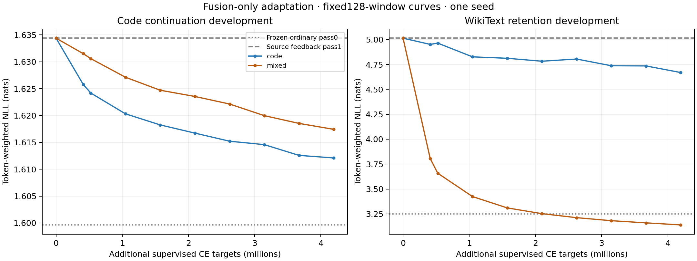
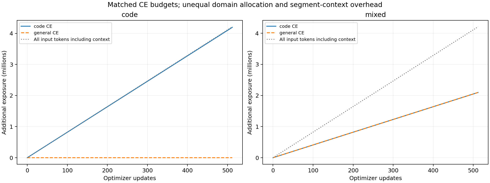

# O5c: frozen-backbone fusion adaptation

Both arms completed **512 updates** and **4,194,304 additional CE targets** from the same O5b FBT endpoint. Only the two fusion matrices trained; every recorded frozen tensor and buffer remained byte-identical.

| Arm | Code CE targets | General CE targets | Total input tokens | Reset segments |
| --- | ---: | ---: | ---: | ---: |
| code | 4,194,304 | 0 | 4,212,498 | 18,194 |
| mixed | 2,097,152 | 2,097,152 | 4,208,250 | 13,946 |

Final512-window metrics; lower NLL is better.

| Model / pass | Code NLL | Code accuracy | Retention NLL | Retention accuracy |
| --- | ---: | ---: | ---: | ---: |
| Source O5b pass0 | 1.698216 | 64.219% | 3.183361 | 40.738% |
| Source O5b pass1 | 1.737004 | 63.645% | 4.969719 | 24.357% |
| code pass0 | 1.698216 | 64.219% | 3.183361 | 40.738% |
| code pass1 | 1.715954 | 63.958% | 4.623289 | 26.882% |
| mixed pass0 | 1.698216 | 64.219% | 3.183361 | 40.738% |
| mixed pass1 | 1.720900 | 63.847% | 3.061443 | 41.637% |

Differences are left minus right NLL. 95% intervals use1,000 paired resamples of original-document clusters, combining their windows before token weighting (seed20260922).

| Feedback-pass contrast | Code difference [95% interval] | Retention difference [95% interval] |
| --- | ---: | ---: |
| mixed − code | +0.004947 [+0.003321, +0.006483] | -1.561846 [-1.680952, -1.426909] |
| code − source | -0.021050 [-0.022816, -0.019291] | -0.346430 [-0.374282, -0.316358] |
| mixed − source | -0.016103 [-0.018235, -0.014188] | -1.908275 [-2.050092, -1.746142] |

[Curves PDF](learning-curves.pdf)

[Exposure PDF](domain-exposure.pdf) · [Full comparison](final-comparison.json)

One seed and development subsets only; reserved tests untouched. Both arms start from the same adapted O5b endpoint, not the original pretrained checkpoint. Only fusion matrices train; frozen-state tensor hashes and ordinary-pass metrics are checked. The budget matches supervised CE targets and optimizer updates, not exact input tokens, number of segments, or measured compute. Mixed has half the code CE exposure plus fresh general-text exposure, so differences include that allocation tradeoff. Documents counters count independent reset segments/windows, not unique documents. Paired intervals resample original evaluation-document clusters and exclude training-seed variability and unknown pretraining overlap. Curves use128 windows; final comparisons use512. These are finite K2 teacher-forced NLL measurements, not exact-online or generated-code capability results.

Run and endpoint records:

- [code on W&B](https://wandb.ai/taylorbollman/pretrained-fbt-rt-nextlat/runs/obv0yofk); [checkpoint](gs://fast-chunks/cdrm-w-latent/fbt-rt-nextlat/olmo1b-o5c-fusion-only/20260922T061000Z/code/update-000512.pt), generation `1790058561034880`, SHA256 `263dcfd6b0553aa2ee6be26483bbe20ad04486dcc8a76e9f3ab6b9a727270f33`.
- [mixed on W&B](https://wandb.ai/taylorbollman/pretrained-fbt-rt-nextlat/runs/28cum2gv); [checkpoint](gs://fast-chunks/cdrm-w-latent/fbt-rt-nextlat/olmo1b-o5c-fusion-only/20260922T061000Z/mixed/update-000512.pt), generation `1790059437165208`, SHA256 `7bba59ac75478fb15cec5fd0187f306b220da9babb138ebccbf5d88a70609d1a`.
