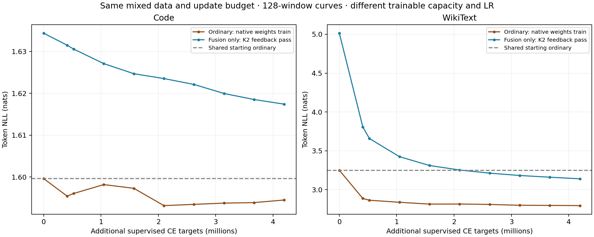

# O5e: ordinary continuation on the same mixed data

Completed **512 updates / 4,194,304 supervised CE targets** from the same O5b native backbone as O5c. Data targets, order and contexts match the fusion-only mixed run exactly.

| Training path | Trainable parameters | Peak learning rate | Training CE |
| --- | ---: | ---: | --- |
| O5e ordinary | 1,176,764,416 | 1e-5 | One ordinary CE |
| O5c fusion only | 8,388,608 | 1e-4 | Trainable feedback CE plus constant ordinary CE |

Final 512-window evaluation, maximum512 tokens/window, batch8. Lower NLL is better.

| Path | Code NLL | WikiText NLL | Code accuracy | WikiText accuracy |
| --- | ---: | ---: | ---: | ---: |
| Shared starting ordinary | 1.698216 | 3.183361 | 64.219% | 40.738% |
| O5e trained ordinary | 1.696348 | 2.720260 | 64.217% | 45.762% |
| O5c fusion, K2 | 1.720900 | 3.061443 | 63.847% | 41.637% |
| O5c fusion, exact online | 1.723307 | 3.140935 | 63.804% | 40.597% |

Paired original-document bootstrap intervals: 1,000 resamples, seed20260922. Negative NLL differences favor O5e ordinary.

| Contrast | Code NLL difference [95% interval] | WikiText NLL difference [95% interval] |
| --- | ---: | ---: |
| Ordinary − source ordinary | -0.001869 [-0.004935, +0.001339] | -0.463101 [-0.484403, -0.444964] |
| Ordinary − fusion K2 | -0.024553 [-0.028505, -0.020318] | -0.341184 [-0.356701, -0.327663] |
| Ordinary − fusion online | -0.026960 [-0.031058, -0.022563] | -0.420675 [-0.440000, -0.403838] |

One seed and development subsets only; reserved tests are untouched. The ordinary and fusion-only runs start from the same O5b native backbone and consume the exact same mixed-data targets, order, reset contexts and update budget. Ordinary trains all native parameters with LR 1e-5; O5c trains only 8,388,608 fusion parameters with LR 1e-4 over a frozen backbone. This is an equal-data practical continuation control, not a pure FBT ablation or a match of trainable capacity, FLOPs, memory or wall time. Ordinary uses one CE term; O5c's ordinary CE term was constant with respect to its trainable fusion. Curves use 128 windows; endpoint comparisons use 512. Online FBT is teacher-forced sequential feedback, not free-running generation. Bootstrap intervals cover evaluation-document variability only, excluding training-seed variance and unknown pretraining overlap. WikiText is a narrow general-text proxy.

[Curves PDF](learning-curves.pdf) · [Endpoint comparison PDF](endpoint-comparison.pdf) · [Full comparison](final-comparison.json)

[Ordinary run on W&B](https://wandb.ai/taylorbollman/pretrained-fbt-rt-nextlat/runs/ri76qycw) · [Fusion run on W&B](https://wandb.ai/taylorbollman/pretrained-fbt-rt-nextlat/runs/28cum2gv)

Retained ordinary checkpoint: `gs://fast-chunks/cdrm-w-latent/fbt-rt-nextlat/olmo1b-o5e-ordinary-control/20260922T132415Z/ordinary/update-000512.pt`; SHA256 `62b288c1e0e7e725ca9b56f65b52d018080b97eaaf28af3215c1613dba3eba45`.
