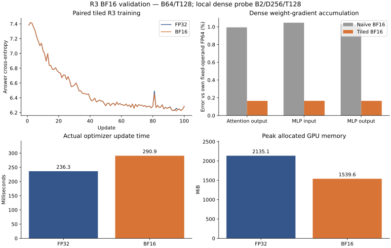

**Tiled R3 BF16 gradient investigation — results**

The evidence supports keeping the existing tiled arithmetic. We localized a
real source of naïve/tiled disagreement to BF16 weight-gradient accumulation:
naïve recurrence repeatedly rounds contributions through a shared autocast
weight; tiled's batched dense backward is substantially closer to the
same-operand FP64 calculation. No model arithmetic patch or architecture change
was justified.

Fresh B64 tests pass the prospective **tiled BF16 versus tiled FP32** numerical
and optimizer screens. The complete frozen suite does **not** pass on the
trained fixture: four strict FP32 max/RMS regression flags remain. An additional
FP64 diagnosis puts those differences at ordinary FP32 rounding scale. An
initial cold-process recovery failure was resolved in a controlled repeat by
retaining the compiler cache across processes. We recommend scoped tiled BF16
use with that recorded execution policy and the reviewed FP32 exception. This
is not unconditional numerical clearance or promotion of BF16 to the default.

**Scope and the previous maximum-error budget**

The executed profile remains Stage B MQAR: twelve blocks, only block 3
recurrent, D256/H4, MLP1024/GELU, rho 1, B64/T128, learned normalization,
Q/K normalization, ALiBi, and actual aligned answer-only mean CE. Compiled tiled
helpers use `bf16_fp32_state`, FP32 parameters/residuals/recurrent state and Adam
moments, BF16 dense operations, default-on autocast caching and BF16 GEMM
reduced-precision reduction, TF32 off, and math SDPA. This is not a BF16 CDRM
validation.

The old maximum budget was a reasonable conservative trigger for investigation,
but it measured distance from **naïve BF16**, which can itself be less accurate.
For reference 1, naïve 0.99 and tiled 1.005 disagree by 0.015 even though tiled
is closer to the reference. Requiring tiled to imitate that naïve result would
work against our deployment objective. The separately frozen
[validation contract](validation-contract.md) therefore evaluates tiled against
FP32, retains per-tensor maximum limits, and preserves every old flag. These
are project engineering tolerances; we do not know the authors' BF16 acceptance
criteria.

Replaying the original initialization B64 case reproduced all shared gradients
and optimizer-step tensors bitwise, including the seven original maximum-budget
failures. Tiled logits and 13 sampled intermediate tensors differed, so this
was **not** a completely bitwise reproduction. The
[comparison record](../../../.runtime/r3-bf16-tiled-resolution/20260907T173632Z/reproduce-init-b64/reproduction-evaluation.json)
retains those mismatches.

**What caused the dense-gradient disagreement**

A synthetic linear operation with fixed BF16-representable inputs and incoming
gradients reproduced native cached execution exactly using an explicit shared
BF16 weight cast. Its many partial weight gradients accumulate at that BF16
node before reaching the FP32 parameter. A batched contraction performs far
less intermediate rounding. Final `.grad` being FP32 does not recover the lost
precision.

The [retained tiny R3 probe](../../../.runtime/r3-bf16-tiled-resolution/20260907T173632Z/dense-tiny/report.json)
then confirmed the mechanism in actual attention-output and MLP projections:
all three had identical effective dense inputs, outputs and incoming gradients
across mixed backends. Weight-gradient relative errors against the fixed-operand
FP64 contraction were **0.64–0.67% for naïve cached** and **0.166–0.168% for
tiled**. Disabling naïve's cache reduced its accumulation error. Changing tiled's
cache left all nine parameter gradients and its input gradient exactly unchanged.

The [full-width B2/T128 isolation](../../../.runtime/r3-bf16-tiled-resolution/20260907T173632Z/dense-fullwidth-b2/report.json)
used captured real inputs and a common incoming block gradient. Each arm's
actual dense operands gave errors of **0.994–1.046% for naïve cached** versus
**0.165–0.166% for tiled**. Tiled's local and batched replay operands matched
exactly, as did its cache-on/off gradients. Internal operands differed somewhat
between naïve and tiled at this width; the FP64 contractions explicitly use
each arm's own operands. This does not attribute every full-model discrepancy
to one cause.

An [independent seed 9103](../../../.runtime/r3-bf16-tiled-resolution/20260907T173632Z/dense-fresh-seed9103/report.json)
repeated the tiny result, with nonzero credit to all 15 earlier writes.
Compiled checks removed diagnostic hooks. Full-width compiled/eager execution
was not exact: its worst parameter relative difference was 0.360%; deployment
confirmation therefore tested compiled tiled directly. A separate B2
fixed-forward scaling check passed all 102 gradients at factors 1/32 and 32.

**Fresh full-batch confirmation**

The candidate, runtime, thresholds and unused stream counters were
[frozen before execution](../../../.runtime/r3-bf16-tiled-resolution/20260907T173632Z/contract-freeze.json).
Four arms ran without diagnostic module/helper observers: naïve and tiled,
each in FP32 and BF16. Both cases retained all 100 parameter and two input
gradients, finite and FP32.

| Tiled BF16 versus tiled FP32 | Initialization, counter 4096 | Update-2000 checkpoint, counter 4097 |
|---|---:|---:|
| Global parameter-gradient relative L2 | 0.8361% | 1.2816% |
| Worst individual gradient relative L2 | 1.8679% | 3.3161% |
| Worst gradient maximum error / same tensor's reference maximum | 2.1092% | 5.6783% |
| Logit relative L2 | 0.7532% | 0.3646% |
| Absolute CE difference | 0.0000539 nats | 0.0001075 nats |
| BF16 numerical / optimizer screens | Pass / pass | Pass / pass |
| Complete frozen machine screens | Pass | **Fail: FP32 regression flags** |

The nominal global/per-tensor/maximum limits are 1.5625%/3.125%/6.25%, with
predeclared FP32 absolute floors. The trained 3.3161% value passes because of
that existing floor; no threshold changed after seeing confirmation. The old
one-sided maximum screen still flags eight initialization tensors and one
trained tensor. See the full [initialization](../../../.runtime/r3-bf16-tiled-resolution/20260907T173632Z/confirm-init-b64/reference-evaluation.json)
and [trained](../../../.runtime/r3-bf16-tiled-resolution/20260907T173632Z/confirm-trained-b64/reference-evaluation.json)
analyses.

Initial Adam delta cosine is 0.99408, exceeding the frozen 0.99 guardrail, with
10.88% relative delta disagreement. Of that error energy, 98.21% lies in the
predeclared near-zero-gradient set, but 550 gradient sign flips remain outside
it. With trained moments, delta relative error is 0.5821%, below 1.5625%.
These are bounded optimizer effects, not identical updates or proof of equal
long-run learning.

The four trained FP32 flags concern embedding weights, recurrent `ff_out`, and
both retained input gradients. Every coordinate passes the original
`atol=2e-6, rtol=2e-5` test; the largest absolute discrepancy is `3.17e-8`.
Their max/RMS values exceed the separate `2e-5` scale screen. A full B64
[naïve FP64 reference](../../../.runtime/r3-bf16-tiled-resolution/20260907T173632Z/trained-b64-fp64-reference/report.json)
also found all 102 gradients elementwise acceptable for both FP32 paths;
tiled's worst tensor relative error was `4.52e-6`. Max/RMS flags persist in
these FP64 comparisons too. This supports the rounding-scale explanation while
leaving the frozen failure recorded.

**Operational training, compiler-cache recovery and cost**

The 100-update FP32/BF16 pair remained finite. Mean BF16-minus-FP32 training
loss was -0.000981 nats overall and -0.001880 over the last 50 updates; the
largest single-step absolute gap was 0.045459. Update-100 development CE was
6.236422 FP32 versus 6.237671 BF16, a 0.001249-nat gap. The predeclared
last-window/development 0.02-nat guardrails pass. This short, low-accuracy run
establishes operational stability, not equal learning quality.

The first [cold-process resume](../../../.runtime/r3-bf16-tiled-resolution/20260907T173632Z/resume-bf16/recovery-comparison.json)
failed bitwise recovery despite exact initial model/optimizer/RNG restoration.
Its first loss difference was `9.54e-7`; the final model relative difference
grew to 0.678%. That failed run remains retained.

A separately declared [controlled repeat](../../../.runtime/r3-bf16-tiled-resolution/20260907T173632Z/recovery-cache-result.json)
trained 100 BF16 updates and resumed from update 50 with the same dedicated,
initially empty **Inductor compiler cache**. Recovery then matched every model,
optimizer and RNG tensor and every non-timing metric bitwise: zero differences.
Training performed 112 autotuning benchmarks; resume performed none and
recorded 15 compiled-graph cache hits. This implicates fresh compiler/kernel
selection in the cold-process drift. Inductor's compiled-code and tuning cache
is separate from autocast's shared BF16 weight cache discussed above.

The launcher now supplies `TORCHINDUCTOR_CACHE_DIR` under the mounted XDG cache,
with `CDRM_TORCHINDUCTOR_CACHE_DIR` as an explicit override; operational reports
record the directory and policy. Two fresh CPU-container marker checks verified
the launcher wiring. Reusing this cache restored exact recovery in the tested
pair; it is not a guarantee across machines, runtimes or compiler changes.
Local-SSD cache contents must be retained with the experiment if exact future
recovery matters. The patch changes execution infrastructure, not model math.

| Warmed-up real update | FP32 | BF16 |
|---|---:|---:|
| Mean forward/backward/clipping/Adam time | 236.344 ms | 290.906 ms |
| Peak allocated memory | 2135.083 MiB | 1539.583 MiB |

The [benchmarks](../../../.runtime/r3-bf16-tiled-resolution/20260907T173632Z/bench-tiled-bf16/report.json)
observed no new compilation during measurement. BF16 used **27.9% less memory**
but took **23.1% longer per update** on this H100 profile. It offers a memory
benefit here, without a throughput advantage.

Graphs are in [W&B](https://wandb.ai/taylorbollman/r3-bf16-tiled-validation),
including [initialization confirmation](https://wandb.ai/taylorbollman/r3-bf16-tiled-validation/runs/qegp17f0)
and [trained confirmation](https://wandb.ai/taylorbollman/r3-bf16-tiled-validation/runs/j76mcgxq).
The [W&B milestone summary](https://wandb.ai/taylorbollman/r3-bf16-tiled-validation/runs/stxue79z)
and [machine-readable results](results.json) accompany this report.
Local evidence is under `.runtime/r3-bf16-tiled-resolution/20260907T173632Z/`,
with archival prefix `gs://fast-chunks/cdrm-w-latent/r3-bf16-tiled-resolution/20260907T173632Z/`.
[Storage verification](storage.json) records uploaded artifacts and checksums.
The successful control's compiler cache is retained as
`source/inductor-cache.tar.gz`. All 136 manifest-listed historical BF16 artifacts
were rehashed with zero changes. Twenty-seven targeted CPU tests, script syntax
checks and the two-container cache-persistence check passed.

The intended PR pause keeps the architecture and numerical implementation
unchanged, records the causal diagnosis and reviewed limitations, and defers
broader CDRM use. Other lengths, smaller physical batches, accumulation,
distributed execution and long-run BF16 learning remain outside this result.
