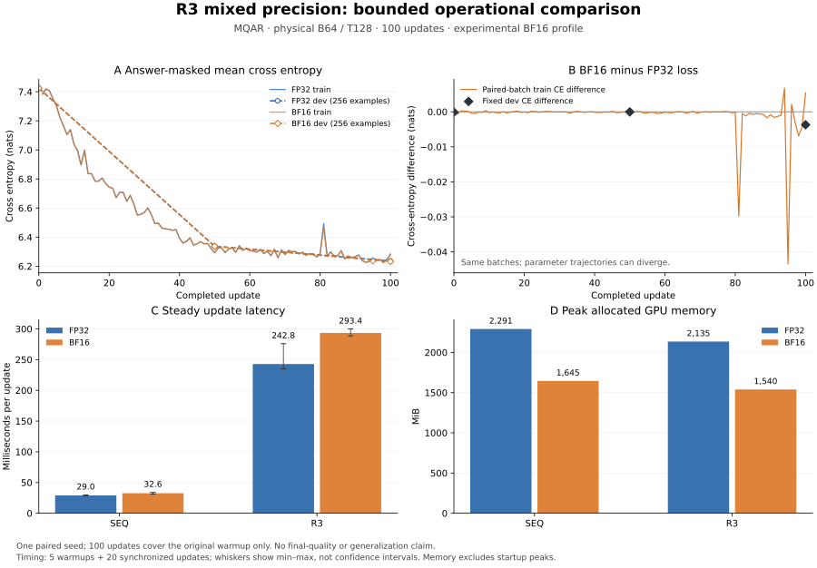

# R3 BF16 mixed precision: implementation and bounded validation

**Implemented as an opt-in experimental profile; retain FP32 as the research
default.** BF16 dense operations are active, the paired 100-update run is stable,
and midpoint recovery is bitwise exact. Full numerical clearance remains
incomplete: seven initialization B64 tensors fail the frozen maximum-error
budget. At the tested shape, BF16 saves 27.9% of R3 peak allocated memory but
makes updates 20.9% slower.

| Question | Result |
|---|---|
| BF16 active in intended dense operations? | Yes, including recurrent projections and MLP; FP32 parameters/final gradients/Adam moments. |
| Recurrent numerical clearance? | **Incomplete.** All per-tensor relative-L2 and added-L2 budgets pass; seven required maximum budgets fail at initialization B64. Trained B64 passes all added-error budgets. |
| Bounded training and recovery? | Yes: paired 100 updates on identical ordered batches; fresh-process update 50→100 recovery is bitwise exact for state and non-timing metrics. |
| Useful performance benefit? | Lower memory, **no throughput gain** at B64/T128. R3: 242.8 ms FP32 versus 293.4 ms BF16 per update. |

The [resolved profile](../../../configs/r3_mixed/mqar_t128_bf16.json),
[runnable commands](../../r3-bf16-usage.md), [machine-readable results](results.json),
and [detailed numerical analysis](numerical-analysis.md) accompany this report.
No architecture, normalization, ALiBi, rho, optimizer hyperparameter, data, or
loss-semantic change was made. This is NUM/OPS evidence, not a new research sweep.

## Implementation and observed precision

`ModelConfig.recurrent_precision_policy` defaults to `legacy`. Set
`bf16_fp32_state` **before constructing the model**, retain `precision=None`,
and use standard outer CUDA BF16 autocast for forward/loss. Backward executes
outside it. The custom function records the forward autocast dtype/enabled
state and re-enters that policy only for dense forward recomputation. The
legacy/inactive FP32 branch remains available.

The focused changes promote recurrent attention scores, softmax products,
working views, and temporal adjoints to FP32. Naive and tiled paths use the
same explicit policy, with one graph-connected FP32 working view per projected
record where it is shared. Original projection outputs and permanent storage
remain BF16. No additional forward attention state is saved.

| Boundary | Observed / established dtype |
|---|---|
| Trainable parameters, final `.grad`, Adam moments | FP32 before/after updates |
| Embedding and residual stream, block 3 input/output | FP32 |
| Q/K/V dense projections and permanent projected records | BF16 |
| Attention Q/K/V working views, online maxima/denominators/value sums | FP32 |
| Recomputed attention probabilities/values | FP32 |
| Temporal Q/K/V adjoints, `gs`, `g_dot_atts` | FP32 |
| Attention input to dense projection; eligible MLP outputs; final logits | BF16 |
| LayerNorm computation and aligned masked-CE reduction | FP32 under the retained default LayerNorm/autocast policy |

Module and custom-boundary observers recorded actual tensor dtypes; these are
not inferred solely from config labels. Buffer observations of initially
uninitialized storage establish dtype/shape only. Subsequent gradients and
optimizer-state finiteness are checked separately.

**FP32 final parameter gradients do not imply every internal dense-adjoint
reduction is FP32.** Standard autocast's weight cache remains enabled. Repeated
naive dense calls can share a BF16 weight view, whereas tiled backward uses
nested local backwards and a batched MLP reduction. The remaining error has not
been causally attributed to that cache. BF16 GEMM reduced-precision reduction
also remains enabled. Nondefault cache/reduction policies were not tested.
This follows the operation-specific AMP contract described in the
[PyTorch AMP documentation](https://docs.pytorch.org/docs/2.14/amp.html);
the installed build and observed boundaries are authoritative here.

## Numerical evidence and remaining flags

The original D256/T16 fixture reproduces **all 187 historical failed
comparisons exactly**, with unchanged fixture, harness and criteria. The old
experiment already used FP32 parameters with autocast. See the
[baseline audit](existing-evidence.md). Observed legacy running maxima were
already FP32; the fix is not premised on a BF16 running-maximum diagnosis.
Legacy reconstruction probabilities/attention and some temporal intermediates
were BF16 despite FP32 destination buffers.

Actual aligned answer-only mean CE uses the authoritative Stage B initialization
and update-2000 checkpoint, all 100 parameter gradients, true block-3-input and
embedding-output gradients, and an identical-state AdamW step. B2 is exploratory;
confirmation uses fresh full batches at counters 1 and 2001. The
[frozen criteria](confirmatory-criteria.md) were recorded before either B64 run.
Historical criteria and failures remain unchanged.

| Actual-CE fixture | Worst tiled/naive BF16 gradient relative L2 | Failed added-L2 budgets | Failed added-max budgets | Absolute CE gap |
|---|---:|---:|---:|---:|
| Legacy init B2 | 2.1805% | — | — | 0.0004420 |
| Candidate init B2 | 1.1101% | 0 | 3 | 0.0000229 |
| Candidate trained B2 | 1.0532% | 0 | 0 | 0 |
| Fresh init B64 | 1.1133% | 0 | **7** | 0.0000682 |
| Fresh trained B64 | 1.1072% | 0 | 0 | 0.0004108 |

All 102 gradients are present, finite and FP32 in every candidate arm. Both
mixed arms have exact normalized power-of-two scaling at 1/32 and 32 on the
two fixed B2 forward graphs. The unchanged FP32 B2 regression has zero original
gradient failures, with worst relative L2 1.39e-6. Five targeted CUDA regression
tests pass; targeted CPU checks pass 25 with one GPU-only skip. An earlier test
invocation omitted the explicit CUDA test selector and is retained separately
as one CPU pass/four skips, not GPU evidence.

Initialization B64 fails the required maximum budget for block 3 `attn_out`,
block 4 `attn_out`/`ff_out`, block 5 `attn_out`, and blocks 7/9/11 `ff_out`.
Excesses are 1.002–1.159 times the fixed permitted budget. At six worst
coordinates the mixed backends straddle FP32; four tiled values are closer to
FP32. Six differences equal one BF16 step at those gradient magnitudes.
These are dense, non-near-zero coordinates, so sparse support and cancellation
cannot explain them all. The block 11 coordinate moves farther from FP32.
The numerical analysis retains coordinates, norms, directions, and all old
flags, including shared BF16-versus-FP32 errors.

Initial Adam differences concentrate near zero but do not disappear outside
that set. At B64, 95.31% of extra-backend update disagreement energy lies inside
the predeclared near-zero gradient mask; 440 strict gradient sign flips remain
outside. Maximum first-step delta differences reach approximately twice LR.
With trained moments, extra-backend delta relative L2 is 0.000815 at B2 and
0.002008 at B64. These observations explain scale sensitivity; they do not
replace the failed numerical gate with an optimizer pass.

The corrected isolated block-3 B2/D32/T16 probe confirms nonzero credit to all
15 earlier writes. Naive/tiled BF16 outputs, all earlier projected K/V values,
and their gradients match exactly. Its remaining between-backend historical
flags affect only MLP parameter gradients; tiled/FP32 passes all historical
gradient screens on this small probe. An earlier probe incorrectly changed
only the model's top-level config after construction; its report is retained
with an invalidation note and is excluded from candidate clearance.

At positions 0/1/64/127, all B2 and initialization B64 dense replay inputs match
exactly. Trained B64 has one BF16 boundary change among 65,536 sampled values,
only 5.96e-8, with no changed sampled recomputed outputs. Permanent K/V replay
is exact in the samples. This does not justify adding saved attention state.

The actionable remaining target is **dense parameter-gradient reduction and
accumulation order**, including whether default cached weight casts contribute.
A focused follow-up should observe those adjoints or match their reduction
schedule, then test any resulting candidate on new fixtures. The evidence does
not prove a cache defect or authorize widening the frozen bounds.

## Paired training and recovery

Both compiled tiled arms start from exactly the same retained initialization,
empty Adam state and RNG. They consume the same first 100 frozen batches, with
the original 2000-update schedule and 100-update warmup. No independent tuning,
accumulation, scaler, dropout, or test-set evaluation is used. The fixed
development subset has 256 examples / 2048 scored answers.

| Update | FP32 development CE | BF16 development CE |
|---|---:|---:|
| 0 | 7.424483 | 7.424376 |
| 50 | 6.337363 | 6.337330 |
| 100 | 6.236422 | 6.232715 |

Both arms clip on 37/100 updates, maintain finite FP32 parameter/gradient/moment
state, and retain nonzero block-3 Q/KV parameter gradients. Mean BF16-minus-FP32
training CE is -0.000939; maximum absolute per-update difference is 0.043478.
This short pair shows no systematic deterioration, but its low development
accuracy and short horizon do not establish equal task quality or convergence.

Fresh-process recovery from BF16 update 50 restores model, optimizer, RNG,
precision/source identity and data position exactly. Updates 50→100 reproduce
the uninterrupted model, moments, RNG, counters, development results and
non-timing training metrics **bitwise**, with zero differences. Timings,
compiler history, paths and serialized-file bytes are excluded explicitly.
The existing update-zero resume restriction is preserved.

## Measured cost

Each arm uses five warmups and 20 synchronized actual masked-CE updates,
including zeroing gradients, forward, backward, clipping and AdamW. GPU data is
prepared; trajectory-monitor copies/reductions are excluded. No new graph is
compiled during measurement; each R3 arm has 12 compiled graphs after warmup.
Compilation/first-use work is reported separately. SEQ BF16 also passes actual
loss, finite-update and FP32 state checks.

| Architecture / precision | Mean update ms | Input tokens/s | Peak allocated MiB | Peak reserved MiB |
|---|---:|---:|---:|---:|
| SEQ FP32 | 28.975 | 282,722 | 2291.3 | 2488 |
| SEQ BF16 | 32.576 | 251,470 | 1645.3 | 1808 |
| R3 FP32 | 242.757 | 33,746 | 2135.1 | 2386 |
| R3 BF16 | 293.393 | 27,922 | 1539.6 | 1716 |

R3 BF16 lowers allocated memory 27.9% while increasing update latency 20.9%.
SEQ lowers allocated memory 28.2% while increasing latency 12.4%. R3/SEQ latency
is 8.38× in FP32 and 9.01× in BF16. Parameters remain about 38.0 MiB and Adam
state about 76.1 MiB per model. Reserved memory includes the warmup allocator
pool. Warmup totals are 0.659/0.800 seconds for SEQ FP32/BF16 and 10.221/11.520
seconds for R3 FP32/BF16; these include first-use work and five updates, not
isolated compiler time. These bounded timings do not predict other shapes or
optimized attention backends.

## Reproducibility and retention

One H100 80 GB HBM3; Python 3.12.3; PyTorch
`2.13.0a0+8145d630e8.nv26.06`; CUDA runtime 13.3; cuDNN 92300; kernel driver
580.173.02 with CUDA compatibility driver 610.43.02. TF32 is off, float32
matmul precision is `highest`, deterministic math SDPA is selected, math SDPA
reduced-precision reduction is off, BF16/FP16 GEMM reduced-precision reductions
are on, and `CUBLAS_WORKSPACE_CONFIG=:4096:8`. No whole-model compilation or
CUDA graphs. Naive recurrence uses its explicit attention equations, not SDPA.
The [numerical-accuracy reference](https://docs.pytorch.org/docs/2.14/notes/numerical_accuracy.html)
explains why reduction policy is part of the recorded contract.

The saved Stage B configuration remains authoritative: MQAR V1024, 12 blocks,
D256/H4/full MHA, MLP1024/GELU, pre-norm ALiBi with affine Q/K normalization,
block 3 recurrence, rho1, four backward MLP chunks, physical/global B64/T128.
Exact checkpoint, fixture, source, runtime and optimizer identities are in
`results.json` and the raw reports. The 59 previously retained FP32-validation
artifacts were rehashed with **zero changes**. Core/config changes and new
harnesses are captured in separate source snapshots; original Stage B files
remain inputs only.

New artifacts live on persistent home storage at
`.runtime/r3-bf16/20260906T225438Z/`, with GCS lineage
`gs://fast-chunks/cdrm-w-latent/r3-bf16/20260906T225438Z/`.
See [storage verification](storage.json) for actual upload/checksum/readback
results. Total GPU-command execution, including container startup and retained
diagnostic failures, was 526.69 seconds of the 3600-second bound. No command
exceeded its 900-second limit.

Scope excludes other tasks/shapes, T512, the paper's one-block D128/H16 model,
accumulation, update-zero exact resume, changed cache/GEMM/SDPA policies,
distributed execution and CUDA graphs. These require separate validation.
