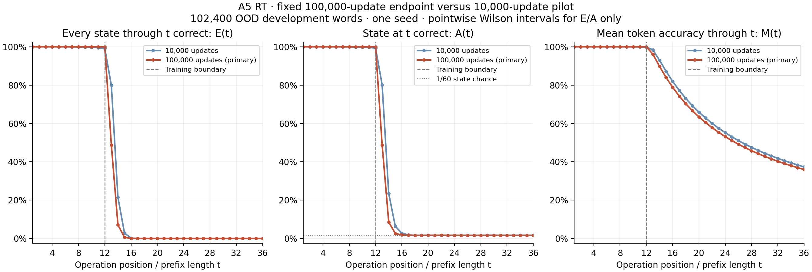
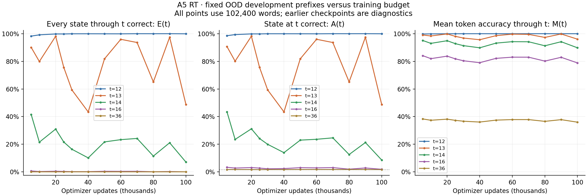
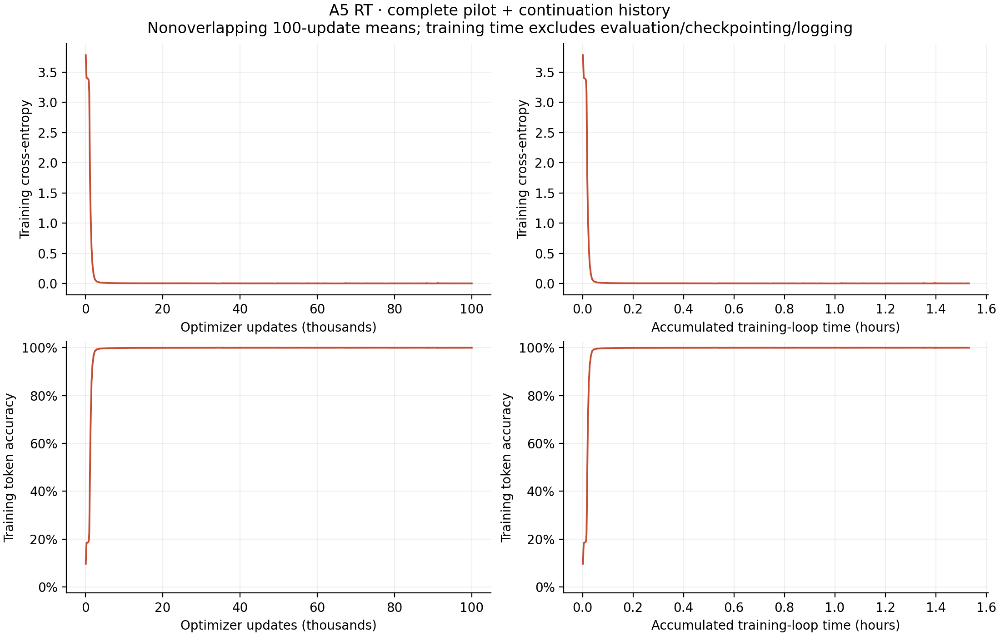

# A5 RT: completed 100,000-update budget

Two recurrent blocks, width 512, 6,357,504 parameters, seed 1234; full FP32, ALiBi and GELU. Autocast, TF32, compilation and CUDA graphs remain disabled.

The original 10,000-update RT checkpoint was resumed with its optimizer, RNG and data-order state. Source/data/model/runtime contracts and initialization lineage match, the parent checkpoint hash is verified, and the joined histories contain each update 1–100,000 exactly once.

**Fixed primary endpoint: 100,000 updates.** This is 102,400,000 training-word presentations over 800,000 unique words: **128 nominal passes**. The continuation added 90,000 updates. This is 25% of the 400,000-update reference budget. Earlier checkpoints are diagnostics and do not replace the primary endpoint.

| Checkpoint | Development set | CE | Mean token accuracy M | Whole-word exactness E | Final-state accuracy A |
| ---: | --- | ---: | ---: | ---: | ---: |
| 10,000 | dev, L12, 102,400 words | 0.00421229 | 99.8752% | 99.1846% | 99.3701% |
| 10,000 | ood_dev, L36, 102,400 words | 4.67008570 | 37.3588% | 0.0000% | 1.6963% |
| 100,000 | dev, L12, 102,400 words | 0.00100971 | 99.9826% | 99.9111% | 99.9258% |
| 100,000 | ood_dev, L36, 102,400 words | 15.17179794 | 35.9744% | 0.0000% | 1.6416% |

E(t) requires every prediction through t to be correct; A(t) checks only the state at t; M(t) averages token correctness through t. Only A has a flat 1/60 guessing reference. The OOD curves reuse the same frozen 102,400 length-36 development words and show their prefixes. They are not separate newly sampled sets for each length. Short development words are a distinct set.

| Updates | Last E ≥95% | Last E ≥50% | Last E ≥10% | Last E ≥1% | First zero-success length |
| ---: | ---: | ---: | ---: | ---: | ---: |
| 5,000 | 12 | 13 | 14 | 15 | 19 |
| 10,000 | 12 | 13 | 14 | 15 | 18 |
| 20,000 | 13 | 13 | 14 | 15 | 19 |
| 25,000 | 12 | 13 | 14 | 15 | 19 |
| 30,000 | 12 | 13 | 14 | 15 | 18 |
| 40,000 | 12 | 12 | 14 | 15 | 19 |
| 50,000 | 12 | 13 | 14 | 15 | 20 |
| 60,000 | 13 | 13 | 14 | 15 | 19 |
| 70,000 | 12 | 13 | 14 | 15 | 18 |
| 80,000 | 12 | 13 | 14 | 15 | 18 |
| 90,000 | 13 | 13 | 14 | 15 | 18 |
| 100,000 | 12 | 12 | 13 | 14 | 18 |

Thresholds use inclusive ≥ comparisons. First zero means an actual integer zero in this sample, not a percentage rounded to zero or proof of population impossibility. A threshold reaching position 36 is bounded by the evaluated range; positions beyond 36 remain untested.

| Final prefix t | All-correct words / 102,400 | E(t), % [95% interval] | State-correct words / 102,400 | A(t), % [95% interval] | M(t), % |
| ---: | ---: | ---: | ---: | ---: | ---: |
| 1 | 102,400 | 100.0000 [99.9962, 100.0000] | 102,400 | 100.0000 [99.9962, 100.0000] | 100.0000 |
| 2 | 102,400 | 100.0000 [99.9962, 100.0000] | 102,400 | 100.0000 [99.9962, 100.0000] | 100.0000 |
| 3 | 102,400 | 100.0000 [99.9962, 100.0000] | 102,400 | 100.0000 [99.9962, 100.0000] | 100.0000 |
| 4 | 102,400 | 100.0000 [99.9962, 100.0000] | 102,400 | 100.0000 [99.9962, 100.0000] | 100.0000 |
| 5 | 102,400 | 100.0000 [99.9962, 100.0000] | 102,400 | 100.0000 [99.9962, 100.0000] | 100.0000 |
| 6 | 102,399 | 99.9990 [99.9945, 99.9998] | 102,399 | 99.9990 [99.9945, 99.9998] | 99.9998 |
| 7 | 102,396 | 99.9961 [99.9900, 99.9985] | 102,396 | 99.9961 [99.9900, 99.9985] | 99.9993 |
| 8 | 102,393 | 99.9932 [99.9859, 99.9967] | 102,395 | 99.9951 [99.9886, 99.9979] | 99.9988 |
| 9 | 102,380 | 99.9805 [99.9698, 99.9874] | 102,383 | 99.9834 [99.9734, 99.9896] | 99.9971 |
| 10 | 102,363 | 99.9639 [99.9502, 99.9738] | 102,372 | 99.9727 [99.9605, 99.9811] | 99.9946 |
| 11 | 102,339 | 99.9404 [99.9235, 99.9536] | 102,354 | 99.9551 [99.9401, 99.9663] | 99.9910 |
| 12 | 102,318 | 99.9199 [99.9006, 99.9355] | 102,342 | 99.9434 [99.9268, 99.9562] | 99.9871 |
| 13 | 49,913 | 48.7432 [48.4371, 49.0494] | 49,932 | 48.7617 [48.4556, 49.0679] | 96.0466 |
| 14 | 7,248 | 7.0781 [6.9227, 7.2368] | 8,794 | 8.5879 [8.4178, 8.7611] | 89.7996 |
| 15 | 642 | 0.6270 [0.5804, 0.6772] | 2,685 | 2.6221 [2.5260, 2.7217] | 83.9878 |
| 16 | 43 | 0.0420 [0.0312, 0.0566] | 1,932 | 1.8867 [1.8052, 1.9719] | 78.8564 |
| 17 | 1 | 0.0010 [0.0002, 0.0055] | 1,778 | 1.7363 [1.6581, 1.8182] | 74.3200 |
| 18 | 0 | 0.0000 [0.0000, 0.0038] | 1,718 | 1.6777 [1.6009, 1.7582] | 70.2843 |
| 19 | 0 | 0.0000 [0.0000, 0.0038] | 1,670 | 1.6309 [1.5551, 1.7103] | 66.6709 |
| 20 | 0 | 0.0000 [0.0000, 0.0038] | 1,761 | 1.7197 [1.6419, 1.8012] | 63.4234 |
| 21 | 0 | 0.0000 [0.0000, 0.0038] | 1,731 | 1.6904 [1.6133, 1.7712] | 60.4837 |
| 22 | 0 | 0.0000 [0.0000, 0.0038] | 1,778 | 1.7363 [1.6581, 1.8182] | 57.8134 |
| 23 | 0 | 0.0000 [0.0000, 0.0038] | 1,728 | 1.6875 [1.6104, 1.7682] | 55.3731 |
| 24 | 0 | 0.0000 [0.0000, 0.0038] | 1,699 | 1.6592 [1.5827, 1.7392] | 53.1351 |
| 25 | 0 | 0.0000 [0.0000, 0.0038] | 1,704 | 1.6641 [1.5875, 1.7442] | 51.0762 |
| 26 | 0 | 0.0000 [0.0000, 0.0038] | 1,723 | 1.6826 [1.6056, 1.7632] | 49.1765 |
| 27 | 0 | 0.0000 [0.0000, 0.0038] | 1,633 | 1.5947 [1.5198, 1.6733] | 47.4142 |
| 28 | 0 | 0.0000 [0.0000, 0.0038] | 1,728 | 1.6875 [1.6104, 1.7682] | 45.7811 |
| 29 | 0 | 0.0000 [0.0000, 0.0038] | 1,686 | 1.6465 [1.5703, 1.7263] | 44.2592 |
| 30 | 0 | 0.0000 [0.0000, 0.0038] | 1,671 | 1.6318 [1.5560, 1.7113] | 42.8383 |
| 31 | 0 | 0.0000 [0.0000, 0.0038] | 1,713 | 1.6729 [1.5961, 1.7532] | 41.5104 |
| 32 | 0 | 0.0000 [0.0000, 0.0038] | 1,724 | 1.6836 [1.6066, 1.7642] | 40.2658 |
| 33 | 0 | 0.0000 [0.0000, 0.0038] | 1,671 | 1.6318 [1.5560, 1.7113] | 39.0951 |
| 34 | 0 | 0.0000 [0.0000, 0.0038] | 1,669 | 1.6299 [1.5541, 1.7093] | 37.9931 |
| 35 | 0 | 0.0000 [0.0000, 0.0038] | 1,709 | 1.6689 [1.5923, 1.7492] | 36.9553 |
| 36 | 0 | 0.0000 [0.0000, 0.0038] | 1,681 | 1.6416 [1.5656, 1.7213] | 35.9744 |

Intervals are pointwise Wilson 95% across words at one checkpoint; they do not describe seed variation or simultaneous coverage across positions/checkpoints. M has no interval assuming independent positions.

Measured training-loop time: 1.532 hours across both jobs (1.379 hours in the continuation). Summed job elapsed time: 1.573 hours; this includes evaluation, checkpointing and logging, and excludes the gap between the jobs.

[All checkpoint/length counts (CSV)](length-curves.csv) · [Checkpoint summary (CSV)](checkpoint-metrics.csv) · [Training bins (CSV)](training-curves.csv) · [Plot data and provenance](plot-data.json) · [Report](report.json)

This is one RT development seed at 100,000 updates, using our existing architecture and generated corpus. It does not establish an exact paper reproduction, final convergence or multi-seed reliability. No additional Transformer training is included; comparing this endpoint to SEQ-10k would have unequal budgets. Final confirmation remains unevaluated. This reporter performs no model inference or numerical analysis.
