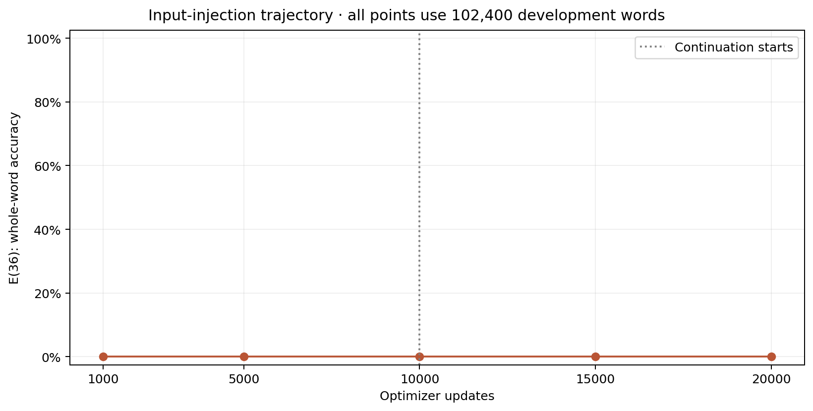
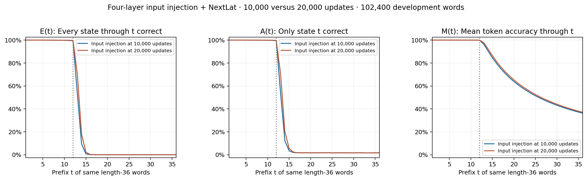
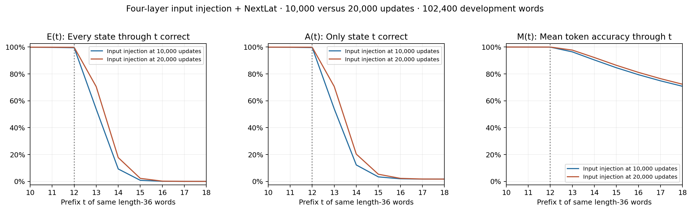
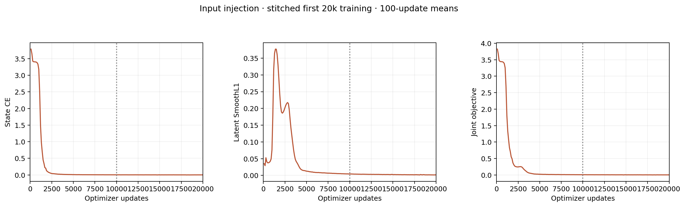

# Input injection: continuation from 10k to 20k

The same input-injection model's E(36) changes from **0.0000% at 10k** to **0.0000% at 20k** (+0.00 percentage points).

The user extended the budget during the original 10k run after inspecting development results. This supplement compares the model with itself after more training. The input-versus-value comparison remains a separate matched 10k report; this 20k endpoint has a different training budget.

| Updates | L12 whole word | E(13) | E(14) | E(36) | A(36) | M(36) |
| --- | ---: | ---: | ---: | ---: | ---: | ---: |
| 1,000 | 0.0000% | 0.0000% | 0.0000% | 0.0000% | 1.6162% | 9.6468% |
| 5,000 | 97.9834% | 34.8467% | 4.4004% | 0.0000% | 1.7266% | 35.4790% |
| 10,000 | 99.4492% | 53.7910% | 9.2256% | 0.0000% | 1.6572% | 36.2164% |
| 15,000 | 99.6025% | 68.3506% | 16.5156% | 0.0000% | 1.6738% | 36.8701% |
| 20,000 | 99.7627% | 70.4941% | 17.6855% | 0.0000% | 1.6904% | 36.9818% |

E(t) requires every state through t correct; A(t) checks only state t; M(t) averages correctness through t. All trajectory points use the same 102,400 development words. Full and boundary plots use identical saved length-36 rows.

The continuation resumes the exact 10k model/Adam/RNG checkpoint. Both 10k history segments and every minibatch-order hash through 20k are checked. Architecture, fixed 0.02 coefficient, learned projection, original NextLat objective and 62 training source files remain unchanged. The scalar coefficient is not learned.

Four RT layers: window of two tokens first, then three full layers; input injection enters the second block. Width 512, batch 1024, full FP32; no TF32, compilation or CUDA graphs. One seed, reused development data, and no uninjected four-layer control. No final confirmation, autonomous latent rollout or convergence claim.

[Learned projection and effective bypass strength](../input-bypass-strength/through-020000/README.md)
[Separate matched10k input/value comparison](../embedding-injection10k/report.md)

[Exact metrics](metrics.csv) · [Provenance and plot data](summary.json). Pointwise Wilson 95% intervals describe variation over words, not training-seed uncertainty.
