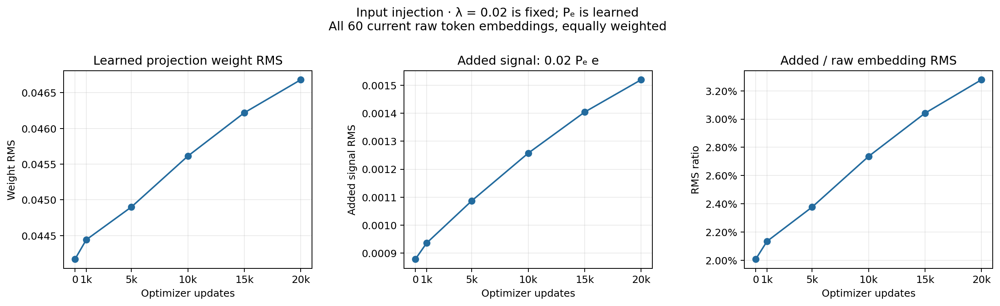

# Input bypass strength

**λ is fixed at 0.02; it is not a learned gate.** The learned object is the projection Pₑ.

These measurements use the projection and raw token-embedding weights from each saved checkpoint. Every one of the60 A5 tokens receives equal weight.

| Updates | Projection weight RMS | Raw embedding RMS | Added signal RMS | Added / raw RMS |
| ---: | ---: | ---: | ---: | ---: |
| 0 | 0.0441682 | 0.0437458 | 0.000878261 | 2.008% |
| 1,000 | 0.0444407 | 0.0438584 | 0.000936055 | 2.134% |
| 5,000 | 0.0449001 | 0.0457374 | 0.00108724 | 2.377% |
| 10,000 | 0.0456129 | 0.0459628 | 0.00125754 | 2.736% |
| 15,000 | 0.0462195 | 0.0461671 | 0.00140444 | 3.042% |
| 20,000 | 0.046682 | 0.0463611 | 0.00152003 | 3.279% |

Added signal = 0.02 × Pₑ e. RMS means the square root of the mean squared entries; the ratio divides added-signal RMS by raw-embedding RMS.

This ratio is **not the contribution relative to the contextual input of the second block**. It measures only the saved raw-embedding route. Both the projection and embedding table can change during training; the trend reflects both. No model forward pass or task evaluation was run.

[W&B run](https://wandb.ai/taylorbollman/rt-a5-state-tracking/runs/ei1upnr1) · [CSV](bypass-strength.csv) · [PDF](bypass-strength.pdf)

