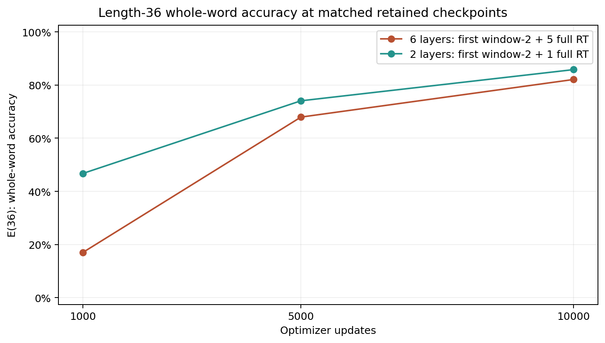
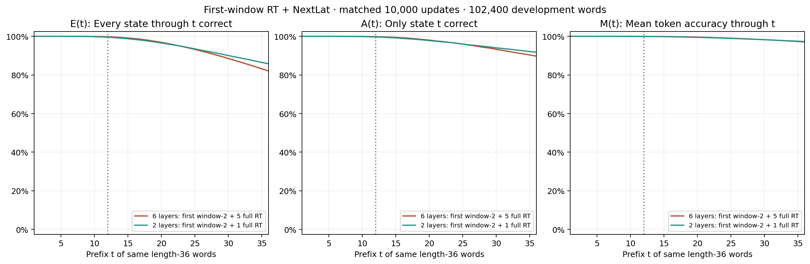
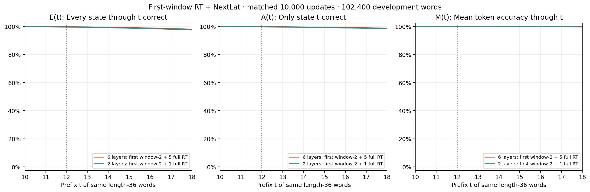
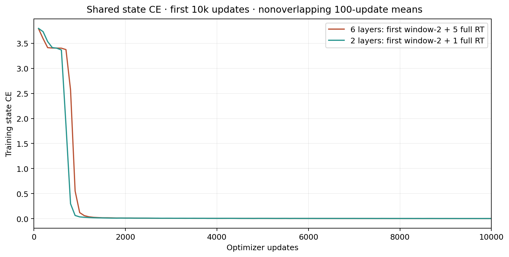

# First-window RT + NextLat: six versus two layers at 10k

At **10,000 updates**, length-36 whole-word accuracy E(36) is **82.0771%** for six layers and **85.7910%** for two layers (-3.71 percentage points).

| Model | L12 whole word | E(13) | E(14) | E(36) | A(36) | M(36) |
| --- | ---: | ---: | ---: | ---: | ---: | ---: |
| 6 layers: first window-2 + 5 full RT | 99.7861% | 99.6309% | 99.4102% | 82.0771% | 89.7324% | 97.0899% |
| 2 layers: first window-2 + 1 full RT | 99.4775% | 99.3105% | 99.0469% | 85.7910% | 91.7656% | 97.3167% |

E(t) requires every state through t correct; A(t) checks only state t; M(t) averages correctness through t. E/A/M curves use the same 102,400 length-36 development words. L12 whole-word accuracy uses separate short development words.

This is a development diagnostic of early learning at a matched update budget, using one seed. If deeper training loses early learning, that concerns optimization at this depth/budget; it does not prove state tracking impossible. Neither equal compute nor identical backbone initialization is claimed: added layers change Mitchell draws and scaling. The independently seeded NextLat predictor, joint objective, minibatch order, width 512/batch 1024, and FP32 runtime settings are preserved. Final confirmation and autonomous latent rollout remain unevaluated.

| Model | Backbone parameters | Total parameters |
| --- | ---: | ---: |
| 6 layers: first window-2 + 5 full RT | 18,948,608 | 19,998,208 |
| 2 layers: first window-2 + 1 full RT | 6,357,504 | 7,407,104 |

| Updates | Six-layer E(36) | Two-layer E(36) |
| --- | ---: | ---: |
| 1,000 | 17.0352% | 46.7471% |
| 5,000 | 67.9365% | 74.0674% |
| 10,000 | 82.0771% | 85.7910% |

The full and boundary plots are views of identical 10k rows. Only 1k/5k/10k checkpoints and the first 10k history from the longer reference run are compared. All 10k corresponding minibatch hashes match. The reporter verifies the frozen protocol, contracts, source snapshots, selected checkpoint hashes and integer metric counts; it loads no model or checkpoint tensors. Pointwise Wilson 95% E/A intervals describe sampling over words, not seed variability.

[Exact counts](metrics.csv) · [Plot data and provenance](summary.json) · [Run and artifact record](report.json)
