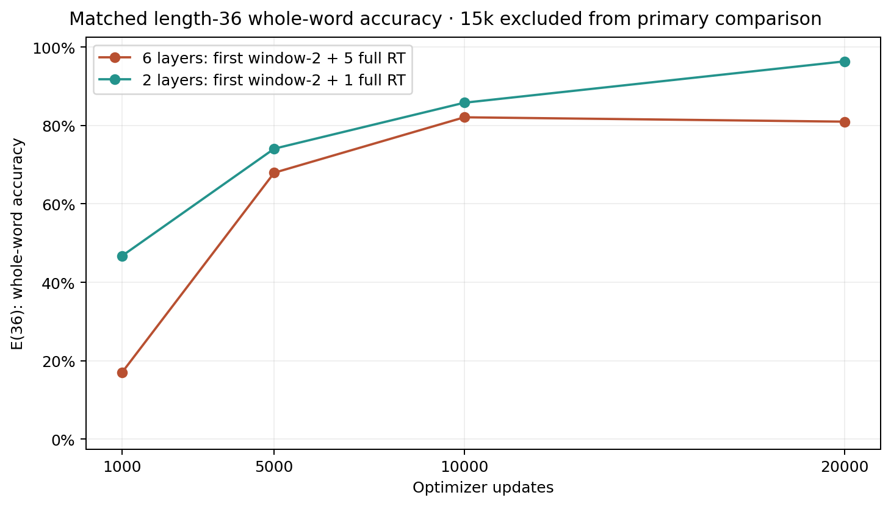
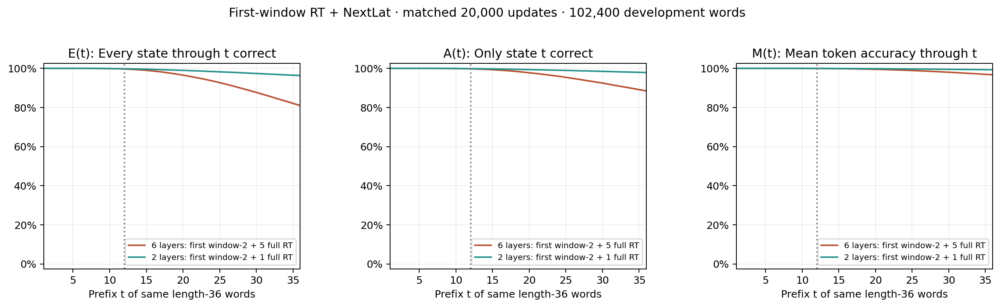
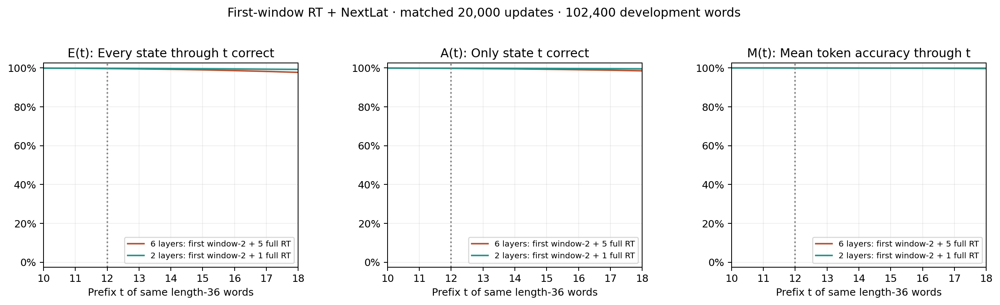
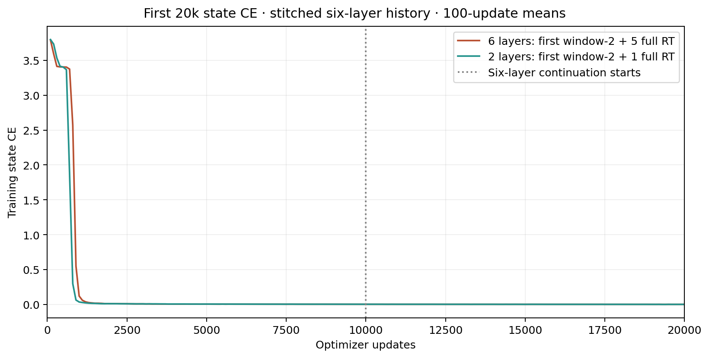

# First-window RT + NextLat: six-layer extension to 20k

At **20,000 updates**, E(36) is **80.9629%** for six layers and **96.3369%** for two layers (-15.37 percentage points).

The six-layer run resumes its exact 10k checkpoint. The 20k budget was selected around 8.7k after reviewing development results. The original 10k report remains separate; this extension is an adaptive follow-up, using one seed.

| Model | L12 whole word | E(13) | E(14) | E(36) | A(36) | M(36) |
| --- | ---: | ---: | ---: | ---: | ---: | ---: |
| 6 layers: first window-2 + 5 full RT | 99.7188% | 99.5078% | 99.2852% | 80.9629% | 88.4922% | 96.7088% |
| 2 layers: first window-2 + 1 full RT | 99.8066% | 99.7412% | 99.6641% | 96.3369% | 97.8750% | 99.2835% |

E(t) requires every state through t correct; A(t) checks only state t; M(t) averages correctness through t. Primary checkpoints use the same 102,400 length-36 development words. The saved six-layer 15k checkpoint is excluded from the primary comparison because the existing two-layer 15k evaluation used only 4,096 words.

The six-layer first 10k history and continuation updates 10,001–20,000 are stitched with every corresponding minibatch hash checked against the two-layer first 20k history. Architecture, source code, joint objective, precision and predictor seed are unchanged across the six-layer continuation. Saved-state resume checks are separate from this report, which deserializes no checkpoint tensors.

Depth changes Mitchell initialization draws/scaling and compute. Poor learning at 20k concerns learning/optimization at this depth and budget; it does not establish that tracking is impossible. Final confirmation and autonomous latent rollout remain unevaluated.

| Updates | Six-layer E(36) | Two-layer E(36) |
| --- | ---: | ---: |
| 1,000 | 17.0352% | 46.7471% |
| 5,000 | 67.9365% | 74.0674% |
| 10,000 | 82.0771% | 85.7910% |
| 20,000 | 80.9629% | 96.3369% |

Full and boundary views use identical 20k rows. Pointwise Wilson 95% E/A intervals describe variation over words, not seed uncertainty. Model widths 512, batch 1024, all FP32 and optimizer hyperparameters match; layer counts and compute differ.

[Exact metric counts](metrics.csv) · [Plot data and provenance](summary.json) · [Run/artifact record](report.json)
