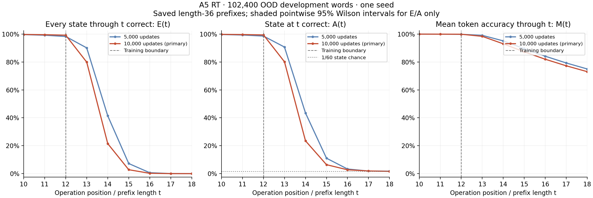

# A5 length follow-up: RT first, then Transformer confirmation

Completed 2026-09-11. This was an evaluation-only milestone: eight model
forwards in total, zero training updates, full FP32, no compile/CUDA graphs,
and unchanged models/checkpoints. RT was checked and published before the
three new Transformer forwards. The independent confirmation set remains
unevaluated.

**RT extrapolates one operation reasonably well, then declines sharply.**
The 10k endpoint gets every state correct through 13 on 79.87% of words,
through 14 on 21.52%, and through 15 on 2.81%. Its individual-state accuracy
also collapses beyond 12, so accumulated occasional mistakes do not fully
explain the decline. The 5k checkpoint extrapolates better than 10k despite
having slightly worse training-length performance.

All table entries below come from the historical evaluations on the same
102,400 frozen OOD development words, using their prefixes. The new explicit
truncation checks used the **first 1,024 words of that same set**. They verify
selected input lengths; they do not replace the larger sample estimates.

| Prefix length | RT whole-word exact at 5k | RT whole-word exact at 10k | RT final-state accuracy at 10k |
| ---: | ---: | ---: | ---: |
| 12 | 98.25% | 99.17% | 99.35% |
| 13 | 90.08% | 79.87% | 80.12% |
| 14 | 41.44% | 21.52% | 23.50% |
| 15 | 7.24% | 2.81% | 6.42% |
| 16 | 0.66% | 0.24% | 2.76% |
| 36 | 0% | 0% | 1.70% |

Both checkpoints' last prefix lengths at or above 95%, 50%, 10% and 1%
whole-word exactness are respectively 12, 13, 14 and 15. First observed zero
successes moves from length 19 at 5k to 18 at 10k. At length 36, RT's 10k
**mean token accuracy is 37.36%**, including strong early-prefix predictions;
its final state is near the 1/60 chance level. Two checkpoints at one seed
do not establish the cause or a persistent training trend.

[RT full report, counts and intervals](rt/report.md) ·
[RT W&B graphs](https://wandb.ai/taylorbollman/rt-a5-state-tracking/runs/oewgafq1)

**The ordinary Transformer fails earlier, within its training horizon.**
At 10k its isolated-state accuracy is 65.46%, 10.56%, 3.13% and 1.94% at
positions 5, 6, 7 and 8. Whole-word exactness reaches observed zero at 10
and stays zero through 36. At positions 12/13/14, state accuracy is
1.69%/1.68%/1.63%, whereas mean token accuracy remains
39.73%/36.80%/34.29% because earlier tokens contribute to that average.
The first observed zero moves from 8 at 5k to 10 at 10k, so it did improve
over that interval. Zero whole-word accuracy would not have been a sound
training stopping rule.

The new SEQ checks ran only T14, T12 and T13. No new longer-length SEQ sweep
or training extension was performed. The full saved curve remains available
without additional forwards. Cumulative exactness cannot recover after an
earlier mistake on the same predictions; this does not force isolated-state
or mean token accuracy to zero. These findings do not isolate an ALiBi effect.

[Transformer full report, counts and intervals](seq/report.md) ·
[Transformer W&B graphs](https://wandb.ai/taylorbollman/rt-a5-state-tracking/runs/eayae4ny)

## Truncation checks and the retained precision qualification

The strict logit screen used the existing A5 tolerances, atol 2e-6 and
rtol 2e-5. It failed at RT lengths 12/13/14 (16 matched exactly) and at
SEQ 12/13. Those original failed records are retained unchanged. Separate
CPU-only assessments replayed the saved outputs and evaluated whether the
differences affected the requested accuracy measurements. No numerical
tolerance was changed and no additional model forwards were performed.

| Check | RT | Transformer |
| --- | ---: | ---: |
| Reference input length | 36 | 14 |
| Truncated lengths | 12, 13, 14, 16 | 12, 13 |
| Compared token positions | 56,320 | 25,600 |
| Changed predicted classes | 0 | 1 |
| Changed correct/incorrect indicators | 0 | 0 |
| Largest absolute logit difference | 9.54e-5 | 9.01e-5 |
| Largest probability difference | 8.76e-6 | 1.17e-5 |
| Largest absolute mean-CE difference | 2.53e-8 | 1.43e-8 |

RT's predicted classes and all accuracy counts match exactly. Every checked
RT winning margin exceeds twice its per-position maximum logit difference.
SEQ's single changed prediction was at row 355, position 13: classes 13 and
32 were both wrong (target 27), with a reference winning margin about
2.15e-7. Its complete per-word/per-position correctness mask is unchanged,
which guarantees unchanged E/A/M; equal aggregate counts alone would not
establish this. Both models' parameter hashes are unchanged and no gradients
were created.

The changes are consistent with FP32 roundoff depending on input shape;
their kernel-level cause was not traced. The supported conclusion is
**agreement of the requested accuracy metrics on the checked subset**,
with an explicit strict-logit-screen qualification. This is not a claim of
exact logits, all-input prediction equivalence, or new backward/BF16 validation.

Original records and scoped assessments:
[RT screen](../../../../.runtime/rt-a5/20260911T165258Z-length/rt-prefix/report.json),
[RT assessment](../../../../.runtime/rt-a5/20260911T165258Z-length/rt-assessment/report.json),
[SEQ screen](../../../../.runtime/rt-a5/20260911T165258Z-length/seq-prefix/report.json),
[SEQ assessment](../../../../.runtime/rt-a5/20260911T165258Z-length/seq-assessment/report.json).

## Scope, validation and retention

The four prefix-check tests and 27 reporter tests passed across the focused
test runs; affected assessment guards were rerun after their changes. The
reporter rejects incompatible counts, source/checkpoint identities, missing
length checks and unsupported acceptance based only on aggregate equality.
The initial reporter test fixture needed a correction to make its artificial
cumulative counts mathematically possible; production count validation was
correct. Independent read-only reviews checked the saved RT curves,
provenance, qualifications and new assessment logic.

The dataset has 800,000 training words after its million-word pool is split.
10k updates at B1024 are 10.24M word presentations, or 12.8 nominal passes;
the reference 400k recipe is 512 nominal passes. Keep the fixed 10k endpoint
as the primary comparison. The diagnostic 5k result does not silently replace
it, and this milestone does not establish convergence or seed robustness.

Local evidence: `.runtime/rt-a5/20260911T165258Z-length/`.
Retained artifacts: `gs://fast-chunks/cdrm-w-latent/rt-a5/20260911T165258Z-length/`.
The storage receipt records the verified archive generation and checksum.
Historical data and checkpoints remain under the original
`20260911T154748Z` GCS lineage.

See [usage and handoff](../../../rt-a5-length-followup-usage.md) and
[the approved plan](../../../rt-a5-length-followup-plan.md). No new training
job remains running. Any longer RT run is a subsequent decision; the observed
5k-to-10k tradeoff argues for monitoring the length curves, rather than
assuming that a larger update count will extend the reliable horizon.
