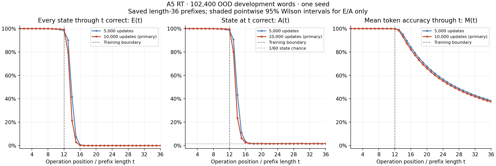

# A5 RT: length-generalization boundary

Two blocks, width 512, 6,357,504 parameters; full FP32, ALiBi, seed 1234. The primary endpoint remains 10,000 updates.

The curves below reuse the same first 102,400 frozen OOD development words at 5,000 and 10,000 updates. They are prefixes of historical length-36 model outputs, not newly inferred independent datasets at every length.

**E(t)** requires every state through t to be correct. **A(t)** requires only the state at t. **M(t)** averages token correctness through t. At the end of a word, E is whole-word exactness, A is final-state accuracy and M is mean token accuracy. Only A has a flat 1/60 state-guessing reference.

| Updates | Last E ≥95% | Last E ≥50% | Last E ≥10% | Last E ≥1% | First zero-success length |
| ---: | ---: | ---: | ---: | ---: | ---: |
| 5,000 | 12 | 13 | 14 | 15 | 19 |
| 10,000 | 12 | 13 | 14 | 15 | 18 |

Thresholds are inclusive and are measured on this finite sample. Observed zeros come from actual zero integer success counts, not rounded percentages; they do not establish zero population success. Intervals below are pointwise Wilson 95% intervals across sampled words at a fixed checkpoint; they do not measure variation across training seeds. No mean-token interval assumes independent positions.

The new forward-only truncation check uses **1,024 words**, distinct from the **102,400-word historical curves** above. All checked shapes produced identical predicted states and E/A/M counts, with unchanged weights and no gradients or optimizer updates. [Original prefix-check snapshot](inputs/prefix-check.json).

**Qualification:** the original elementwise FP32 logit screen failed and remains recorded as failed. The separate saved-output assessment supports using the exactly matching accuracy metrics for this bounded length check; it does not retroactively make that strict screen pass.

This post-run assessment accepts only the observed E/A/M length metrics: every prediction and integer accuracy count agrees, and each observed logit perturbation is smaller than half the winning margin. Original strict logit-screen failures remain failures. Probability/loss changes are descriptive; no numerical tolerance was changed. No claim about all inputs, backward gradients or mixed precision.

[Separate assessment snapshot](inputs/prefix-assessment.json)

## 5,000 updates: all lengths

| t | All-correct words / 102,400 | E(t), % [95% interval] | State-correct words / 102,400 | A(t), % [95% interval] | M(t), % |
| ---: | ---: | ---: | ---: | ---: | ---: |
| 1 | 102,400 | 100.0000 [99.9962, 100.0000] | 102,400 | 100.0000 [99.9962, 100.0000] | 100.0000 |
| 2 | 102,400 | 100.0000 [99.9962, 100.0000] | 102,400 | 100.0000 [99.9962, 100.0000] | 100.0000 |
| 3 | 102,400 | 100.0000 [99.9962, 100.0000] | 102,400 | 100.0000 [99.9962, 100.0000] | 100.0000 |
| 4 | 102,400 | 100.0000 [99.9962, 100.0000] | 102,400 | 100.0000 [99.9962, 100.0000] | 100.0000 |
| 5 | 102,400 | 100.0000 [99.9962, 100.0000] | 102,400 | 100.0000 [99.9962, 100.0000] | 100.0000 |
| 6 | 102,395 | 99.9951 [99.9886, 99.9979] | 102,395 | 99.9951 [99.9886, 99.9979] | 99.9992 |
| 7 | 102,376 | 99.9766 [99.9651, 99.9842] | 102,378 | 99.9785 [99.9675, 99.9858] | 99.9962 |
| 8 | 102,331 | 99.9326 [99.9147, 99.9467] | 102,341 | 99.9424 [99.9257, 99.9553] | 99.9895 |
| 9 | 102,216 | 99.8203 [99.7924, 99.8445] | 102,255 | 99.8584 [99.8334, 99.8796] | 99.9749 |
| 10 | 101,999 | 99.6084 [99.5682, 99.6448] | 102,072 | 99.6797 [99.6432, 99.7125] | 99.9454 |
| 11 | 101,533 | 99.1533 [99.0953, 99.2076] | 101,685 | 99.3018 [99.2489, 99.3509] | 99.8869 |
| 12 | 100,609 | 98.2510 [98.1689, 98.3295] | 100,915 | 98.5498 [98.4747, 98.6212] | 99.7755 |
| 13 | 92,240 | 90.0781 [89.8935, 90.2597] | 92,855 | 90.6787 [90.4991, 90.8553] | 99.0757 |
| 14 | 42,437 | 41.4424 [41.1410, 41.7444] | 44,497 | 43.4541 [43.1507, 43.7580] | 95.1027 |
| 15 | 7,409 | 7.2354 [7.0783, 7.3956] | 11,318 | 11.0527 [10.8622, 11.2462] | 89.4994 |
| 16 | 678 | 0.6621 [0.6143, 0.7137] | 3,387 | 3.3076 [3.1998, 3.4189] | 84.1124 |
| 17 | 44 | 0.0430 [0.0320, 0.0577] | 1,906 | 1.8613 [1.7803, 1.9459] | 79.2741 |
| 18 | 2 | 0.0020 [0.0005, 0.0071] | 1,800 | 1.7578 [1.6791, 1.8401] | 74.9677 |
| 19 | 0 | 0.0000 [0.0000, 0.0038] | 1,702 | 1.6621 [1.5856, 1.7422] | 71.1095 |
| 20 | 0 | 0.0000 [0.0000, 0.0038] | 1,718 | 1.6777 [1.6009, 1.7582] | 67.6379 |
| 21 | 0 | 0.0000 [0.0000, 0.0038] | 1,686 | 1.6465 [1.5703, 1.7263] | 64.4954 |
| 22 | 0 | 0.0000 [0.0000, 0.0038] | 1,660 | 1.6211 [1.5455, 1.7003] | 61.6375 |
| 23 | 0 | 0.0000 [0.0000, 0.0038] | 1,690 | 1.6504 [1.5742, 1.7303] | 59.0294 |
| 24 | 0 | 0.0000 [0.0000, 0.0038] | 1,631 | 1.5928 [1.5179, 1.6713] | 56.6362 |
| 25 | 0 | 0.0000 [0.0000, 0.0038] | 1,780 | 1.7383 [1.6600, 1.8202] | 54.4403 |
| 26 | 0 | 0.0000 [0.0000, 0.0038] | 1,725 | 1.6846 [1.6075, 1.7652] | 52.4112 |
| 27 | 0 | 0.0000 [0.0000, 0.0038] | 1,744 | 1.7031 [1.6257, 1.7842] | 50.5331 |
| 28 | 0 | 0.0000 [0.0000, 0.0038] | 1,734 | 1.6934 [1.6161, 1.7742] | 48.7889 |
| 29 | 0 | 0.0000 [0.0000, 0.0038] | 1,722 | 1.6816 [1.6047, 1.7622] | 47.1645 |
| 30 | 0 | 0.0000 [0.0000, 0.0038] | 1,749 | 1.7080 [1.6304, 1.7892] | 45.6493 |
| 31 | 0 | 0.0000 [0.0000, 0.0038] | 1,670 | 1.6309 [1.5551, 1.7103] | 44.2293 |
| 32 | 0 | 0.0000 [0.0000, 0.0038] | 1,645 | 1.6064 [1.5312, 1.6853] | 42.8973 |
| 33 | 0 | 0.0000 [0.0000, 0.0038] | 1,724 | 1.6836 [1.6066, 1.7642] | 41.6484 |
| 34 | 0 | 0.0000 [0.0000, 0.0038] | 1,722 | 1.6816 [1.6047, 1.7622] | 40.4729 |
| 35 | 0 | 0.0000 [0.0000, 0.0038] | 1,663 | 1.6240 [1.5484, 1.7033] | 39.3630 |
| 36 | 0 | 0.0000 [0.0000, 0.0038] | 1,722 | 1.6816 [1.6047, 1.7622] | 38.3163 |

## 10,000 updates: all lengths

| t | All-correct words / 102,400 | E(t), % [95% interval] | State-correct words / 102,400 | A(t), % [95% interval] | M(t), % |
| ---: | ---: | ---: | ---: | ---: | ---: |
| 1 | 102,400 | 100.0000 [99.9962, 100.0000] | 102,400 | 100.0000 [99.9962, 100.0000] | 100.0000 |
| 2 | 102,400 | 100.0000 [99.9962, 100.0000] | 102,400 | 100.0000 [99.9962, 100.0000] | 100.0000 |
| 3 | 102,400 | 100.0000 [99.9962, 100.0000] | 102,400 | 100.0000 [99.9962, 100.0000] | 100.0000 |
| 4 | 102,397 | 99.9971 [99.9914, 99.9990] | 102,397 | 99.9971 [99.9914, 99.9990] | 99.9993 |
| 5 | 102,390 | 99.9902 [99.9820, 99.9947] | 102,391 | 99.9912 [99.9833, 99.9954] | 99.9977 |
| 6 | 102,373 | 99.9736 [99.9616, 99.9819] | 102,379 | 99.9795 [99.9686, 99.9866] | 99.9946 |
| 7 | 102,336 | 99.9375 [99.9202, 99.9510] | 102,346 | 99.9473 [99.9312, 99.9596] | 99.9879 |
| 8 | 102,289 | 99.8916 [99.8695, 99.9100] | 102,318 | 99.9199 [99.9006, 99.9355] | 99.9794 |
| 9 | 102,209 | 99.8135 [99.7851, 99.8381] | 102,253 | 99.8564 [99.8313, 99.8778] | 99.9657 |
| 10 | 102,100 | 99.7070 [99.6720, 99.7383] | 102,171 | 99.7764 [99.7455, 99.8035] | 99.9468 |
| 11 | 101,916 | 99.5273 [99.4834, 99.5675] | 102,029 | 99.6377 [99.5990, 99.6727] | 99.9187 |
| 12 | 101,551 | 99.1709 [99.1135, 99.2246] | 101,739 | 99.3545 [99.3036, 99.4017] | 99.8717 |
| 13 | 81,790 | 79.8730 [79.6264, 80.1175] | 82,047 | 80.1240 [79.8785, 80.3673] | 98.3526 |
| 14 | 22,032 | 21.5156 [21.2650, 21.7684] | 24,065 | 23.5010 [23.2423, 23.7617] | 93.0061 |
| 15 | 2,878 | 2.8105 [2.7111, 2.9136] | 6,572 | 6.4180 [6.2695, 6.5697] | 87.2335 |
| 16 | 250 | 0.2441 [0.2157, 0.2763] | 2,823 | 2.7568 [2.6583, 2.8589] | 81.9537 |
| 17 | 19 | 0.0186 [0.0119, 0.0290] | 1,968 | 1.9219 [1.8396, 2.0078] | 77.2460 |
| 18 | 0 | 0.0000 [0.0000, 0.0038] | 1,653 | 1.6143 [1.5389, 1.6933] | 73.0442 |
| 19 | 0 | 0.0000 [0.0000, 0.0038] | 1,736 | 1.6953 [1.6180, 1.7762] | 69.2890 |
| 20 | 0 | 0.0000 [0.0000, 0.0038] | 1,743 | 1.7021 [1.6247, 1.7832] | 65.9097 |
| 21 | 0 | 0.0000 [0.0000, 0.0038] | 1,662 | 1.6230 [1.5474, 1.7023] | 62.8484 |
| 22 | 0 | 0.0000 [0.0000, 0.0038] | 1,673 | 1.6338 [1.5579, 1.7133] | 60.0659 |
| 23 | 0 | 0.0000 [0.0000, 0.0038] | 1,711 | 1.6709 [1.5942, 1.7512] | 57.5270 |
| 24 | 0 | 0.0000 [0.0000, 0.0038] | 1,713 | 1.6729 [1.5961, 1.7532] | 55.1997 |
| 25 | 0 | 0.0000 [0.0000, 0.0038] | 1,697 | 1.6572 [1.5808, 1.7373] | 53.0580 |
| 26 | 0 | 0.0000 [0.0000, 0.0038] | 1,675 | 1.6357 [1.5598, 1.7153] | 51.0803 |
| 27 | 0 | 0.0000 [0.0000, 0.0038] | 1,685 | 1.6455 [1.5694, 1.7253] | 49.2493 |
| 28 | 0 | 0.0000 [0.0000, 0.0038] | 1,694 | 1.6543 [1.5780, 1.7343] | 47.5495 |
| 29 | 0 | 0.0000 [0.0000, 0.0038] | 1,769 | 1.7275 [1.6495, 1.8092] | 45.9695 |
| 30 | 0 | 0.0000 [0.0000, 0.0038] | 1,786 | 1.7441 [1.6658, 1.8262] | 44.4953 |
| 31 | 0 | 0.0000 [0.0000, 0.0038] | 1,703 | 1.6631 [1.5866, 1.7432] | 43.1136 |
| 32 | 0 | 0.0000 [0.0000, 0.0038] | 1,666 | 1.6270 [1.5513, 1.7063] | 41.8171 |
| 33 | 0 | 0.0000 [0.0000, 0.0038] | 1,741 | 1.7002 [1.6228, 1.7812] | 40.6015 |
| 34 | 0 | 0.0000 [0.0000, 0.0038] | 1,736 | 1.6953 [1.6180, 1.7762] | 39.4572 |
| 35 | 0 | 0.0000 [0.0000, 0.0038] | 1,718 | 1.6777 [1.6009, 1.7582] | 38.3778 |
| 36 | 0 | 0.0000 [0.0000, 0.0038] | 1,737 | 1.6963 [1.6190, 1.7772] | 37.3588 |

[CSV with exact counts and denominators](length-curves.csv) · [Plot data and provenance](plot-data.json) · [Machine-readable report](report.json)

The 10,000-update endpoint is only 2.5% of the reference 400,000-update budget. This single-seed development result is not a convergence or architecture-impossibility claim. The 5,000-update curve is a diagnostic comparison, not a newly selected endpoint. Final confirmation remains unevaluated. No training or gradient analysis was performed for this report.
