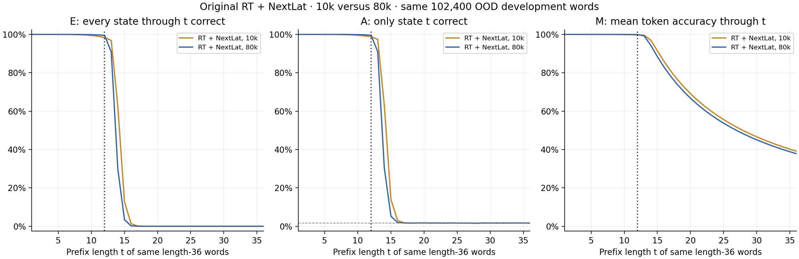
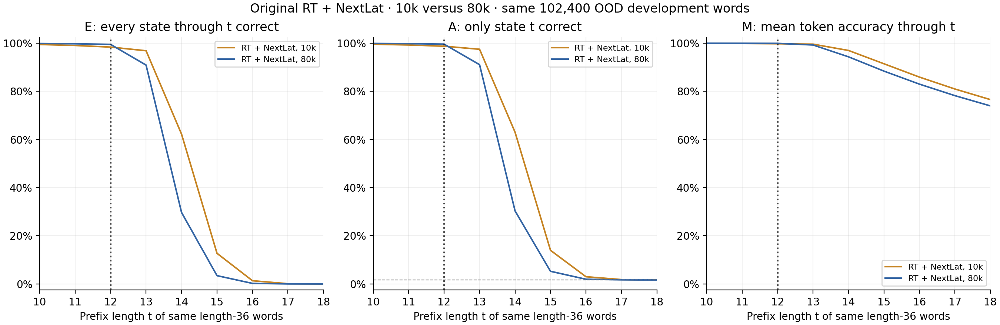
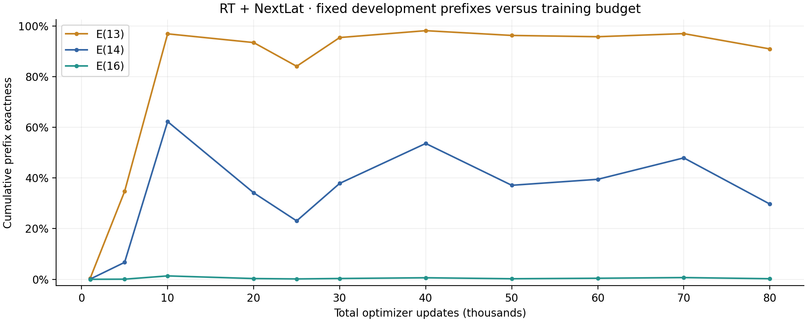
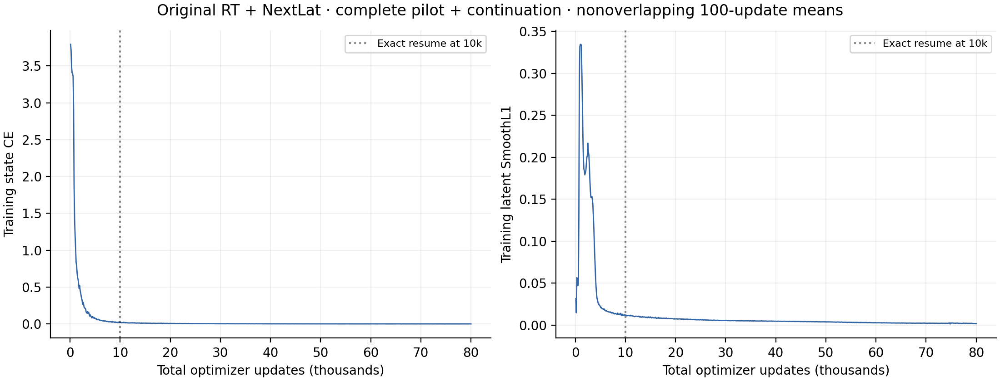

# Original RT + NextLat: user-selected 80k checkpoint

The user stopped this continuation at the retained **80,000-update checkpoint after reviewing development curves**. The original prospective endpoint was 100k; 80k is a retrospective user-selected endpoint, not a prospectively fixed budget. The original protocol, raw stopped-job report and all history remain unchanged.

This is the original Mitchell + ALiBi model: two full-prefix tiled RT blocks, rho1, D512/H8/GELU-FFN2048, LayerNorm and full-width QK normalization. Backbone 6,357,504 parameters; NextLat predictor 1,049,600; total 7,407,104. Full FP32/math attention; autocast, TF32, compilation and CUDA graphs disabled. State CE plus weight-one latent SmoothL1 is unchanged, with only the target latent detached. All accuracy evaluation uses the backbone; no latent predictor rollout.

The original 10k checkpoint was resumed exactly with model, Adam, RNG and absolute data-order state. Accepted training is 70,000 additional updates, **81,920,000 total word presentations** over 800,000 unique length-12 words, or 102.4 nominal passes. No new training or model evaluation is performed by this reporter.

| Model | Updates | L12 token | L12 whole word | E(13) | E(14) | E(16) | M(36) | E(36) |
| --- | ---: | ---: | ---: | ---: | ---: | ---: | ---: | ---: |
| RT + NextLat | 10,000 | 99.7533% | 98.3047% | 96.8652% | 62.2373% | 1.3350% | 39.1194% | 0.0000% |
| RT + NextLat | 80,000 | 99.9404% | 99.5449% | 90.9102% | 29.6934% | 0.2236% | 37.8208% | 0.0000% |
| Pure RT, without NextLat (reference) | 10,000 | 99.8752% | 99.1846% | 79.8730% | 21.5156% | 0.2441% | 37.3588% | 0.0000% |
| Pure RT, without NextLat (reference) | 80,000 | 99.9961% | 99.9814% | 65.1172% | 11.4365% | 0.0996% | 36.5590% | 0.0000% |

Pure RT references are already-existing **10k and 80k** checkpoints without the NextLat objective or predictor. They have matched update budgets, shared backbone initialization and identical minibatch order. The historical pure RT job continued to 100k, but its 100k endpoint is not substituted for 80k here. These references were neither retrained nor re-evaluated.

E(t) requires every state through t to be correct. A(t) checks only state t, and M(t) averages correctness through t. OOD results use prefixes of the same 102,400 frozen length-36 development words. Full and boundary figures use exactly the same rows. L12 development uses a separate short-word set. The 1/60 guessing line applies only to isolated A(t).

| RT + NextLat checkpoint | E(13) | E(14) | E(16) | M(36) | OOD CE |
| ---: | ---: | ---: | ---: | ---: | ---: |
| 1,000 | 0.4014% | 0.0762% | 0.0000% | 21.7690% | 3.284441 |
| 5,000 | 34.6738% | 6.6807% | 0.0449% | 33.8608% | 3.791806 |
| 10,000 | 96.8652% | 62.2373% | 1.3350% | 39.1194% | 3.347455 |
| 20,000 | 93.4199% | 34.1436% | 0.2930% | 38.0110% | 3.159689 |
| 25,000 | 84.0596% | 23.0469% | 0.1426% | 37.3977% | 3.378511 |
| 30,000 | 95.3984% | 37.8486% | 0.3135% | 38.1674% | 3.335508 |
| 40,000 | 98.1133% | 53.6035% | 0.6016% | 38.7960% | 3.389479 |
| 50,000 | 96.2314% | 37.0967% | 0.2139% | 38.1858% | 3.559806 |
| 60,000 | 95.7266% | 39.4512% | 0.4092% | 38.2782% | 3.974128 |
| 70,000 | 96.9521% | 47.9141% | 0.6777% | 38.6395% | 6.000862 |
| 80,000 | 90.9102% | 29.6934% | 0.2236% | 37.8208% | 6.984486 |

The trainer received the requested SIGINT after update 81,607. Its **1,607 complete uncheckpointed updates after 80k**, plus any interrupted in-flight step, are excluded from accepted model results. The 6 later routine evaluation records and 6 later auxiliary diagnostic records remain preserved in raw evidence but are excluded from the comparison.

The raw trainer records `failed`/`KeyboardInterrupt` and W&B records `synced_failed_experiment` because of the deliberate user interruption. This reporter requires the explicit endpoint-revision receipt binding protocol, raw report, raw history, accepted checkpoint and termination hashes. It does not reinterpret arbitrary failures as completed experiments. The raw report's completed-update counter includes the unsaved tail; its saved order hash and training-loop time still refer to 80k.

Accepted training-loop time: 1.206h total, including 1.051h in this continuation. Excluded tail: 86.766s. Raw continuation training-loop time: 1.075h; raw job elapsed time: 1.105h including evaluation/checkpoint/logging/interruption overhead.

All reported checkpoint evaluations use 102,400 words per development role. Intermediate checkpoints are diagnostic. Bands are pointwise Wilson 95% across words for E/A, not seed variability, simultaneous coverage or paired differences. Zero E means zero successes in this sample. This is one development seed with an endpoint chosen after inspecting development outcomes; it does not establish convergence or a confirmed generalization gain. Final confirmation and autonomous latent rollout remain **unevaluated**.

[Exact metric counts](metrics.csv) · [Checkpoint summary](checkpoint-summary.csv) · [Accepted training bins](training-curves.csv) · [Plot data](plot-data.json) · [Provenance](report.json)
