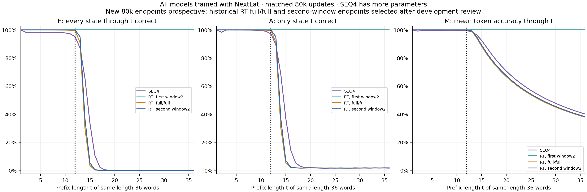
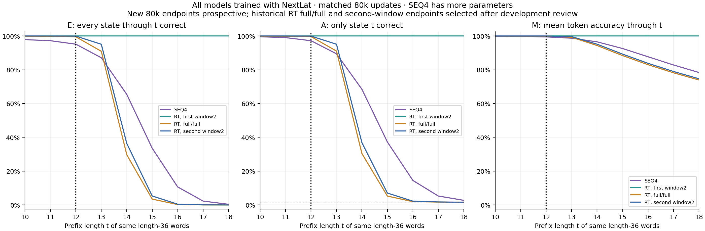
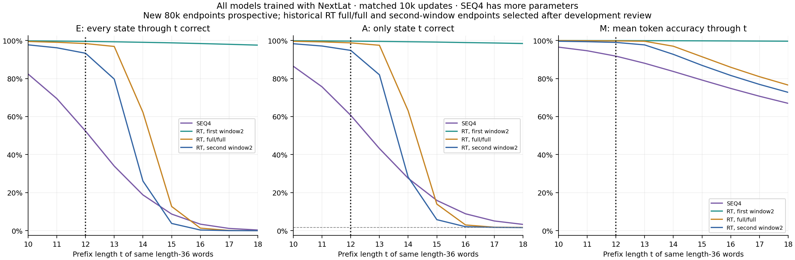
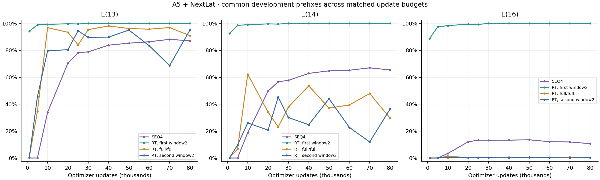
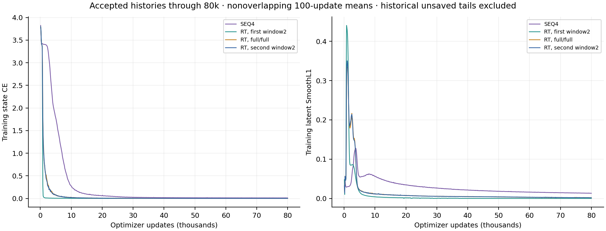

# A5 + NextLat: four-layer Transformer and recurrent window location

The two new models completed prospectively fixed **80,000-update** runs: SEQ4 with ALiBi + NextLat, followed by two RT layers with window 2 in the first layer and full attention in the second. Historical RT full/full and full/second-window references are their retained 80k checkpoints, selected by the user after development review. Both historical unsaved tails are excluded.

All models use D512/H8/GELU-FFN2048, LayerNorm/full-width QK norm, original Mitchell initialization, ALiBi, full FP32, the same A5 data/order, batch 1024, AdamW recipe, and unchanged state CE plus weight-one next-latent SmoothL1 objective. Only target latents are detached. Inference uses the backbone, without autonomous predictor rollout.

| Model | Blocks | Parameters, including predictor | Learned tensors | Backbone initialization |
| --- | ---: | ---: | ---: | --- |
| SEQ4 + NextLat |4 ordinary |13,702,656 |39 | Fresh canonical four-layer Mitchell draw |
| Each RT + NextLat variant |2 recurrent |7,407,104 |25 | Exact original RT2 learned tensors at matching layer indices |

This is a same-width, same-update-budget comparison, **not a parameter- or FLOP-matched comparison**. SEQ4 has a different depth, parameter count, compute requirement and canonical backbone initialization. Its common seed does not make its tensors identical to RT2. The RT window variants preserve the original learned initialization; window location changes direct attention reads, with gradients still attached through recurrent states. All arms retain the same predictor initialization.

| Model | Updates | L12 whole word | E(13) | E(14) | E(16) | M(36) | E(36) |
| --- | ---: | ---: | ---: | ---: | ---: | ---: | ---: |
| SEQ4 + NextLat | 10,000 | 52.7129% | 33.9512% | 18.7900% | 3.4199% | 34.3478% | 0.0000% |
| RT: first layer window 2 + NextLat | 10,000 | 99.4775% | 99.3105% | 99.0469% | 98.3867% | 97.3167% | 85.7910% |
| RT: both layers full + NextLat | 10,000 | 98.3047% | 96.8652% | 62.2373% | 1.3350% | 39.1194% | 0.0000% |
| RT: second layer window 2 + NextLat | 10,000 | 93.0303% | 79.6963% | 26.0879% | 0.3457% | 37.1962% | 0.0000% |
| SEQ4 + NextLat | 80,000 | 95.1816% | 87.1016% | 65.4463% | 10.6631% | 40.0371% | 0.0000% |
| RT: first layer window 2 + NextLat | 80,000 | 100.0000% | 100.0000% | 100.0000% | 100.0000% | 100.0000% | 100.0000% |
| RT: both layers full + NextLat | 80,000 | 99.5449% | 90.9102% | 29.6934% | 0.2236% | 37.8208% | 0.0000% |
| RT: second layer window 2 + NextLat | 80,000 | 99.9189% | 95.0840% | 36.3848% | 0.4375% | 38.1807% | 0.0000% |

The historical full/full job logged 81,607 updates, of which 1,607 were an unsaved tail beyond its accepted checkpoint. The second-window job logged 85,376, excluding its 5,376-update tail. Their original protocols planned 100k; neither historical arm has a completed 100k outcome. These later stopping choices are retrospective, while both new 80k endpoints were fixed before training.

E(t) requires all states through t correct; A(t) checks only state t; M(t) averages token correctness through t. Every reported checkpoint uses 102,400 words per development role. OOD curves are prefixes of the same frozen length-36 outputs, not separate samples for each length. L12 development is a separate set. The 80k full-range and boundary figures use identical rows; the additional 10k boundary figure is explicitly labeled with its own checkpoint.

The accepted histories contain updates 1–80,000 exactly once per arm, with matching minibatch-order hashes. Source 55 and the historical 52/46-source subsets, executed arguments, model/objective/runtime contracts, initializations and all checkpoint hashes are verified. Both explicit historical stop revisions remain bound to raw logs, accepted checkpoints and excluded tails. This reporter performs no training or model inference.

These are one-seed development results. New endpoints were fixed prospectively, while historical endpoints and the choice of these experiments followed development inspection. Pointwise Wilson 95% bands quantify sampling over words for E/A, not seed variability, simultaneous coverage or paired differences. Zero E means zero successes in this sample. Final confirmation and autonomous latent rollout remain **unevaluated**.

Each accepted 80k run represents 81,920,000 word presentations over 800,000 unique training words (102.4 nominal passes). Shared update count does not equate model FLOPs or wall time. Intermediate checkpoints are diagnostics, not selected substitutes for the new 80k endpoints.

[Exact metric counts](metrics.csv) · [All checkpoint summaries](checkpoint-summary.csv) · [Plot data](plot-data.json) · [Provenance](report.json)
