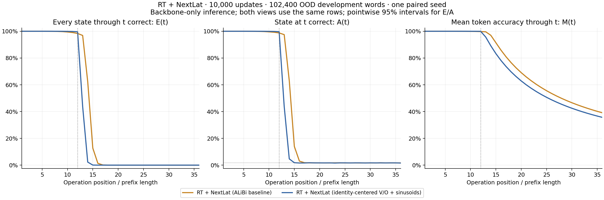
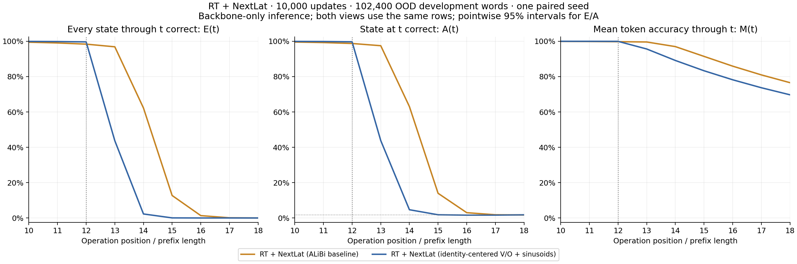
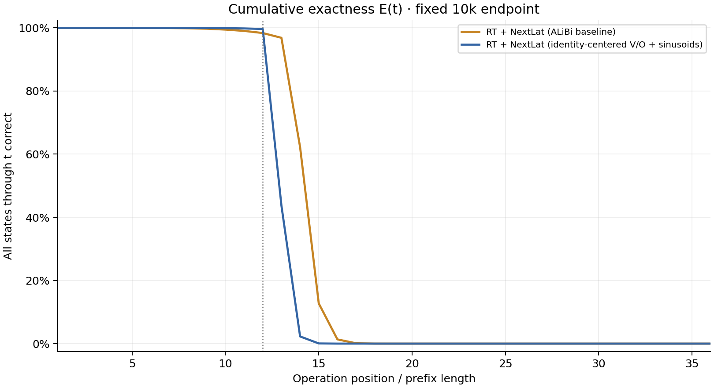
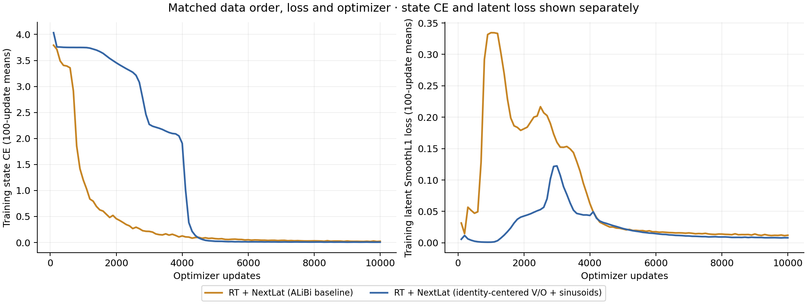

# A5: RT + NextLat combined initialization/position pilot

This is a fixed 10,000-update, single-seed development comparison. The new model changes both W_V/W_O initialization and positional encoding. Individual effects are not isolated.

Both recurrent blocks use identity-centered V/O matrices with independent entry variance 1/512. Fixed unit-amplitude sinusoidal positions replace ALiBi; raw token embeddings remain unscaled. This does not guarantee a near-identity recurrent state update. The NextLat predictor, objective, optimizer, data, seed and minibatch order match the original pilot. All accuracy uses the backbone alone; confirmation and autonomous predictor rollout remain unevaluated.

| Checkpoint | Model | L12 dev token accuracy | L12 dev whole word | OOD E(13) | OOD E(14) | OOD E(16) | OOD M(36) |
| --- | --- | ---: | ---: | ---: | ---: | ---: | ---: |
| 1,000 (diagnostic) | RT + NextLat (ALiBi baseline) | 61.3525% | 1.6416% | 0.4014% | 0.0762% | 0.0000% | 21.7690% |
| 1,000 (diagnostic) | RT + NextLat (identity-centered V/O + sinusoids) | 10.0667% | 0.0000% | 0.0000% | 0.0000% | 0.0000% | 4.4679% |
| 5,000 (diagnostic) | RT + NextLat (ALiBi baseline) | 94.1174% | 68.2754% | 34.6738% | 6.6807% | 0.0449% | 33.8608% |
| 5,000 (diagnostic) | RT + NextLat (identity-centered V/O + sinusoids) | 98.7048% | 91.5195% | 40.4004% | 2.0605% | 0.0020% | 35.2175% |
| 10,000 (primary) | RT + NextLat (ALiBi baseline) | 99.7533% | 98.3047% | 96.8652% | 62.2373% | 1.3350% | 39.1194% |
| 10,000 (primary) | RT + NextLat (identity-centered V/O + sinusoids) | 99.9541% | 99.6436% | 43.7207% | 2.2676% | 0.0000% | 35.6854% |

Each saved-checkpoint evaluation uses the same first 102,400 frozen words per development role. The 1k and 5k checkpoints are diagnostic; 10k remains the primary endpoint.

E(t) requires every state through t to be correct; A(t) measures only state t; M(t) averages token accuracy through t. Length curves are prefixes of the same length-36 outputs. Full and boundary plots use exactly the same rows and differ only in horizontal display limits.

Bands show pointwise Wilson 95% intervals over words for E/A. They do not describe training-seed uncertainty or paired-difference confidence; M has no interval based on independent token positions. Zero observed exactness is not proof of zero population success.

The report verifies complete histories, each minibatch order hash, retained checkpoint hashes, source snapshots, matching shared contracts, initialization provenance, and evaluation tallies. No model inference or additional training is performed by this reporter.

[Metrics CSV](metrics.csv) · [Plot data](plot-data.json) · [Machine-readable summary](summary.json) · [Reporting provenance](report.json)
