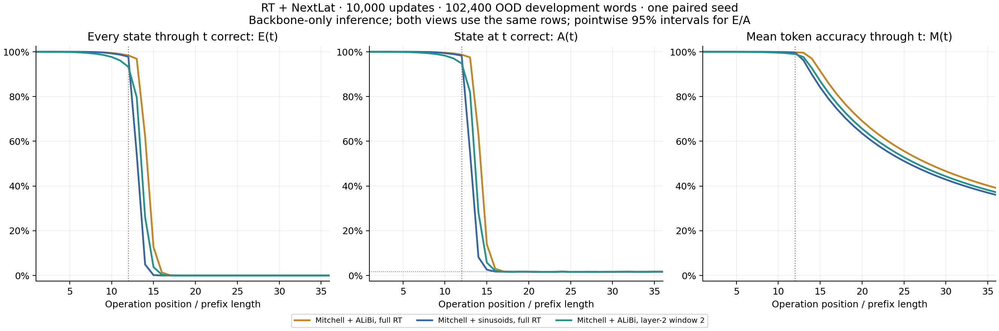
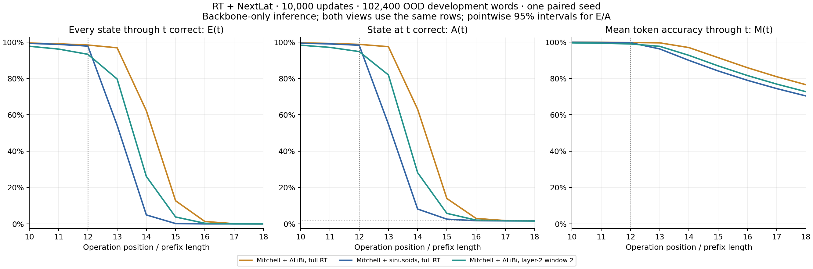
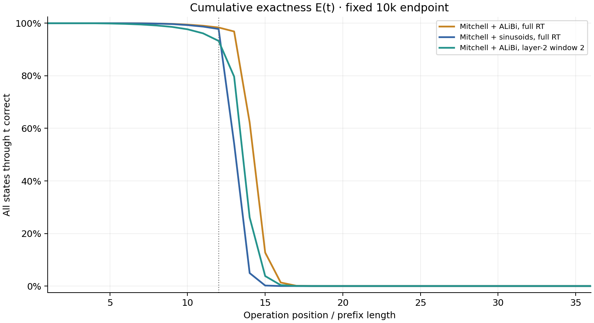
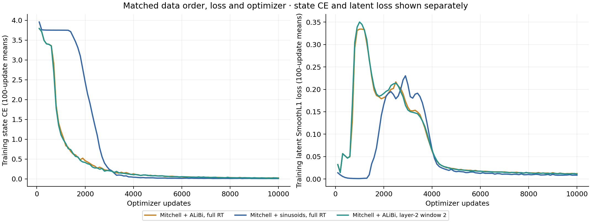

# A5: Mitchell positions and second-layer attention window pilots

All three models use the original Mitchell initialization and the original NextLat predictor initialization. Each was trained for 10,000 updates with matched data order, objective, optimizer and FP32 runtime.

The first new pilot changes only ALiBi to fixed sinusoids. The frozen development criterion selected **alibi** using mean cumulative-prefix exactness over positions 13–36 at update 10k. Exact ties select ALiBi. This is a provisional one-seed development choice, not a confirmed population ranking.

The second pilot compares against **Mitchell + ALiBi, full RT** and restricts only RT layer 2 to its temporary self K/V and the preceding token's permanent output K/V. Layer 1 retains full causal recurrent attention. The recurrent graph remains attached across all earlier positions; window length 2 does not mean two-token memory. Both new pilots start fresh. Backbone-only inference, latent objective and predictor are unchanged.

| Position candidate | Mean E(13–36), 10k | Selected |
| --- | ---: | --- |
| alibi | 7.2195% | yes |
| sinusoidal | 2.4739% | no |

| Checkpoint | Model | L12 dev token accuracy | L12 dev whole word | OOD E(13) | OOD E(14) | OOD E(16) | OOD M(36) |
| --- | --- | ---: | ---: | ---: | ---: | ---: | ---: |
| 1,000 (diagnostic) | Mitchell + ALiBi, full RT | 61.3525% | 1.6416% | 0.4014% | 0.0762% | 0.0000% | 21.7690% |
| 1,000 (diagnostic) | Mitchell + sinusoids, full RT | 10.0259% | 0.0000% | 0.0000% | 0.0000% | 0.0000% | 4.4520% |
| 1,000 (diagnostic) | Mitchell + ALiBi, layer-2 window 2 | 63.9745% | 2.7783% | 0.6074% | 0.0723% | 0.0029% | 22.6391% |
| 5,000 (diagnostic) | Mitchell + ALiBi, full RT | 94.1174% | 68.2754% | 34.6738% | 6.6807% | 0.0449% | 33.8608% |
| 5,000 (diagnostic) | Mitchell + sinusoids, full RT | 99.8126% | 98.5928% | 39.8682% | 1.7480% | 0.0000% | 35.5201% |
| 5,000 (diagnostic) | Mitchell + ALiBi, layer-2 window 2 | 96.3980% | 80.8564% | 45.5107% | 9.5830% | 0.0850% | 34.9513% |
| 10,000 (primary) | Mitchell + ALiBi, full RT | 99.7533% | 98.3047% | 96.8652% | 62.2373% | 1.3350% | 39.1194% |
| 10,000 (primary) | Mitchell + sinusoids, full RT | 99.6887% | 97.8350% | 54.2559% | 4.9277% | 0.0029% | 36.0196% |
| 10,000 (primary) | Mitchell + ALiBi, layer-2 window 2 | 98.9552% | 93.0303% | 79.6963% | 26.0879% | 0.3457% | 37.1962% |

Each checkpoint evaluation uses the same first 102,400 frozen words per development role. The 1k and 5k checkpoints are diagnostic; 10k remains the primary endpoint. Final confirmation and autonomous predictor rollout remain unevaluated.

E(t) requires every state through t to be correct; A(t) measures only state t; M(t) averages token accuracy through t. Length curves are prefixes of the same length-36 outputs. Full and boundary plots use exactly the same rows and differ only in horizontal display limits.

Bands show pointwise Wilson 95% intervals over words for E/A. They do not describe training-seed uncertainty or paired-difference confidence; M has no interval based on independent token positions. Zero observed exactness is not proof of zero population success.

The report verifies complete histories, every minibatch order hash, retained checkpoint hashes, frozen source snapshots, shared contracts, initialization provenance, evaluation tallies and the recorded position selection. It performs no model inference or additional training.

[Metrics CSV](metrics.csv) · [Plot data](plot-data.json) · [Machine-readable summary](summary.json) · [Reporting provenance](report.json)
