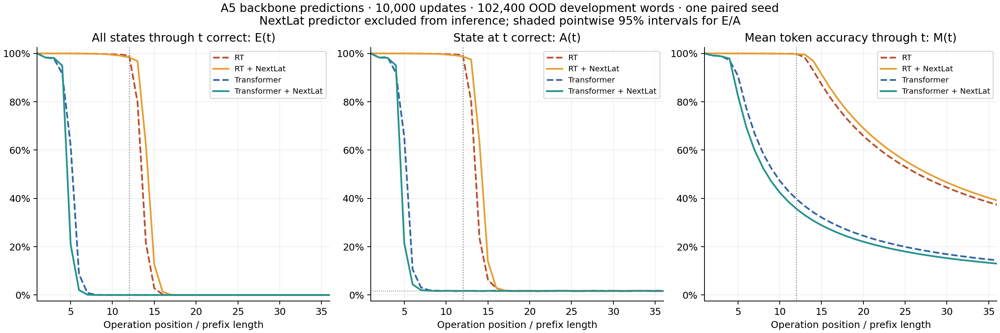
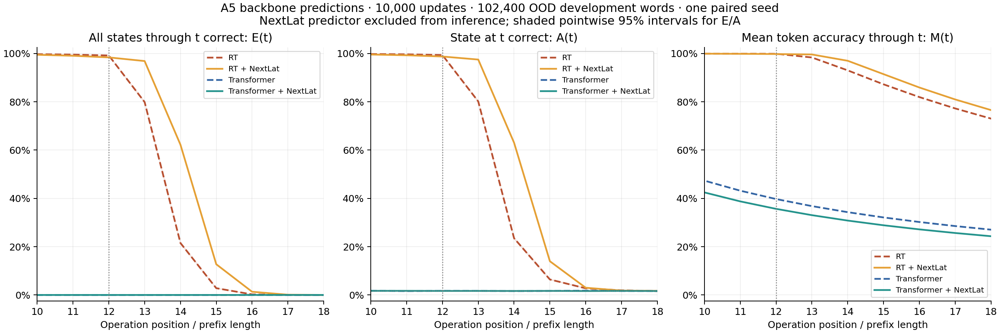
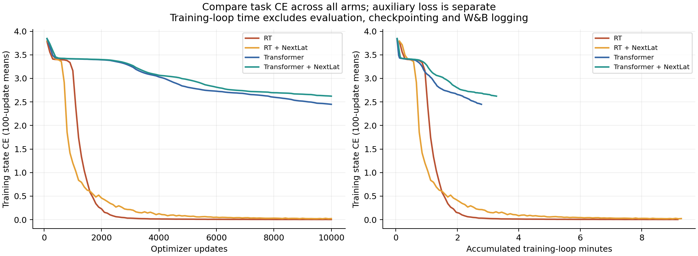
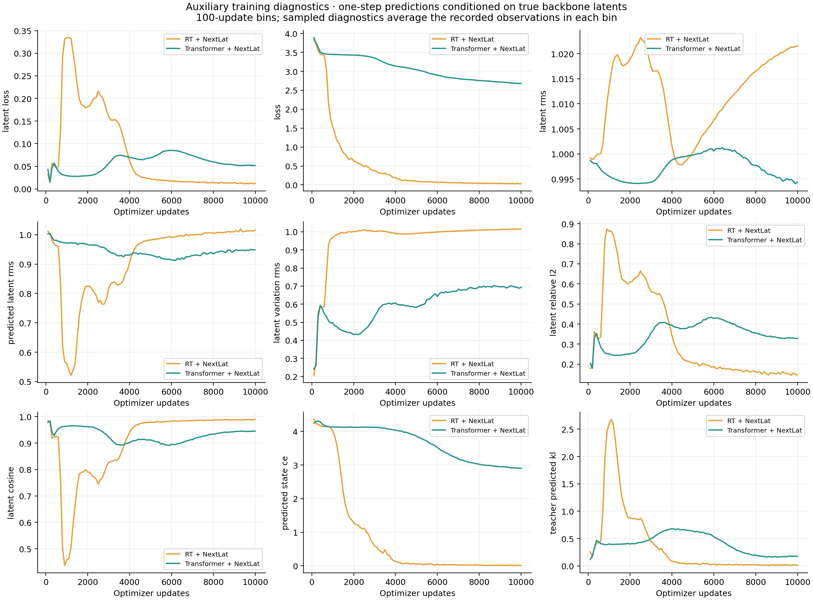

# A5: NextLat training with recurrent and ordinary Transformers

**All accuracy results use the backbone alone.** Each new model was trained jointly with a one-step NextLat predictor; that predictor is excluded from inference. No latent-RNN rollout was run.

Four matched 10,000-update runs: two blocks, D512/H8/GELU-FFN2048, full FP32 eager execution and ALiBi. Corresponding backbone initialization and every training minibatch are identical. Both RT blocks are recurrent at rho=1. Each backbone has 6,357,504 parameters; NextLat adds 1,049,600 training parameters, for 7,407,104 total. The new predictor initialization is also paired.

The objective is ordinary same-position state CE plus weight-one SmoothL1 over 11 latent transitions per length-12 word. Targets alone are detached; the source latent and next-operation embedding receive gradients. Auxiliary KL and predicted-state CE have zero training weight. The predictor follows the released A5 width-512 implementation; the paper's Table 5 lists width 1,024. Runtime remains our baseline FP32/eager policy rather than the release's BF16/compile settings.

| Development set | Model | State CE | Mean token accuracy | Whole-word exactness | Final-state accuracy |
| --- | --- | ---: | ---: | ---: | ---: |
| dev, L12 | RT | 0.004212 | 99.8752% | 99.1846% | 99.3701% |
| dev, L12 | RT + NextLat | 0.007647 | 99.7533% | 98.3047% | 98.7119% |
| dev, L12 | Transformer | 2.460976 | 39.7189% | 0.0000% | 1.6865% |
| dev, L12 | Transformer + NextLat | 2.637248 | 35.6447% | 0.0000% | 1.6650% |
| ood_dev, L36 | RT | 4.670086 | 37.3588% | 0.0000% | 1.6963% |
| ood_dev, L36 | RT + NextLat | 3.347455 | 39.1194% | 0.0000% | 1.6426% |
| ood_dev, L36 | Transformer | 3.551059 | 14.3542% | 0.0000% | 1.6660% |
| ood_dev, L36 | Transformer + NextLat | 3.610420 | 12.9946% | 0.0000% | 1.6504% |

Each endpoint evaluation uses the same first 102,400 frozen words for its development role.

**E(t)** means every state through t is correct; **A(t)** means only the state at t is correct; **M(t)** means mean token accuracy through t. The following values come from length-36 outputs. They are not new independent evaluations at every shorter length.

| Model | E(12) | E(13) | E(14) | E(16) | E(36) | A(36) | M(36) |
| --- | ---: | ---: | ---: | ---: | ---: | ---: | ---: |
| RT | 99.1709% | 79.8730% | 21.5156% | 0.2441% | 0.0000% | 1.6963% | 37.3588% |
| RT + NextLat | 98.3770% | 96.8652% | 62.2373% | 1.3350% | 0.0000% | 1.6426% | 39.1194% |
| Transformer | 0.0000% | 0.0000% | 0.0000% | 0.0000% | 0.0000% | 1.6660% | 14.3542% |
| Transformer + NextLat | 0.0000% | 0.0000% | 0.0000% | 0.0000% | 0.0000% | 1.6504% | 12.9946% |

| Comparison at 10k | Δ E(12) | Δ E(13) | Δ E(14) | Δ E(16) | Δ M(36) |
| --- | ---: | ---: | ---: | ---: | ---: |
| RT + NextLat minus RT | -0.7939 pp | +16.9922 pp | +40.7217 pp | +1.0908 pp | +1.7606 pp |
| Transformer + NextLat minus Transformer | +0.0000 pp | +0.0000 pp | +0.0000 pp | +0.0000 pp | -1.3597 pp |
| RT + NextLat minus Transformer + NextLat | +98.3770 pp | +96.8652 pp | +62.2373 pp | +1.3350 pp | +26.1248 pp |

The shaded bands are pointwise Wilson 95% intervals over words for E and A. They are not training-seed uncertainty or confidence intervals for paired differences. Observed zero exactness does not establish zero population success. M has no interval that assumes independent positions.

Task CE is plotted separately from the combined training objective. Auxiliary metrics are one-step training diagnostics, not another model-evaluation route. Increasing or decreasing latent regression loss alone does not establish improvement or failure; the actual backbone task results are primary.

| Model | Training-loop minutes | Complete run minutes |
| --- | ---: | ---: |
| RT | 9.18 | 9.53 |
| RT + NextLat | 9.29 | 9.77 |
| Transformer | 2.78 | 2.95 |
| Transformer + NextLat | 3.27 | 3.47 |

Training-loop time includes per-update diagnostics but excludes evaluation, checkpointing and W&B logging. Complete run time includes those costs. These are measured elapsed times, not hardware-normalized benchmarks.

The CSV includes 1k, 5k and 10k checkpoints. At 1k, historical RT/Transformer evaluations used 4,096 words and the new models used 102,400 from the same frozen pools; that comparison has different sample sizes. At 5k and 10k all four arms use the same 102,400 words. Every row carries its own denominator. The endpoint was fixed at 10k; intermediate checkpoints are diagnostics, not selected replacements.

This is one paired development seed and 2.5% of the paper's 400,000-update reference budget. It does not establish convergence, multi-seed reliability, paper replication or a general RT×NextLat interaction. The prior pure-RT 100k continuation is a different training budget and is not included as an equal-budget arm. Final confirmation remains unevaluated.

Verification checks complete histories, checkpoint hashes, actual source snapshots, dataset-manifest identity, shared historical execution sources, model/runtime contracts, backbone/predictor initialization and every minibatch order hash. It also recovers integer correctness counts and checks all curve/scalar identities.

[Metrics CSV](metrics.csv) · [Plot data](plot-data.json) · [Machine-readable report](report.json)
