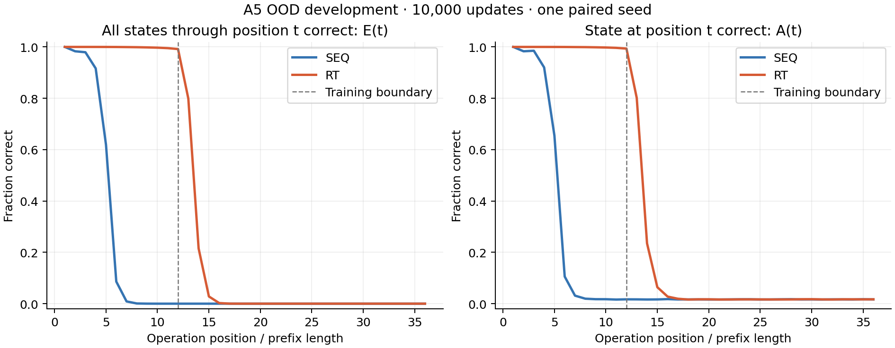
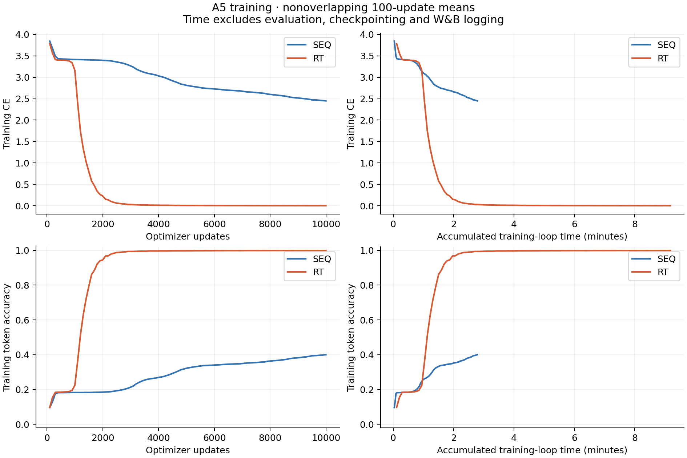

# A5 paired development pilot

Two blocks, width 512, 6,357,504 parameters per arm; 10,000 updates, batch 1,024, seed 1234.

Both arms use full FP32, causal ALiBi, GELU and the same canonical initialization and data order. Both RT blocks are recurrent.

| Development set | Model | Rows | CE | Token accuracy | Whole-word exact match | Final-state accuracy |
| --- | --- | ---: | ---: | ---: | ---: | ---: |
| dev (L12) | SEQ | 102,400 | 2.46097555 | 0.39718913 | 0.00000000 | 0.01686523 |
| dev (L12) | RT | 102,400 | 0.00421229 | 0.99875244 | 0.99184570 | 0.99370117 |
| ood_dev (L36) | SEQ | 102,400 | 3.55105877 | 0.14354248 | 0.00000000 | 0.01666016 |
| ood_dev (L36) | RT | 102,400 | 4.67008570 | 0.37358832 | 0.00000000 | 0.01696289 |

Accuracy columns are fractions. E(t) measures correctness of **every** state through t; A(t) measures only the state at t. The training boundary is marked on the length curve.

Training curves show nonoverlapping means of up to 100 updates. Their time axis sums training-loop durations only, excluding evaluation, checkpointing and W&B logging. It is not total wall-clock cost.

This is one paired development seed at a fixed update budget. It provides no multi-seed uncertainty estimate and does not establish convergence or performance at the 400,000-update reference budget. Final confirmation remains unevaluated.

[Plot data and input SHA256 records](plot-data.json) · [Machine-readable report](report.json)
