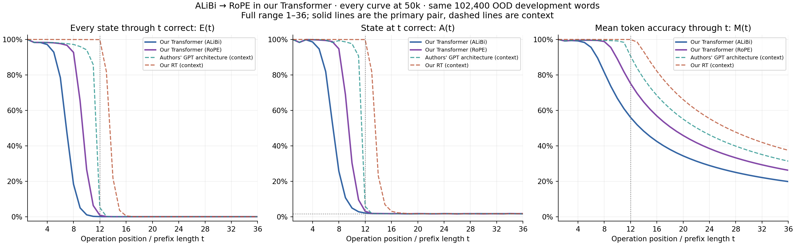
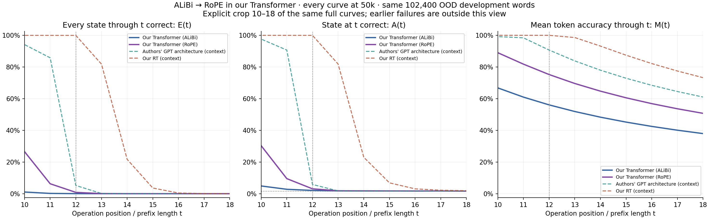
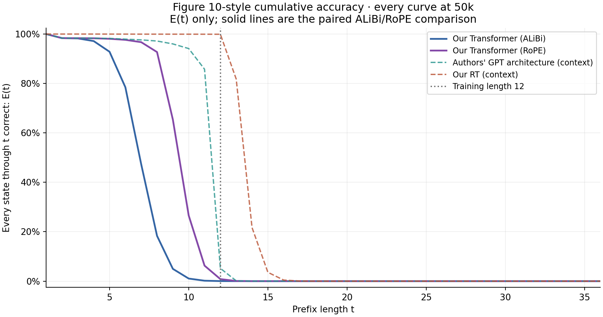
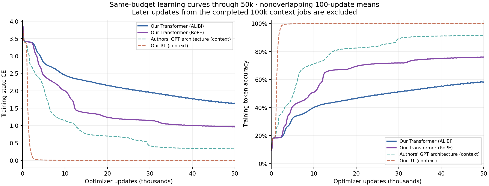

# A5: ALiBi versus RoPE at 50,000 updates

**Primary comparison: our SEQ Transformer versus the same Transformer with ALiBi replaced by RoPE, both at 50,000 updates.** The recorded canonical initialization, parameter count, data order, optimizer, and runtime match. Every other model configuration field is identical.

The primary pair retains two D512/H8/GELU-FFN2048 blocks with LayerNorm and learned QK normalization (6,357,504 parameters). The authors' GPT architecture and our RT are context at the same 50k budget. The GPT architecture changes multiple components and has its own initialization; it is not part of the isolated positional-encoding comparison.

Each arm has 51.2 million word presentations, 614.4 million training-token presentations, and 64 nominal passes over 800,000 training words. This is 12.5% of the paper's 400k update budget. The earlier 10k/25k checkpoints are diagnostics. Although the source SEQ, GPT-reference and RT jobs completed 100k, this report selects their retained 50k checkpoints and uses no later metrics or training updates.

| Backbone at 50k | Comparison role | Set | State CE | Mean token accuracy M | Whole-word exactness E | Final-state accuracy A |
| --- | --- | --- | ---: | ---: | ---: | ---: |
| Our Transformer (ALiBi) | primary | dev, L12 | 1.7352534 | 56.0525% | 0.0352% | 2.0703% |
| Our Transformer (ALiBi) | primary | ood_dev, L36 | 3.3091615 | 19.8027% | 0.0000% | 1.6035% |
| Our Transformer (RoPE) | primary | dev, L12 | 0.9924603 | 75.2426% | 0.8223% | 3.1514% |
| Our Transformer (RoPE) | primary | ood_dev, L36 | 3.0661625 | 26.1905% | 0.0000% | 1.7354% |
| Authors' GPT architecture (context) | context | dev, L12 | 0.3563208 | 90.6925% | 5.2578% | 5.9414% |
| Authors' GPT architecture (context) | context | ood_dev, L36 | 9.1645303 | 31.3328% | 0.0000% | 1.6543% |
| Our RT (context) | context | dev, L12 | 0.0014987 | 99.9793% | 99.9287% | 99.9502% |
| Our RT (context) | context | ood_dev, L36 | 11.9852708 | 37.4539% | 0.0000% | 1.7100% |

All checkpoint evaluations use the same first 102,400 frozen words for each development role. E(t) requires every state through t to be correct; A(t) checks only position t; M(t) averages correctness through t. Short development words and long-word prefixes are different samples. Length curves use prefixes of saved length-36 outputs, not separate model evaluations at each length.

The zoom uses exactly the full plot's data and panels; failures before position 10 are outside the crop. M(t) can remain high because earlier states were correct even when A(t) is near chance and E(t) is zero. Only A has a flat 1/60 state-guessing line. Solid lines are the primary pair; dashed lines provide context.

The Figure 10-style plot shows E(t), following the cumulative-correctness convention supported by the released A5 evaluator. These are our results at 50k, not digitized paper measurements or a claimed reproduction of its 400k run.

| OOD prefix t, at 50k | SEQ E(t) | SEQ+RoPE E(t) | Δ E, percentage points | Δ A, percentage points | Δ M, percentage points |
| ---: | ---: | ---: | ---: | ---: | ---: |
| 2 | 98.3477% | 98.3477% | +0.0000 | +0.0000 | +0.0000 |
| 5 | 92.8379% | 98.0850% | +5.2471 | +5.0303 | +1.2822 |
| 6 | 78.4668% | 97.6562% | +19.1895 | +17.5498 | +3.9935 |
| 8 | 18.3242% | 92.7100% | +74.3857 | +69.0625 | +17.3158 |
| 10 | 1.0449% | 26.5605% | +25.5156 | +25.4395 | +22.2152 |
| 12 | 0.0283% | 0.8252% | +0.7969 | +1.0166 | +19.1582 |
| 13 | 0.0029% | 0.0625% | +0.0596 | +0.0762 | +17.6904 |
| 14 | 0.0000% | 0.0039% | +0.0039 | +0.0410 | +16.4297 |
| 16 | 0.0000% | 0.0000% | +0.0000 | -0.0625 | +14.3734 |
| 18 | 0.0000% | 0.0000% | +0.0000 | +0.0225 | +12.7776 |
| 36 | 0.0000% | 0.0000% | +0.0000 | +0.1318 | +6.3878 |

Differences are RoPE minus ALiBi at the same update. They are descriptive; saved marginal counts do not provide paired-difference confidence intervals. This is one matched training seed, not evidence of seed robustness.

| Backbone | Updates | Last E≥95% | Last E≥50% | Last E≥10% | Last E≥1% | First zero-success length |
| --- | ---: | ---: | ---: | ---: | ---: | ---: |
| Our Transformer (ALiBi) | 10,000 | 3 | 5 | 5 | 6 | 10 |
| Our Transformer (ALiBi) | 25,000 | 4 | 6 | 7 | 8 | 13 |
| Our Transformer (ALiBi) | 50,000 | 4 | 6 | 8 | 10 | 14 |
| Our Transformer (RoPE) | 10,000 | 4 | 6 | 7 | 8 | 11 |
| Our Transformer (RoPE) | 25,000 | 6 | 8 | 9 | 11 | 14 |
| Our Transformer (RoPE) | 50,000 | 7 | 9 | 10 | 11 | 15 |
| Authors' GPT architecture (context) | 10,000 | 7 | 8 | 9 | 10 | 13 |
| Authors' GPT architecture (context) | 25,000 | 8 | 10 | 11 | 11 | 14 |
| Authors' GPT architecture (context) | 50,000 | 9 | 11 | 11 | 12 | 17 |
| Our RT (context) | 10,000 | 12 | 13 | 14 | 15 | 18 |
| Our RT (context) | 25,000 | 12 | 13 | 14 | 15 | 19 |
| Our RT (context) | 50,000 | 12 | 13 | 14 | 15 | 20 |

Thresholds are inclusive and bounded by positions 1–36. Zero means zero successes in this sample, not population impossibility. CSV intervals are pointwise Wilson 95% over words for E/A; M has no interval assuming independent positions.

| Backbone | Updates | OOD E(12) | E(13) | E(14) | E(36) | A(36) | M(36) |
| --- | ---: | ---: | ---: | ---: | ---: | ---: | ---: |
| Our Transformer (ALiBi) | 10,000 | 0.0000% | 0.0000% | 0.0000% | 0.0000% | 1.6660% | 14.3542% |
| Our Transformer (ALiBi) | 25,000 | 0.0010% | 0.0000% | 0.0000% | 0.0000% | 1.6387% | 17.1094% |
| Our Transformer (ALiBi) | 50,000 | 0.0283% | 0.0029% | 0.0000% | 0.0000% | 1.6035% | 19.8027% |
| Our Transformer (RoPE) | 10,000 | 0.0000% | 0.0000% | 0.0000% | 0.0000% | 1.6934% | 18.0732% |
| Our Transformer (RoPE) | 25,000 | 0.0508% | 0.0029% | 0.0000% | 0.0000% | 1.6924% | 24.7646% |
| Our Transformer (RoPE) | 50,000 | 0.8252% | 0.0625% | 0.0039% | 0.0000% | 1.7354% | 26.1905% |
| Authors' GPT architecture (context) | 10,000 | 0.0059% | 0.0000% | 0.0000% | 0.0000% | 1.6924% | 24.7569% |
| Authors' GPT architecture (context) | 25,000 | 0.5244% | 0.0117% | 0.0000% | 0.0000% | 1.5928% | 28.8801% |
| Authors' GPT architecture (context) | 50,000 | 5.1758% | 0.1318% | 0.0039% | 0.0000% | 1.6543% | 31.3328% |
| Our RT (context) | 10,000 | 99.1709% | 79.8730% | 21.5156% | 0.0000% | 1.6963% | 37.3588% |
| Our RT (context) | 25,000 | 99.8086% | 75.5898% | 21.5996% | 0.0000% | 1.6152% | 37.2980% |
| Our RT (context) | 50,000 | 99.9189% | 81.7979% | 21.6865% | 0.0000% | 1.7100% | 37.4539% |

| Backbone | Training-loop minutes for updates 1–50,000 |
| --- | ---: |
| Our Transformer (ALiBi) | 13.79 |
| Our Transformer (RoPE) | 14.53 |
| Authors' GPT architecture (context) | 14.49 |
| Our RT (context) | 45.63 |

Timing sums only updates 1–50,000, including the original pilot portions for SEQ/RT. It excludes evaluation, checkpointing and logging. Full 100k job elapsed time is not reported as 50k cost, and this is not a controlled hardware-normalized benchmark.

Both primary attention-only models lack a BOS token or positional contribution to their values/residual. An initial repeated nonidentity operation `(g, g)` therefore gives identical representations in exact arithmetic while the required states `g` and `g²` differ. RoPE and ALiBi share this limitation; a learned-through-12 pattern need not reach literally 100% E(12). This structural statement does not attribute individual model errors or assume exact arithmetic in an FP32 run.

This bounded comparison uses FP32 eager execution and the existing same-position A5 loss. It introduces no NextLat objective or recurrent latent inference. Final confirmation remains unevaluated. Stop after this 50k experiment before further work.

[All counts and denominators](metrics.csv) · [Primary differences](primary-differences.csv) · [Plot data](plot-data.json) · [Machine-readable report](report.json)
