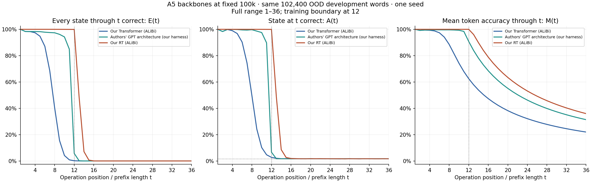
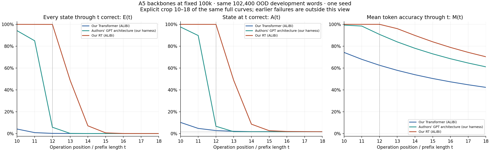
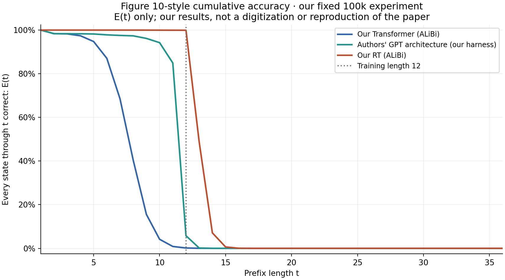
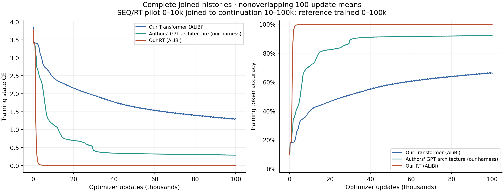

# A5: Transformer architecture comparison at 100,000 updates

**Fixed primary endpoint: 100,000 updates for every backbone.** This is 102.4 million word presentations, 128 nominal passes over 800,000 training words, and 25% of the paper's 400k update budget. Earlier 10k/25k/50k checkpoints are diagnostics.

Our Transformer and RT retain two D512/H8/GELU-FFN2048 blocks with ALiBi, LayerNorm and learned QK normalization (6,357,504 parameters). The authors' GPT architecture uses two D512/H8/RMSNorm/RoPE blocks with SwiGLU hidden width 1408, no QK normalization, and Normal(0,.02) initialization (6,486,528 parameters).

All runs use our frozen data, same-position A5 CE, AdamW update function, FP32 eager runtime and identical per-update word order. SEQ and RT continue their original 10k checkpoints; the reference starts from its own architecture initialization. A common seed does not make its weights paired with our models. This comparison changes several architecture components together and does not isolate an ALiBi or RoPE effect.

| Backbone at 100k | Set | State CE | Mean token accuracy M | Whole-word exactness E | Final-state accuracy A |
| --- | --- | ---: | ---: | ---: | ---: |
| Our Transformer (ALiBi) | dev, L12 | 1.4669957 | 62.4946% | 0.1514% | 2.6328% |
| Our Transformer (ALiBi) | ood_dev, L36 | 3.2450907 | 21.9672% | 0.0000% | 1.6602% |
| Authors' GPT architecture (our harness) | dev, L12 | 0.3763981 | 90.7859% | 5.8662% | 6.7285% |
| Authors' GPT architecture (our harness) | ood_dev, L36 | 10.2703887 | 31.3747% | 0.0000% | 1.6689% |
| Our RT (ALiBi) | dev, L12 | 0.0010097 | 99.9826% | 99.9111% | 99.9258% |
| Our RT (ALiBi) | ood_dev, L36 | 15.1717979 | 35.9744% | 0.0000% | 1.6416% |

Every reported checkpoint uses the same first 102,400 frozen words for each development role. E(t) requires every state through t to be correct; A(t) checks only position t; M(t) averages token correctness through t. Short development words and long-word prefixes are different samples. All length curves below are prefixes of saved length-36 outputs, not independently generated evaluations at every length.

The zoom uses exactly the full plot's data and metric panels; failures before position 10 are cropped out. The right panel M(t) can stay high because of correct earlier states even when A(t) is near chance and E(t) is zero. Only A has a flat 1/60 state-guessing line.

The Figure 10-style plot uses E(t), the cumulative-correctness convention supported by the released A5 evaluator. Its title identifies this as our experiment; no paper measurements are overlaid or claimed reproduced.

Both attention-only architectures also share a small structural limitation: without a BOS token, an initial repeated nonidentity operation `(g, g)` yields identical position representations in exact arithmetic although the required states `g` and `g²` differ. RoPE/ALiBi alter scores but cannot distinguish identical values. This limits perfect-prefix accuracy even after learning; it does not explain the large later-position gap. The [handoff](../../../rt-a5-transformer-reference-handoff.md#shared-repeated-prefix-limitation) records the bounded count and CPU checks, with the roundoff and per-word attribution qualifications.

| Backbone | Updates | Last E≥95% | Last E≥50% | Last E≥10% | Last E≥1% | First zero-success length |
| --- | ---: | ---: | ---: | ---: | ---: | ---: |
| Our Transformer (ALiBi) | 10,000 | 3 | 5 | 5 | 6 | 10 |
| Our Transformer (ALiBi) | 25,000 | 4 | 6 | 7 | 8 | 13 |
| Our Transformer (ALiBi) | 50,000 | 4 | 6 | 8 | 10 | 14 |
| Our Transformer (ALiBi) | 100,000 | 4 | 7 | 9 | 10 | 15 |
| Authors' GPT architecture (our harness) | 10,000 | 7 | 8 | 9 | 10 | 13 |
| Authors' GPT architecture (our harness) | 25,000 | 8 | 10 | 11 | 11 | 14 |
| Authors' GPT architecture (our harness) | 50,000 | 9 | 11 | 11 | 12 | 17 |
| Authors' GPT architecture (our harness) | 100,000 | 9 | 11 | 11 | 12 | 16 |
| Our RT (ALiBi) | 10,000 | 12 | 13 | 14 | 15 | 18 |
| Our RT (ALiBi) | 25,000 | 12 | 13 | 14 | 15 | 19 |
| Our RT (ALiBi) | 50,000 | 12 | 13 | 14 | 15 | 20 |
| Our RT (ALiBi) | 100,000 | 12 | 12 | 13 | 14 | 18 |

Thresholds are inclusive and bounded by the tested range 1–36. Zero is an actual zero success count in this sample, not a proof of population impossibility. CSV intervals are pointwise Wilson 95% over words for E/A, not paired-difference or training-seed uncertainty. M has no interval assuming independent positions.

| Backbone at 100k | E(12) | E(13) | E(14) | E(16) | E(36) | A(36) | M(36) |
| --- | ---: | ---: | ---: | ---: | ---: | ---: | ---: |
| Our Transformer (ALiBi) | 0.1504% | 0.0215% | 0.0010% | 0.0000% | 0.0000% | 1.6602% | 21.9672% |
| Authors' GPT architecture (our harness) | 5.7686% | 0.1416% | 0.0020% | 0.0000% | 0.0000% | 1.6689% | 31.3747% |
| Our RT (ALiBi) | 99.9199% | 48.7432% | 7.0781% | 0.0420% | 0.0000% | 1.6416% | 35.9744% |

| Backbone | Total training-loop minutes | Sum of job elapsed minutes |
| --- | ---: | ---: |
| Our Transformer (ALiBi) | 27.51 | 28.07 |
| Authors' GPT architecture (our harness) | 28.98 | 29.45 |
| Our RT (ALiBi) | 91.91 | 94.35 |

Joined timing includes the original pilot for SEQ/RT; job-time sums exclude gaps between jobs. It is measured elapsed time, not a controlled hardware-normalized benchmark.

This is the authors' architecture on our harness, not exact paper reproduction: we use our generated corpus, optimizer/data-order conventions, FP32/eager runtime and 100k rather than 400k updates. One development seed does not establish convergence or seed robustness. No NextLat objective, autonomous latent recurrence, or RoPE-only ablation is included in this 100k comparison. Final confirmation remains unevaluated. A separately authorized RoPE-only control uses a matched 50k endpoint and its own report.

[All counts and denominators](metrics.csv) · [Plot data](plot-data.json) · [Machine-readable report](report.json)
