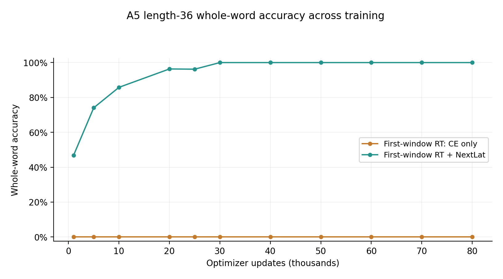
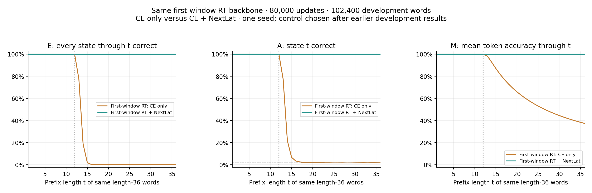
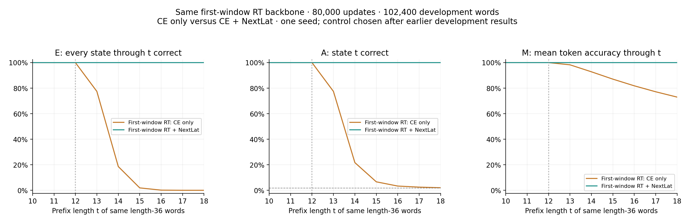
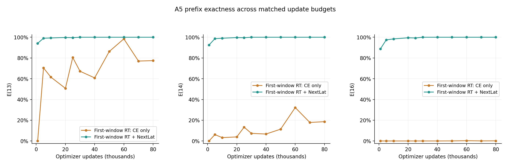
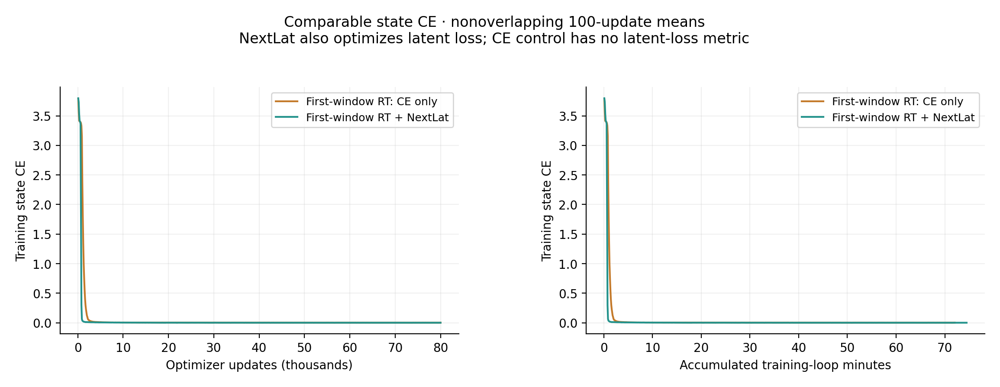

# Same first-window RT: CE only versus NextLat

Both runs completed their prospectively fixed **80,000-update** endpoints. They use the same two-layer RT backbone: window-2 attention in the first layer, full recurrent attention in the second. The control trains on state CE only; the reference trains on state CE plus the original weight-one next-latent SmoothL1 loss. Both evaluate backbone predictions.

| Training objective | Total parameters | Backbone parameters | Learned tensors |
| --- | ---: | ---: | ---: |
| CE only | 6,357,504 | 6,357,504 | 21 |
| CE + NextLat | 7,407,104 | 6,357,504 | 25 |

All 21 initial backbone tensors were checked for exact equality, mapping the reference's `backbone.` names to the bare control. The control has no registered predictor. Backbone optimizer parameter groups and hyperparameters match. Removing NextLat also removes the predictor from the global norm used for clipping; total parameters, joint clipping inputs and compute therefore differ.

| Objective at 80k | L12 whole word | E(13) | E(14) | E(16) | E(36) | A(36) | M(36) |
| --- | ---: | ---: | ---: | ---: | ---: | ---: | ---: |
| First-window RT: CE only | 99.9570% | 77.4326% | 18.5957% | 0.1240% | 0.0000% | 1.6748% | 37.3472% |
| First-window RT + NextLat | 100.0000% | 100.0000% | 100.0000% | 100.0000% | 100.0000% | 100.0000% | 100.0000% |

| Updates | CE-only E(36) | NextLat E(36) |
| --- | ---: | ---: |
| 1,000 | 0.0000% | 46.7471% |
| 5,000 | 0.0000% | 74.0674% |
| 10,000 | 0.0000% | 85.7910% |
| 20,000 | 0.0000% | 96.3369% |
| 25,000 | 0.0000% | 96.2090% |
| 30,000 | 0.0000% | 100.0000% |
| 40,000 | 0.0000% | 100.0000% |
| 50,000 | 0.0000% | 100.0000% |
| 60,000 | 0.0000% | 100.0000% |
| 70,000 | 0.0000% | 100.0000% |
| 80,000 | 0.0000% | 100.0000% |

E(t) requires every state through t correct; A(t) checks only state t; M(t) averages token correctness through t. All checkpoint evaluations use 102,400 words per development role. Prefix curves use the same length-36 outputs, and full/boundary figures use identical rows. L12 uses a separate development set. CE-only history contains no latent-loss metrics; the training plot compares state CE without treating the different total objectives as equivalent.

Both arms use width 512, eight heads, GELU FFN width 2048, original Mitchell initialization, ALiBi, full FP32, the same data/minibatch order, and the same backbone AdamW recipe. Each 80k run represents 81,920,000 word presentations over 800,000 unique length-12 training words (102.4 nominal passes). The direct attention window preserves attached recurrent states and gradients; it does not truncate represented history to two tokens.

This is a one-seed development comparison. Both endpoints were fixed before their own training; the choice of this control followed the reference's development results. Repeated use of the same development words is not independent replication. Pointwise Wilson 95% intervals for E/A describe sampling over words, not seed variability or paired differences. Zero errors or zero successes mean observations in this sample, not exact population accuracy. Final confirmation and autonomous latent predictor rollout remain **unevaluated**.

The reporter checks frozen source identities, exact initial backbone/optimizer mapping, all retained checkpoint hashes, finite ordered histories, every matching minibatch hash, objective contracts and evaluation counts. It performs no model inference or training.

[Exact metric counts](metrics.csv) · [All checkpoint summaries](checkpoint-summary.csv) · [Plot data](plot-data.json) · [Provenance](report.json)
