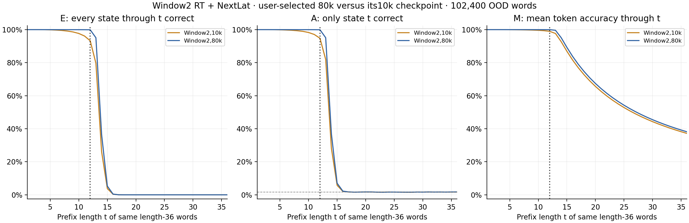
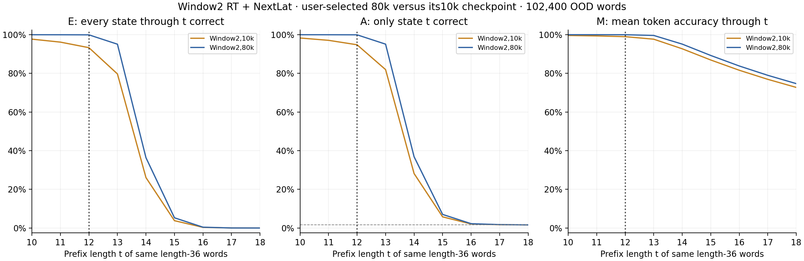
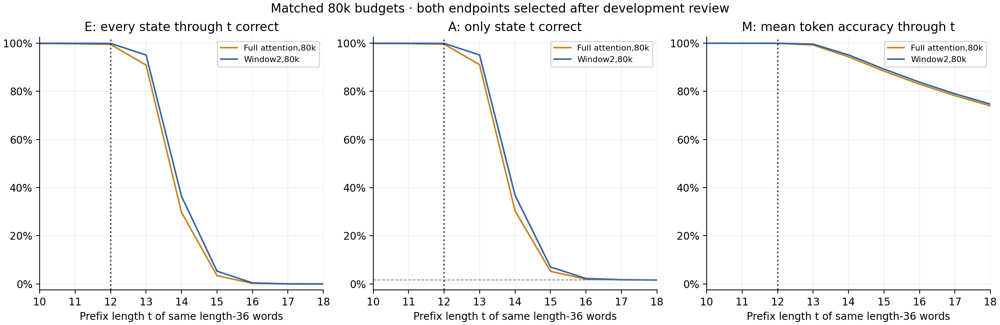
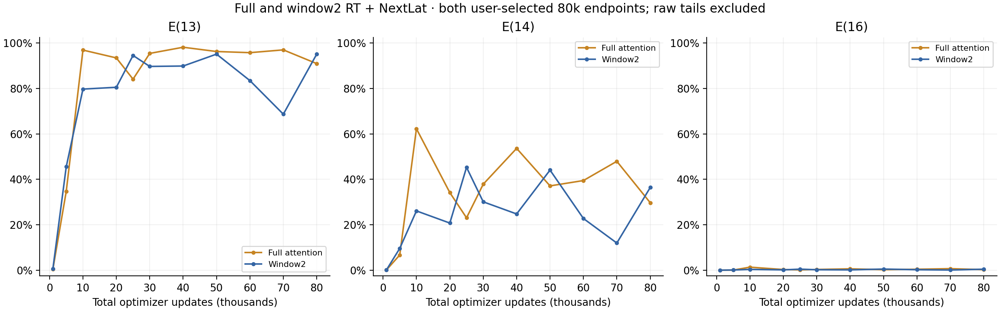
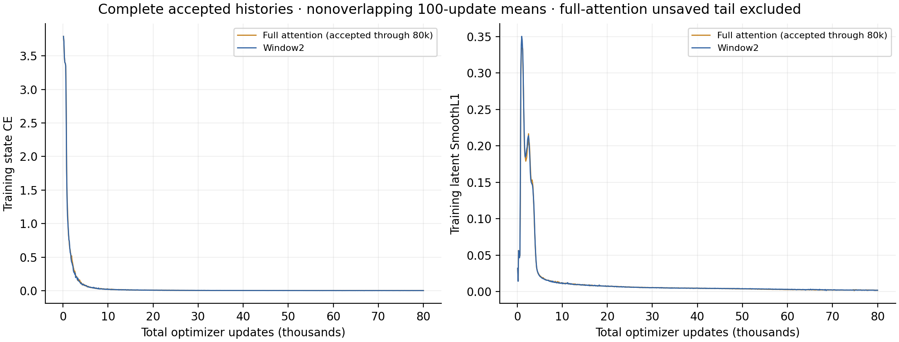

# Window2 RT + NextLat: user-selected 80k checkpoint

The user stopped the original Mitchell + ALiBi, layer-2 window2 RT + NextLat continuation at its retained **80,000-update checkpoint after reviewing development curves**. The original prospective plan was 100k. The full-attention RT + NextLat reference was also stopped at 80k after development review. These are retrospective user-selected endpoints with matched training budgets; neither model has a completed 100k outcome.

Layer 1 retains full-prefix recurrent attention. Layer 2 reads temporary self K/V and the immediately preceding output's permanent K/V, with recurrent gradients attached. The window limits direct reads, not the full history encoded in recurrent states. Mitchell initialization, ALiBi, D512/H8/GELU-FFN2048, LayerNorm/full-width QK norm, rho1, state CE plus weight-one latent SmoothL1, and full FP32 are unchanged. Total 7,407,104 parameters. Only the target latent is detached; model accuracy uses the RT backbone without autonomous predictor rollout.

The window model resumed its original 10k checkpoint with model, Adam, RNG and absolute word-order state. Accepted training adds 70,000 updates, totaling 81,920,000 word presentations over 800,000 unique length-12 words (102.4 nominal passes). The reporter performs no model inference or training.

| Model | Updates | L12 whole word | E(13) | E(14) | E(16) | M(36) | E(36) |
| --- | ---: | ---: | ---: | ---: | ---: | ---: | ---: |
| Window2 RT + NextLat | 10,000 | 93.0303% | 79.6963% | 26.0879% | 0.3457% | 37.1962% | 0.0000% |
| Window2 RT + NextLat | 80,000 | 99.9189% | 95.0840% | 36.3848% | 0.4375% | 38.1807% | 0.0000% |
| Full attention RT + NextLat | 10,000 | 98.3047% | 96.8652% | 62.2373% | 1.3350% | 39.1194% | 0.0000% |
| Full attention RT + NextLat | 80,000 | 99.5449% | 90.9102% | 29.6934% | 0.2236% | 37.8208% | 0.0000% |

E(t) requires every state through t to be correct. A(t) checks only state t; M(t) averages correctness through t. OOD curves use prefixes of the same 102,400 frozen length-36 development words. Full and boundary plots use identical rows. L12 development is a separate short-word set. The 1/60 guessing reference applies only to A(t).

| Updates | Window E(13) | Full E(13) | Window E(14) | Full E(14) | Window E(16) | Full E(16) |
| ---: | ---: | ---: | ---: | ---: | ---: | ---: |
| 1,000 | 0.6074% | 0.4014% | 0.0723% | 0.0762% | 0.0029% | 0.0000% |
| 5,000 | 45.5107% | 34.6738% | 9.5830% | 6.6807% | 0.0850% | 0.0449% |
| 10,000 | 79.6963% | 96.8652% | 26.0879% | 62.2373% | 0.3457% | 1.3350% |
| 20,000 | 80.4932% | 93.4199% | 20.7363% | 34.1436% | 0.1475% | 0.2930% |
| 25,000 | 94.5020% | 84.0596% | 45.2627% | 23.0469% | 0.4561% | 0.1426% |
| 30,000 | 89.6699% | 95.3984% | 30.0859% | 37.8486% | 0.2041% | 0.3135% |
| 40,000 | 89.8438% | 98.1133% | 24.7471% | 53.6035% | 0.1338% | 0.6016% |
| 50,000 | 95.0801% | 96.2314% | 44.0479% | 37.0967% | 0.4971% | 0.2139% |
| 60,000 | 83.4268% | 95.7266% | 22.7393% | 39.4512% | 0.2090% | 0.4092% |
| 70,000 | 68.6543% | 96.9521% | 11.9482% | 47.9141% | 0.0645% | 0.6777% |
| 80,000 | 95.0840% | 90.9102% | 36.3848% | 29.6934% | 0.4375% | 0.2236% |

The requested SIGINT arrived after update 85,376; **5,376 complete uncheckpointed window updates after 80k** and any interrupted in-flight step are excluded from accepted results. The 20 later routine evaluation records and 20 later one-step diagnostic records remain in raw evidence but are excluded from comparisons.

The deliberate stop is recorded as `failed`/`KeyboardInterrupt` by the unchanged trainer and as `synced_failed_experiment` by W&B. The separate window endpoint-revision receipt binds the protocol, raw history/report, accepted checkpoint and termination evidence. Only this explicit user-directed stop is accepted; arbitrary failures are not reclassified. The raw completed counter includes the unsaved tail, while raw order/time counters remain those of 80k.

Accepted window training-loop time: 1.236h total, with 1.082h in the continuation. Excluded tail: 299.335s. Raw continuation training time: 1.166h; raw job elapsed: 1.197h including evaluation/checkpoint/logging/interruption overhead.

Every reported checkpoint uses 102,400 words per development role. This is one seed with endpoints selected after development inspection, not a confirmed convergence result. Pointwise Wilson 95% intervals describe sampling over words for E/A, not seed variability, simultaneous coverage or paired differences. Zero E means no successes in this sample. Final confirmation and autonomous latent rollout remain **unevaluated**.

[Exact counts](metrics.csv) · [Checkpoint summary](checkpoint-summary.csv) · [Plot data](plot-data.json) · [Provenance](report.json)
