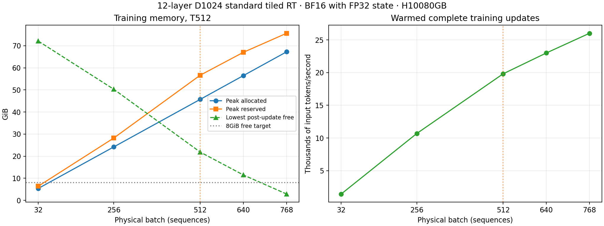

# Standard Recurrent Transformer training capacity at T512

Status: complete for compiled tiled helpers **without CUDA graph capture**, 2026-09-10.

This is a short physical-batch memory/throughput probe on the available H100
80GB HBM3, using random tokens and complete training updates. Randomly trained
weights have no scientific value and are discarded. The earlier CDRM
experiments and their archived evidence are unchanged.

## Result and recommendation

**Use physical batch512 at sequence length512 for the present execution path.**
It completed ten training updates, with stable memory after warmup, 21.84GiB
sampled physical free memory, and about19.8k input tokens/second. Every one of
the twelve layers is recurrent. The batch contains262,144 input tokens per
optimizer update; only the vocabulary head is processed in smaller chunks.

| Physical batch | Complete updates | Peak allocated GiB | Peak reserved GiB | Lowest sampled free GiB | Median warmed seconds/update | Input tokens/second |
| ---: | ---: | ---: | ---: | ---: | ---: | ---: |
| 32 | 5 | 5.37 | 6.38 | 72.13 | 11.49 | 1,425 |
| 256 | 5 | 24.19 | 28.22 | 50.28 | 12.26 | 10,682 |
| **512** | **10** | **45.71** | **56.66** | **21.84** | **13.21** | **19,817** |
| 640 | 10 | 56.48 | 67.03 | 11.47 | 14.23 | 23,005 |
| 768 | 5 | 67.25 | 75.66 | 2.85 | 15.12 | 26,022 |

Two warmup updates are excluded from each timing summary; throughput uses mean
update time, while the table also gives the median. Batch512 retains86.1% of
batch640 throughput, with10.37GiB more free memory. Given the user's preference
for the paper's batch512, this is a reasonable efficiency/headroom tradeoff.
Batch640 is the largest *tested comfortable* candidate under the initial8GiB
headroom target. Batch768 fits but leaves little margin; no hard OOM boundary
was sought, and no claim is made about untested intermediate batches.

All35 measured/warmup updates across the five processes completed. All final
parameters, gradients and allocated Adam moments were finite FP32. Each process
recorded14 compiled helper graphs, with no fallback or new compilation after
warmup. These are compiler graphs, **not CUDA graph captures**.

The user specifically asked about CUDA graphs. They are **off**: the local
[capture functions](../../../recurrent-transformer/olmo/efficient_utils.py#L76)
explicitly reject capture pending causal-mask and gradient validation. The
authors' released sweep requests whole-model CUDA graphs, so these throughput
measurements do not reproduce that execution setup. Validating/re-enabling
capture and repeating B512 is the next step for that comparison; CUDA graph
memory and throughput must be measured separately.

[W&B comparison and table](https://wandb.ai/taylorbollman/recurrent-transformer-capacity/runs/r3f3gmsl)
and the [B512 run](https://wandb.ai/taylorbollman/recurrent-transformer-capacity/runs/kxmathn5)
are synchronized online.

## Exact architecture

The user confirmed the previous **12-layer, width-1024** model. These dimensions
are the paper's 150M backbone configuration in
[Appendix E.3](https://arxiv.org/html/2604.21215v1#A5.SS3).
[D.1](https://arxiv.org/html/2604.21215v1#A4.SS1) instead describes the larger
12-layer width-1408 configuration. The released `150m.yaml` and
`sweep_recurrent_150m_512.yaml` supply the practical 150M/T512 configuration.

| Setting | Profiled value |
| --- | --- |
| Layers | 12, all standard tiled Recurrent Transformer |
| Width / MLP / heads | 1024 / 4096 with GELU / 16 heads of dimension64 |
| Parameters | 216,843,264 total; 151,045,120 outside input/output tables |
| Vocabulary | 32,100 valid token IDs; padded 32,128-row input and output tables |
| Weight tying | Untied; each vocabulary table has 32,899,072 parameters |
| Normalization | Learned pre-LayerNorm and learned Q/K normalization |
| Positions | Causal ALiBi, maximum bias8; no RoPE |
| Bias / dropout | Disabled |
| Recurrence | Full standard write, local `rho=1`; separate same-layer KV memory in every layer |
| Initialization | Mitchell, seed20260910 |

Persistent KV comes from each layer's own processed output; temporary self-KV
comes from its input. There are no CDRM adapters, side fabric, cross-layer
bridge or latent auxiliary objective. The full C4 vocabulary restores the
input/output tables omitted by the previous V16 synthetic-task adaptation.

## Execution and measurement

The tested policy uses BF16 projections/MLPs/head and FP32 parameters, residuals,
recurrent attention state, loss and Adam moments. This is the local
`bf16_fp32_state` policy, not an assertion that the released legacy BF16 path
has identical memory or numerical behavior. The ordinary-attention precision
option remains `legacy`, because this stack has no ordinary sequential blocks.

The released recipe's **head microbatch of two sequences** is retained: all
12 recurrent layers process the complete physical batch once; only the
vocabulary head/loss is split. Head-input gradients accumulate and propagate
through the backbone once. There is no accumulation of smaller recurrent
batches. Each 512-token sequence scores511 next-token targets; summed CE is
divided by `B*512`, matching the released trainer's normalization.

Tiled backward retains the released `bwd_mlp_chunks=4` and its internal
recomputation. No additional whole-layer activation checkpointing is enabled.
The supported tiled helpers are compiled, with fallback treated as failure.
Whole-model CUDA graph capture is currently disabled in our implementation
and is excluded here, although the released sweep requests it. This is a
capacity estimate for the present supported execution path.

Checkpointing was checked in the implementation: the tiled forward saves its
layer input and output, then the custom backward reconstructs Q/K/V, attention
probabilities/outputs and MLP intermediates. At T512 the four backward MLP
chunks cover128 timesteps each. This is activation checkpointing/recomputation
inside every recurrent layer, even though the separate whole-layer checkpoint
option is off. See
[saved tensors and backward](../../../recurrent-transformer/olmo/model.py#L1435)
and the released
[512-token sweep](../../../recurrent-transformer/sweep_recurrent_150m_512.yaml).

Each candidate runs in a fresh Docker process. AdamW uses LR1e-3,
betas(0.9,0.95), epsilon1e-8, weight decay0 and clipping norm1; parameters,
gradients and both Adam moments are FP32. Foreach/fused optimizer paths are
disabled. Each probe includes two warmup updates and at least three measured
updates, including backward, clipping and an optimizer step. Warmed timing
excludes compilation and W&B overhead. Peak allocated and reserved memory,
post-update physical free memory and cold-training peaks are retained. The
physical free-memory samples are taken after each update, not continuously;
the allocator's reserved-memory high-water mark supplies the additional peak
context. Cold-training peaks cover compilation and the first two updates,
including lazy Adam allocation, after model construction.

The initial comfort target is about8GiB physical free memory, followed by a
longer confirmation at the recommended batch. This is a coarse capacity
estimate, not a last-GB optimization or a task-quality experiment. No FSDP,
document packing, data-loader staging buffers or distributed training are used.
The user subsequently requested batch512 if reasonably efficient, matching the
paper's setting. The final recommendation distinguishes that practical choice
from the largest tested batch meeting the initial comfort target.

## Validation and evidence

Four CPU tests verify chunked versus full-head loss and all parameter gradients,
tail chunks, logit scaling, shifted supervision and exactly one backbone
forward/backward. GPU probes require finite gradients, FP32 parameters/gradients/
allocated Adam moments and no new helper compilations during measured updates.
These are operational checks, not a fresh all-layer precision-validation study.

Runtime: NVIDIA PyTorch26.06, `torch2.13.0a0+8145d630e8.nv26.06`, CUDA13.3;
TF32 disabled and deterministic algorithms enabled. The GPU is an H10080GB
HBM3 with 85,017,493,504 bytes available to CUDA (79.179GiB); no other workload
was present at the initial check.

Raw records are under `.runtime/rt-batch-capacity/20260910T175700Z`.
Online tracking uses
[taylorbollman/recurrent-transformer-capacity](https://wandb.ai/taylorbollman/recurrent-transformer-capacity),
group `20260910T175700Z`.

The [storage receipt](storage.json) records the small retained evidence bundle
under `gs://fast-chunks/cdrm-w-latent/rt-batch-capacity/20260910T175700Z/`.
It contains resolved configurations, source snapshots, raw step metrics,
execution logs, tests, audits and graphs. Disposable random weights and
regenerable compiler/W&B caches are excluded.
