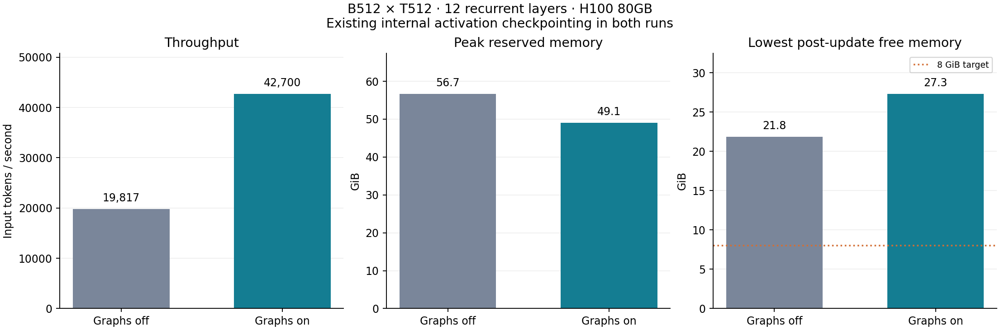

# Standard RT CUDA graphs: validation and B512 results

**Recommend physical batch 512 at sequence length 512, with all 12 layers recurrent, CUDA graphs enabled and the existing tiled checkpointed backward.** The confirmed run delivered **42,700 input tokens/second**, **2.15×** the uncaptured baseline, while leaving **27.3 GiB** of sampled post-update GPU memory free.

| Execution | Mean update | Input tokens/s | Peak reserved, including setup | Lowest post-update free |
| --- | ---: | ---: | ---: | ---: |
| CUDA graphs off | 13.23 s | 19,817 | 56.66 GiB | 21.84 GiB |
| CUDA graphs on | 6.14 s | 42,700 | 49.07 GiB | 27.30 GiB |

Each B512 comparison contains 10 complete Adam updates: 2 warmup and 8 measured. Every recurrent layer sees the full physical batch; there is no recurrent gradient accumulation. Timing includes input-buffer copy for graph replay, forward, loss, backward, finite checks, gradient clipping and Adam; it excludes W&B logging, uncaptured reference checking and capture setup. The confirmation's three capture warmups took 37.4 s, followed by 16.0 s for capture itself.

[W&B comparison](https://wandb.ai/taylorbollman/recurrent-transformer-capacity/runs/yxr2q9z8) · [B512 confirmed run](https://wandb.ai/taylorbollman/recurrent-transformer-capacity/runs/njsmyuat) · [machine-readable summary](summary.json) · [previous capacity report](../rt-batch-capacity/results.md).

## Exact architecture and training semantics

This is the user's previous **width 1024** model: **12 tiled recurrent layers, 16 heads with dimension 64, and a 4096-wide GELU FFN**. It has **151,045,120 backbone parameters**, or **216,843,264 total** including two untied 32128-row embedding/output tables, with 32100 valid token IDs. This is the paper's 150M backbone size in [Appendix E.3](https://arxiv.org/html/2604.21215v1#A5.SS3); D.1 describes a larger width 1408/22-head backbone. All 12 layers are recurrent, with no CDRM or latent components.

Causal ALiBi, pre-LayerNorm, learned Q/K normalization, rho 1, no bias/dropout and our existing `bf16_fp32_state` policy are unchanged. Projection autocast uses BF16; parameters, residual/recurrent attention state, gradients, loss and Adam moments stay FP32. TF32 is disabled. This is our previously qualified local precision policy, not a claim to reproduce every author runtime choice.

Only the output head is microbatched into groups of 2 sequences. The released trainer's loss sums 511 shifted CE targets per sequence and divides by B×512. AdamW uses LR 0.001, betas (0.9,0.95), epsilon 1e-8, weight decay 0 and global gradient clipping 1; foreach and fused Adam are off.

## Correctness evidence

| Validation | Batch × length | Two fixed-input replays: loss and raw gradients | Three changing-input Adam steps: loss, gradients, parameters and optimizer state | Evidence |
| --- | --- | --- | --- | --- |
| tiny / FP32 | 3 × 16 | Exact | Exact | [run](https://wandb.ai/taylorbollman/recurrent-transformer-capacity/runs/91r3tzi3) |
| tiny / BF16 | 3 × 16 | Exact | Exact | [run](https://wandb.ai/taylorbollman/recurrent-transformer-capacity/runs/bjhi253o) |
| full / BF16 | 2 × 512 | Exact | Exact | [run](https://wandb.ai/taylorbollman/recurrent-transformer-capacity/runs/wrkxmya8) |

The tiny model has 2 layers and width 64, with a batch 3 tail in head microbatching. The full validator uses the actual 12-layer width 1024 model at B2/T512. All compared coordinates were exactly equal; no comparison relied on the allowed rtol 1e-5 / atol 1e-7 tolerance. Capture preserved state-dict keys and values before training, and parameters changed after actual Adam updates. Repeated-input gradient hashes remained identical. Fixed-shape, no-grad and replaced-gradient-buffer guards also passed.

At **B512/T512**, the uncaptured reference loss and **all 111 initial parameter gradients** matched captured execution exactly. Across all 10 updates, loss and gradient norm also matched the separately recorded uncaptured baseline exactly, using identical initialization, input IDs, model/optimizer configuration and loss helper. All 111 parameter/gradient tensors and 222 Adam moment tensors remained finite FP32. Compiled-helper counters stayed at 14 graphs, with no fallback or new compilation during measured updates. These compiler graphs are distinct from the explicit CUDA graph capture.

**19 CPU tests passed**: 15 capture-contract cases and 4 existing head-chunking checks. The independent evidence audit is [retained here](../../../.runtime/rt-cuda-graphs/20260910T182400Z/verification/audit.json).

Prefix causality was checked on native forward by changing suffix tokens and observing an exactly unchanged hidden prefix. Capture invokes that same native forward path; the validator does not separately expose captured hidden prefixes. Graph/eager equivalence is checked **within each precision**, and is not a new BF16-versus-FP32 numerical clearance.

## Capture implementation and setup-memory fix

The opt-in [capture helper](../../../scripts/rt_cuda_graph.py) captures native model forward, head-chunked cross entropy and complete backward. Clipping and Adam remain outside capture. It preserves the module tree, parameter objects and checkpoint keys. Persistent FP32 gradient buffers are zeroed inside each replay; graph-captured weight casts refresh after in-place Adam updates.

The old `make_graphed_callables` wrappers remain disabled because the tiled custom backward accumulates parameter gradients through nested autograd. This milestone provides a separate full-backward capture path through [the profiler](../../../scripts/rt_batch_profile.py); it does not yet wire CUDA graphs into the released general C4 training loop.

The first successful B512 graph run temporarily reserved 73.74 GiB during setup. Releasing unused allocator cache before side-stream warmup reduced that setup peak to 47.26 GiB, with 49.07 GiB reserved after Adam initialization. The change adds synchronization and cache release only; captured arithmetic is unchanged. Both complete B512 runs and all first-pass evidence are retained. Numerical checks were repeated after the fix.

Memory peaks start after model construction. Free memory is sampled after updates, not continuously. Graph replay reuses a reserved private pool, so replay-time `max_memory_allocated` alone is not a measure of the complete working memory. The table uses peak reservation and available device memory; see [PyTorch's graph memory notes](https://docs.pytorch.org/docs/2.14/notes/cuda.html#graph-memory-management).

## Activation checkpointing and scope

**The activation checkpointing described in the paper was already active in the preceding uncaptured measurements.** Each tiled layer saves inputs/outputs, rebuilds persistent KV from saved outputs and reconstructs attention without repeating the sequential forward recurrence. `bwd_mlp_chunks=4` stays enabled. The separate `activation_checkpointing=None` means there is no additional outer layer wrapper.

A second checkpoint around each whole layer is not needed for this B512 capacity target. Code inspection suggests limited extra memory savings for that placement, with expensive forward recomputation; no outer-checkpointing ablation was run or cleared. See [the checkpointing analysis](checkpointing.md).

These are bounded random-data training checks on one H100 80GB, not a task-performance or long-training-stability result. Real data loading, packing, evaluation, checkpoint writes and distributed training remain outside the measurement. Random weights and data were discarded. Source snapshots, resolved configurations, reports, logs and plots are retained in the project and under `gs://fast-chunks/cdrm-w-latent/rt-cuda-graphs/20260910T182400Z/`; [storage verification](storage.json).

[Execution guide](../../rt-cuda-graphs-usage.md) · [GPU validation script](../../../scripts/rt_cuda_graph_validate.py) · [CPU capture tests](../../../tests/test_rt_cuda_graph.py).
