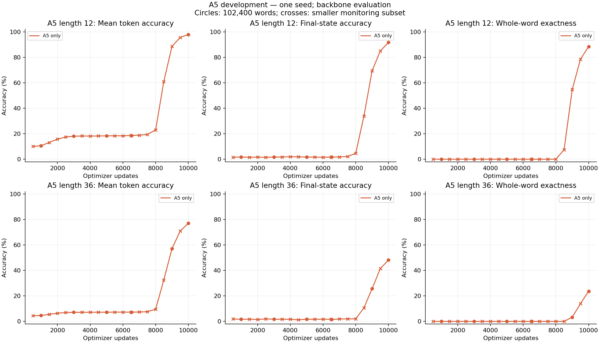
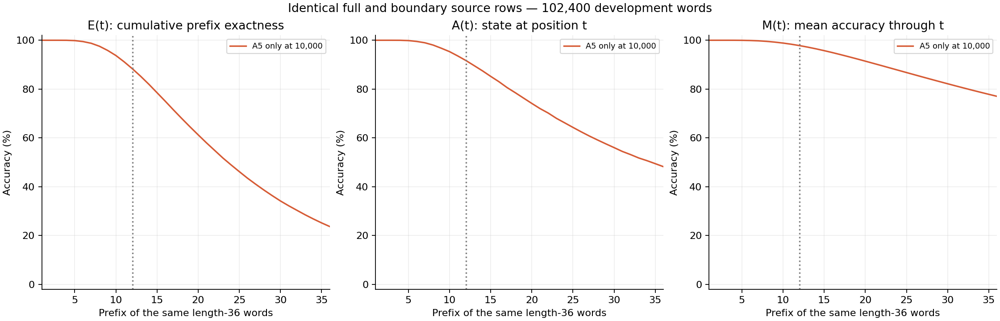
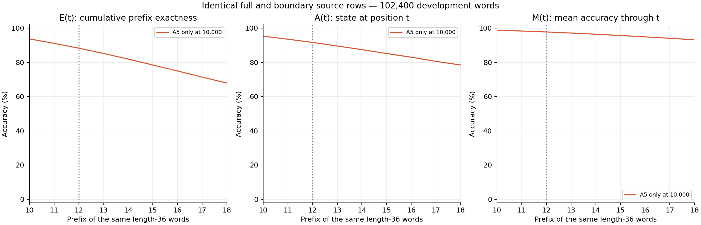
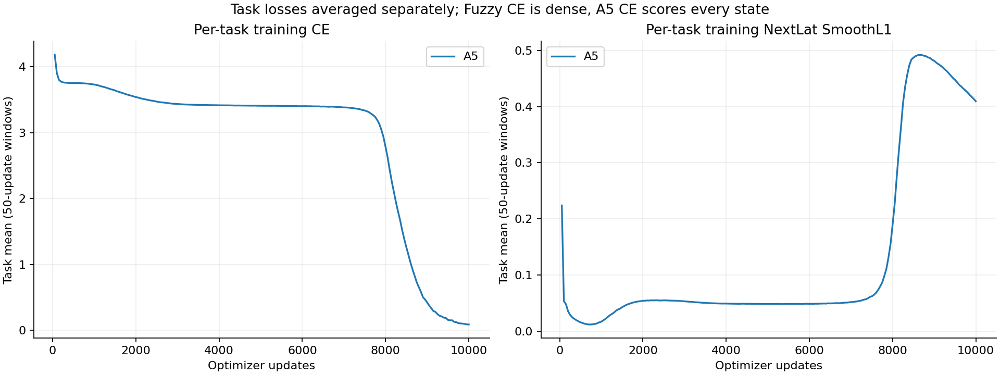

# D128 A5 and Fuzzy development pilot

**a5-only, actual endpoint 10,000 updates.** Training status: complete.

Two RT layers; first window two, second full recurrent. Width 128, 16 heads, FFN 512; ALiBi, Mitchell, FP32 eager, NextLat retained. 479,616 parameters; no embedding bypass or autonomous latent rollout.

128 examples per active task per optimizer update; 1,280,000 examples per task at the endpoint. Losses are means within each task; mixed training weights the two task objectives equally.

| Same-checkpoint endpoint metric | Accuracy |
| --- | ---: |
| A5 L12 mean token | 97.8502% |
| A5 L12 final state | 91.6709% |
| A5 L12 whole word | 88.4736% (90,597 / 102,400) |
| A5 L36 mean token | 77.0332% |
| A5 L36 final state | 48.2207% |
| A5 L36 whole word | 23.6865% (24,255 / 102,400) |

## A5 continuation gate

The first observed positive full L36 evaluation was at **9,000 updates**: 3,415 / 102,400 whole words (3.334961%). Positive within the first 3,000 updates: no. This is the prospective continuation gate; the endpoint table remains independent.

## Controls and qualifications

Single initialization and reused development data; no final confirmation. Joint endpoint metrics belong to one checkpoint. First-positive A5 development evaluation is a prospective continuation gate, not the selected endpoint. Only common retained checkpoints with equal task exposure and evaluation rows are matched control comparisons; unequal terminal budgets are descriptive.

Checkpoint: `step-010000.pt`; SHA256 `0f246e2f39f8a26c8a39fcb336ee1bac4da12990f14bdfaf5676b45ce1364701`.

[Training W&B](https://wandb.ai/taylorbollman/rt-nextlat-fuzzy-a5/runs/4y1z4tyj)

