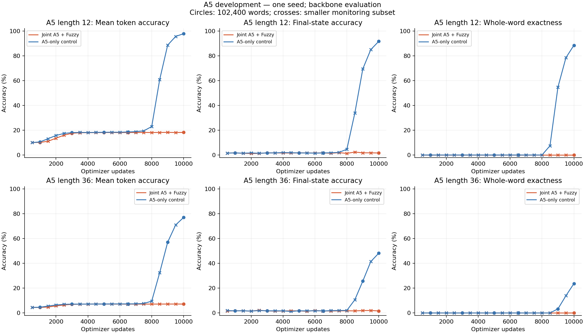
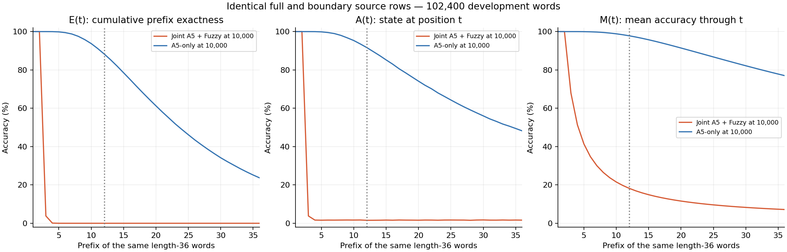
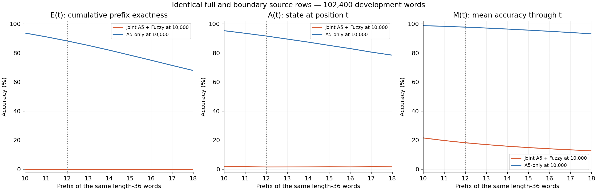
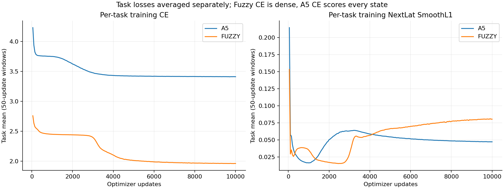
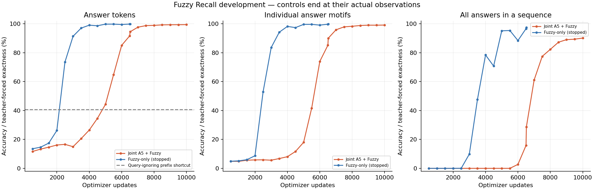

# D128 A5 and Fuzzy development pilot

**mixed, actual endpoint 10,000 updates.** Training status: complete.

Two RT layers; first window two, second full recurrent. Width 128, 16 heads, FFN 512; ALiBi, Mitchell, FP32 eager, NextLat retained. 479,616 parameters; no embedding bypass or autonomous latent rollout.

128 examples per active task per optimizer update; 1,280,000 examples per task at the endpoint. Losses are means within each task; mixed training weights the two task objectives equally.

| Same-checkpoint endpoint metric | Accuracy |
| --- | ---: |
| A5 L12 mean token | 18.2314% |
| A5 L12 final state | 1.6260% |
| A5 L12 whole word | 0.0000% (0 / 102,400) |
| A5 L36 mean token | 7.1777% |
| A5 L36 final state | 1.6387% |
| A5 L36 whole word | 0.0000% (0 / 102,400) |
| Fuzzy answer tokens | 99.4383% |
| Fuzzy answer-motif exact | 99.1413% |
| Fuzzy all-answers sequence exact | 90.1562% |
| Fuzzy first value token | 99.4390% |
| Fuzzy terminal probe | 98.7786% |

## A5 continuation gate

No full 102,400-word L36 evaluation observed a positive whole-word count by the completed budget, within the 10k gate horizon. This pilot does not establish length-36 state tracking.

## Controls and qualifications

A5 control actual endpoint: **10,000 updates**. matched single-task control.
Shared retained comparison updates: 500, 1,000, 1,500, 2,000, 2,500, 3,000, 3,500, 4,000, 4,500, 5,000, 5,500, 6,000, 6,500, 6,521, 7,000, 7,500, 8,000, 8,500, 9,000, 9,500, 10,000. Matching per-task data order verified through 10,000 updates.

| Update | Task metric | Joint/current | Single-task control |
| ---: | --- | ---: | ---: |
| 500 | A5 dev whole word | 0.0000% | 0.0000% |
| 500 | A5 ood_dev whole word | 0.0000% | 0.0000% |
| 1,000 | A5 dev whole word | 0.0000% | 0.0000% |
| 1,000 | A5 ood_dev whole word | 0.0000% | 0.0000% |
| 1,500 | A5 dev whole word | 0.0000% | 0.0000% |
| 1,500 | A5 ood_dev whole word | 0.0000% | 0.0000% |
| 2,000 | A5 dev whole word | 0.0000% | 0.0000% |
| 2,000 | A5 ood_dev whole word | 0.0000% | 0.0000% |
| 2,500 | A5 dev whole word | 0.0000% | 0.0000% |
| 2,500 | A5 ood_dev whole word | 0.0000% | 0.0000% |
| 3,000 | A5 dev whole word | 0.0000% | 0.0000% |
| 3,000 | A5 ood_dev whole word | 0.0000% | 0.0000% |
| 3,500 | A5 dev whole word | 0.0000% | 0.0000% |
| 3,500 | A5 ood_dev whole word | 0.0000% | 0.0000% |
| 4,000 | A5 dev whole word | 0.0000% | 0.0000% |
| 4,000 | A5 ood_dev whole word | 0.0000% | 0.0000% |
| 4,500 | A5 dev whole word | 0.0000% | 0.0000% |
| 4,500 | A5 ood_dev whole word | 0.0000% | 0.0000% |
| 5,000 | A5 dev whole word | 0.0000% | 0.0000% |
| 5,000 | A5 ood_dev whole word | 0.0000% | 0.0000% |
| 5,500 | A5 dev whole word | 0.0000% | 0.0000% |
| 5,500 | A5 ood_dev whole word | 0.0000% | 0.0000% |
| 6,000 | A5 dev whole word | 0.0000% | 0.0000% |
| 6,000 | A5 ood_dev whole word | 0.0000% | 0.0000% |
| 6,500 | A5 dev whole word | 0.0000% | 0.0000% |
| 6,500 | A5 ood_dev whole word | 0.0000% | 0.0000% |
| 6,521 | A5 dev whole word | 0.0000% | 0.0000% |
| 6,521 | A5 ood_dev whole word | 0.0000% | 0.0000% |
| 7,000 | A5 dev whole word | 0.0000% | 0.0000% |
| 7,000 | A5 ood_dev whole word | 0.0000% | 0.0000% |
| 7,500 | A5 dev whole word | 0.0000% | 0.0000% |
| 7,500 | A5 ood_dev whole word | 0.0000% | 0.0000% |
| 8,000 | A5 dev whole word | 0.0000% | 0.0000% |
| 8,000 | A5 ood_dev whole word | 0.0000% | 0.0000% |
| 8,500 | A5 dev whole word | 0.0000% | 7.4463% |
| 8,500 | A5 ood_dev whole word | 0.0000% | 0.0000% |
| 9,000 | A5 dev whole word | 0.0000% | 54.7852% |
| 9,500 | A5 dev whole word | 0.0000% | 78.4912% |
| 9,500 | A5 ood_dev whole word | 0.0000% | 13.8916% |
| 10,000 | A5 dev whole word | 0.0000% | 88.4736% |
| 10,000 | A5 ood_dev whole word | 0.0000% | 23.6865% |

FUZZY control actual endpoint: **6,521 updates**. matched single-task control.
Shared retained comparison updates: 1,000, 5,000, 6,521. Matching per-task data order verified through 6,521 updates.

| Update | Task metric | Joint/current | Single-task control |
| ---: | --- | ---: | ---: |
| 1,000 | Fuzzy answer tokens | 13.3163% | 14.6632% |
| 5,000 | Fuzzy answer tokens | 44.2731% | 99.7794% |
| 6,521 | Fuzzy answer tokens | 94.4924% | 99.8854% |

Fuzzy query-ignoring answer-prefix shortcut: 40.6367%. Dense Fuzzy training CE and masked answer evaluation CE have different scopes. Answer exactness is teacher-forced. Causal lookup coverage is not a universal accuracy ceiling.

Single initialization and reused development data; no final confirmation. Joint endpoint metrics belong to one checkpoint. First-positive A5 development evaluation is a prospective continuation gate, not the selected endpoint. Only common retained checkpoints with equal task exposure and evaluation rows are matched control comparisons; unequal terminal budgets are descriptive.

Checkpoint: `step-010000.pt`; SHA256 `5c448d02903713139330f88c06b9beecb4464e3d44131a5d8835b1d0a589c69e`.

[Training W&B](https://wandb.ai/taylorbollman/rt-nextlat-fuzzy-a5/runs/afm9xxon)

## Exact checkpoint recovery

History, evaluations and control comparisons use the committed parent prefix followed by the resumed updates. Post-boundary parent observations are excluded; their original bytes remain preserved. Matching state at the restored boundary does not establish bitwise equivalence of later updates across GPU instances.

| Stage | Updates used | Raw history SHA256 | Excluded tail bytes |
| --- | --- | --- | ---: |
| train-mixed | 1–8,000 | `f9fe68bac517b209e1400ff7a800ccc08d73574d70c76ff12ba9c794d1590fd1` | 307,831 |
| train-mixed-resume-8000 | 8,001–10,000 | `b75bb7b7569c04e84b38ca454b7cb4b93dfac7da27696cfbb4378683eecbded7` | 0 |

