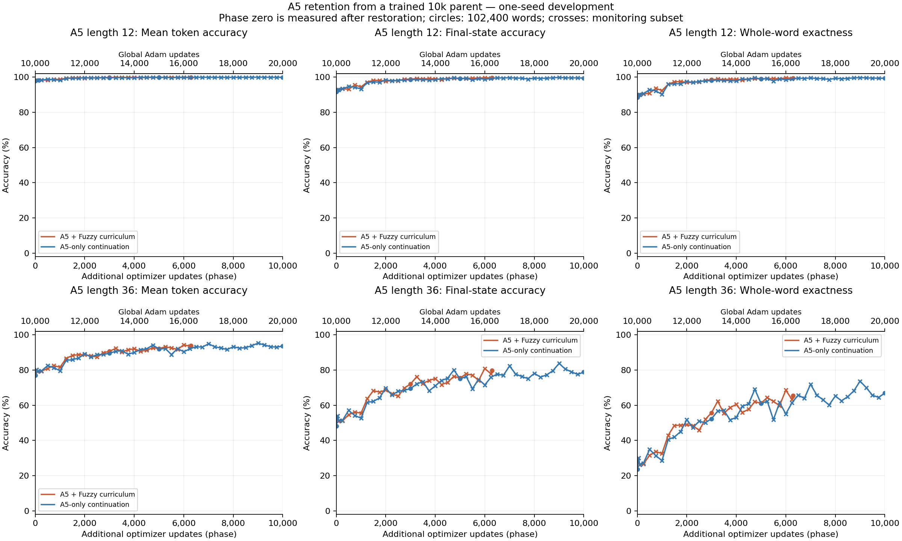
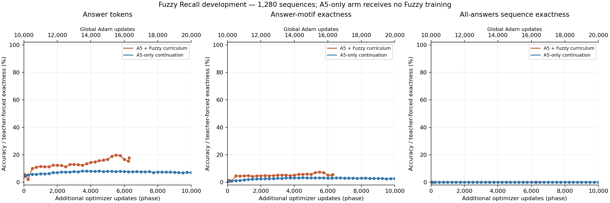
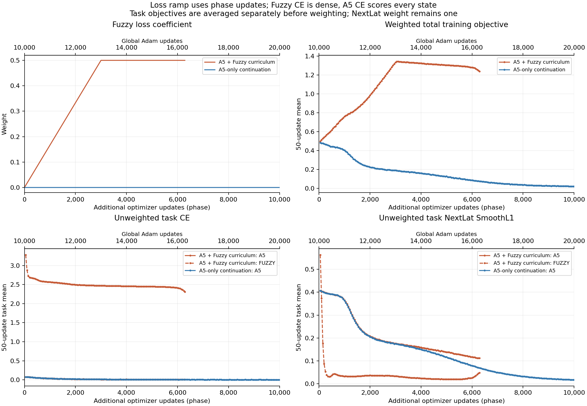

# A5 warm-start continuation and Fuzzy curriculum

**A5 + Fuzzy curriculum: phase 6,288, global Adam update 16,288.** Training status: stopped.

The phase starts from A5-only training at global update 10,000, including its Adam state. The parent's saved L36 whole-word accuracy was 23.6865%. The baseline column below is a new full evaluation of the restored checkpoint.

| Metric | Restored phase 0 | Same-checkpoint endpoint |
| --- | ---: | ---: |
| A5 L12 mean token | 97.8502% | 99.9266% |
| A5 L12 final state | 91.6709% | 99.5898% |
| A5 L12 whole word | 88.4736% | 99.4473% (101,834/102,400) |
| A5 L36 mean token | 77.0332% | 93.9634% |
| A5 L36 final state | 48.2207% | 79.6865% |
| A5 L36 whole word | 23.6865% | 65.3574% (66,926/102,400) |
| Fuzzy answer token | 4.4560% | 17.6892% |
| Fuzzy answer motif | 0.6583% | 5.5645% |
| Fuzzy all-answer sequence | 0.0000% | 0.0000% |

Cumulative A5 presentations: 2,084,864; additional A5 presentations: 804,864; Fuzzy presentations: 804,864. Global updates include 10,000 A5-only parent updates. Each active task contributes 128 examples per phase update.

The mixed objective uses `w_FR(s) = 0.5 * min(s/3000, 1)` and `L = (1-w_FR)*L_A5 + w_FR*L_FR`; the first optimizer update uses `s=1`. The control uses only A5. Both retain task-local CE plus NextLat weight one.

One initialization and reused development data; final confirmation remains unused. Phase zero already has learned A5 state tracking. This measures retention and coexistence after an A5 warm start, not new early learning. Warm-start pretraining and the loss ramp are combined; an abrupt-mix branch would be needed to isolate their effects. The earlier fresh mixed 10k endpoint does not rule out later learning. All endpoint task metrics below are bound to one checkpoint. Fuzzy sequence exactness is teacher-forced all-answer exactness, not autonomous generation.

The paired A5-only control ends at phase 10,000, global 20,000. Same parent, A5 data order and A5 exposure; Fuzzy exposure, task weights and total compute differ. Only equal-phase, equal-evaluation-size comparisons are paired; curves end at actual observations.

| Endpoint comparison at equal phase | Curriculum | A5-only continuation |
| --- | ---: | ---: |
No equal-phase full endpoint comparison exists; no different-checkpoint metrics are combined.

Parent checkpoint: `/workspace/cdrm-w-latent/.runtime/rt-nextlat-fuzzy-a5/20260916T182200Z-d128-a5-mixed/train-a5/checkpoints/step-010000.pt`

Parent SHA256: `0f246e2f39f8a26c8a39fcb336ee1bac4da12990f14bdfaf5676b45ce1364701`

Endpoint checkpoint: `/workspace/cdrm-w-latent/.runtime/rt-nextlat-fuzzy-a5/20260917T150900Z-d128-a5-warmstart-curriculum/train-mixed-curriculum/checkpoints/phase-006288.pt`

Endpoint SHA256: `ceacc5450c7cd92e5f80437106911fb5e7e81ea85cd0f208bc17d8e197a717b5`

Exact input, source, checkpoint and figure hashes are recorded in `evidence.json`.

[Training curves in W&B](https://wandb.ai/taylorbollman/rt-nextlat-fuzzy-a5/runs/uyg8ngm1)

