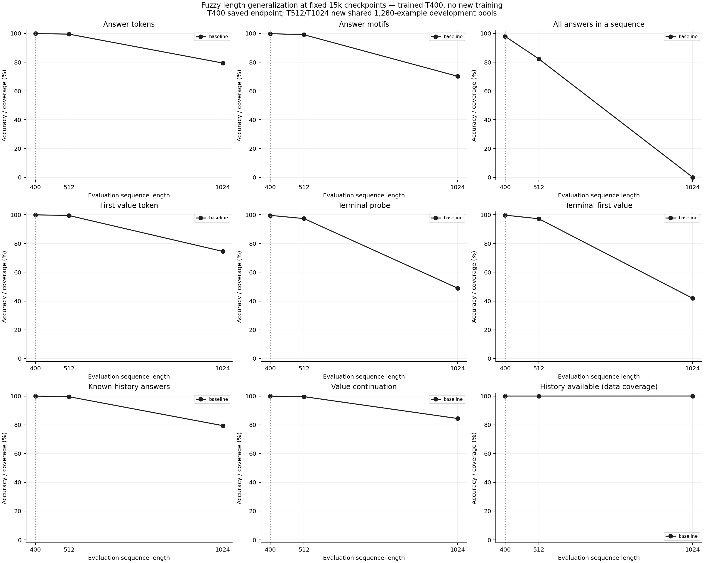
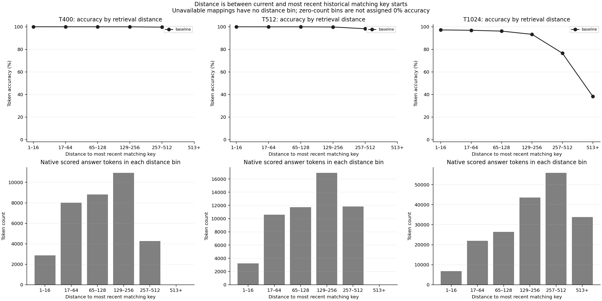
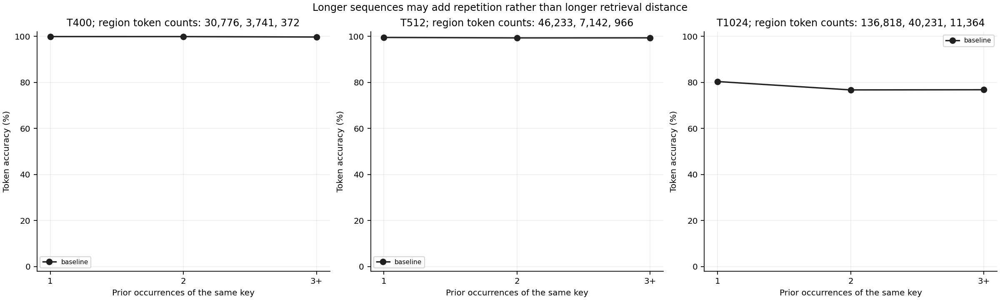

# Baseline Fuzzy Recall length probe

Baseline-only out-of-distribution length-generalization probe at the fixed 15,000-update checkpoint. This uninjected model trained on mixed A5 T12 and Fuzzy T400 with NextLat. T400 is its retained endpoint development evaluation; T512/T1024 are newly evaluated held-out development pools of 1,280 examples each. The longer pools are shared with the planned later architecture comparison, but no embedding variant is evaluated in this report. Longer sequences are not necessarily harder: repeated mappings may reduce effective retrieval difficulty. Native answer masks, history coverage, retrieval distances and previous occurrence counts are retained. No optimizer update, final confirmation, A5 re-evaluation or autonomous latent rollout is performed. These single-seed observations screen length difficulty; they do not compare architectures.

The same saved baseline checkpoint is used at every length: **15,000 optimizer updates**, 479,616 parameters. This probe performs **zero training updates**.

| Length | Answer | Motif exact | Sequence exact | First value | Terminal | Known history |
| --- | ---: | ---: | ---: | ---: | ---: | ---: |
| 400 | 99.9112% | 99.8397% | 97.8906% | 99.9256% | 99.5272% | 99.9283% |
| 512 | 99.4959% | 99.0812% | 82.2656% | 99.4326% | 97.3277% | 99.5179% |
| 1024 | 79.4008% | 70.1713% | 0.0000% | 74.4914% | 48.9054% | 79.4011% |

## Scoring populations

The points at different lengths use different development examples. Native teacher-forced answer accuracy and whole-sequence exactness must not be interpreted as interchangeable. A zero-count distance bin has undefined accuracy, not 0%.

| Length | Scored answers | First values | Known history | Unavailable history | History coverage |
| --- | ---: | ---: | ---: | ---: | ---: |
| 400 | 34,897 | 17,468 | 34,889 | 8 | 99.9771% |
| 512 | 54,353 | 27,317 | 54,341 | 12 | 99.9779% |
| 1024 | 188,415 | 94,674 | 188,413 | 2 | 99.9989% |

## Provenance

Checkpoint SHA256: `5db99243133937d9eb2fc1dd7c1815d228262d974e7dfd23336aed0d11aa7d6b`. Data manifest SHA256: `b27a1811dee0ede42777186be8aa55c3b060166e6164d8ee933a0ac00dcac5fe`.

Evaluation uses FP32 eager execution and microbatch 64; TF32, autocast, compilation and CUDA graphs remain off. The original evaluator supplies native Fuzzy metrics plus a teacher-conditioned NextLat loss diagnostic. Canonical initialization, strict checkpoint restoration, finite FP32 state and frozen source hashes were checked. Model tensors, source hashes and the data manifest were checked again after evaluation. Complete scoring counts and retrieval-distance/previous-occurrence bins are in evidence.json.

This probe does not establish a winning embedding design. If longer lengths remain near ceiling, they may offer limited discrimination for the planned comparison.

[PDF](fuzzy-length-generalization.pdf)

[PDF](fuzzy-retrieval-distance.pdf)

[PDF](fuzzy-prior-occurrences.pdf)
