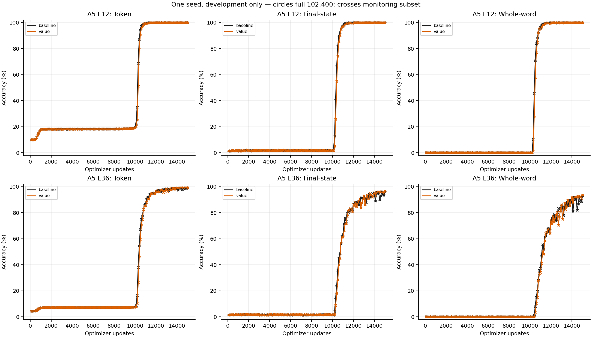
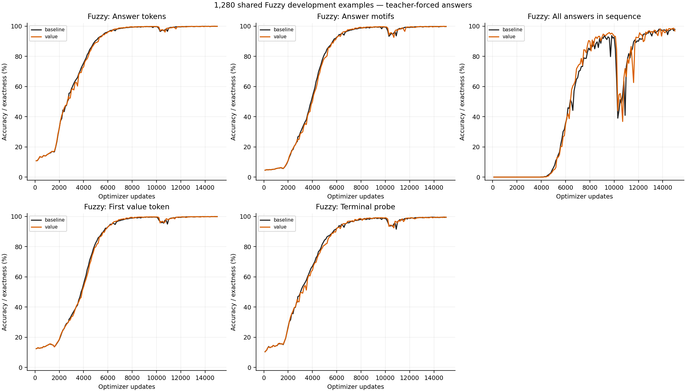
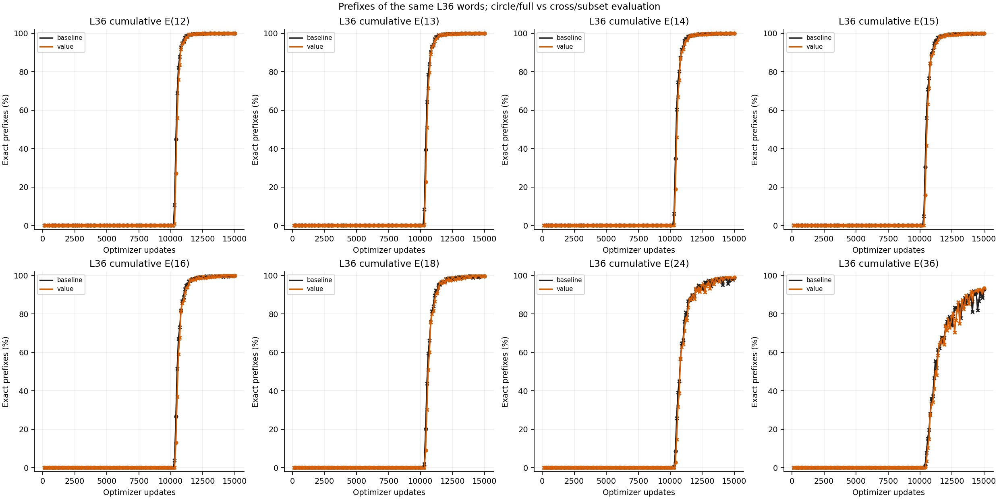
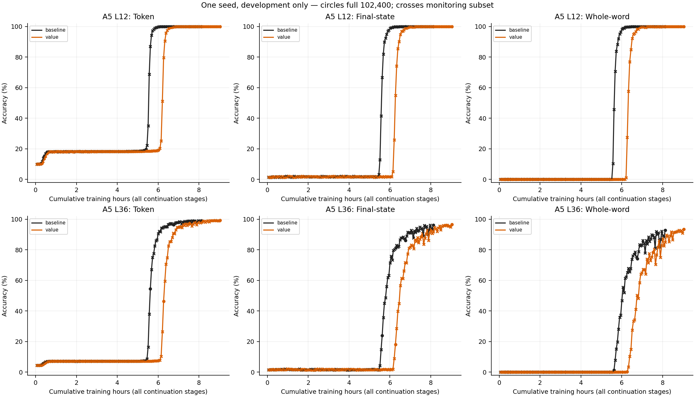
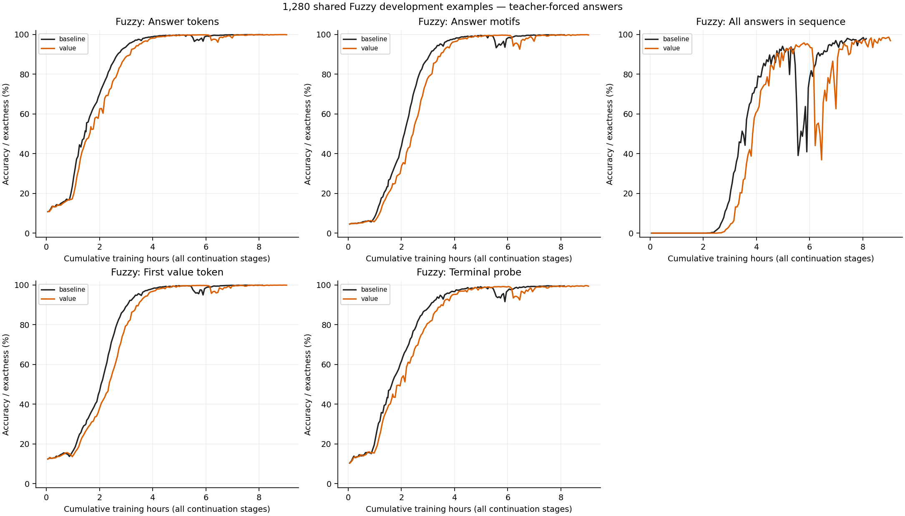
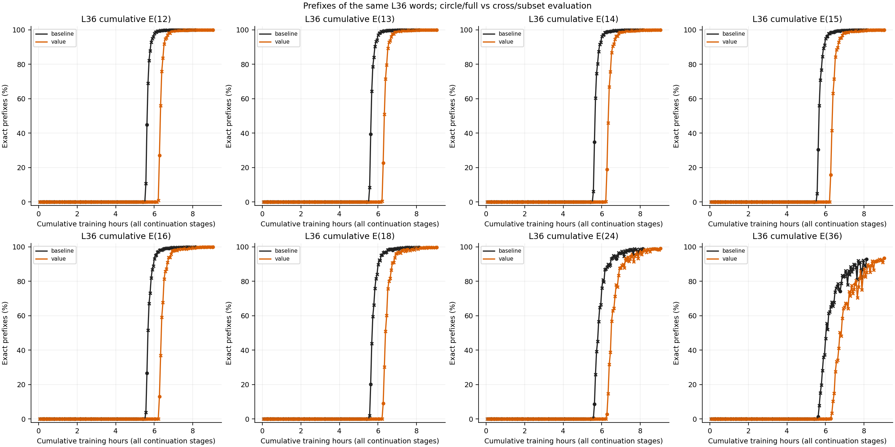
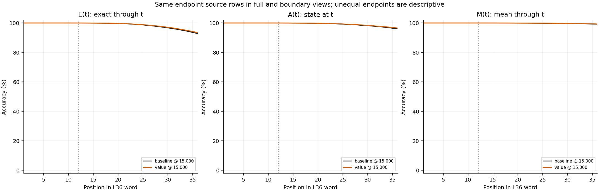
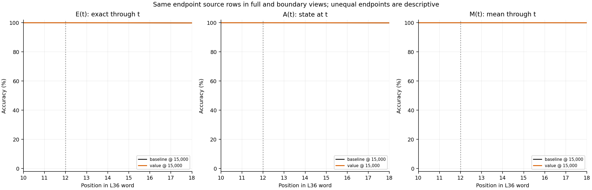

# Mixed A5 + Fuzzy embedding comparison

One initialization, fixed reused development pools, and no final confirmation. These are directional architecture comparisons, not replicated effects. All training uses NextLat; evaluation uses the backbone without latent rollout. A5 monitoring subsets and full evaluations have different sample sizes. Threshold times are first observed crossings, not sustained success or the exact onset of learning. Near-ceiling Fuzzy answer accuracy can conceal differences; motif, sequence, first-value and terminal metrics are shown without claiming that sequence exactness removes the underlying task ceiling. Training seconds exclude evaluation, checkpointing and reporting, and include initialization-period training updates; sequential runs may also differ because of system conditions.

Each arm starts from the same original backbone and NextLat predictor tensors, with the same ordered examples per update. No arm is warm-started from the trained baseline. Only upper block index 1 changes; the first block retains its two-position window.

| Arm | Upper-block change | Parameters | Actual updates | Train hours |
| --- | --- | ---: | ---: | ---: |
| baseline | No embedding injection | 479,616 | 15,000 | 8.126 |
| value | Upper permanent values W_V h + 0.01 P_e e; keys unchanged | 496,000 | 15,000 | 9.036 |

Input and value variants use a fixed coefficient of 0.01 and a learned D×D projection. The head variant reassigns one existing 8-dimensional head, adding no parameters or gate. Its gain is not directly matched to the 0.01 additive mechanisms.

## Actual endpoint results

All metrics in one arm's row belong to its same saved checkpoint. Different terminal update counts are descriptive, not matched-budget comparisons.

| Arm | A5 L12 token / whole | A5 L36 token / whole | Fuzzy answer / motif / sequence | Fuzzy first value / terminal |
| --- | ---: | ---: | ---: | ---: |
| baseline | 99.9993% / 99.9961% | 99.2369% / 92.8535% | 99.9112% / 99.8397% / 97.8906% | 99.9256% / 99.5272% |
| value | 99.9994% / 99.9951% | 99.3277% / 93.4990% | 99.8682% / 99.7596% / 96.8750% | 99.9084% / 99.4090% |

## First observed threshold crossings

Only full evaluations establish the crossings below. No interpolation or best-checkpoint selection is used. Full A5 evaluations need not have identical schedules across resumed and fresh runs; use the matched observations in evidence.json for equal-update, equal-pool comparisons.

| Arm | Metric | Threshold | First observed update | Training hours |
| --- | --- | --- | ---: | ---: |
| baseline | a5_l36_whole_word | positive | 10,400 | 5.621 |
| baseline | a5_l36_whole_word | 10% | 12,500 | 6.765 |
| baseline | a5_l36_whole_word | 50% | 12,500 | 6.765 |
| baseline | a5_l36_whole_word | 90% | 15,000 | 8.126 |
| baseline | a5_l36_whole_word | 99% | Not observed | — |
| baseline | fuzzy_answer | 50% | 2,700 | 1.464 |
| baseline | fuzzy_answer | 90% | 5,000 | 2.717 |
| baseline | fuzzy_answer | 99% | 7,500 | 4.061 |
| value | a5_l36_whole_word | positive | 10,400 | 6.270 |
| value | a5_l36_whole_word | 10% | 12,500 | 7.531 |
| value | a5_l36_whole_word | 50% | 12,500 | 7.531 |
| value | a5_l36_whole_word | 90% | 15,000 | 9.036 |
| value | a5_l36_whole_word | 99% | Not observed | — |
| value | fuzzy_answer | 50% | 2,700 | 1.644 |
| value | fuzzy_answer | 90% | 5,300 | 3.211 |
| value | fuzzy_answer | 99% | 7,300 | 4.405 |

## Evidence and interpretation

Training time sums every committed per-update duration through all baseline continuation stages, including the original 0–2.5k and 2.5k–5k portions. It excludes eval/report/storage overhead. Accuracy-versus-time plots therefore compare measured training efficiency; accuracy-versus-update plots compare equal per-task data exposure. Neither axis alone establishes a general architectural advantage.

Compatibility checks require unchanged original source files, task data, optimization, precision and loss settings; exact shared initial tensors; empty initial optimizer state; identical per-update data-order chains; and checkpoint-bound matching exposure/cursors at common full milestones. The input/value projection increases parameter count by 16,384 (about 3.4%). No automatic winner is chosen from these single-seed, potentially fluctuating trajectories.

- baseline: `/workspace/cdrm-w-latent/.runtime/rt-nextlat-fuzzy-a5/20260918T015724Z-d128-b2560-mixed-15000/train-mixed-continue15000`; endpoint checkpoint `5db99243133937d9eb2fc1dd7c1815d228262d974e7dfd23336aed0d11aa7d6b`. [W&B training](https://wandb.ai/taylorbollman/rt-nextlat-fuzzy-a5/runs/qygud2ze).
- value: `/workspace/cdrm-w-latent/.runtime/rt-nextlat-fuzzy-a5/20260918T075200Z-d128-b2560-embedding-reordered/value/train`; endpoint checkpoint `5260a87446b33a0e59e8bb48b0ffe3d0ac51cc523bb16eed0a9b9c150f7d1c91`. [W&B training](https://wandb.ai/taylorbollman/rt-nextlat-fuzzy-a5/runs/ucahrd6v).

## Figures

[PDF](a5-learning-updates.pdf)

[PDF](fuzzy-learning-updates.pdf)

[PDF](a5-prefix-learning-updates.pdf)

[PDF](a5-learning-training-time.pdf)

[PDF](fuzzy-learning-training-time.pdf)

[PDF](a5-prefix-learning-training-time.pdf)

[PDF](a5-endpoint-prefix-full.pdf)

[PDF](a5-endpoint-prefix-boundary.pdf)
