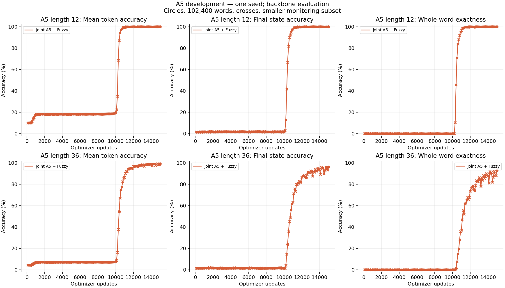
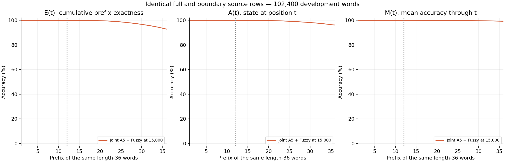
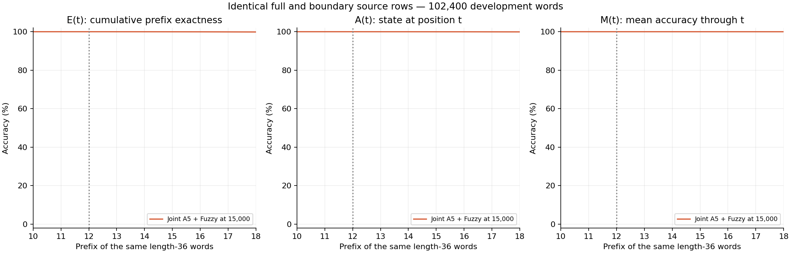
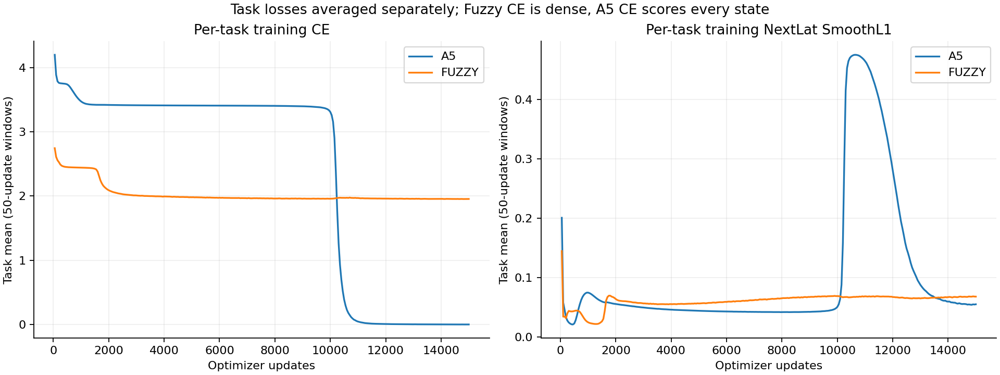
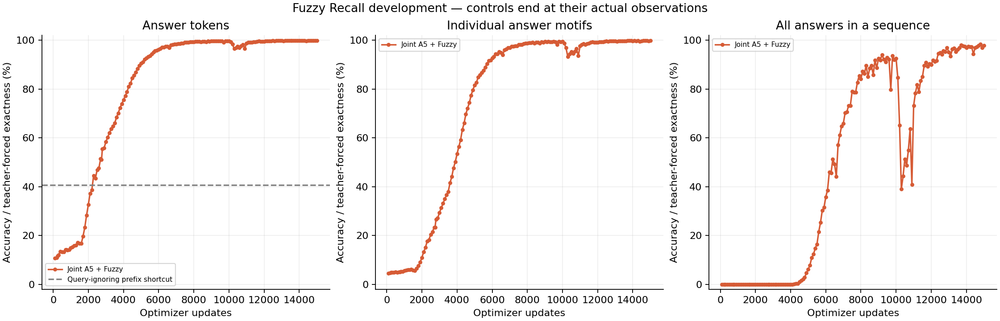

**Authoritative extended-budget interpretation.** The historical 10k gate is unchanged; this report supersedes the earlier gate-based conclusion about the extended budget.

# D128 A5 and Fuzzy development pilot

**mixed, actual endpoint 15,000 updates.** Training status: complete.

Two RT layers; first window two, second full recurrent. Width 128, 16 heads, FFN 512; ALiBi, Mitchell, FP32 eager, NextLat retained. 479,616 parameters; no embedding bypass or autonomous latent rollout.

2,560 examples per active task per optimizer update; 38,400,000 examples per task at the endpoint. Losses are means within each task; mixed training weights the two task objectives equally.

| Same-checkpoint endpoint metric | Accuracy |
| --- | ---: |
| A5 L12 mean token | 99.9993% |
| A5 L12 final state | 99.9971% |
| A5 L12 whole word | 99.9961% (102,396 / 102,400) |
| A5 L36 mean token | 99.2369% |
| A5 L36 final state | 96.1631% |
| A5 L36 whole word | 92.8535% (95,082 / 102,400) |
| Fuzzy answer tokens | 99.9112% |
| Fuzzy answer-motif exact | 99.8397% |
| Fuzzy all-answers sequence exact | 97.8906% |
| Fuzzy first value token | 99.9256% |
| Fuzzy terminal probe | 99.5272% |

## Historical 10k gate and extended-budget observations

The original continuation gate applies only through update 10,000 and is preserved unchanged.

That historical gate did not pass: no positive full L36 observation was recorded by 10k. This does not determine what happened during the extension.

Across the actual extended budget, the first positive full L36 observation was at **update 10,400**: 1,452/102,400 words (1.417969%).

At the actual endpoint, L36 whole-word accuracy is **92.853516%** (95,082/102,400). Earlier positive observations and endpoint performance are reported separately.

A positive finite-sample development count establishes observed correct length-36 words; it does not establish reliable or general state tracking. The first observed full positive is not the exact onset of learning. Final confirmation remains unused. The unchanged same-checkpoint endpoint table reports Fuzzy performance alongside A5.

## Controls and qualifications

Fuzzy query-ignoring answer-prefix shortcut: 40.6367%. Dense Fuzzy training CE and masked answer evaluation CE have different scopes. Answer exactness is teacher-forced. Causal lookup coverage is not a universal accuracy ceiling.

Single initialization and reused development data; no final confirmation. The historical 10k continuation gate is preserved separately from observed performance through the actual endpoint. Only common retained checkpoints match control training exposure; controls are not extended or extrapolated.

Checkpoint: `step-015000.pt`; SHA256 `5db99243133937d9eb2fc1dd7c1815d228262d974e7dfd23336aed0d11aa7d6b`.

[Training W&B](https://wandb.ai/taylorbollman/rt-nextlat-fuzzy-a5/runs/qygud2ze)

## Exact checkpoint recovery

History, evaluations and control comparisons use the committed parent prefix followed by the resumed updates. Post-boundary parent observations are excluded; their original bytes remain preserved. Matching state at the restored boundary does not establish bitwise equivalence of later updates across GPU instances.

| Stage | Updates used | Raw history SHA256 | Excluded tail bytes |
| --- | --- | --- | ---: |
| train-mixed | 1–2,500 | `7a304ca3927af936b57b15b38be04aa9528dd0902b2fc2549b458136e919733a` | 0 |
| train-mixed-continue5000 | 2,501–5,000 | `be115fa3ab342ef57aee3a38482ba4a1a72401c52da42aa75d4968a3290fb03d` | 0 |
| train-mixed-continue15000 | 5,001–15,000 | `3fe8ca71f483a292d819594fdcb4c6644e00c0d8881748b0a5f08b0066ac4d65` | 0 |

