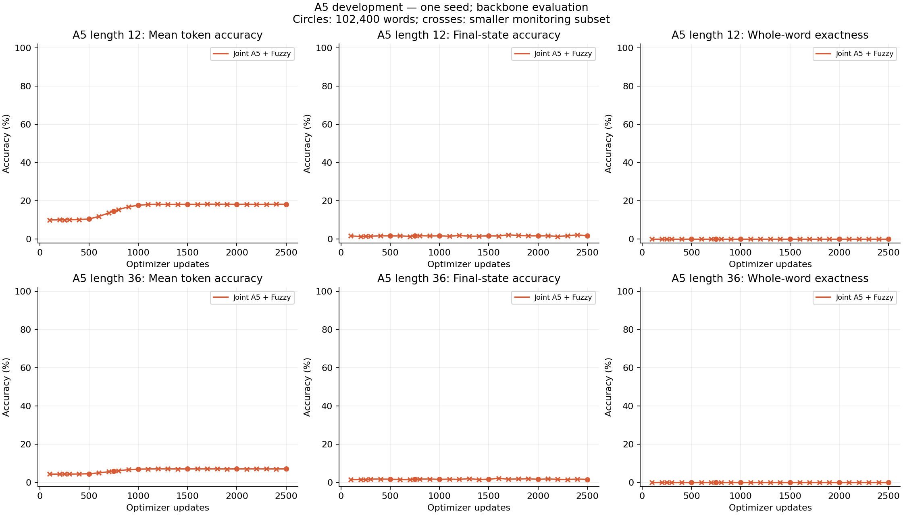
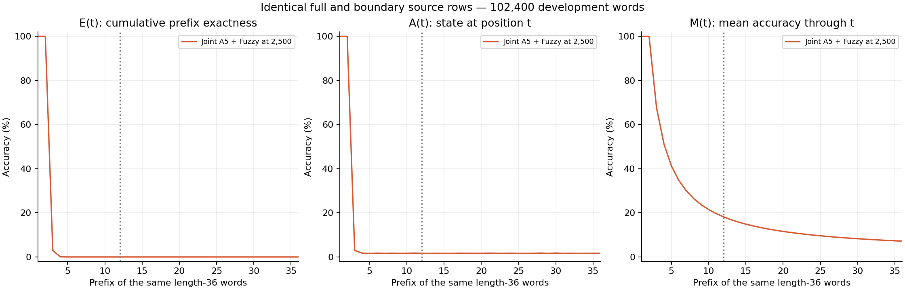
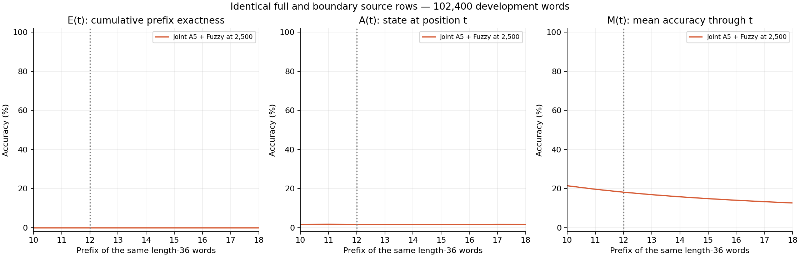
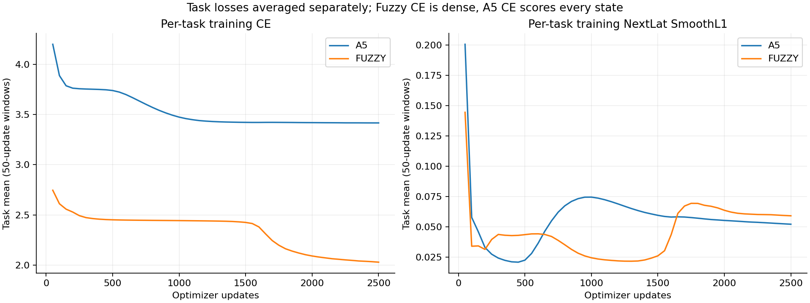
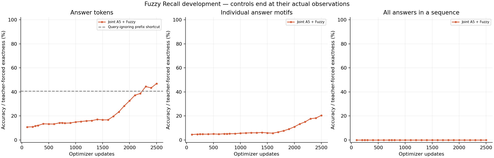

# D128 A5 and Fuzzy development pilot

**mixed, actual endpoint 2,500 updates.** Training status: complete.

Two RT layers; first window two, second full recurrent. Width 128, 16 heads, FFN 512; ALiBi, Mitchell, FP32 eager, NextLat retained. 479,616 parameters; no embedding bypass or autonomous latent rollout.

2,560 examples per active task per optimizer update; 6,400,000 examples per task at the endpoint. Losses are means within each task; mixed training weights the two task objectives equally.

| Same-checkpoint endpoint metric | Accuracy |
| --- | ---: |
| A5 L12 mean token | 18.1488% |
| A5 L12 final state | 1.6426% |
| A5 L12 whole word | 0.0000% (0 / 102,400) |
| A5 L36 mean token | 7.1664% |
| A5 L36 final state | 1.6582% |
| A5 L36 whole word | 0.0000% (0 / 102,400) |
| Fuzzy answer tokens | 46.9152% |
| Fuzzy answer-motif exact | 20.4889% |
| Fuzzy all-answers sequence exact | 0.0000% |
| Fuzzy first value token | 27.8223% |
| Fuzzy terminal probe | 39.4011% |

## A5 continuation gate

No full 102,400-word L36 evaluation observed a positive whole-word count by the completed budget, within the 10k gate horizon. This pilot does not establish length-36 state tracking.

## Controls and qualifications

Fuzzy query-ignoring answer-prefix shortcut: 40.6367%. Dense Fuzzy training CE and masked answer evaluation CE have different scopes. Answer exactness is teacher-forced. Causal lookup coverage is not a universal accuracy ceiling.

Single initialization and reused development data; no final confirmation. Joint endpoint metrics belong to one checkpoint. First-positive A5 development evaluation is a prospective continuation gate, not the selected endpoint. Only common retained checkpoints with equal task exposure and evaluation rows are matched control comparisons; unequal terminal budgets are descriptive.

Checkpoint: `step-002500.pt`; SHA256 `743cbd63f87ecaab116a9b543589a776b5b6c3fcc3c49d1eed0e8ca6c42fff6a`.

[Training W&B](https://wandb.ai/taylorbollman/rt-nextlat-fuzzy-a5/runs/fuq95voo)

