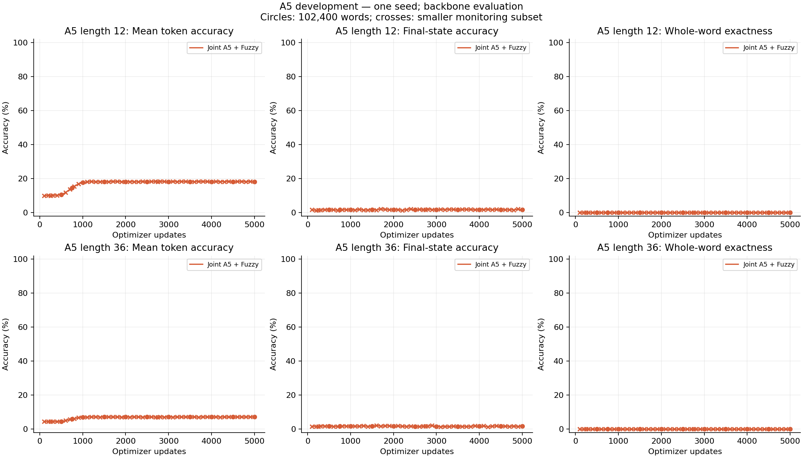
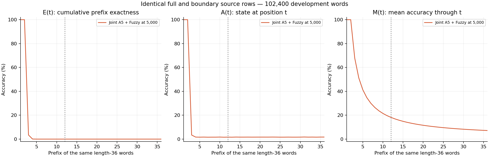
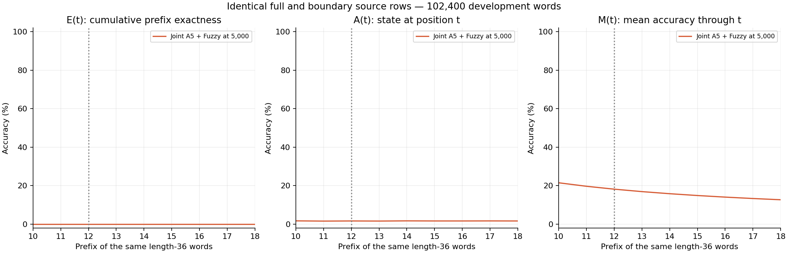
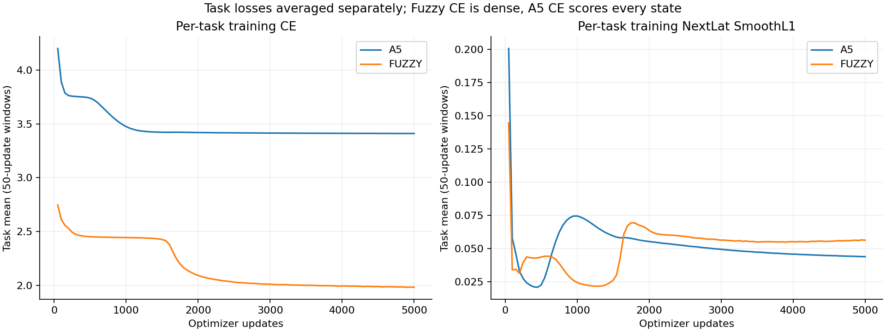
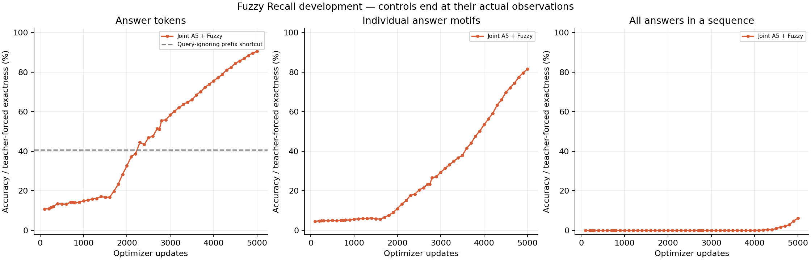

# D128 A5 and Fuzzy development pilot

**mixed, actual endpoint 5,000 updates.** Training status: complete.

Two RT layers; first window two, second full recurrent. Width 128, 16 heads, FFN 512; ALiBi, Mitchell, FP32 eager, NextLat retained. 479,616 parameters; no embedding bypass or autonomous latent rollout.

2,560 examples per active task per optimizer update; 12,800,000 examples per task at the endpoint. Losses are means within each task; mixed training weights the two task objectives equally.

| Same-checkpoint endpoint metric | Accuracy |
| --- | ---: |
| A5 L12 mean token | 18.1993% |
| A5 L12 final state | 1.6924% |
| A5 L12 whole word | 0.0000% (0 / 102,400) |
| A5 L36 mean token | 7.1791% |
| A5 L36 final state | 1.7148% |
| A5 L36 whole word | 0.0000% (0 / 102,400) |
| Fuzzy answer tokens | 90.5379% |
| Fuzzy answer-motif exact | 81.5548% |
| Fuzzy all-answers sequence exact | 6.1719% |
| Fuzzy first value token | 82.5510% |
| Fuzzy terminal probe | 84.4366% |

## A5 continuation gate

No full 102,400-word L36 evaluation observed a positive whole-word count by the completed budget, within the 10k gate horizon. This pilot does not establish length-36 state tracking.

## Controls and qualifications

Fuzzy query-ignoring answer-prefix shortcut: 40.6367%. Dense Fuzzy training CE and masked answer evaluation CE have different scopes. Answer exactness is teacher-forced. Causal lookup coverage is not a universal accuracy ceiling.

Single initialization and reused development data; no final confirmation. Joint endpoint metrics belong to one checkpoint. First-positive A5 development evaluation is a prospective continuation gate, not the selected endpoint. Only common retained checkpoints with equal task exposure and evaluation rows are matched control comparisons; unequal terminal budgets are descriptive.

Checkpoint: `step-005000.pt`; SHA256 `3e7cfea69fdacd02a77df46e331499a4676fd6df23ac74168ff10e99522a3b74`.

[Training W&B](https://wandb.ai/taylorbollman/rt-nextlat-fuzzy-a5/runs/otyh4yb7)

## Exact checkpoint recovery

History, evaluations and control comparisons use the committed parent prefix followed by the resumed updates. Post-boundary parent observations are excluded; their original bytes remain preserved. Matching state at the restored boundary does not establish bitwise equivalence of later updates across GPU instances.

| Stage | Updates used | Raw history SHA256 | Excluded tail bytes |
| --- | --- | --- | ---: |
| train-mixed | 1–2,500 | `7a304ca3927af936b57b15b38be04aa9528dd0902b2fc2549b458136e919733a` | 0 |
| train-mixed-continue5000 | 2,501–5,000 | `be115fa3ab342ef57aee3a38482ba4a1a72401c52da42aa75d4968a3290fb03d` | 0 |

